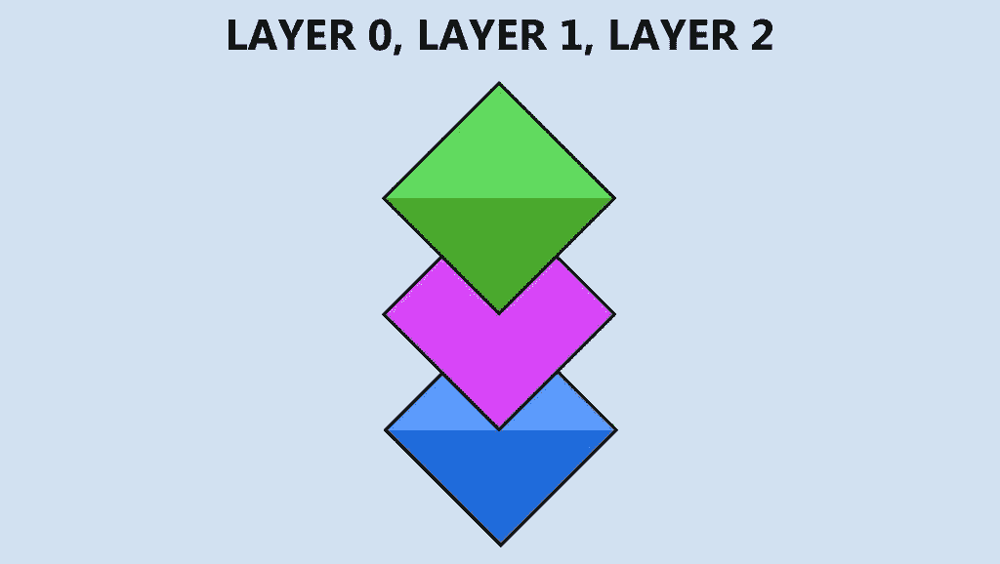
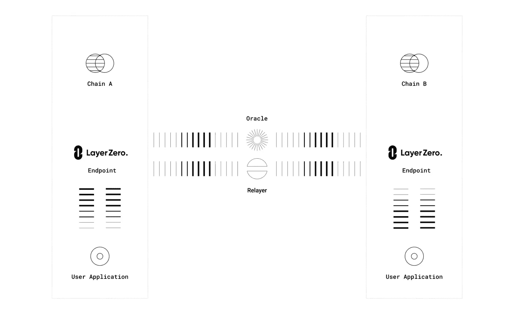
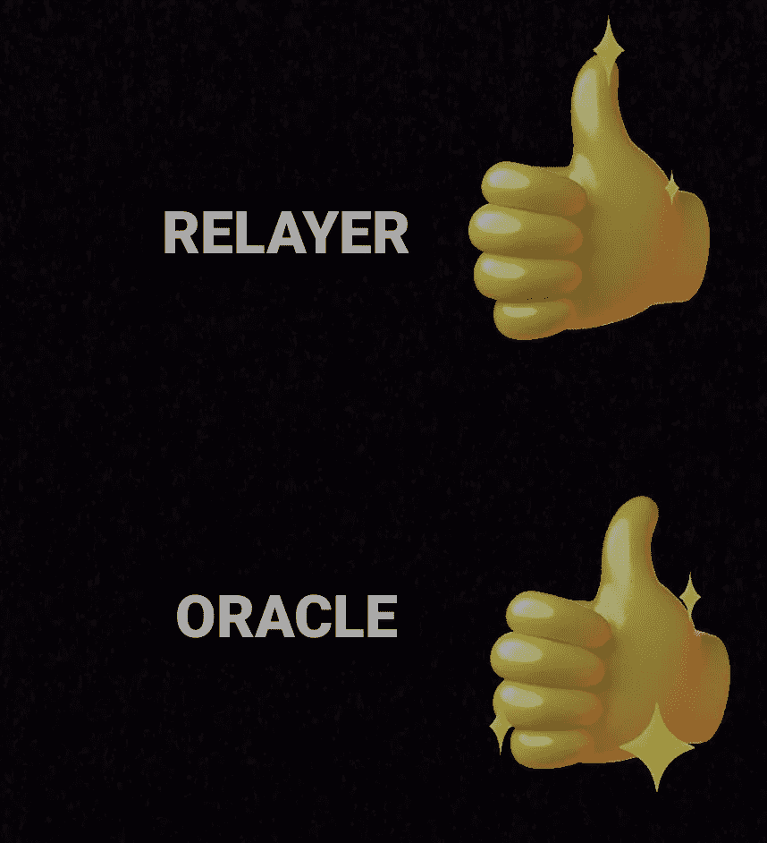
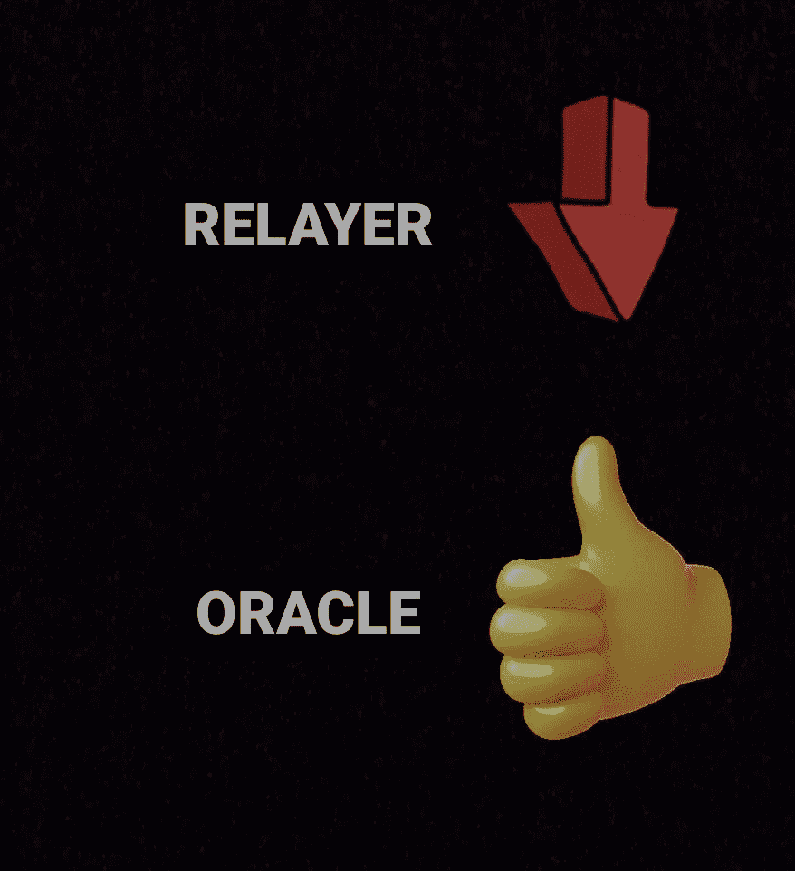
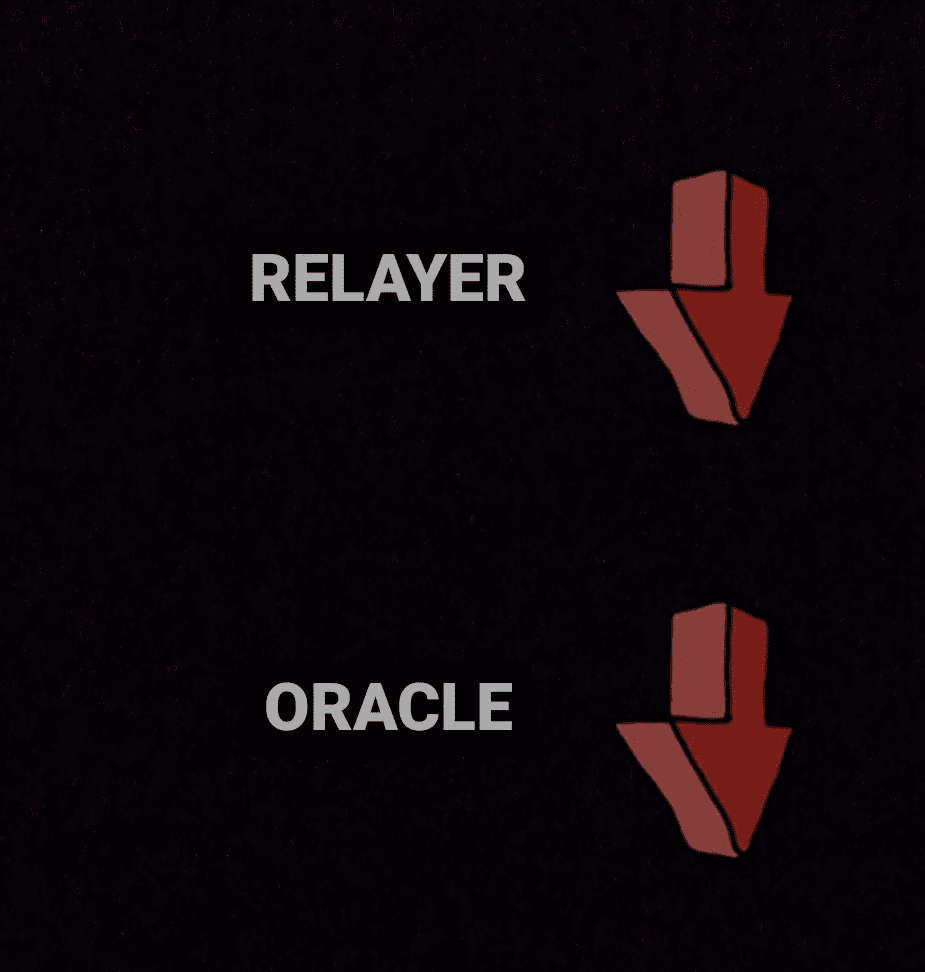
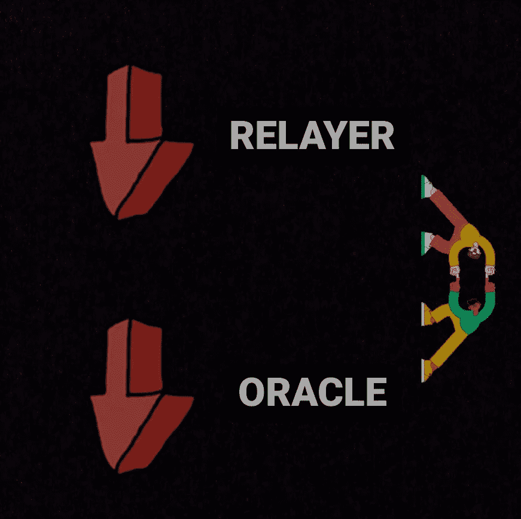

# 这个协议是连接区块链

> 原文：<https://medium.com/coinmonks/this-protocol-is-connecting-blockchains-6a6f132e6c75?source=collection_archive---------26----------------------->

是的，你没看错。我们将在本文中介绍的协议是让区块链相互之间进行交互。

## 零层

你可能最近听说过这个协议，因为它的媒体“爆炸”，例如在 twitter 上。许多大投资者，如币安实验室。

所以，这个项目正在参与 DeFi 和 crypto 的“下一阶段”;链间通信

什么是第 0 层，它与其他协议有何不同？

-首先，我们将通过定义零层来介绍其项目和任务

-其次，我们将着手解决问题

-然后我们会谈论它的安全性

-最后是它的一些使用案例

## 所以，让我们从分析零层是什么开始

零层是一个基础设施，它作为一个框架来创建构建在其上的结构。

基础设施有两个主要原则:安全性和互操作性

> 安全→它需要传播到所有创建的生态系统。把它看作一个城堡(第 0 层)，在里面，所有的资源(第 1 层和第 2 层)都受到保护。
> 
> 互操作性→链之间的沟通和交互需要简单、有效和高效。

## 好了，一旦理解了零层的定义，让我们转到项目本身

第 0 层是一个通用的消息传递协议，这意味着交换令牌它不是唯一的潜在用途。因此，零层希望最大化从一个链到另一个链的传输效率，没有中间链作为中介(如 Anyswap)

目标是连接每一个跨链契约，因此应用程序。

## 让我们继续解释我们目前所处的环境

加密世界现在是多硬币的，因为以太坊的统治地位正在下降，所以现在生态系统被分配到除以太坊以外的其他有价值的硬币中。随着越来越多的链投入使用，链之间的桥接需求也越来越多，桥使用包装令牌(非本机)进行交换，此外，许多桥受到攻击(如虫洞)，这就是第 0 层出现的地方，它有第一个用例

# 解决方法

让我们看看零层解决了什么问题

***-LIGHTNODE*** :由于运行一个 LIGHTNODE 通常是昂贵的(尤其是对于小项目来说)，零层解决方案提供了一个超轻节点(ULN)，一个叫做“中继者”的实体。该协议还使用 Oracles(如 Chainlink 或 Band 协议)在整个网络中获取数据和发送消息。

因此，正如我们将在后面看到的，在零层系统中有一个中继器和一个先知，由于它们相互之间独立的工作方式，它们起到了一种“无形”的协作作用，这使得零层甚至比链或带更安全。

事实上，零层将使用中继器(ULN)和 oracle 的组合来提高效率。

***——不需要桥接***

***-改善的用户体验*** :该协议和零层通常是扩展 DeFi 应用所需的解决方案。

零层让非技术用户有更好的体验、流量和可用性，让环境更容易、更便宜。

## 在讨论了它的解决方案之后，让我们继续讨论这个协议是如何工作的？

所有工程都有 3 个主要组成部分:

安**甲骨文**:甲骨文基本上是处理链外数据的工具(比如链或带协议)

一个**中继器(ULN)** :一个处理链上数据的实体，或者，例如，传递事务

一个**层零端点**:一个可能存在于每个链上的契约，它允许后来的零与所有那些链兼容

## 让我们把注意力集中在先知和继电器上

Oracle 和 Relayer 是独立的实体。

这，是出于安全考虑，实际上他们彼此之间并不交流。

## 万一遭到恶意攻击会怎样？

当中继器和先知都在做他们的任务时，协议工作。

现在，1)如果情况仍然如此，那么一切工作正常

2)如果中继器是恶意的，第二个网络理解它的意图并作为结果，不允许消息被发送。同样的事情，如果先知是恶意的(而继电器不是)

3)如果中继器和神谕都是恶意的，消息无论如何都将被停止

4)如果继电器和神谕之间存在合作以进行恶意攻击，那么消息将是有效的，但是不同。积极的一面是，即使他们真的利用了漏洞，受损的也是那些使用 Oracle 和 Relayer 的应用程序的一部分

## 最后，我们到达了用例

这些只是零层可能的用例示例

**跨链索引**:最近 SushiSwap 为此范围创建了一个建议权限。它的目的是使 DEX 跨链，所以你可以更容易地交换来自不同链的令牌。

**多链收益聚合器**:基于跨链的策略。

**多链套利**:想象一下，以一种既安全又便宜的方式，在两条不同链上的两种不同指数之间进行套利。酷吧？

# 结论

鉴于区块链和金融市场的分散性，互操作性一直是个问题。

以太坊走在了前面，并标榜自己是通往所有其他连锁店的桥梁。

它进行得并不顺利，并且从那时起已经开发了许多其他的解决方案。

第 0 层吸取了每个解决方案的精华，将它们整合到一个无缝集成的包中。

因此，要真正获得区块链技术的好处，我们需要考虑零层解决方案

零层允许更有效和更便宜的链间交易。它可以用于侧链、链间原子交换、链间消息传递和智能合约兼容性。

因此，零层是可互操作的 DeFi 生态系统的基础，这将带来加密货币的下一波创新。

希望你喜欢这篇文章，并学到一些新东西

关注了解更多内容

> 加入 Coinmonks [电报频道](https://t.me/coincodecap)和 [Youtube 频道](https://www.youtube.com/c/coinmonks/videos)了解加密交易和投资

# 另外，阅读

*   [瓦济里克斯 NFT 评论](https://coincodecap.com/wazirx-nft-review)|[Bitsgap vs Pionex](https://coincodecap.com/bitsgap-vs-pionex)|[Tangem 评论](https://coincodecap.com/tangem-wallet-review)
*   [如何使用 Solidity 在以太坊上创建 DApp？](https://coincodecap.com/create-a-dapp-on-ethereum-using-solidity)
*   [币安 vs FTX](https://coincodecap.com/binance-vs-ftx) | [最佳(SOL)索拉纳钱包](https://coincodecap.com/solana-wallets)
*   [如何在 Uniswap 上交换加密？](https://coincodecap.com/swap-crypto-on-uniswap) | [A-Ads 审查](https://coincodecap.com/a-ads-review)
*   [加密货币储蓄账户](/coinmonks/cryptocurrency-savings-accounts-be3bc0feffbf) | [YoBit 评论](/coinmonks/yobit-review-175464162c62)
*   [Botsfolio vs nap bots vs Mudrex](/coinmonks/botsfolio-vs-napbots-vs-mudrex-c81344970c02)|[gate . io 交流回顾](/coinmonks/gate-io-exchange-review-61bf87b7078f)