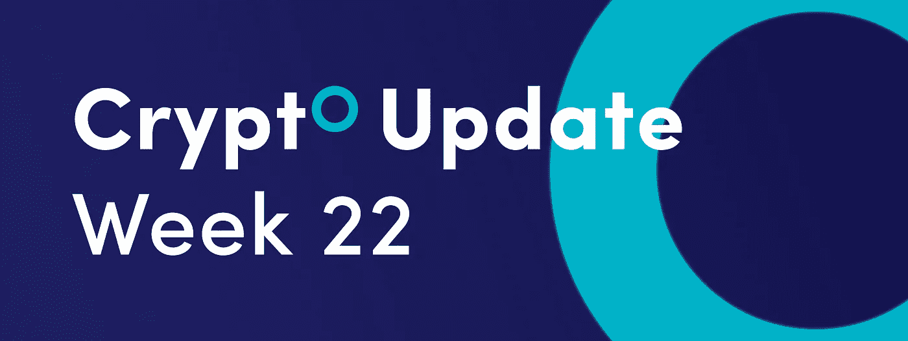
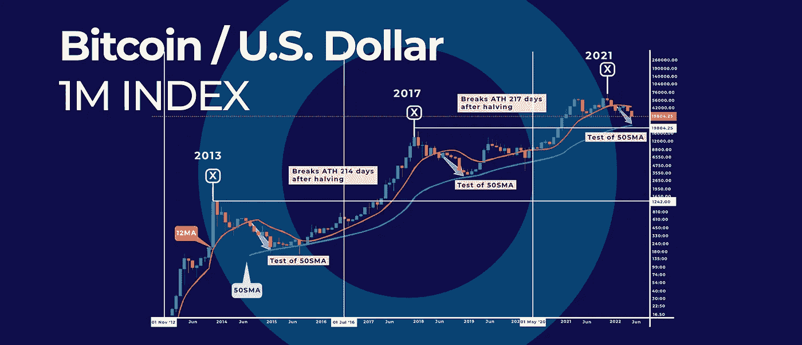
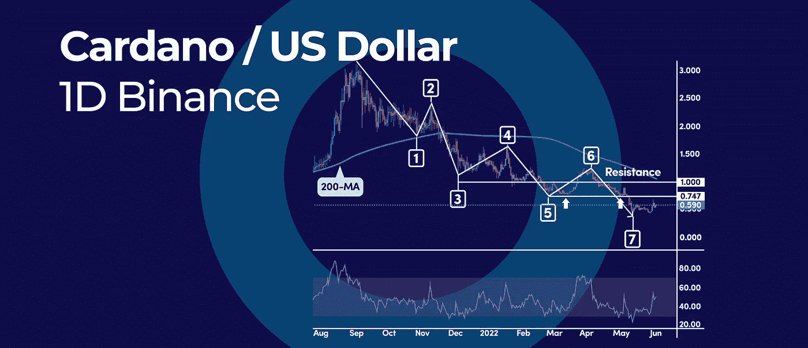
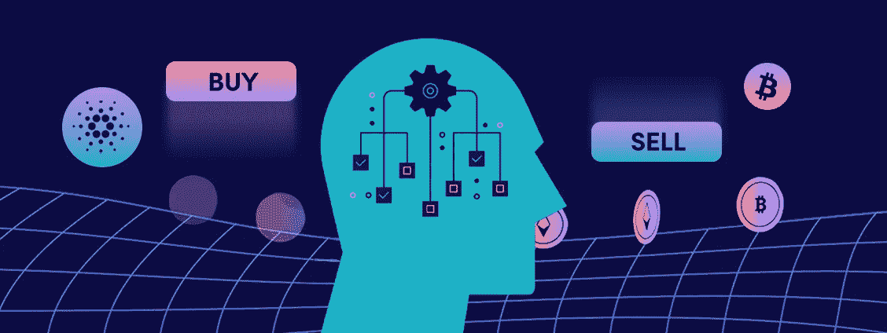

# 这个交易错误阻碍了你的发展，以下是如何避免这个错误的方法。

> 原文：<https://medium.com/coinmonks/this-trading-mistake-holds-you-back-here-is-how-to-avoid-it-and-more-in-this-weeks-crypto-update-6de6817610ee?source=collection_archive---------59----------------------->

*   为什么比特币的价格持续下跌？减半周期是答案
*   这张图表展示了为什么卡尔达诺处于修正模式
*   这个交易错误阻碍了你，下面是如何避免它

## 为什么比特币的价格持续下跌？减半周期是答案

自今年年初以来，比特币(BTC)跌破 30，000 美元的心理数字，其价值损失超过 38%。加密货币市值也缩减至 5450 亿美元，为 2020 年 12 月以来的最低水平。要理解当前 BTC 价格的下跌，我们必须着眼于更大的图景。

# 减半周期模型

根据减半模型，比特币似乎有望长期测试 20，000 美元的支持。20，000 美元水平就在关键点附近，50 个月简单移动平均线(SMA)，可以用来跟踪 4 年减半周期。

每隔 21 万个区块，比特币就会减半，这通常与每四年一次的总统选举相同。

比特币的 4 年减半周期是这样的:反弹至历史新高，然后回落。

之前的回调将比特币的价格推向了 50 个月的 SMA。自然，收盘跌破 12 个月简单移动平均线引发了抛售。

在撰写本文时，50 个月的 SMA 在 21，000 美元附近，因此我们可以预计价格将重新测试该水平，以完成 4 年减半模型。

# 什么是比特币减半周期？

比特币的价格与其供应量密切相关。这是因为比特币受到固定货币政策的监管，这一政策已被写入其协议。货币政策确保只有 2100 万个比特币会出现。

与美国美联储发行美元的方式相同，比特币协议发行比特币。美国美联储自动发行美元，而比特币通过挖矿发行比特币。在采矿业，矿工们在验证区块的比赛中相互竞争，并获得凭空创造的 12.5 个比特币的奖励。

货币政策控制新比特币的发行。比特币协议每四年将供应量减半。每 210，000 个数据块就会减少一半，大约是每四年一次。

# 比特币减半历史

第一次减半发生在 2012 年 11 月。此后，比特币又经历了两次减半。在 2020 年 5 月第三次减半时，比特币的市值为 1500 亿美元。

在第三次减半后，比特币的价格创下了 68，000 美元的历史新高，市值超过 1.2 万亿美元。

# 展望未来

根据之前的周期，在跌破 12 月均线后，50 月均线附近的底部需要 6 个月到 8 个月才能完成。因此，我们应该很快就会触底。

## 这张图表展示了为什么卡尔达诺处于修正模式

和大多数其他加密货币一样，Cardano 也经历了熊市。然而，根据艾略特波浪理论，从 2021 年 9 月 3.16 美元的历史高点开始的整个下跌不是冲动性的，而是纠正性的。下面，我们来探讨一下为什么会这样。

# 什么是修正？

在艾略特波浪分析中，修正是与主导趋势相反的价格运动。例如，如果市场处于上升趋势，那么修正可以被称为熊市序列。在卡尔达诺的例子中，修正是熊市，因为之前的趋势是牛市。

# 艾略特波浪分析

在艾略特波浪分析中，最先进的原则之一是纠正序列在 3，7，11 摆动波中展开。在 ADA 日线图上，我们可以从 3.16 美元的高点开始计算 7 波价格波动。

第一波波动以 1.81 美元的低点结束，随后是第二波波动的反弹。从 2.40 美元的高点下跌，第三波波动在 1.12 美元的低点结束。另一次修正出现在第四波波动中，以 1.63 美元的高点结束。

第五波摆动在 2 月 24 日低点结束，向上修正在 1.24 美元高点完成了第六波摆动。

短线来看，第七波可以在目前 0.38 美元的低点被称为完成。随着 RSI 振荡指标突破 50 的中间水平，我们更有信心认为修正已经完成。

# 走向

只要 0.38 美元的低点保持不变，整个价格调整就可以被称为完成。然而，跌破第七个浪会打开下一个 3 浪的大门。

最近的阻力位在 0.50 美元和 0.55 美元。突破这些水平可能会将 Cardano 的价格推向 0.70 美元，这是 50 天移动平均线目前的位置。

## 这个交易错误阻碍了你，下面是如何避免它

害怕错过 FOMO 是阻止你交易的一个原因。如果你想学习如何减轻这个 PnL 杀手，你来对地方了。让我们开始分享如何战胜 FOMO 的关键经验，这样你就可以增加你的交易账户！

因为 FOMO 是一种心理现象，所以从心理学的角度来处理它是必要的。如果你想建立一个战胜 FOMO 的战略，你需要改变你的思维过程。你需要努力的关键部分是恐惧方面。

当我们感觉到威胁时，交易中就会产生恐惧。我们需要理解的关键问题是，恐惧不是因为我们错过了一笔交易而产生的，而是我们认为这是对我们成功的威胁。

当我们的大脑感觉受到攻击或威胁时，我们更容易冲动行事。显而易见的结论是，我们可以通过消除威胁因素来战胜 FOMO。在我们的交易生涯中，我们都会错过交易机会。

# 克服恐惧

在交易中克服 FOMO 的一个实际方法是改变你的思维过程。我们这样说的意思是，改变你错过交易机会的思维模式。要牢牢把握的基本原则是，我们的思维创造了我们的反应。换句话说，如果我们认为错过交易机会是一种威胁，我们肯定会冲动交易。

好消息是，我们可以通过重新加工大脑来改变我们的思维。我们通过写交易日志来做到这一点，你可以在日志中写下基于 FOMO 进行交易的结果。

FOMO 最常见的负面后果是冲动交易经常导致亏损。这主要是因为当我们受到 FOMO 的影响时，我们倾向于“追逐”交易。追逐交易意味着有时我们会买一个硬币，即使它已经涨了很多，只是因为我们害怕错过大利润。因此，我们最终会高价买入，当硬币最终下跌时，我们的利润也会下跌。

底线:你需要改变你的思维过程，关注 FOMO 的后果，这样下次你错过交易机会时，你就会把这种恐惧和 FOMO 的负面影响联系起来。

订阅我们的媒体每周博客和更新。
在推特[上关注我们](https://twitter.com/cryptohopper) | [脸书](https://www.facebook.com/cryptohopper)|[Reddit](https://www.reddit.com/r/CryptoHopper/)|[insta gram](https://www.instagram.com/cryptohopper/?hl=nl)

在 [Cryptohopper](https://www.cryptohopper.com/) 开始交易！

> 加入 Coinmonks [电报频道](https://t.me/coincodecap)和 [Youtube 频道](https://www.youtube.com/c/coinmonks/videos)了解加密交易和投资

# 另外，阅读

*   [BigONE 交易所评论](/coinmonks/bigone-exchange-review-64705d85a1d4) | [电网交易机器人](https://coincodecap.com/grid-trading)
*   [氹欞侊贸易评论](https://coincodecap.com/anny-trade-review) | [硬币现场评论](https://coincodecap.com/coinspot-review)
*   [新加坡十大最佳加密交易所](https://coincodecap.com/crypto-exchange-in-singapore) | [收购 AXS](https://coincodecap.com/buy-axs-token)
*   [投资印度的最佳加密软件](https://coincodecap.com/best-crypto-to-invest-in-india-in-2021) | [WazirX P2P](https://coincodecap.com/wazirx-p2p)
*   [西班牙 5 大最佳文案交易平台](https://coincodecap.com/copy-trading-spain)
*   [Pionex 双重投资](https://coincodecap.com/pionex-dual-investment) | [AdvCash 审查](https://coincodecap.com/advcash-review) | [支持审查](https://coincodecap.com/uphold-review)