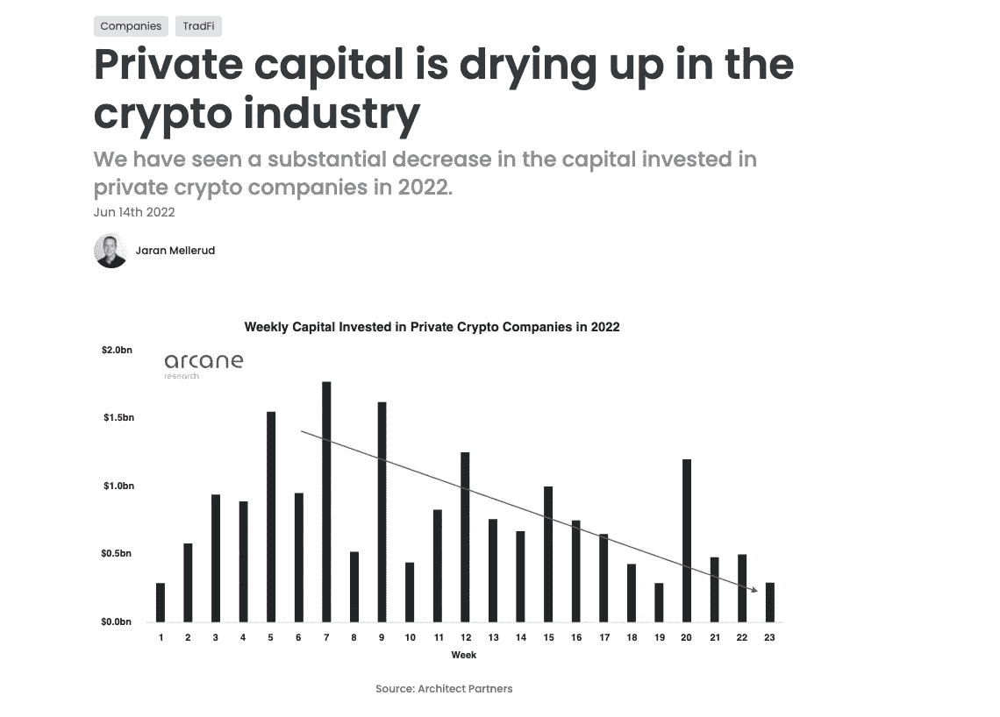
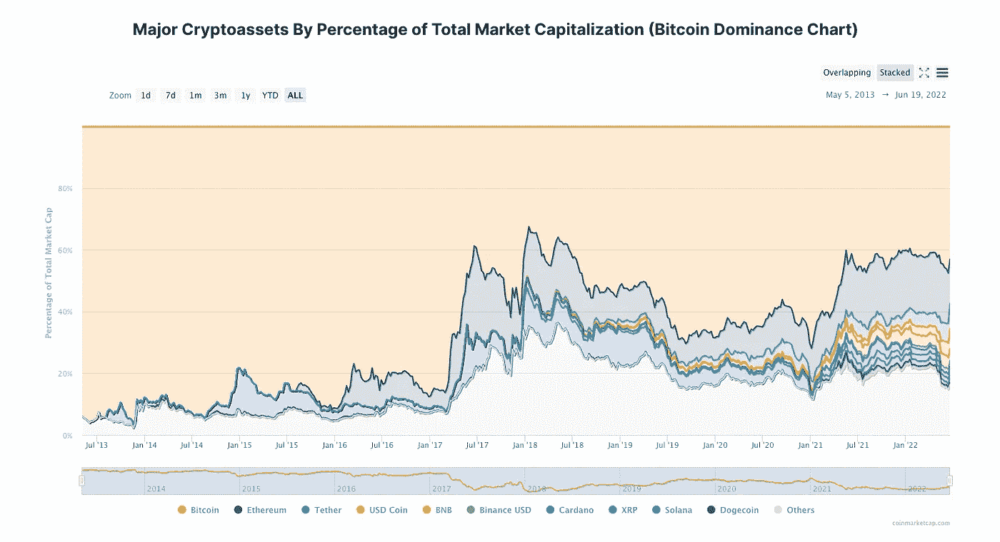

# 本周在 Crypto(6 月 12 日至 6 月 19 日)

> 原文：<https://medium.com/coinmonks/this-week-in-crypto-jun-12-jun-19-91956f26e86e?source=collection_archive---------31----------------------->

本周在加密领域有更多的痛苦。价格和市值全面大幅下降。

这些新闻主要是由大型加密玩家的杠杆头寸平仓(理解为“不情愿”或“被迫”)驱动的，这些玩家在繁荣时期过度杠杆化。对于那些在“这在 TradFi 中感觉熟悉”宾果卡上记分的人，你可以在“UST 脱钩有点像长期资本崩溃”旁边划掉“我认为这是我们的雷曼兄弟时刻——摄氏/3AC”

除了价格压力，我们还收到了更多关于更广泛的技术领域，特别是加密货币交易所的招聘冻结和裁员的消息。

从积极的方面来看，建筑商在继续建造，加密蓝筹股正在寻找新的领域。Circle 宣布计划发行欧元支持的稳定币。

投资者争相了解三支箭危机的深度

 [## 投资者争相了解三箭集团的麻烦——挑衅

### 恐惧显而易见。Terra 崩溃六周后，Celsius 崩溃一周后，四面楚歌的加密银行暂停了…

thedefiant.io](https://thedefiant.io/3ac-margins-calls-leverage/) 

**加密贷款公司 Celsius 以市场状况为由暂停提款和转账**

 [## 加密贷款公司 Celsius 以市场状况为由暂停提款和转账

### 加密贷款公司 Celsius 在周日晚上的一封电子邮件中告诉客户，它将暂停取款和转账…

www.theblock.co](https://www.theblock.co/linked/151522/crypto-lending-firm-celsius-pauses-withdrawals-and-transfers-citing-market-conditions) 

**市场动荡引发交易低迷，加密交易所裁员**

 [## 市场动荡引发交易低迷，加密交易所裁员

### 主要的数字资产交易所正在裁减数百名员工，这与该行业的飞速发展形成了突然逆转…

www.ft.com](https://www.ft.com/content/719cb1c6-1a12-4c7a-b845-3a08679cff4b) 

**为什么以太坊的主流液体赌注协议正在争论是否要降低其影响力**

 [## 为什么丽都社区正在讨论是否减少其赌注足迹

### 人们担心丽都的主导地位可能会给更大的网络带来安全风险，这为一场危机埋下了伏笔

www.theblockcrypto.com](https://www.theblockcrypto.com/news+/152516/why-ethereums-dominant-liquid-staking-protocol-is-debating-whether-to-reduce-its-influence) 

**USDC 发行人圈将在美国推出欧元支持的稳定货币**

 [## USDC 发行人计划在美国引入欧元支持的稳定货币

### Sandali Handagama 是 CoinDesk 的记者，专注于密码法规和政策。她没有任何密码…

www.coindesk.com](https://www.coindesk.com/business/2022/06/16/usdc-issuer-circle-to-introduce-euro-backed-stablecoin-in-us/) 

**本周图表:**

Funding in crypto companies continues a downtrend into second half of 2022 as VC look to judge current winners and traditional institutions grappled with macro headwinds in the economy.

Ethereum looks a winner in the first stages of the crypto winter. As all alt coins face selling pressure and declining valuations ETH looks to have kept its % share of the total crypto space. The strength signals both adoption and longevity to one of smart contracts OG’s. If you are bullish these could be the lowest prices of ETH we will see for a while.

> 加入 Coinmonks [电报频道](https://t.me/coincodecap)和 [Youtube 频道](https://www.youtube.com/c/coinmonks/videos)了解加密交易和投资

# 另外，阅读

*   [最佳加密分析或链上数据](https://coincodecap.com/blockchain-analytics) | [Bexplus 评论](https://coincodecap.com/bexplus-review)
*   [NFT 十大市场造币集锦](https://coincodecap.com/nft-marketplaces)
*   [AscendEx Staking](https://coincodecap.com/ascendex-staking)|[Bot Ocean Review](https://coincodecap.com/bot-ocean-review)|[最佳比特币钱包](https://coincodecap.com/bitcoin-wallets-india)
*   [Bitget 回顾](https://coincodecap.com/bitget-review)|[Gemini vs block fi](https://coincodecap.com/gemini-vs-blockfi)|[OKEx 期货交易](https://coincodecap.com/okex-futures-trading)
*   [美国最佳加密交易机器人](https://coincodecap.com/crypto-trading-bots-in-the-us) | [变化回顾](https://coincodecap.com/changelly-review)
*   [在印度利用加密套利赚取被动收入](https://coincodecap.com/crypto-arbitrage-in-india)