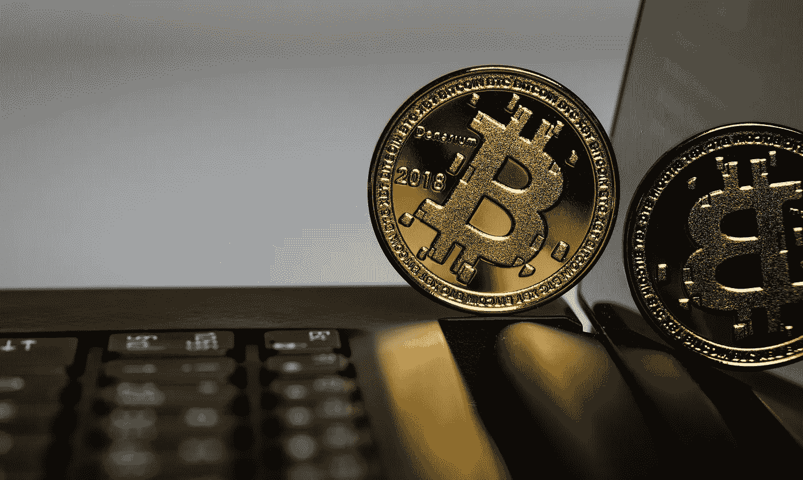

# 本周在加密货币方面:比特币超过 2022 年水平，索拉纳和特拉飙升，以太坊反弹

> 原文：<https://medium.com/coinmonks/this-week-in-cryptocurrencies-bitcoin-surpasses-the-2022-level-solana-and-terra-soar-and-e3f6e28b0699?source=collection_archive---------32----------------------->

Source photo Unsplash.com

在今年平静的开局之后，比特币在周一达到了 2022 年的高点，以太坊在周末飙升，许多排名前 30 的货币在此前一周徘徊。

比特币周一触及 48086.84 美元的 2022 年高点，为新年前夕以来的最高价格。根据……