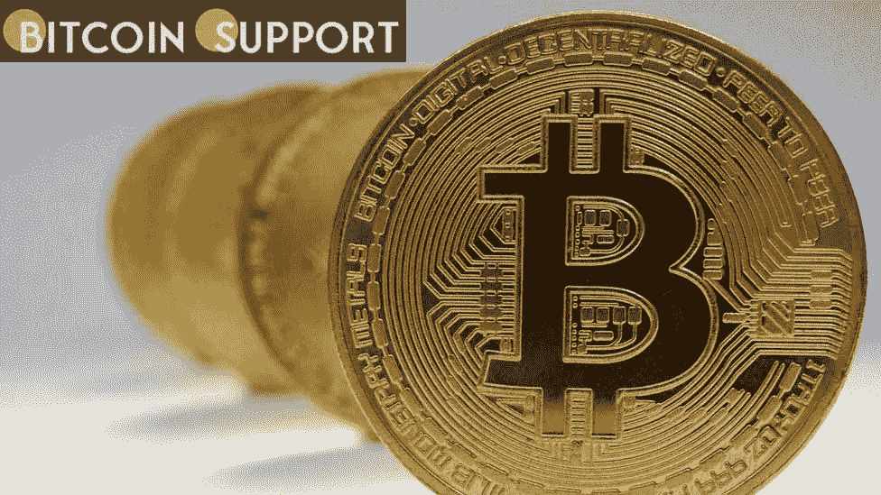
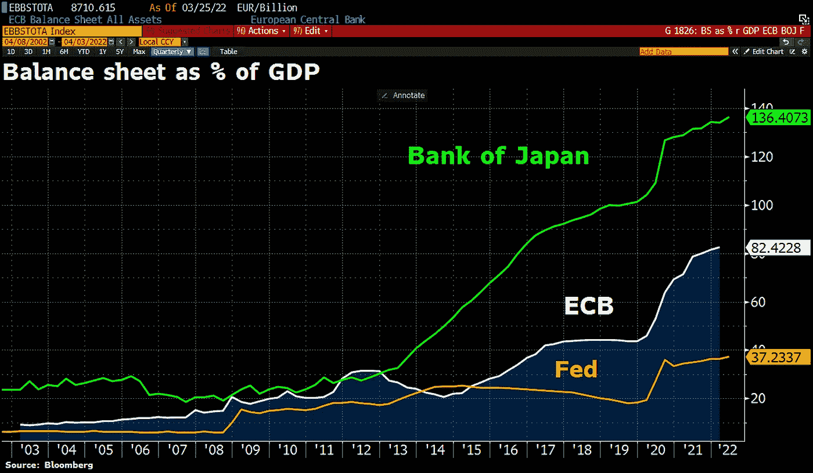
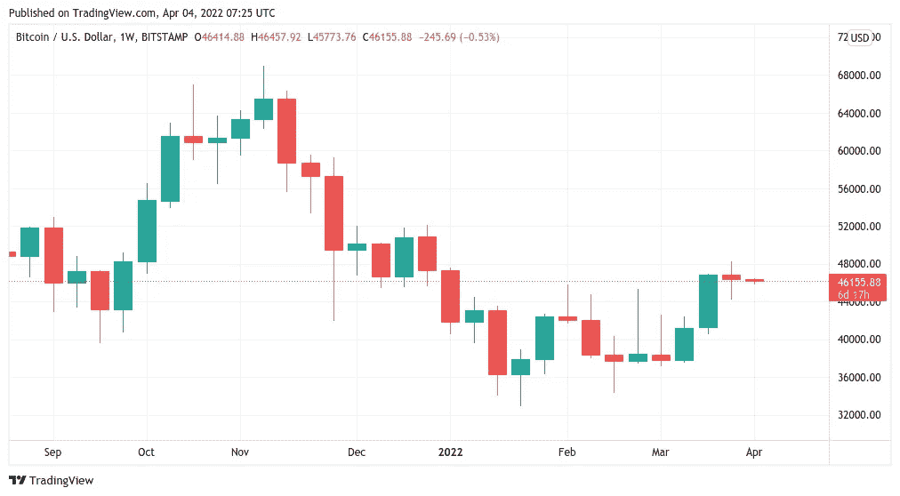

# 本周，我们将谈论关于比特币需要牢记的五件事。2022 年，BTC 将重新开始

> 原文：<https://medium.com/coinmonks/this-week-were-going-to-talk-about-five-things-to-keep-in-mind-about-bitcoin-239b6ce435d4?source=collection_archive---------52----------------------->

**Visit our website:-** [**https://bitcoinsupports.com/**](https://bitcoinsupports.com/)

随着比特币多头预计本周比特币价格将升至 50，000 美元，年度开盘仍将是支撑的焦点。

比特币(BTC)以略高于 46000 美元的价格开始了新的一周和新的一个季度，仿佛是新的一年。BTC/美元几乎处于 2022 年 1 月 1 日的同一水平，这对霍德勒来说似乎是一个似曾相识的糟糕案例。最近几天，价格活动一直很平静，或许过于平静，但有迹象表明，市场正忙于考虑波动性下降背后的未来方向。在比特币保持其年度开盘价作为支撑的背景下，至少到目前为止，4 月份有许多迹象值得关注，从宏观到连锁。

**通货膨胀与新货币印刷碰撞**

关于后 COVID“廉价货币”时期的结论以及它将如何影响比特币这样的风险资产，已经有很多讨论。随着美国美联储承诺在继续提高关键利率的同时减少创纪录的资产负债表，评论人士对可能影响加密投资的冲击波表示担忧。然而，到目前为止，还没有什么迹象表明会发生重大转变，但本周在亚洲，情况似乎正好相反。

根据市场分析师 Holger Zschaepitz 的说法，日本央行(BoJ)在增加资产负债表的同时，印刷了更多的流动性。就 GDP 而言，日本银行已经拥有最大的资产负债表，而且这一趋势还在继续，目前的资产负债表相当于 GDP 的 136%。这不仅让 Zschaepitz 大吃一惊，也可能是“历史上最大的货币实验”。“相比之下，欧洲央行和美联储就像业余选手，”他断言。

**Visit our website:-** [**https://bitcoinsupports.com/**](https://bitcoinsupports.com/)

与此同时，并非所有人都相信，如果更多的印钞意味着风险资产的更好时光，那么大肆宣扬的资产负债表缩减将会持续下去。他们声称，央行将很快被迫恢复流动性注入。“从来没有一个政府能够抑制住印钞的冲动，以支付开支，安抚选民。”政府永远不会自动破产。这是不言自明的。在 3 月份的一篇博客文章中，衍生品巨头 BitMEX 的前首席执行官亚瑟·海斯(Arthur Hayes)说，“我要求你拿出证据来反对我。”

**“因此，如果你的时间视野是以年来衡量的，那就是时间。如果你摆弄公牛，你就会得到角。记住:上涨的不是黄金或比特币的价格；定价法定货币的价值正在下降。”上周收益率曲线反转所证明的相反观点，将加息与美国经济衰退的高概率对立起来，给比特币和股票带来压力。

**现货多头瞄准 5 万美元奖池**

随着周一的开始，波动性的缺失是比特币交易员和分析师讨论的主要话题。根据 TradingView 的数据，围绕周线收盘的传统但短暂的兴奋在几个小时内就消失了，空头仍然没有将年度开盘作为支撑。**

**Visit our website:-** [**https://bitcoinsupports.com/**](https://bitcoinsupports.com/)

因此，BTC/美元正好处于三个月前的水平，但短期价格迹象已经表明它将继续上行。热门分析师 TechDev 就是其中之一，他在 12 小时图上指出了比特币自 1 月份以来的首次“波动挤压”。

[https://twitter.com/TechDev_52/status/1510796082627944456](https://twitter.com/TechDev_52/status/1510796082627944456)

TechDev 利用了布林线波动指标，该指标现在看到 BTC/美元在通道中间向上倾斜。比特币今年首次达到 50，000 美元的可能性已经很大。与此同时，4 月有很多事情要做，因为从历史上看，这个月对比特币来说是“极好的”。

**完整的博客请访问**:-[https://bitcoinsupports . com/BTC-is-starting-all-over-again-2022-以下是本周关于比特币的五件需要牢记的事情/](https://bitcoinsupports.com/btc-is-starting-all-over-again-in-2022-here-are-five-things-to-keep-in-mind-about-bitcoin-this-week/)

**免责声明:以上为作者观点，不应视为投资建议。读者应该自己做研究。**

> 加入 Coinmonks [电报频道](https://t.me/coincodecap)和 [Youtube 频道](https://www.youtube.com/c/coinmonks/videos)了解加密交易和投资

# 另外，阅读

*   [币安交易机器人](/coinmonks/binance-trading-bots-d0d57bb62c4c) | [OKEx 评论](/coinmonks/okex-review-6b369304110f) | [阿塔尼评论](https://coincodecap.com/atani-review)
*   [最佳加密交易信号电报](/coinmonks/best-crypto-signals-telegram-5785cdbc4b2b) | [MoonXBT 评论](/coinmonks/moonxbt-review-6e4ab26d037)
*   [如何在 Bitbns 上购买柴犬(SHIB)币？](https://coincodecap.com/buy-shiba-bitbns) | [购买弗洛基](https://coincodecap.com/buy-floki-inu-token)
*   [CoinFLEX 评论](https://coincodecap.com/coinflex-review) | [AEX 交易所评论](https://coincodecap.com/aex-exchange-review) | [UPbit 评论](https://coincodecap.com/upbit-review)
*   [十大最佳加密货币博客](https://coincodecap.com/best-cryptocurrency-blogs) | [YouHodler 评论](https://coincodecap.com/youhodler-review)
*   [AscendEx 保证金交易](https://coincodecap.com/ascendex-margin-trading) | [Bitfinex 赌注](https://coincodecap.com/bitfinex-staking)