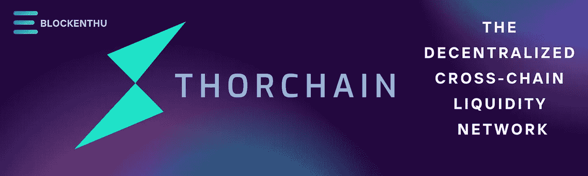
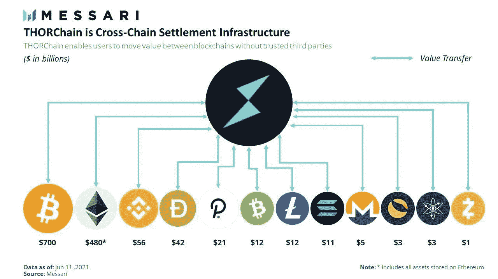
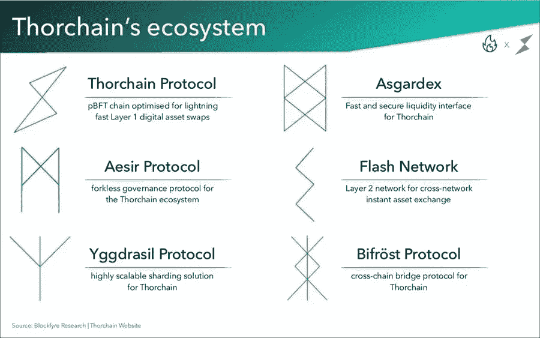
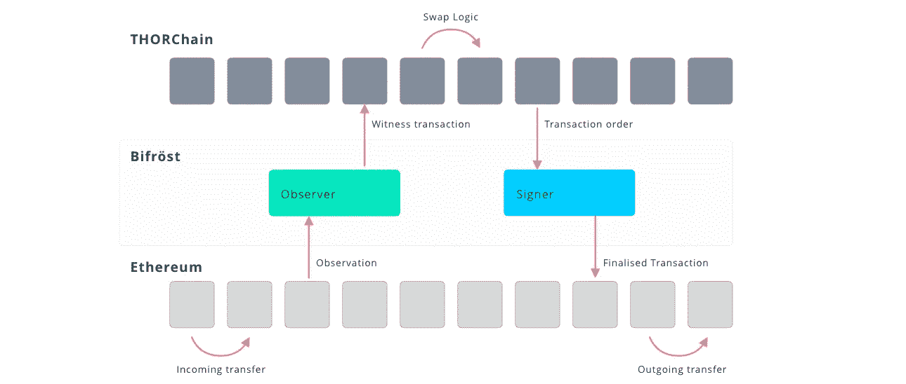
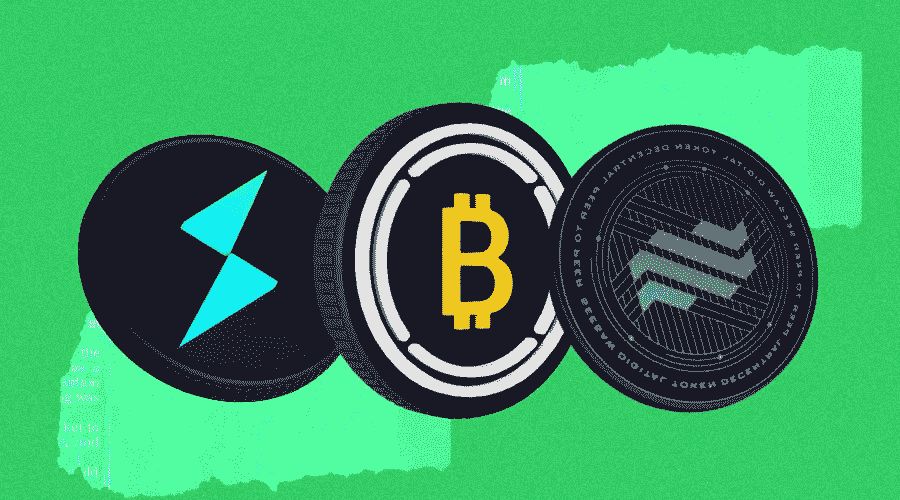

# 荆棘链(符文)

> 原文：<https://medium.com/coinmonks/thorchain-rune-7698cc00bc9a?source=collection_archive---------49----------------------->

> 一个分散的流动性网络，我们可以使用符文作为抵押品，以 1:1 的比例交换代币。

## **thor chain(符文)是什么？**

Thorchain 是一个分散的流动性网络，具有可互操作的区块链，允许以非托管方式进行跨链令牌互换。用户只需在不同的区块链之间交换代币，无需注册交易所或通过 KYC。

## **thor chain 的创始人是谁？**

据 THORChain 的官方代表称，该平台没有首席执行官、创始人和董事。相反，平台的进一步开发是通过 Gitlab 来组织的。

最重要的是，目前从事该项目的人大多是匿名的。THORChain 的一名官方代表再次声明，这是为了“保护该项目，并确保它能够分散。”

【Thorchain 是如何维护的？

->开发人员为节点工作，通过发送使系统更有价值的代码。

->节点通过保护资产和在线为利益相关者工作。

->利益攸关者带来资本，为交换者投放市场。

->交换者支付费用，带来经济活动。"

**记号组学**

截至 2021 年 2 月，在 5 亿总供应量中，有 1.584 亿符文在流通。

正如我们前面提到的，THORChain 最初是在币安 DEX 上的 IEO 之后推出的。作为 IEO 的一部分，售出了 2000 万个符文。在此之前，在早期的融资轮中，总共售出了 1.3 亿符文。

根据币安 DEX 的官方提议，总供应量(5000 万代币)的 10%分配给该团队，并锁定到 mainnet 推出为止，此后每月解锁 20%。

THORChain 目前的排放曲线始于 30%的 APR，预计十年后达到 2%左右的 APR。

# 共识角色

**流动性提供者:**这些用户将资产(如本地比特币或以太坊)存入流动性池。作为存入资产的回报，他们赚取收益。

**交易者**:这些用户希望用一种资产交换另一种资产，比如用原生 ETH 交换原生 BTC。他们派人进去把 BTC 带出来。

**节点操作符:**这些用户运行 THORnodes，它包括 THORChain 节点(Tendermint/Cosmos SDK)，以及每个受支持链的一个节点。因此，节点运营商将运行比特币节点、以太坊节点等

【thorchain 是如何工作的？

thorChain 生态系统作为 thor chain Sybil 抵抗机制的一部分，用于平台治理和安全。ThorChain 节点承诺最少 100 万符文参与其循环一致进程。

ThorChains consensus 是利害关系的证明，建立在 Tendermint 之上，需要网络验证器来绑定其本地令牌 RUNE。符文是这个平台的原生实用令牌。它具有随着网络利用率的增长而增值的令牌模型。使用符文有两个基本原因

*1。Thorchain 不是通过直接的资产转移来运作的，它需要 RUNE 从一个资产转移到另一个资产，并激活 ThorChain 的 Bifrost 协议。因此，在流动性池中，基础货币对需要 1:1 的资产比率。*

*2。RUNE 并不打算成为一个治理令牌，节点可以决定它的方向。Thor chain 不仅仅局限于交易现货代币的交易者。*

# 符文有五个目的

***流动性*** :作为结算资产

***安全*** :作为一种抵御西比尔的安全措施和手段来推动经济行为

***治理*** :给信号链上的优先级

***激励*** :作为激励机制的一部分，符文用来发放奖励、收取费用、补贴汽油

***放大器*** :提升链条上的资产

该项目的持续流动性池(CLP)激励任何 ThorChain 参与者提供流动性以换取回报。ThorChain 的 CLP 有其链上和不可信的流动性“篮子”,并鼓励参与填充它，这意味着 thorchain 的流动性池是一个独特的交易环境，从不需要配对买方和卖方进行交易。Bifrost 协议还跟踪 CLP 中符文与资产的比率。

Thor chain 使用一种独特的系统来帮助缓解流动性提供者在向流动性池捐款时可能遇到的“非永久性损失”问题。它通过使用基于滑动的费用来实现这一点，以帮助确保流动性停留在需要的地方。Thorchain 的吸引力在于其与链无关的特性允许它在真实的基础上交换资产。这是一个里程碑，因为目前比特币最接近 Defi 的包装形式。此外，随着新智能合约平台网络的增长，连锁店的数量也在增长。

Thorchain 结合了一系列新技术，包括 on-way state pegs、状态机、Bifrost signer 模块和 TSS 协议，以无缝促进跨链令牌交换。这个平台不以盈利为目的。protocol 产生的所有费用都直接归用户，团队没有任何规定。

目前，thorchain 正在研究 Polkadot、Solana、Monero、cosmos (ATOM ),预计将推出 mainnet。

# **符文与大地融合**

一个令符文社区兴奋的发展是将 Terra ( [LUNA](https://cointelegraph.com/terra-price-index) )整合到 THORChain 协议中。这种集成也使平台能够支持所有基于 Cosmos 的项目。

Terra integration 为 THORChain 生态系统带来了 LUNA token 以及 TerraUSD (UST) stablecoin，并为用户提供了更多的交易和下注选择。

THORChain 现在[在其 THORSwap 跨链分散交换上支持](https://twitter.com/THORSwap/status/1497261286022918149)六种钱包类型和八种区块链。THORChain 也正在增加对 Haven 和 Monero 的支持。

作为 Terra 和 Cosmos SDK 推出的一部分，THORChain 将通过 hard fork 进行更新，这将在 testnet 中进行全面测试，随后在 Terra 推出后在 Stagenet 中进行进一步测试，并在 mainnet 推出前在 ChaosNet 上进行进一步测试。

# 加入我们，轻松进入 WEB 3.0

> *我们的社区*

# WHATSAPP

 [## BLOCKENTHU

### WhatsApp 群邀请

chat.whatsapp.com](https://chat.whatsapp.com/FTKme4XzkOU73ZDv99Oatj) 

# INSTAGRAM

[https://www.instagram.com/blockenthu/](https://www.instagram.com/blockenthu/)

# 电报

 [## ⚡·布洛克登胡·⚡

### 可以马上查看并加入@blockenthu。

t.me](https://t.me/blockenthu) 

# 商务化人际关系网

 [## Blockenthu | LinkedIn

### LinkedIn 上有 453 名粉丝。“面向大众的 Web 3.0 福利”加密和区块链| BlockEnthu 是社区…

www.linkedin.com](https://www.linkedin.com/company/blockenthu/) 

使用印度最安全的外汇货币

 [## CoinDCX -加密交易所|购买、出售和交易比特币和顶级替代币

### CoinDCX 是印度最大、最安全的加密货币交易所，在这里你可以买卖比特币和其他…

coindcx.com](https://coindcx.com/) 

# blockenthu # ETH # BTC # coincxpathbreaker # FILECOIN #比特币#以太坊# thorchain #符文#月神# terra #原子

> 加入 Coinmonks [电报频道](https://t.me/coincodecap)和 [Youtube 频道](https://www.youtube.com/c/coinmonks/videos)了解加密交易和投资

# 另外，阅读

*   [3 商业评论](/coinmonks/3commas-review-an-excellent-crypto-trading-bot-2020-1313a58bec92) | [Pionex 评论](https://coincodecap.com/pionex-review-exchange-with-crypto-trading-bot) | [Coinrule 评论](/coinmonks/coinrule-review-2021-a-beginner-friendly-crypto-trading-bot-daf0504848ba)
*   [莱杰 vs Ngrave](/coinmonks/ledger-vs-ngrave-zero-7e40f0c1d694) | [莱杰 nano s vs x](/coinmonks/ledger-nano-s-vs-x-battery-hardware-price-storage-59a6663fe3b0) | [币安评论](/coinmonks/binance-review-ee10d3bf3b6e)
*   [Bybit 交易所评论](/coinmonks/bybit-exchange-review-dbd570019b71) | [Bityard 评论](https://coincodecap.com/bityard-reivew) | [Jet-Bot 评论](https://coincodecap.com/jet-bot-review)
*   [3 commas vs crypto hopper](/coinmonks/3commas-vs-pionex-vs-cryptohopper-best-crypto-bot-6a98d2baa203)|[赚取加密利息](/coinmonks/earn-crypto-interest-b10b810fdda3)
*   最好的比特币[硬件钱包](/coinmonks/hardware-wallets-dfa1211730c6) | [BitBox02 回顾](/coinmonks/bitbox02-review-your-swiss-bitcoin-hardware-wallet-c36c88fff29)
*   [block fi vs Celsius](/coinmonks/blockfi-vs-celsius-vs-hodlnaut-8a1cc8c26630)|[Hodlnaut 审核](/coinmonks/hodlnaut-review-best-way-to-hodl-is-to-earn-interest-on-your-bitcoin-6658a8c19edf) | [KuCoin 审核](https://coincodecap.com/kucoin-review)