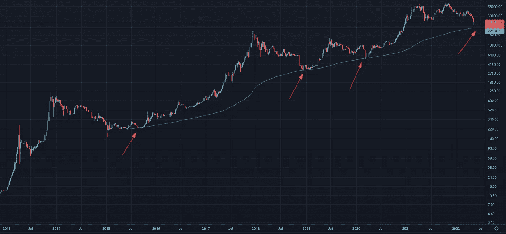
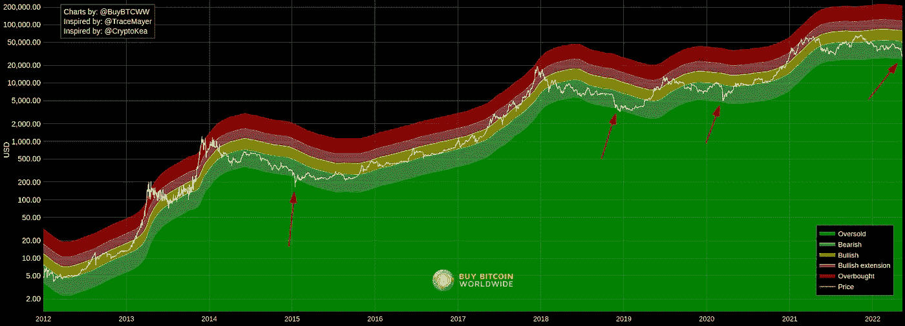
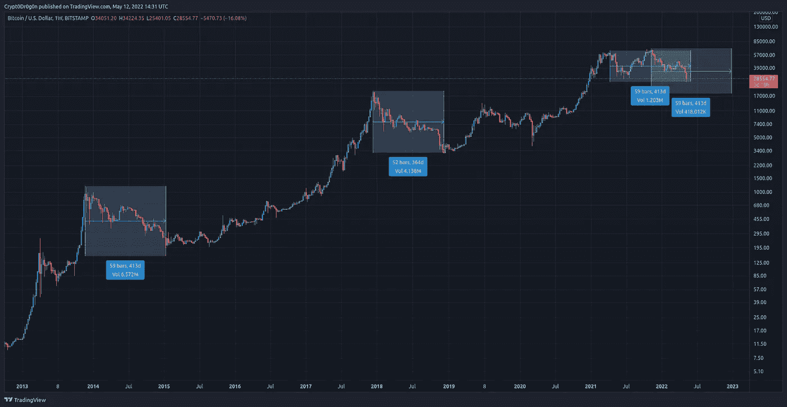

# 对加密货币市场现状的思考

> 原文：<https://medium.com/coinmonks/thoughts-on-the-current-state-of-the-cryptocurrency-market-804108f9311b?source=collection_archive---------14----------------------->

如果有人怀疑 crypto 正处于熊市，那么这些怀疑现在都被打消了。过去几天非常动荡和残酷，几乎证实了熊市趋势。鉴于市场状况，替代硬币已经被彻底摧毁，而 BTC 和瑞士联邦理工学院实际上相当坚挺。

我认为可以有把握地说，大多数市场参与者预计 BTC 和瑞士联邦理工学院(以及主要替代货币)在最近结束的牛市中会达到更高的估值。就我个人而言，我一直认为 BTC 和瑞士联邦理工学院的交易价格应该分别超过 10 万美元和 1 万美元。然而，这些期望与现实相去甚远。市场可能是残酷和意想不到的。这取决于我们调整对市场的看法，并尽可能以最好的方式给自己定位。

我个人认为，当前的世界形势在比预期更早结束本轮牛市(价格方面)的过程中发挥了关键作用。宏观环境显示出许多恐惧和不确定性:美国的通胀处于 40 年来的高点，美联储正在加息，股市一直在暴跌，存在后 COVID 焦虑，更糟糕的是，俄罗斯和乌克兰之间爆发了战争。

# 但这对短期未来意味着什么？

有一点几乎是肯定的:在接下来的几周/几个月里，所有替代硬币(除了极少数例外)都会下跌 95-99%。95%的加密货币不会创造新的历史新高(永远！)而将死。另外 5%将经历一段非常艰难的时期，但可能会在下一轮牛市中复苏。

我唯一能确定的是，BTC 和瑞士联邦理工学院(考虑到币安有多大，我也可以把 BNB 包括在内)最终将在未来几年创下历史新高。

在这一点上，我的建议是，尽可能保持火力，不要将你的峰值净资产与你目前的净资产进行比较。接下来的几个月/几年将会是艰难和令人沮丧的，但这就是机会所在。省钱和平均成本是最好的策略。信念和耐心会在未来回报你。

# 比特币(以及市场其他部分)的看涨理由

现在试图预测底部还为时过早，但我将分享我对潜在底部可能发生的位置以及我所关注的水平的看法。

首先，重要的是要考虑到，我们从底部开始 V 型复苏的可能性非常小(类似于 2020 年 3 月的 COVID 崩盘)。更有可能的是，我们有一个像 2015 年那样的长期底部情景，以及 2018 年 12 月至 2019 年 3 月之间的情景。

话虽如此，在这次熊市中，我们能预计 BTC 会达到什么价格呢？200 周移动平均线已经被证明是底部的一个很好的指标。在上两次熊市中，BTC 从 200 WMA 中完美反弹，包括 COVID 崩盘。因此，人们可以推测，BTC 可能会再次从 200 WMA 反弹。目前，它位于 22，000 美元左右，但它每天都在上升。

200 Week Moving Average

另一个伟大的顶部和底部指标是迈耶倍数。这些基于 200 天移动平均线的价格带非常清楚地显示了 BTC 何时超买和超卖。目前，超卖价格带位于 25，000 美元左右。然而，它正处于下降趋势，可能在几周/几个月内下降几千美元。

Mayer Multiple Price Bands

因此，我预计 BTC 的底部会在 22，000 美元到 25，000 美元之间。然而，这是一个以波动为特征的残酷市场。因此，低于 20，000 美元的灯芯不会让我感到惊讶。

最近两次熊市表明，底部通常发生在顶部之后 50-60 周。所以，关于时间框架，我认为有两种理论可以用来推测底部可能何时发生。

1.  真正的市场顶部发生在 2021 年 4 月，2021 年 11 月的 ATH 是一个“异常现象”，应该是一次死猫反弹:如果我们从上一个熊市周期的时间框架中推断，底部的现实预测将是未来 1-2 个月左右。
2.  2021 年 11 月的顶部是市场的实际峰值:对底部的现实预测将是在 2023 年初左右。

Time from top to bottom

(重要的是，该领域的其他事件也表明市场底部即将到来，如 Tether 的 USDt FUD、altcoin 投降和极端看跌情绪。)

# 最终考虑

我毫不怀疑比特币和 Web3 会继续存在，加密货币市场也是如此。比特币和以太坊显然会生存下来并蓬勃发展。

我预计，在未来两年内，比特币将继续被各国采用，就像萨尔瓦多和中非共和国宣布 BTC 为法定货币一样。此外，我预计越来越多的公司将效仿 MicroStrategy 和 Tesla，在资产负债表中持有 BTC。

以太坊将很快走向股权证明(合并)，并将成为一种通缩资产。出于这个原因，我也认为很有可能公司最终会在资产负债表中持有 ETH。此外，以太坊的第二层(特别是 Arbitrum、乐观、Starknet 和 zkSync)的采用率将在未来 1-2 年内快速增长(甚至可能更短)，天然气费用将开始下降。说到第二层，Arbitrum 将很快跟随乐观主义，向早期用户空投一个令牌。之后 StarkNet 和 zkSync 也会这样做。聪明点:试试这些卷装，在上面做实验；它们比以太坊的 mainnet 要快得多，也便宜得多，而且你得到价值 4 位数的空投物资的概率高得惊人。

保持安全，不要被 rekt。

声明:我不是财务顾问，这些都不是财务建议。