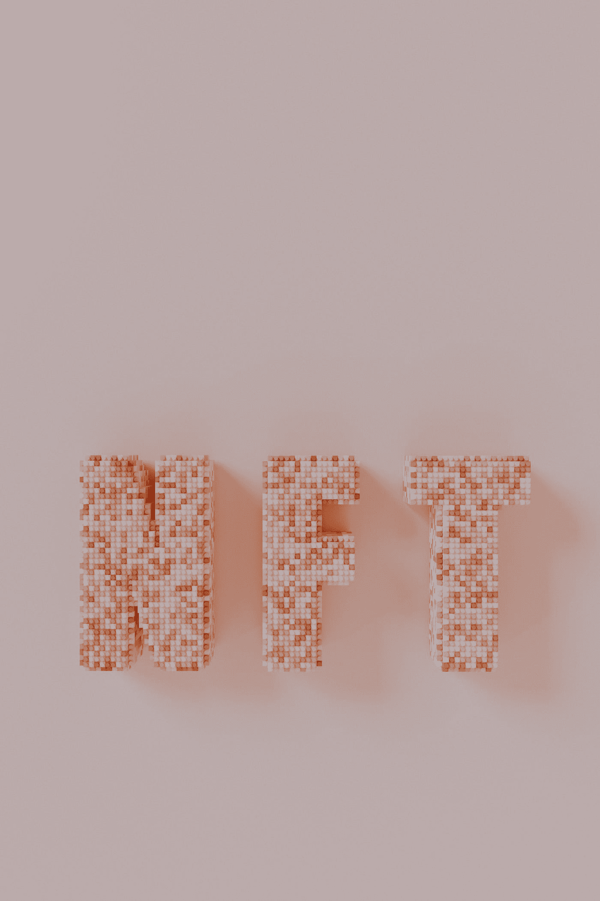
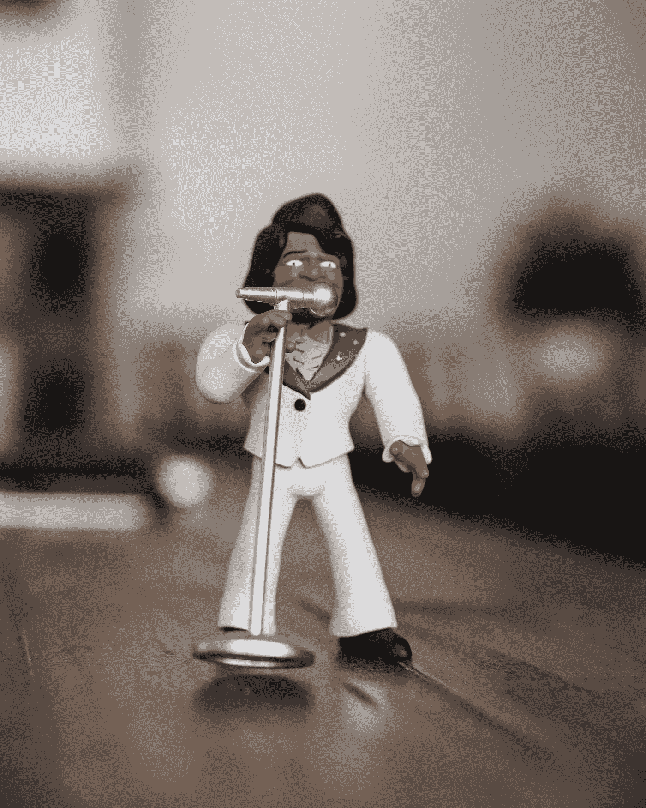

# 对《国际生物伦理法》第一卷的思考

> 原文：<https://medium.com/coinmonks/thoughts-on-volume-1-of-the-ijbl-9caeacfcfe1a?source=collection_archive---------105----------------------->

Photo by [Pawel Czerwinski](https://unsplash.com/@pawel_czerwinski?utm_source=medium&utm_medium=referral) on [Unsplash](https://unsplash.com?utm_source=medium&utm_medium=referral)

## 摘自《区块链法律国际杂志》第一卷的两篇文章

关于涉及 Dao 的法律纠纷的一些想法给律师带来了新的问题，安德鲁·辛克斯(Andrew Hinkes)和*不可替代的令牌(NFTS):它们是名人“恢复”自己形象的一种方式吗？*作者:希亚拉·卡伦、亚历山德罗·切里和索菲·帕金森。这两篇文章出现在全球区块链商业理事会的《国际区块链法杂志》第 1 卷。

你可以在这里 或者在本文末尾的嵌入中找到第一卷 [**。**](https://gbbcouncil.org/wp-content/uploads/2021/11/IJBL-1.pdf)

Photo by [Chris Montgomery](https://unsplash.com/@cwmonty?utm_source=medium&utm_medium=referral) on [Unsplash](https://unsplash.com?utm_source=medium&utm_medium=referral)

# 涉及 Dao 的法律纠纷给律师带来了新的问题

文章中提到的 Dao 的一些法律问题包括:

1.  如果资产由智能合同控制，DAO 能否遵守法院命令将资产移交给受托人或接管人？；
2.  法院应该考虑代码透明性吗(例如，软件是开源的吗？)在其分析中原告是否受到了侵害？；和
3.  DAO 是一个可合法寻址的实体吗？

你可以从下面的文章中找到一些片段。

> 智能合同控制的资产与合法实体控制的数字资产在处理方式上存在结构性差异。因此，如果代码控制了数字资产，并且只在特定的情况下才会放弃对数字资产的控制，并且法院命令移交该资产，那么实际上没有法人可以做到这一点。法院也不能命令智能联系人重写代码。与之形成对比的是，比如一家持有特定资产的银行。法院可以向银行发出命令，要求银行将特定资产移交给接管人或受托人
> 
> 结果是，针对智能合同控制的数字资产，某些法院补救措施可能可用，也可能不可用。您可能只能获得事后或事前补救，而不是影响正在处理的数字资产的补救
> 
> 接下来要考虑的是法院的分析在多大程度上受到代码透明性的影响。也就是说，法典向所有人公开这一事实在多大程度上影响了法院对原告是否受到侵害的判决。
> 
> 当你想到 DAOs，首先想到的问题
> 是被告是否是一个法律上可寻址的
> 实体。
> 
> 谁能被认为是阿道的代表，这个问题提出了有趣的问题。假设一个 DAO 需要一个令牌来进行治理。任何持有代币的人都可以成为被起诉的代理人吗？假设，原告可以为一个加密交易所服务，并声称因为交易所
> 拥有令牌或为第三方持有令牌，所以它代表一个分散的组织行事吗？这可能会导致一个荒谬的结果。

Photo by [Start Digital](https://unsplash.com/@startdig?utm_source=medium&utm_medium=referral) on [Unsplash](https://unsplash.com?utm_source=medium&utm_medium=referral)

# 不可替代的标志(NFTS):它们是名人“恢复”自己形象的一种方式吗？

有趣的文章指出了不可替代令牌(NFT)带来的知识产权(主要是版权)问题。

作者回顾了我之前在 [**的《法律问题》中提到的关于 *JPEG 链接的 NFTs* 和*生成艺术 NFTs* 之间差异的一些问题。我认为我在这里提到的一件事是，对于 JPEG 链接的 NFTs，文件的链接托管在第三方服务器上(可以是联合的、分布式的或企业的)，可以在区块链上不记录任何更改的情况下对其进行操作。对于这些类型的情况，我建议将 NFT 存储在一个分散的数据存储网络上，如**](https://anchor.fm/philomath-ledgerback/episodes/Charles-Adjovu-on-Legal-Issues-with-using-Copyrightable-NFTs-e18s6do) **[**【星际文件系统】**](https://ipfs.io/) (IPFS)，通过类似 [**NFT.storage**](https://nft.storage/) 或 [**arweave**](https://www.arweave.org/) 的服务。我也很喜欢作者们讨论的 [**公开权**](https://mtsu.edu/first-amendment/article/1011/publicity-right-of) 可以成为另一种保护潜在作品的手段，如果版权不可用的话。**

虽然文章中没有提到很多，但另一个要注意的问题是商标的含义，如果一个公司的品牌或标志在作为 NFT 提供的作品中被提及。

正如文章中提到的，需要注意的一些事情包括:

1.  出售 NFT 的个人或团体是否从潜在作品的创作者那里获得了转让或许可？
2.  出售 NFT 的个人或团体是否与基础作品中显示或提到的任何人有权利许可？
3.  出售 NFT 的个人或团体是否被允许使用在作品中显示或引用的公司品牌或标志？

你可以从下面的文章中找到一些片段。

> 最终，对于 NFT 的创作者来说，确保他们
> 从潜在作品的创作者那里获得必要的权利将是很重要的——例如
> 从摄影师(在
> 的情况下是一张 NFT 照片)或艺术家那里获得许可或转让，以 NFT 为目的使用照片/艺术品，因为
> 如果没有这一点，他们很可能会侵犯创作者的版权。
> 
> 尽管有些人认为使用自己的图像应该属于公平交易例外(在美国为公平使用)，这可能会保护用户免受侵犯版权的索赔，但这种例外在英国只适用于少数特定的(主要是非商业的)使用，如研究、私人研究、批评或评论、戏仿或模仿。然而，最安全的做法总是从版权所有者那里获得转让或许可。另一方面，如果 NFT 中的形象以某人的名字或肖像为特征(例如名人的照片)，则该人可以根据英国法律中笼统称为“形象权”的一揽子权利进行追索。这些权利植根于许多法律制度，包括隐私和数据保护法，美国等一些司法管辖区甚至承认特定的“公开权”。同样，如果一个人出现在 NFT 的照片中，谨慎的做法是征得该人以及摄影师(或版权所有者，如果不同)的同意。
> 
> 不幸的是，区块链技术的使用不能作为认证基础资产的完整安全网。这是因为数字资产可能不会直接附加到区块链，这通常是一个昂贵而繁琐的过程。相反，区块链令牌可能只包含指向托管在第三方网站上的文件的链接。虽然对链接本身的任何更改都会显示在区块链上，但如果艺术家(或黑客)更改了链接到的页面或主机服务器，NFT 可能不再将查看者引向原始资产。

*免责声明:*本内容仅供参考，不应作为法律、商业、投资或税务建议。关于那些事情，你应该咨询你自己的顾问。对任何证券或数字资产的引用仅用于说明目的，并不构成投资建议或提供投资咨询服务。

> 加入 Coinmonks [电报频道](https://t.me/coincodecap)和 [Youtube 频道](https://www.youtube.com/c/coinmonks/videos)了解加密交易和投资

# 另外，阅读

*   [如何开始通过加密贷款赚取被动收入](https://coincodecap.com/passive-income-crypto-lending)
*   [BigONE 交易所点评](/coinmonks/bigone-exchange-review-64705d85a1d4) | [电网交易 Bot](https://coincodecap.com/grid-trading)
*   [氹欞侊贸易评论](https://coincodecap.com/anny-trade-review) | [CoinSpot 评论](https://coincodecap.com/coinspot-review)
*   [新加坡十大最佳加密交易所](https://coincodecap.com/crypto-exchange-in-singapore) | [购买 AXS](https://coincodecap.com/buy-axs-token)
*   [投资印度的最佳加密软件](https://coincodecap.com/best-crypto-to-invest-in-india-in-2021) | [WazirX P2P](https://coincodecap.com/wazirx-p2p)
*   [7 个最佳零费用加密交易平台](https://coincodecap.com/zero-fee-crypto-exchanges)