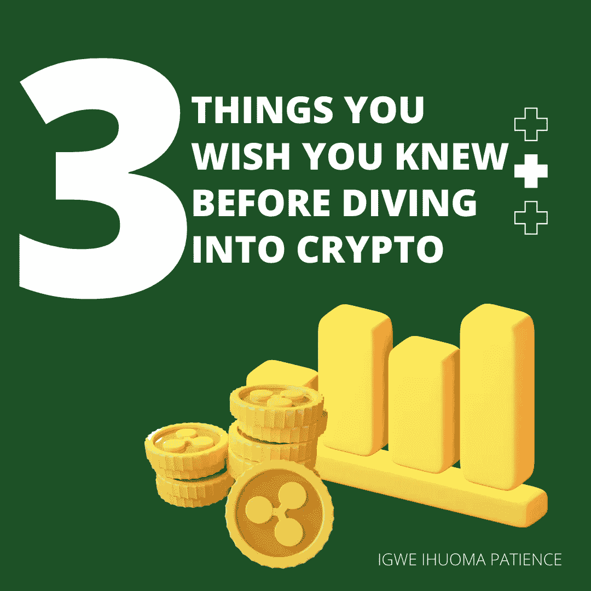

# 在深入研究加密之前，你希望知道的三件事

> 原文：<https://medium.com/coinmonks/three-3-things-you-wish-you-knew-before-diving-into-crypto-cce453f21bc6?source=collection_archive---------30----------------------->

3 THINGS YOU WISH YOU KNEW BEFORE DIVING INTO CRYPTO

# 介绍

加密货币领域充满了大量关于快速致富的误解和错误信息。然而，事情并不总是看起来那样，这里有三(3)件你希望在进入加密货币领域之前知道或应该知道的事情。

## 1.区块链技术并不完美

CRYPTO IS NOT PERECT, SAME ASA YOU

对于每个希望进入区块链领域的人来说，值得注意的是，尽管区块链技术解决了传统金融的问题，但它仍处于起步阶段，因此存在一些缺陷和错误。其中一些缺陷在缓慢的交易速度中显而易见。

.

# 2.加密货币是不稳定的

CRYPTO IS VOLATILE

不要被与加密货币相关的提现率或炒作所欺骗。事实是，加密货币非常不稳定，有一些欺骗的倾向，特别是未经验证的项目，这就是为什么需要对任何加密货币项目的投资进行适当的研究(DYOR)。此外，值得注意的是，比特币是所有加密货币中的佼佼者，因此，在投资或交易任何加密货币时，您都需要关注比特币。这是你需要知道的一个非常重要的加密货币交易秘密。

还值得注意的是，今天许多国家拒绝接受加密货币作为法定货币，因为它的波动率反过来会影响国家的经济。

# 3.加密货币没有政府支持

CRYPTO HAS NO GOVERNMENT BACKING

在一个国家使用任何一种货币之前，必须首先得到该国政府的认可和同意。例如，美元、人民币、日元等货币。因此，与加密货币不同，它没有政府或任何央行的支持。这就是为什么你不能因为任何密码崩溃而起诉任何政府。然而，这是骗局吗？这完全取决于你对它的看法。

## 结论:

在踏入区块链空间之前，有很多事情是你应该考虑的，然而，这些只是你应该注意的其中几个。分享你的观点。

# 关于作者

Igwe Ihuoma Patience 是一名自学成才的创意和特定行业内容作家，也是一名加密货币爱好者，拥有 2 年多的经验和不断发展的区块链空间的知识。

我擅长内容创作、文案撰写、字幕管理、视频编辑和手机图形设计，我教其他人如何在加密货币和区块链领域起步，我的目标是让区块链的学习和更新易于任何人理解。

> 加入 Coinmonks [电报频道](https://t.me/coincodecap)和 [Youtube 频道](https://www.youtube.com/c/coinmonks/videos)了解加密交易和投资

# 另外，阅读

*   [红狗赌场评论](https://coincodecap.com/red-dog-casino-review) | [Swyftx 评论](https://coincodecap.com/swyftx-review) | [造币厂评论](https://coincodecap.com/coingate-review)
*   [Bookmap 评论](https://coincodecap.com/bookmap-review-2021-best-trading-software) | [美国 5 大最佳加密交易所](https://coincodecap.com/crypto-exchange-usa)
*   [如何在 FTX 交易所交易期货](https://coincodecap.com/ftx-futures-trading) | [OKEx vs 币安](https://coincodecap.com/okex-vs-binance)
*   [CoinLoan 审查](https://coincodecap.com/coinloan-review) | [YouHodler 审查](/coinmonks/youhodler-4-easy-ways-to-make-money-98969b9689f2) | [BlockFi 审查](https://coincodecap.com/blockfi-review)
*   [XT.COM 评论](https://coincodecap.com/profittradingapp-for-binance)币安评论 |
*   [SmithBot 评论](https://coincodecap.com/smithbot-review) | [4 款最佳免费开源交易机器人](https://coincodecap.com/free-open-source-trading-bots)