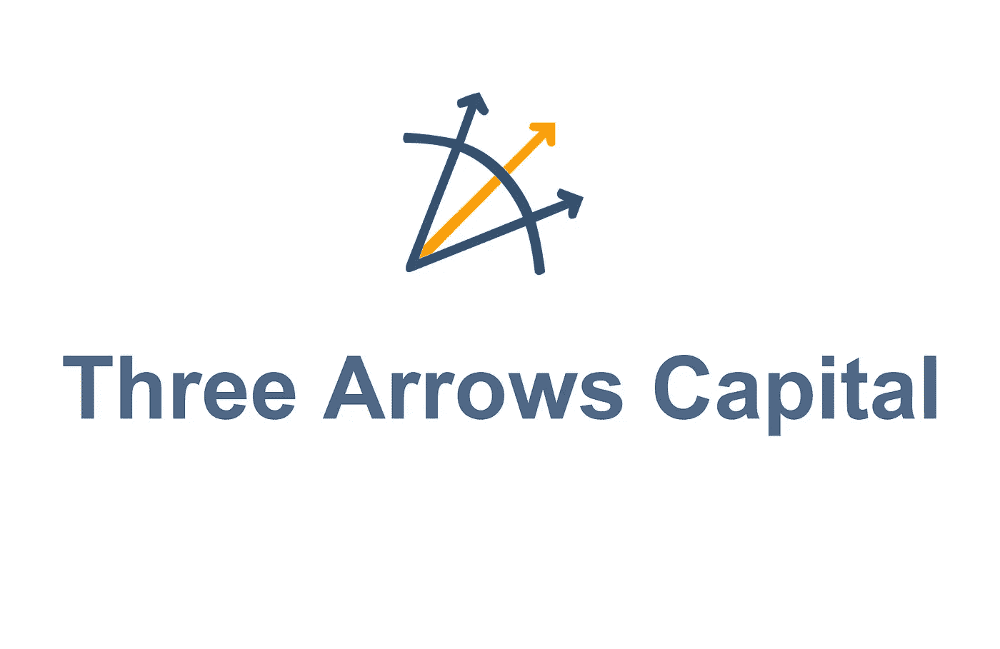
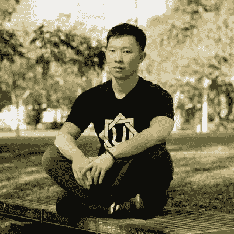
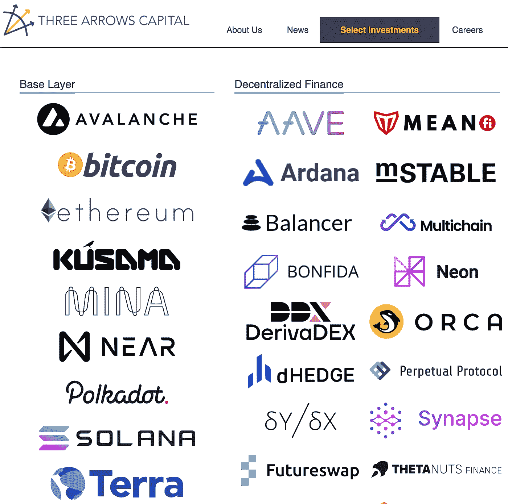
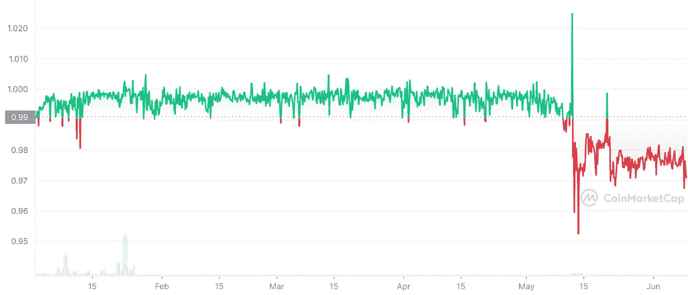
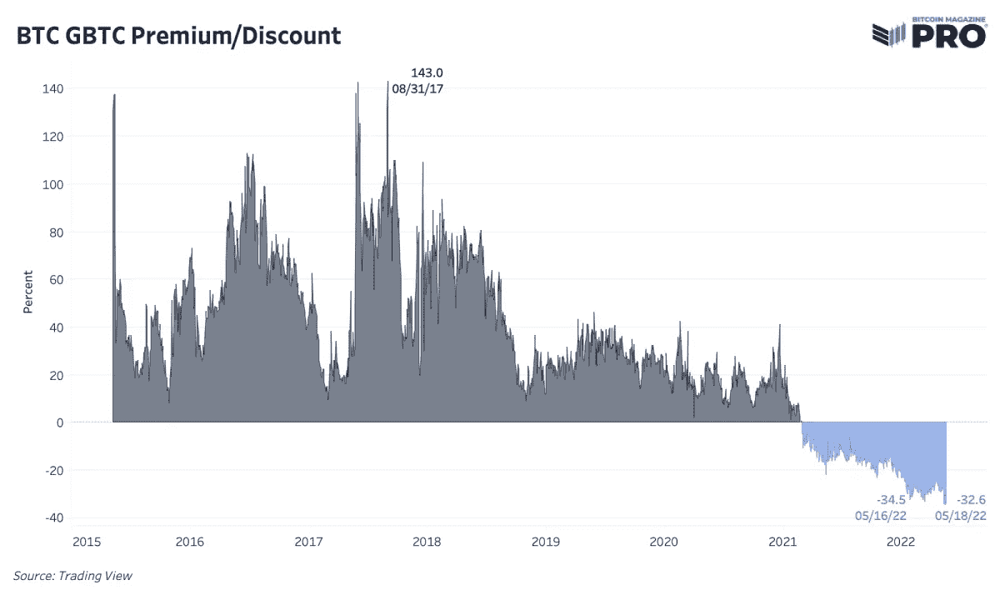

# 三支箭资本第 1 部分:Web 3 多米诺效应

> 原文：<https://medium.com/coinmonks/three-arrows-capital-part-1-the-web-3-domino-effect-c12d8274f8f2?source=collection_archive---------5----------------------->

加密对冲基金 Three Arrows Capital-3AC 的倒闭，或许是分散化金融世界中相互依赖的最好警示。3AC 陷入困境的消息是在 Luna 垮台后不到一个月，大约在同一时间，Celsius 开始发出资不抵债的信号。精明的观察家正确地推测，这三大巨头的崩溃是相互关联的，并显示了一个系统的脆弱性，容易受到多米诺骨牌效应的影响。

Su Zhu and Kyle Davies

三箭资本最初由苏柱和凯尔·戴维斯创立，他们主要在亚洲从事贸易。在创始人开始涉足加密后，他们的公司在 2018 年左右将重点转移到了 Web 3。苏和凯尔认为，加密将遵循互联网周期，泡沫将先于市场范式的转变。尽管 3AC 在过去几年的牛市中表现出色，但泡沫最终还是破裂了，3AC 没有做好渡过难关的准备，而是陷入了困境。

像许多在过去几个月遭受重大损失的公司一样，3AC 对 Terra Luna 的敞口不足为奇。当 UST 失去了与美元的挂钩，卢娜基金会的卫士——LFG 介入帮助恢复了挂钩。LFG 从三箭资本(Three Arrows Capital)、Jump Crypto 和迪法恩斯资本(Defiance Capital)筹集了 10 亿美元的比特币，这些公司随后用比特币交换了露娜。三箭资本以 5.596 亿美元买入 1090 万锁定 LUNA。3AC 对 Luna 的投资目前价值约 670 美元。虽然三箭资本在 Luna 的崩溃中幸存下来，但多米诺骨牌已经开始倒下，一连串的事件将导致整个市场崩溃，使这家曾经备受尊崇的公司破产。

stETH loses its peg to ETH

这个故事的第二个罪魁祸首是 3AC 对 staked ETH——stETH 的长期押注。Staked ETH 是一个代表 ETH 的令牌，已经在以太坊的利害关系证明协议上被标记。虽然 stETH 从未打算与 ETH 的价值挂钩，但许多人认为应该是因为 1:1 的索赔关系，这将允许有人在合并期间协议过渡到股权证明时用 stETH 交换 ETH。在过去几周的市场动荡中，staking platform Lido 上的 stETH 失去了与 ETH 的联系，导致恐慌，并迫使 Alameda 和 3AC 等机构开始交换他们的 stETH on Curve 协议，有效地耗尽了 ETH 的流动性池。这让一些散户投资者以及像 Celsius 这样的机构陷入困境，他们坐在 stETH 的山上，没有足够的流动性退出这些头寸。

3ACs 棺材上的最后一颗钉子是其对灰度比特币信托公司 GBTC 的 13 亿英镑敞口。这是比特币的首批结构化机构产品之一，允许机构交易者在不实际购买和存储加密资产的情况下，暴露于 BTC 的价格波动。GBTC 总是溢价交易，因为在 ETF 推出之前，这是机构交易员参与加密热潮的唯一途径。这创造了一个非常有利可图的套利机会，3AC 将借入 BTC 股票，并将其兑换成价值更高的 GBTC 股票。在 6 个月的锁定期后，这些 GBTC 股票可能会被抛售，从而获得巨额利润。

GBTC 套利机会是过去几年比特币价值飙升的原因之一……大量 BTC 被杠杆收购。然而，随着 ETF 的激增，资金开始流向其它结构性机构产品。GBTC 失去了其作为机构交易员投资比特币的唯一途径的独特地位。这导致一度溢价的股票相对于 BTC 折价交易。这创造了一种不同类型的套利机会，3AC 倾向于押注于此。

由于预计到 ETF 的威胁迫在眉睫，gray 自去年以来一直在游说 SEC 将其比特币信托转换为 ETF。如果 SEC 批准通过，理论上 GBTC 应该开始追踪比特币的价格，因为比特币与 BTC 的兑换比例为 1:1。鉴于 GBTC 的交易价格有 30-40%的折扣，任何持有打折 GBTC 的人都会自动大赚一笔。

3AC 非常看好这个 GBTC 套利机会，以至于在 6 月 7 日就开始向投资者推销这个想法。不幸的是，SEC 的批准从未通过，此后不久，3ACs 破产的传言开始流传。不清楚有多少人投资了 3AC 在 GBTC 的机会。有人猜测，在一连串的追加保证金通知后，3AC 被迫平仓，截至 6 月 17 日，3AC 持有 0 股 GBTC 股票。

曾经在 Twitter 上非常活跃的 3AC 创始人苏竹和凯尔·戴维斯现在已经沉默了。他们欺骗了投资者和更广泛的 Web 3 社区。这并不令人意外，因为他们对过去一个月我们不得不忍受的许多市场动荡负有直接责任。从这家一度享有盛誉的对冲基金的倒闭中，我们可以学到很多东西，但 3AC 故事中最有趣的一面或许是各个公司、区块链和 defi 协议之间的相互依赖。这应该是一个警示故事，说明当多米诺骨牌最终开始倒下时，不受监管的金融部门会产生连锁反应。

感谢您的阅读。

在 Twitter 上查看我的德根之旅:

[https://twitter.com/wasifmrahman](https://twitter.com/wasifmrahman)

在 LinkedIn 上关注我的 Web 3 职业生涯:

 [## Wasif Rahman -美国纽约布鲁克林|职业简介| LinkedIn

### 查看 Wasif Rahman 在全球最大的职业社区 LinkedIn 上的个人资料。Wasif 有 4 个工作列在他们的…

www.linkedin.com](https://www.linkedin.com/in/wasif-rahman-91114a85/) 

看看我对媒体的其他 Web 3 淋浴想法:

 [## 瓦西夫·拉赫曼-中号

### 阅读瓦西夫·拉赫曼在媒介上的作品。Web 3 德根 Ex Populus 营销伙伴关系总监。每天…

medium.com](/@wasifmrahman) 

来源:

 [## 灰度比特币信托公司的“GBTC 折扣”随着 ETF 决定的出台而收窄

### 莱拉·莱德斯马是 CoinDesk Markets 的记者，现居欧洲。她持有比特币、以太和少量…

www.coindesk.com](https://www.coindesk.com/markets/2022/06/24/grayscale-bitcoin-trusts-gbtc-discount-narrows-with-etf-decision-on-horizon/)  [## 最大的“stETH”池几乎空了，使潜在卖家的退出变得复杂

### 阿拉米达研究公司(Alameda Research)和三箭资本(Three Arrows Capital)等大型机构投资者用来抛售的交易池…

www.coindesk.com](https://www.coindesk.com/markets/2022/06/17/biggest-steth-pool-almost-empty-complicating-exit-for-would-be-sellers/)  [## 跳和三支箭导致$1B 卢纳购买安全 UST 对黑天鹅-挑衅

### Terra 的稳定资本，主要是 UST，现在将得到比特币的支持。价值十亿美元的 BTC 将被设定…

thedefiant.io](https://thedefiant.io/luna-sale-ust-bitcoin/) 

[https://www . Bloomberg . com/news/articles/2021-03-10/-灌篮-比特币-套利-最大的秘密基金](https://www.bloomberg.com/news/articles/2021-03-10/-slam-dunk-bitcoin-arbitrage-fizzles-for-biggest-crypto-fund)

> 加入 Coinmonks [电报频道](https://t.me/coincodecap)和 [Youtube 频道](https://www.youtube.com/c/coinmonks/videos)了解加密交易和投资

# 另外，阅读

*   [如何在 FTX 交易所交易期货](https://coincodecap.com/ftx-futures-trading) | [OKEx vs 币安](https://coincodecap.com/okex-vs-binance)
*   [CoinLoan 审查](https://coincodecap.com/coinloan-review) | [YouHodler 审查](/coinmonks/youhodler-4-easy-ways-to-make-money-98969b9689f2) | [BlockFi 审查](https://coincodecap.com/blockfi-review)
*   [XT.COM 评论](https://coincodecap.com/profittradingapp-for-binance)币安评论 |
*   [SmithBot 评论](https://coincodecap.com/smithbot-review) | [4 款最佳免费开源交易机器人](https://coincodecap.com/free-open-source-trading-bots)
*   [比特币基地僵尸程序](/coinmonks/coinbase-bots-ac6359e897f3) | [AscendEX 审查](/coinmonks/ascendex-review-53e829cf75fa) | [OKEx 交易僵尸程序](/coinmonks/okex-trading-bots-234920f61e60)
*   [如何在印度购买比特币？](/coinmonks/buy-bitcoin-in-india-feb50ddfef94) | [WazirX 评论](/coinmonks/wazirx-review-5c811b074f5b)