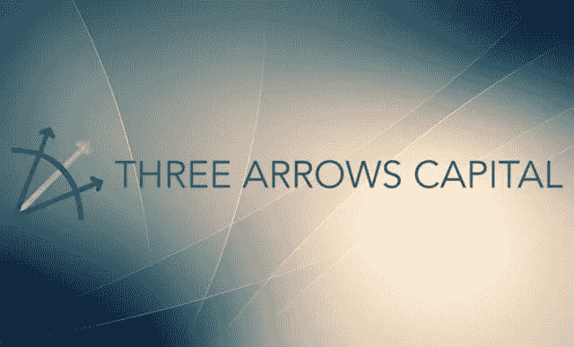
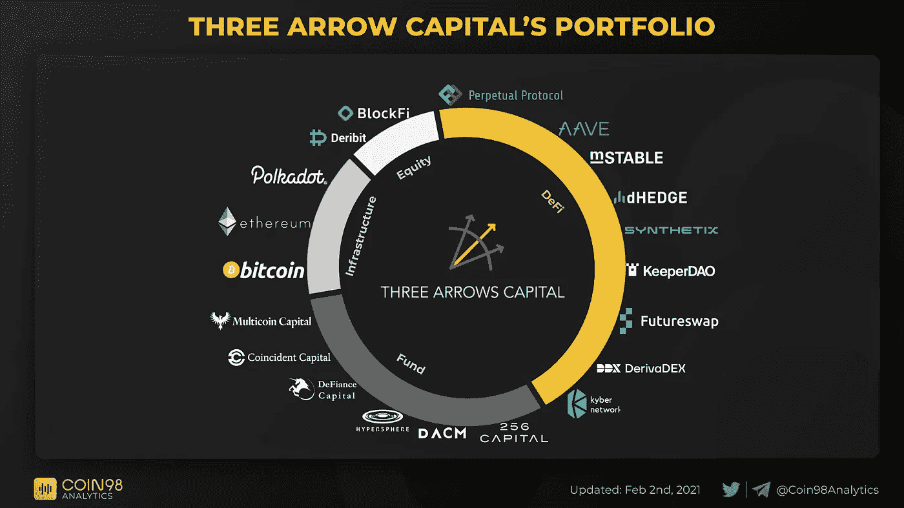
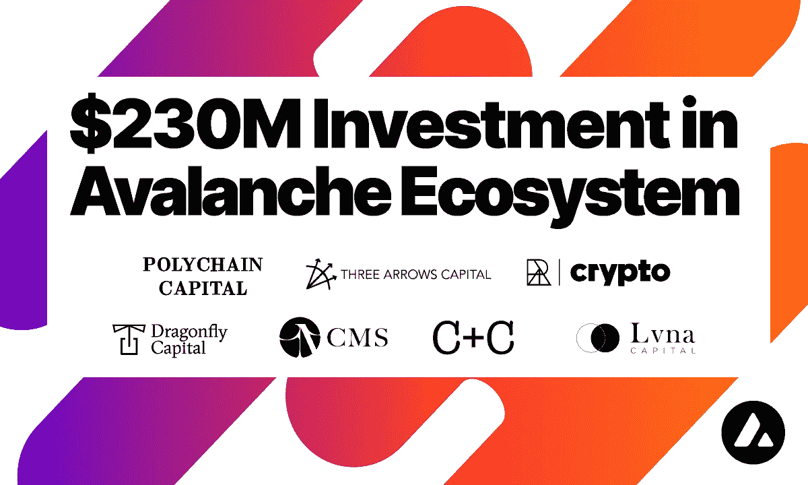
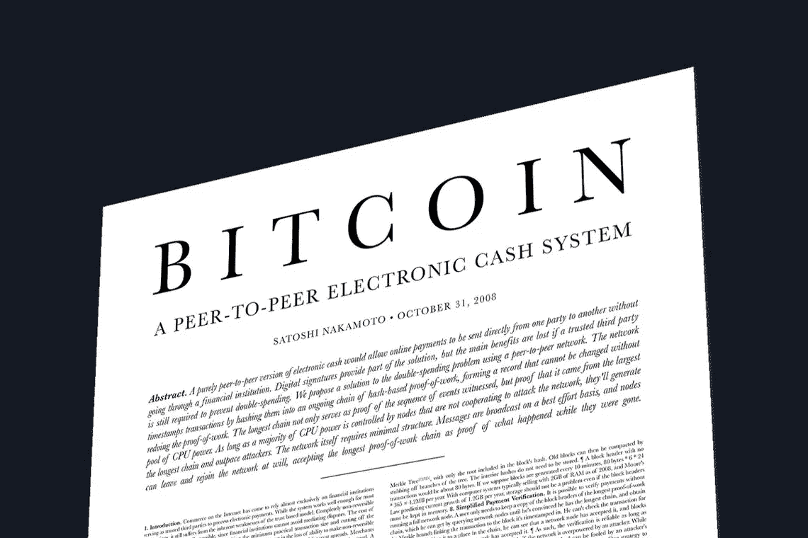

# 三支箭资本第二部分:贪婪与恐惧

> 原文：<https://medium.com/coinmonks/three-arrows-capital-part-2-greed-and-fear-6bf7e42e2999?source=collection_archive---------19----------------------->

昨日有消息称，三箭资本(Three Arrows Capital)被法院下令清算，成为 2022 年加密冬天的最新受害者。这并不令人意外，因为这家对冲基金资不抵债的消息已经公开了一段时间。机构采用是过去几年我们有一个加密牛市的原因。我们现在正在目睹机构收养失控时会发生什么。尽管许多人认为 3AC 是一家管理良好的公司，但它更像是一个赌注庞氏骗局，其崩溃是不可避免的。

3AC 是由在亚洲 TradFi 一起工作的苏柱和凯尔·戴维斯创立的。随着过去几年中加密技术的采用，该公司将其重点转移到 Web 3，并成长为业内最大的对冲基金之一。尽管拥有良好的声誉，3AC 还是卷入了一些真正堕落的、过度杠杆化的头寸，最终导致了该公司的垮台。正如我在上一篇文章中提到的，3AC 在 Terra Luna、gray bit coin Trust——GBTC 和 Staked ETH——stETH 的投资中遭受了重大打击。然而，在过去几周，我们对 3AC 如何开展业务、它与投资组合公司的关系，以及迫使该公司在不断下跌的市场中采取过度杠杆化头寸的流动性危机有了更多的了解。

3AC 以在种子期和战略轮投资著名的 Web 3 项目而闻名。他们的投资组合拥有 48 个项目，包括基础层链、DeFI 协议、股权、基金、游戏和 NFT。他们投资组合中的一些知名项目包括 Terra、Avalanche、Near、AAVe、BlockFi、Multicoin Capital 和 Axie Infinity。许多人不知道的是，3AC 为他们的投资组合项目提供了资金管理服务，以帮助他们产生收益——一位匿名创始人透露，3AC 为其资金管理服务提供了 8%的年回报率。许多投资组合公司选择将融资和部分资金放在 3AC。当资不抵债的谣言开始流传的时候，许多信任 3AC 的项目突然发现自己被抛弃了。

更糟糕的是，今天的清算消息意味着 3AC 将不得不出售其投资公司内部的种子资金和战略分配。这些分配中有许多在授权合同中被锁定，一旦解锁就会被抛售，尤其是在破产时被收回。这可能会对 3AC 投资组合中所有公司的股价产生非常不利的影响。从这个角度来看，现在有一些项目在 3AC 清算中同时失去了资金和股票价值。

> 交易新手？试试[加密交易机器人](/coinmonks/crypto-trading-bot-c2ffce8acb2a)或者[复制交易](/coinmonks/top-10-crypto-copy-trading-platforms-for-beginners-d0c37c7d698c)

许多人开始怀疑 3AC 蔓延的真实规模。有多糟糕，还能糟糕到什么程度？事实证明，3AC 从该领域的许多机构获得了大量贷款，并在几项投资中利用了多头头寸。随着过去几周加密市场的崩溃，3AC 发现自己被要求追加保证金并面临清算。BlockFi 和 Genesis 等加密贷款公司在一连串的保证金通知中清算了 3ACs 的头寸。本周早些时候，3AC 拖欠了 Voyager Digital 的一笔贷款，按当前利率计算，价值约 6 . 5 亿美元。到周一，情况变得非常清楚，任何给 3AC 提供资金的项目都可能拿不回任何东西。

3AC 的故事是一个警示故事，讲述了当制度采纳导致我们回到同样的制度错误时会发生什么。比特币诞生于 2008 年金融危机之后。比特币在设计时就考虑到了透明度，它本应是我们避免另一场经济灾难的一种方式。正如任何令人向往的新技术一样，有时结果并不是我们所期望的。从一份白皮书开始的东西催生了一个全新的多面性行业，这个行业被称为无所不包的术语 Web 3。这个行业由相互关联的公司、风险公司、DeFi 协议和 Dao 组成，它们都在努力帮助构建这项新兴技术的未来。随着机构资金的流入，这些相互关联的项目蓬勃发展。

然而，机构可以是鲁莽和贪婪的。3AC 的故事是一个案例，说明为什么机构收养可能不是一件好事。缺乏透明度、高杠杆和制度上的相互依赖将不可避免地引发问题。我们现在的处境与 2008 年金融危机时没有太大不同。非常清楚的是，监管者的注意力现在牢牢地固定在 Web 3 上……这个行业诞生于摆脱政府控制的愿望。讽刺是诗意的。

感谢您的阅读。

看看我在推特上未经过滤的想法:

[https://twitter.com/wasifmrahman](https://twitter.com/wasifmrahman)

在 LinkedIn 上关注我的 Web 3 职业生涯:

 [## Wasif Rahman -美国纽约布鲁克林|职业简介| LinkedIn

### 查看 Wasif Rahman 在全球最大的职业社区 LinkedIn 上的个人资料。Wasif 有 4 个工作列在他们的…

www.linkedin.com](https://www.linkedin.com/in/wasif-rahman-91114a85/) 

我对媒体的另一个 Web 3 淋浴想法:

 [## 瓦西夫·拉赫曼-中号

### 阅读瓦西夫·拉赫曼在媒介上的作品。Web 3 德根 Ex Populus 营销伙伴关系总监。每天…

medium.com](/@wasifmrahman) 

阅读第 1 部分:Web 3 多米诺效应

 [## 三支箭资本第 1 部分:Web 3 多米诺效应

### 加密对冲基金 Three Arrows Capital-3AC 的倒闭或许是关于相互依赖的最好警示…

medium.com](/coinmonks/three-arrows-capital-part-1-the-web-3-domino-effect-c12d8274f8f2) 

来源:

 [## BitMEX 和其他退出三箭资本在 3AC 破产的恐惧-解密

### 三箭资本多年来一直是加密投资公司的宠儿。现在，在加密熊市和之后…

decrypt.co](https://decrypt.co/103153/bitmex-finblox-deribit-others-exiting-three-arrows-capital-3ac-insolvency-fears)  [## 三支箭支持的协议说，财政部的主要部分下落不明

### 一份由三箭资本支持的 DeFi 协议称，该基金控制了其国库的很大一部分

砌块工程](https://blockworks.co/three-arrows-backed-protocol-says-major-chunk-of-treasury-is-unaccounted-for/)  [## 加密对冲基金三支箭被法院下令清算

### 在债权人起诉三箭资本有限公司后，英属维尔京群岛一家法院下令对其进行清算。

www.wsj.com](https://www.wsj.com/articles/crypto-fund-three-arrows-ordered-to-liquidate-by-court-11656506404)