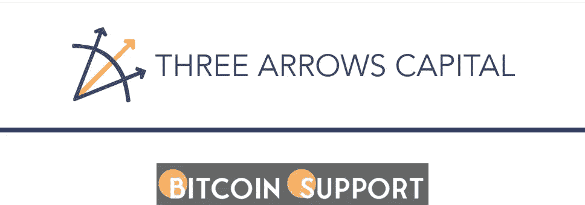

# 三箭资本以 2200 万美元收购 7500 以太坊(ETH)，将加密货币的价格推高至 3000 美元以上

> 原文：<https://medium.com/coinmonks/three-arrows-capital-purchases-7500-ethereum-eth-for-22-million-pushing-the-price-of-the-7f5dffe1f7c0?source=collection_archive---------34----------------------->

**Visit our website:-** [**https://bitcoinsupports.com/**](https://bitcoinsupports.com/)

3 月 22 日，对冲基金经理三箭资本(Three Arrows Capital)以 2243 万美元的价格收购了近 7500 个以太坊。在过去的 8 小时里，三箭资本的以太坊地址显示以太从 FTX 和德里比特的加密交易所流出。

三箭资本在正确的时间买入乙醚，当时交易价格在 2800 美元附近，就在价格上涨大致 5%之前。如今，包括以太坊在内的密码市场出现了激增，目前的 ETH 价格交易在 3000 美元以上。

**三箭资本已对以太坊**

进行了投资在一条推文中，密码作家科林吴(Colin Wu)声明，该对冲基金共撤出了 7500 ETH。从 FTX 转来 5500 ETH，从 Deribit 转来 2000 ETH。

[https://twitter.com/WuBlockchain/status/1506189160087838722](https://twitter.com/WuBlockchain/status/1506189160087838722)

根据以太扫描统计，已经有三笔交易链接到三箭资本的钱包地址。从 FTX 流出的两笔交易价值 3500 埃特和 2000 埃特，从德里比特流出的一笔交易价值 2000 埃特。此外，对冲基金经理的钱包地址显示本周有巨额 ETH 赌注。四天前，两笔交易显示有 40，500 和 9000 股乙醚流入。然而，钱包里也流出了 36400 乙醚。

继最近的购买之后，三箭资本联合创始人朱苏发推文:

**“为什么泵”这个问题的答案永远是“预定的”，不多也不少。”**

以太坊在过去 24 小时内上涨了 5%

三箭资本和 FTX 最近为米娜股权证明协议发起了一轮筹款，目标是增加以太坊工程师的数量。随着以太坊推动 ETH 2.0 的发展，交易商们正在加大对高效以太坊的投资。根据 CoinMarketCap 的数据，在过去的 24 小时内，以太坊的交易量增长了 38%，价格上涨了近 5%。此外，随着投资者决定持有以太币，以太币价格在上周攀升了近 19 %,从 2500 美元升至 3000 美元的关键关口。

**访问我们的网站:-**[**https://bitcoinsupports.com/**](https://bitcoinsupports.com/)

**免责声明:以上为作者观点，不应视为投资建议。读者应该自己做研究。**

> 加入 Coinmonks [电报频道](https://t.me/coincodecap)和 [Youtube 频道](https://www.youtube.com/c/coinmonks/videos)了解加密交易和投资

# 另外，阅读

*   [如何匿名购买比特币](https://coincodecap.com/buy-bitcoin-anonymously) | [比特币现金钱包](https://coincodecap.com/bitcoin-cash-wallets)
*   [瓦济克斯 NFT 评论](https://coincodecap.com/wazirx-nft-review)|[Bitsgap vs Pionex](https://coincodecap.com/bitsgap-vs-pionex)|[Tangem 评论](https://coincodecap.com/tangem-wallet-review)
*   [如何使用 Solidity 在以太坊上创建 DApp？](https://coincodecap.com/create-a-dapp-on-ethereum-using-solidity)
*   [币安 vs FTX](https://coincodecap.com/binance-vs-ftx) | [最佳(SOL)索拉纳钱包](https://coincodecap.com/solana-wallets)