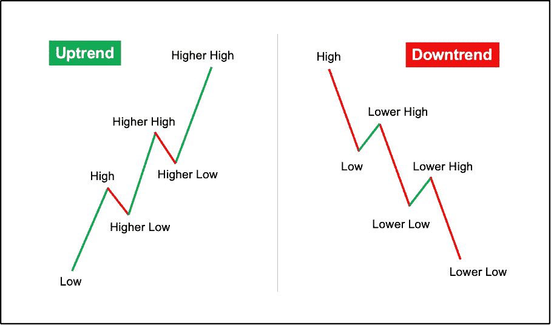
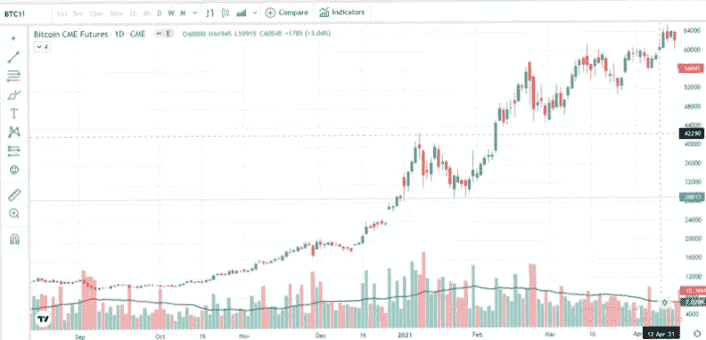
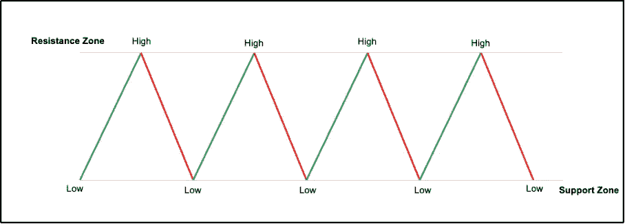
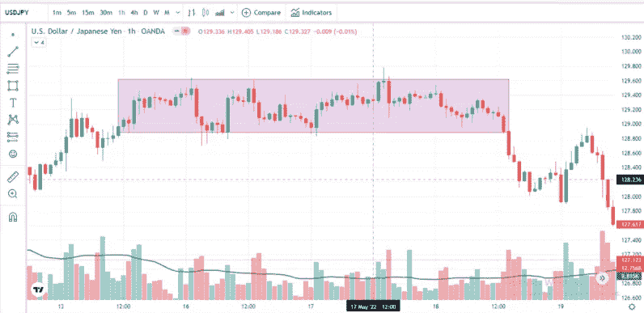
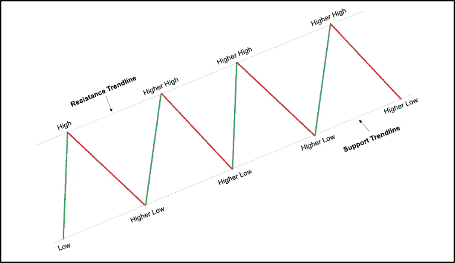
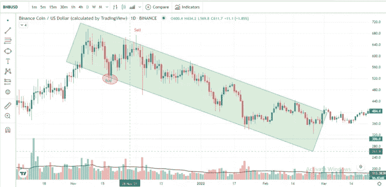

# 你应该知道的三种不同的加密/外汇市场状态

> 原文：<https://medium.com/coinmonks/three-different-crypto-forex-market-states-you-should-know-a73385a2d575?source=collection_archive---------24----------------------->

# 你应该知道的三种不同的加密市场状态

区块链

比特币

**三种不同的加密状态是什么，为什么您应该知道它们？**

新手加密交易者、投机者和投资者普遍存在一种误解，认为任何加密资产的价格都是随机波动的。一些人坚信密码的价格是由供需等基本面因素驱动的，而一些人认为是鲸鱼控制了整个密码市场。前一类和后一类人的方式都是正确的，但他们忽略了价格的一个关键方面

*   **市场状态-** 在任何特定时期，推动价格的都是市场状态。

这两种流行的观点是相互联系的，硬币的基本面，以及机构参与者的举动，决定了任何加密货币和外汇的市场状态。如果你是一个技术交易者，如果你对日内交易和黄牛交易感兴趣，你必须担心的是你正在交易的加密/外汇目前处于哪个市场状态。基于此，你必须决定[交易任何给定的加密资产/货币对类别](https://support.kucoin.plus/hc/articles/360015207073-How-to-Make-a-Trade-on-KuCoin)。考虑到当天的其他新闻和硬币的整体基本面，不言而喻。

# 加密货币市场的不同状态

整个加密货币市场，或者说任何金融市场的方向，都是由买卖双方决定的。价格图表给了我们许多关于市场环境的信息。利用价格图表，我们可以很容易地评估市场支配地位。根据谁在控制市场，技术专家将市场分为三种不同的状态，即:

*   趋势
*   范围
*   频道

任何加密资产/货币对的价格都在这三种不同状态下变动。所有烛台模式，[密码图表模式](https://blog.aluna.social/how-to-trade-cryptocurrency/2020/05/31/bitcoin-technical-analysis-top-8-chart-patterns-for-crypto-trading/)，货币图表模式等。，最终将属于上述两种市场状态之一。每个技术交易者都需要知道这些市场状态，以便有效地运用他们的策略。例如，在趋势市场中应用为区间市场设计的[策略](https://www.kucoin.com/blog/top-trading-strategies-for-stagnating-and-ranging-markets)可能最终会失败。现在，让我们来了解这些市场是什么，以及如何准确地交易它们。

# 什么是趋势？

在趋势市场中，加密资产/货币对的价格将明显向一个方向移动。这并不意味着图表将呈直线。当然，价格会朝另一个方向移动一段时间，但最终，它会恢复原来的趋势。在趋势市场中，我们可以看到一个加密资产/货币对的价格行为根据主要的市场趋势而产生更高的高点、更高的低点、更低的高点和更低的低点。

如果买方完全控制了市场，我们称之为上升趋势。相反，如果卖方控制了市场，我们称之为下跌趋势。在上升趋势中，给定的加密资产/货币对价格形成更高的高点，经历回调到附近的任何重要水平，并恢复原来的方向，以形成一个全新的更高的高点。这同样适用于下跌趋势。为了更好地理解这一点，请查看下面的快照。

在下面的[比特币](https://www.kucoin.com/blog/what-is-bitcoin-and-how-does-it-work)价格图中，很明显市场是趋势性的。它代表了 2021 年第一季度整个 [BTC 牛市](https://www.kucoin.com/blog/bitcoin-continues-to-build-up-a-big-base-of-capital-and-retail-re-accumulation-continues)。正如你所看到的，价格继续创造更高的高点和更高的低点，表明了明显的上升趋势。

[BTC bull run](https://www.kucoin.com/blog/bitcoin-continues-to-build-up-a-big-base-of-capital-and-retail-re-accumulation-continues) (Uptrend)

*比特币价格走势图形成趋势|来源:* [*BTC/USDT*](https://trade.kucoin.com/BTC-USDT)

# 什么是范围？

当价格没有创造任何更高的高点或更低的低点时，我们说加密/外汇市场正在横盘整理或移动。在任何给定的范围内，加密资产的价格行为保持在给定的支撑位和阻力位之间。区间的形成意味着双方都没有控制市场。买家和卖家实力相当，因此，他们不能创造更高的高点或更低的低点。

通常情况下，在一个波动的市场中，价格从支撑位开始其旅程，并到达阻力区。然后，它回落到支持，并遵循相同的模式一段时间，直到范围结束。交易区间的一般规则是在支撑位买入，在阻力位卖出。在没有任何确认的情况下这样做是有风险的。(您可以查看指标来判断市场趋势，[https://medium . com/@ princeedesco/indicators-you-need-to-know-before-trading-5466 a06b 6764](/@princeedesco/indicators-you-need-to-know-before-trading-5466a06b6764))

始终考虑基于实际市场方向的交易区间。也就是说，当整个市场看涨时，考虑只在支撑位买入，不要在阻力位卖出。永远记住整体趋势是你的朋友。

下面的美元兑日元图表就是一个很好的例子，因为我们可以看到价格在横向移动，并保持在区间内。

USDJPY Formation (Side Trend)

*美元兑日元价格图表上一个区间的形成|来源:美元兑日元*

# 什么是渠道？

我们可以把“通道”看作是“趋势”和“范围”的结合在通道中，价格仍然在支撑位和阻力位之间波动，但是这些位是以趋势线的形式画出来的。加密资产在渠道中的价格不会横向波动。它或者向上或者向下移动，但是它在趋势线之间移动。然而，交易通道和交易区间差不多，但是要格外小心。下面的信息图会让你对渠道有一个大致的了解。

在下面的[币安钱币价格图](https://www.kucoin.com/blog/wgat-is-binance-coin-and-how-does-it-work)中，我们可以看到一个通道的形成。如果你观察，价格在区间内移动，同时制造更高的高点和更高的低点。

*币安钱币价格图上一个通道的形成|来源:*[*BNB/美元*](https://trade.kucoin.com/BNB-USDT)

# 结论

学会根据当前的市场状态交易加密/外汇市场是专业交易者和新手的区别。在进行任何交易之前，一定要检查整体市场趋势。在接下来的课程中，我们将用清晰的例子来解释如何交易这些市场状态。

> 加入 Coinmonks [电报频道](https://t.me/coincodecap)和 [Youtube 频道](https://www.youtube.com/c/coinmonks/videos)了解加密交易和投资

# 另外，阅读

*   [德国最佳加密交易所](https://coincodecap.com/crypto-exchanges-in-germany) | [Arbitrum:第二层解决方案](https://coincodecap.com/arbitrum)
*   [币安交易机器人](/coinmonks/binance-trading-bots-d0d57bb62c4c) | [OKEx 评论](/coinmonks/okex-review-6b369304110f) | [阿塔尼评论](https://coincodecap.com/atani-review)
*   [最佳加密交易信号电报](/coinmonks/best-crypto-signals-telegram-5785cdbc4b2b) | [MoonXBT 评论](/coinmonks/moonxbt-review-6e4ab26d037)
*   [如何在 Bitbns 上购买柴犬(SHIB)币？](https://coincodecap.com/buy-shiba-bitbns) | [买弗洛基](https://coincodecap.com/buy-floki-inu-token)
*   [CoinFLEX 评论](https://coincodecap.com/coinflex-review) | [AEX 交易所评论](https://coincodecap.com/aex-exchange-review) | [UPbit 评论](https://coincodecap.com/upbit-review)
*   [十大最佳加密货币博客](https://coincodecap.com/best-cryptocurrency-blogs) | [YouHodler 评论](https://coincodecap.com/youhodler-review)