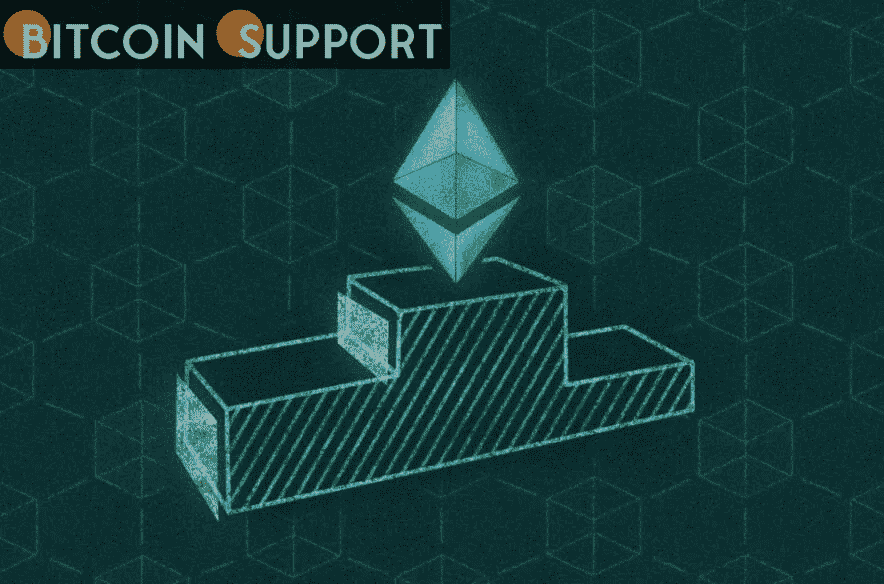
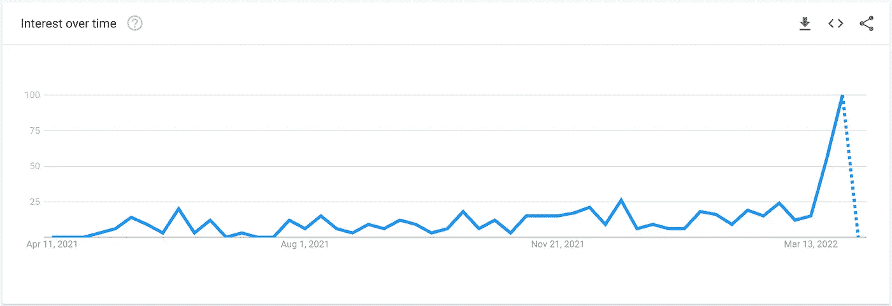
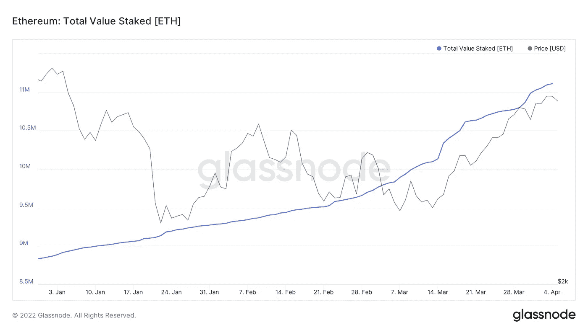
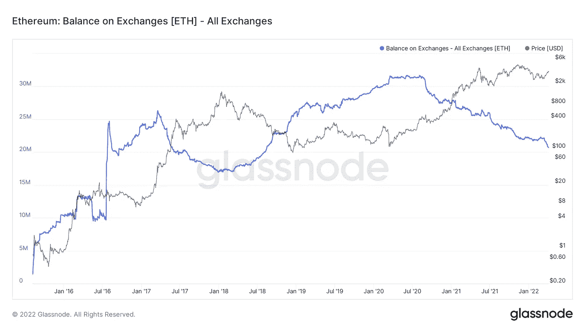
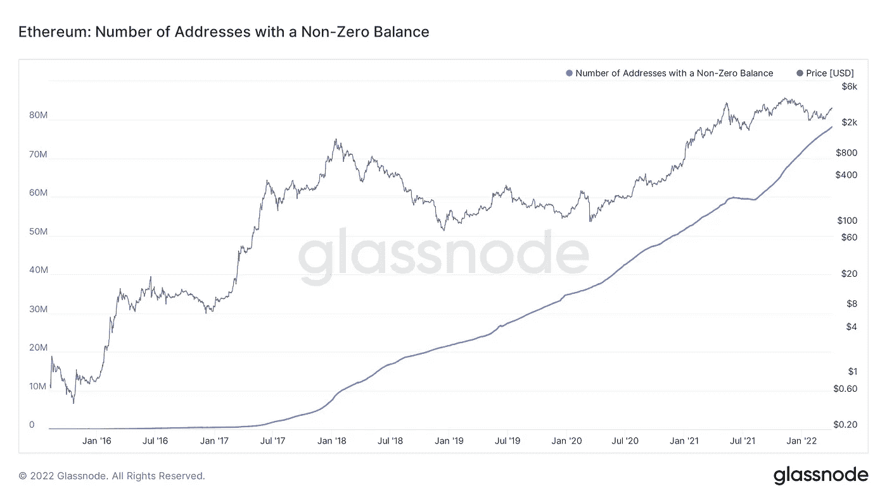
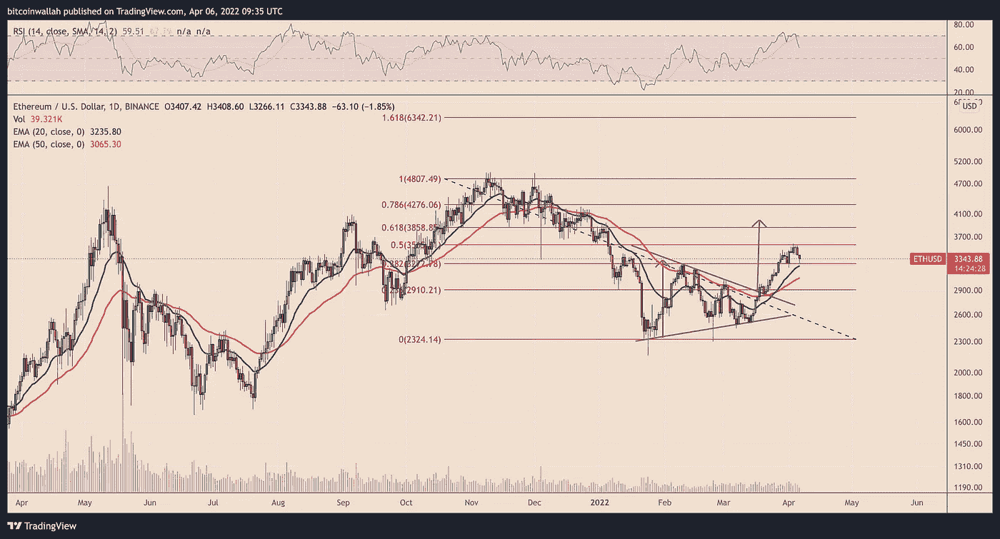

# 以太坊的价格可能在 4 月份达到 4000 美元，原因有三

> 原文：<https://medium.com/coinmonks/three-reasons-why-ethereums-price-could-reach-4000-in-april-1da7587aecda?source=collection_archive---------55----------------------->

**Visit our website:-** [**https://bitcoinsupports.com/**](https://bitcoinsupports.com/)

多种因素，从谷歌趋势的激增到供应的减少，都暗示了以太坊的额外优势。三个市场因素表明，以太坊的原生令牌以太(ETH)本月有望超过 4000 美元。

**“以太坊合并”的谷歌搜索量大幅增长。根据谷歌趋势数据，在截至 4 月 2 日的一周内，人们对以太坊计划中的网络更新(昵称为“合并”)的兴趣显著增加。在 12 个月的时间里，搜索短语“以太坊合并”获得了完美的谷歌趋势 100 分，大部分流量来自美国、新加坡、加拿大和澳大利亚。**

**Visit our website:-** [**https://bitcoinsupports.com/**](https://bitcoinsupports.com/)

Merge，也称为 ETH 2.0，指的是以太网网络从工作证明(PoW)到利益证明(PoS)的完全转变，这一发展被认为是以太网从 3 月 14 日的 2500 美元上涨到本周超过 3500 美元的主要原因。

看涨的预测源于 Merge 限制乙醚发行速度的提议，这可能导致总乙醚流通量出现供应高峰。由于电力开采，ETH 的数量每年增长 3%。

**Visit our website:-** [**https://bitcoinsupports.com/**](https://bitcoinsupports.com/)

公众对“以太坊合并”的兴趣激增表明，随着以太坊升级的临近，加密货币投资者和交易者的兴奋情绪正在积聚。在今年晚些时候整个网络切换到 PoS 之前，上个月的发射是最后的公共测试网。

[https://Twitter . com/thecryptocactus/status/1511274169211756547](https://twitter.com/thecryptocactus/status/1511274169211756547)

**交易所乙醚的储备处于三年来的低点。**

与此同时，加密货币交易所的 ETH 供应量持续下降。

值得注意的是，所有交易所的乙醚净储备已降至 2018 年 8 月以来的最低水平，这意味着交易商一直在大量提取乙醚，以长期保留或在 DeFi 流动性池中持有股份。

**Visit our website:-** [**https://bitcoinsupports.com/**](https://bitcoinsupports.com/)

此外，余额大于零的地址数量继续攀升，表明 ETH 的接受度和分布度都有所提高。

**Visit our website:-** [**https://bitcoinsupports.com/**](https://bitcoinsupports.com/)

技术指标显示 4K 联邦理工学院的定价为 1 美元。

4 月份 ETH 达到 4000 美元的可能性也受到一个众所周知的技术形态的提振。

这种形态被称为“对称三角形”，通常出现在大幅上涨或下跌之后，此时价格在一个由下降的上趋势线和上升的下趋势线表示的范围内横向整理。

在理想的世界中，三角形将在先前趋势的方向上分解，因此被称为“连续模式”然而，对称的三角形突破并不总是新趋势的开始。例如，技术分析师罗伯特·爱德华兹和约翰·马吉在他们的《股票趋势的技术分析》一书中观察到，大约 25%的对称三角形突破会导致反转，即价格不会沿着之前趋势的方向突破，这出乎意料。以太坊最近的突破似乎是一个反转，因为它反弹到了上方，而不是继续之前的下降趋势，如下图所示。

**Visit our website:-** [**https://bitcoinsupports.com/**](https://bitcoinsupports.com/)

对称三角形的可能突破目标是通过测量图形的上下趋势线之间的最大距离，然后乘以图形的突破点来计算的。

**访问我们的网站:-**[**https://bitcoinsupports.com/**](https://bitcoinsupports.com/)

**免责声明:以上为作者观点，不应视为投资建议。读者应该自己做研究。**

> 加入 Coinmonks [电报频道](https://t.me/coincodecap)和 [Youtube 频道](https://www.youtube.com/c/coinmonks/videos)了解加密交易和投资

# 另外，阅读

*   [比特币基地僵尸程序](/coinmonks/coinbase-bots-ac6359e897f3) | [AscendEX 审查](/coinmonks/ascendex-review-53e829cf75fa) | [OKEx 交易僵尸程序](/coinmonks/okex-trading-bots-234920f61e60)
*   [如何在印度购买比特币？](/coinmonks/buy-bitcoin-in-india-feb50ddfef94) | [瓦济克斯审查](/coinmonks/wazirx-review-5c811b074f5b)
*   [隐料斗替代品](/coinmonks/cryptohopper-alternatives-d67287b16d27) | [HitBTC 审查](/coinmonks/hitbtc-review-c5143c5d53c2)
*   [CBET 回顾](https://coincodecap.com/cbet-casino-review) | [库科恩 vs 比特币基地](https://coincodecap.com/kucoin-vs-coinbase)
*   [折叠 App 审核](https://coincodecap.com/fold-app-review) | [Kucoin 交易机器人](/coinmonks/kucoin-trading-bot-automate-your-trades-8cf0ca2138e0) | [Probit 审核](https://coincodecap.com/probit-review)