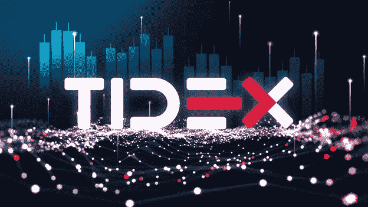

# Tidex (TDX)宣布空投 200 万美元！

> 原文：<https://medium.com/coinmonks/tidex-tdx-announces-a-2-million-airdrop-1a89b43df241?source=collection_archive---------16----------------------->

价值 200 万美元的 TDX 空投已经开始——还剩 23 天

自 4 月 25 日以来，Tidex 一直在与一个推荐项目合作开展代币抽奖活动。

# Tidex Airdrop 是什么？

由 Waves 创始人运营的创新加密货币交易所 Tidex T3 已经推出了一项大型空投计划，将赠送 200 万美元的 TDX 本地代币。空投将从 4 月 25 日开始，为期一个月。Tidex 也有一个全面的奖励计划。每个用户将获得 200 个价值 20 美元的免费 TDX。参与者还可以通过带朋友来赚取更多代币:一级推荐 7 美元，二级推荐 3 美元。

最重要的是，投资者认为 TDX 加密货币有巨大的上升潜力。业内知名人士亚历山大·伊万诺夫担任该交易所的顾问。价值 20 亿美元的 WAVES 是由他创立的。这意味着仅仅这个名字就能激起全世界密码社区的兴趣。WAVES 已经有了一个重要的粉丝群，他们可能愿意投资一种新的代币。因为 TDX 的排放量是有限的，我们可能会看到“贸易开放时 5000%的峰值”

# 成为世界上最大的发射台

Tidex 是一个为新手和有经验的交易者设计的加密货币交易所。得益于全球专业知识和领先的金融科技和密码开发人员，该组织建立了一个新系统，为交易者提供了更高的简单性、功能性和安全性。Tidex 拥有无与伦比的技术稳定性。他的决心是正确的:Tidex 的野心包括成为世界上最大的发射台。

[Tidex](https://tidex.com/referral/3910ba4e-ab9e-41b6-a9de-ad1285c573cf) 是一个优先推荐优质项目上市的平台。这就是你优先考虑质量而不是数量的情况。我们努力优化所有程序，包括添加额外的令牌。重新设计的核心允许新项目的最快集成，允许用户在流中处理最流行的项目。

# 如何参与 TIDEX Airdrop？

鉴于该平台的优势、可靠性和安全性，似乎没有理由不参与空投。

1.  [注册](https://tidex.com/referral/3910ba4e-ab9e-41b6-a9de-ad1285c573cf) [这里](https://tidex.com/referral/3910ba4e-ab9e-41b6-a9de-ad1285c573cf)
2.  超越 KYC
3.  从 20 美元开始存款
4.  订阅社交网络
5.  **获得 200 TDX (20 USDT)**

**获得代币的额外机会**

70 TDX (7 USDT) —对于您邀请的每个用户，将遵守 AirDrop。30 TDX(3 USDT)—对于每个满足 Airdrop 条件的用户，您将邀请其被邀请的推荐人。

**代币分配规则**

在 25.05，将发生象征性的 GENENATION 事件空投基金——在该事件上，用户将分发高达 2，000，000 TDX。25.11 开始沉没的每日周期，在该周期中，在 18 个月内分发另外 18，000，000 TDX。

# CEX 发射台

还有 **5 天**在 Tidex 自有集中发射平台上的归属模型主公开拍卖会上以 **0.095 USDT** 的特价购买代币。CEX 发射台期间(25.05-30.05)报价**2100 万 TDX** 。

*   **31.05 代币生成事件 CEX 启动平台资金将发生——基于已实施资金的 15%**
*   **11.25** 每日可行权期开始，在此期间 **18，000，000 TDX** 将在 18 个月内分配

> 加入 Coinmonks [电报频道](https://t.me/coincodecap)和 [Youtube 频道](https://www.youtube.com/c/coinmonks/videos)了解加密交易和投资

# 另外，阅读

*   [瓦济里克斯 NFT 评论](https://coincodecap.com/wazirx-nft-review)|[Bitsgap vs Pionex](https://coincodecap.com/bitsgap-vs-pionex)|[坦吉姆评论](https://coincodecap.com/tangem-wallet-review)
*   [如何使用 Solidity 在以太坊上创建 DApp？](https://coincodecap.com/create-a-dapp-on-ethereum-using-solidity)
*   [百佳卡达诺钱包](https://coincodecap.com/best-cardano-wallets) | [Bingbon 副本交易](https://coincodecap.com/bingbon-copy-trading)
*   [氹欞侊贸易评论](https://coincodecap.com/anny-trade-review) | [Paybis 评论](https://coincodecap.com/paybis-review) | [Keevo 钱包评论](https://coincodecap.com/keevo-wallet-review)
*   [印度最佳 P2P 加密交易所](https://coincodecap.com/p2p-crypto-exchanges-in-india) | [柴犬钱包](https://coincodecap.com/baby-shiba-inu-wallets)