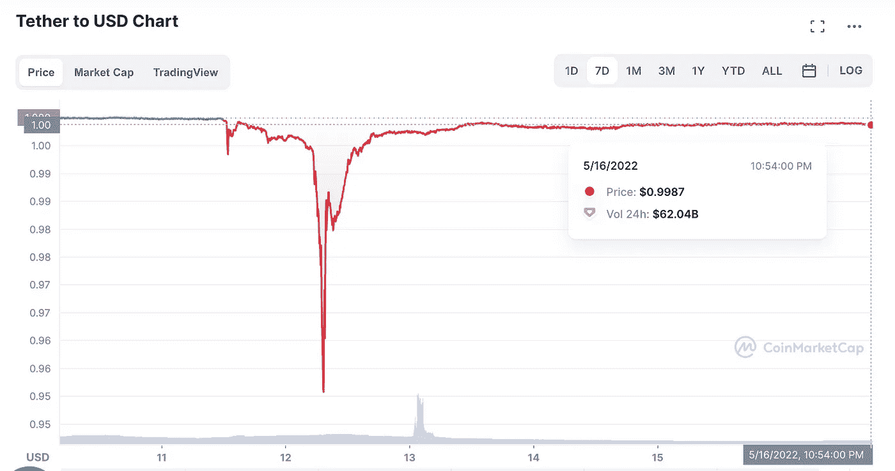
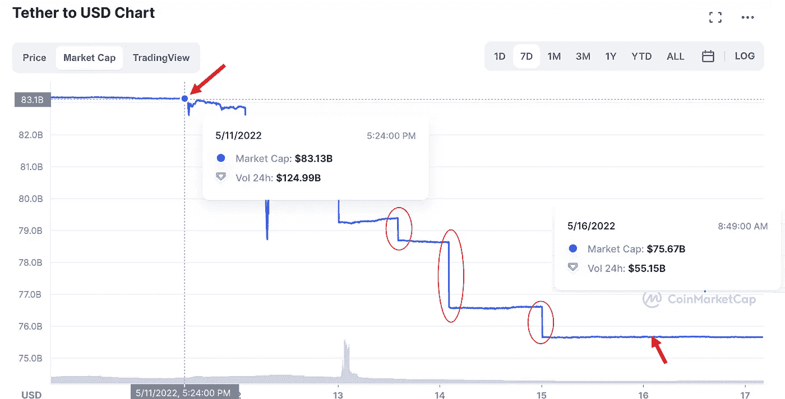
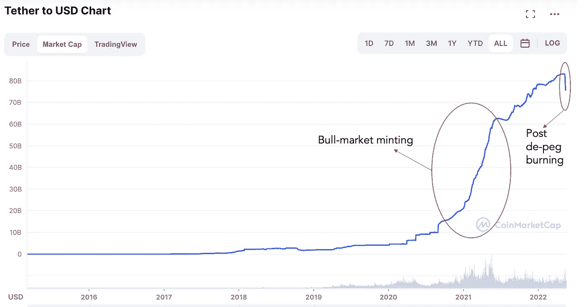
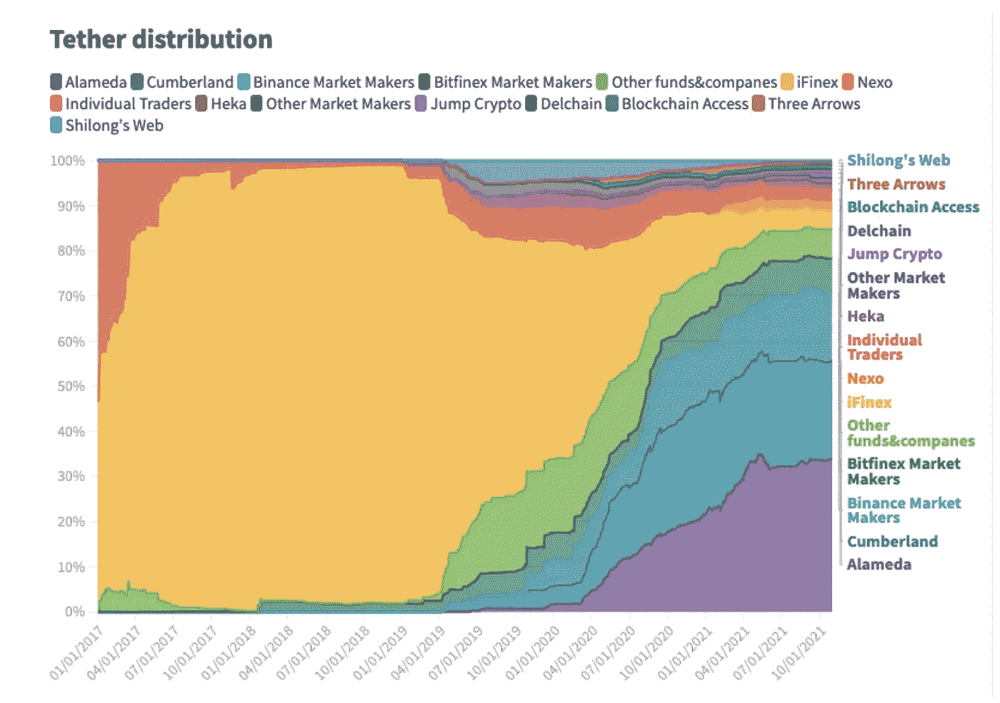
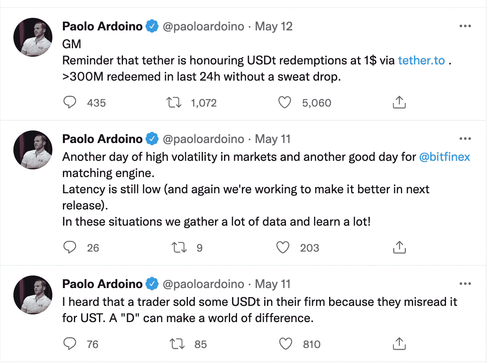
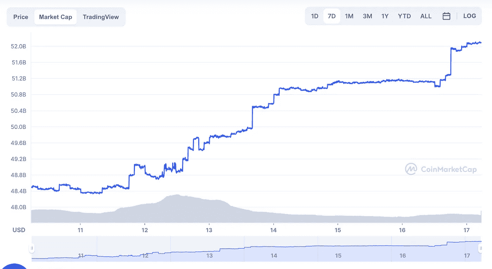
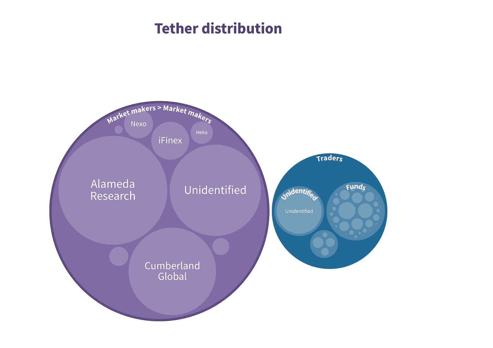
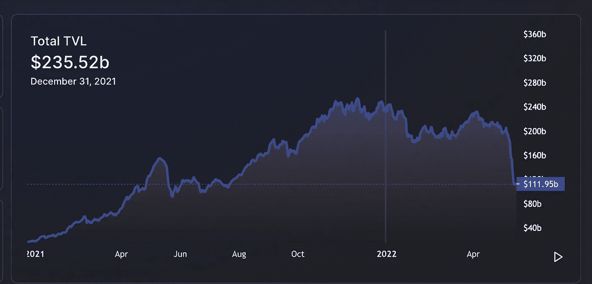
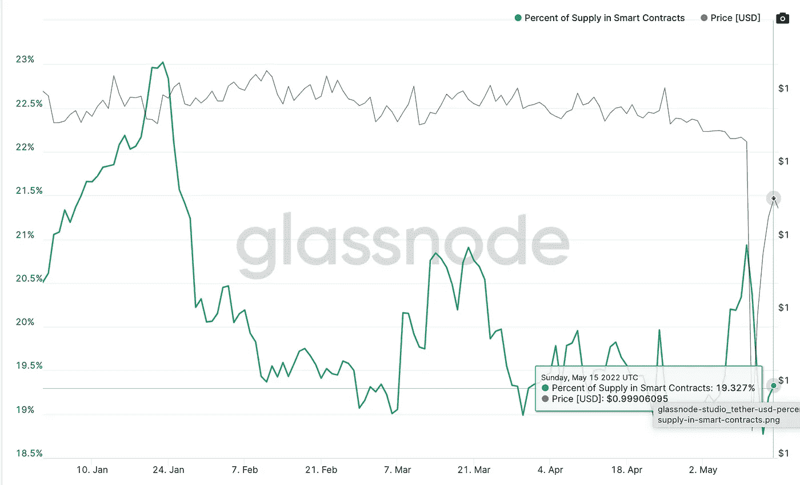

# Defi 是时候降低 USDT 的风险敞口了

> 原文：<https://medium.com/coinmonks/time-for-defi-to-reduce-usdt-exposure-3d25af7cc81a?source=collection_archive---------21----------------------->

$UST 崩盘已经过去一周了，这是加密领域的黑色一天，数百万散户投资者的价值化为乌有。在过去的 7 天里，$USDT，最大的加密稳定硬币一直在做一些奇怪的动作。

在这篇文章中，我强调了$USDT 的一些不寻常的活动及其潜在的影响。

## 脱钩的起源

5 月 11 日，泰瑟公司发行的稳定硬币------------------------------------- USDT ----显示出与美元脱钩的初步迹象，并一路下跌至 0.9935。几个小时后，它收复失地，触及 0.9989。

然后，几个小时后，5 月 12 日，在 6 个小时内，later 一路下跌到 0.95，然后又回到 0.99。有趣的是，在此期间，USDC 美元和 BUSD 美元的交易价格都高于票面价值。投资者可能正在抛售美元 USDT，买入美元 USDC 和美元 BUSD。

在撰写本文时，USDT 仍未完全恢复盯住美元的汇率制度，目前的汇率水平为 0.998。

USDT de-peg and recovery. Note that $USDT is consistently below peg for over a week. (Source: Coinmarketcap)

第一次脱钩主要归因于美元 UST 崩溃后投资者的恐慌。但是美元 USDT 的持续疲软意味着更多的人希望抛售 USDT 而不是持有它。这是不寻常和令人不安的。让我解释一下为什么..

## 不寻常的$USDT 转储

如果我们看看过去 7 天 USDT 的市值图，我们会看到每天都在“垂直下跌”。每天都有价值 10-20 亿美元的 USDT 代币退出流通。由于$USDT 是一种由美元支持的集中稳定的硬币，所以焚烧$USDT 的唯一方法是将其交给 Tether(铸造 USDT 的公司)并兑换成美元。

Drop in USDT supply (Source: CoinMarketCap)

正如你在上面的图表中所看到的，USDT 的供应量下降了 80 亿英镑。也就是说，仅在 5 天多一点的时间里，供应量就减少了约 10%。此外，请注意用红圈突出显示的每天的垂直下降。

如果我们缩小一点，看看$USDT 的整个生命周期，我们会注意到 USDT 在 2021 年的繁荣期间出现了大幅飙升，但即使是这一时期的增长率也比过去 5 天的下跌速度慢。

Rate of change of USDT is the highest in past week. Source: CoinMarketCap

> 当我们审视$USDT 的整个生命周期时，紧接着$UST 脱钩之后持续的高烧钱率是不寻常的

## $USDT 背后的聪明人

Protos 去年对$USDT 做了一项调查(报告[在这里](https://protos.com/tether-papers-crypto-stablecoin-usdt-investigation-analysis/))。该报告的一个重要发现是，仅阿拉梅达研究公司和坎伯兰全球公司这两家做市商就贡献了 USDT 2/3 的发行额。加在一起，它们占 USDT 新发行美元的 492 亿美元(71%)。总的来说，Tether 向做市商和个人(小额交易)发行了约 90%的 USDT，仅占 USDT 发行的 2.3%(分散化也不过如此..).

对于不了解谁是做市商的人来说，做市商是比散户更懂市场的专业投资者。他们通过设定买卖各种加密资产的买价/卖价来创造市场流动性。

简而言之，做市商配置的资金可以被称为“聪明钱”，而大多数散户投资者的资金被委婉地归类为“笨钱”。“聪明钱”的所有者在部署资本之前知道确切的风险，“笨钱”的所有者(通常)受情绪和炒作的驱动。

90% of Tether issuance is made to market makers (Source: Protos.com)

现在，添加上面的三个事实:

1.  五天过去了，USDT 仍然没有恢复联系
2.  过去一周，USDT 出现了最大规模的撤资
3.  大多数部署 USDT 的人都是专业投资者

我们可以得出一个合理的结论，聪明的投资者很可能抛售美元 USDT，以换取美元或其他稳定的硬币。问题是为什么？做市商看到了散户看不到的什么？这是一场“海啸”前的缓慢流血，还是一场重大的美元 USDT 脱钩？这些都是自然的问题，尤其是在 UST 美元崩溃之后。

## 避险环境？

大多数人(显然包括 Tether 的首席技术官 Paolo Ardoino 在内)认为，这种波动是完全正常的，USDT 美元有充足的资本吸收短期流动性紧缩事件。

Source: [https://twitter.com/paoloardoino](https://twitter.com/paoloardoino)

给我们解释这类事件的一般逻辑是:

1.  这种暂时的脱钩是因为 UST 美元崩溃后投资者的恐慌
2.  一个更广泛的避险环境，股票、债券和密码投资者纷纷抛售高风险资产，以换取美元

虽然这可能部分正确，但这种逻辑可以用几个问题来反驳:

1.  为什么这个逻辑不适用于第二和第三大稳定硬币 USDC & BUSD？如果投资者在避险环境中感到恐惧，这两家公司不也应该看到赎回吗？但是他们没有。

USDC supply over past 7 days (Source: CoinMarketCap)

2.做市商喜欢波动性——波动性越高，做市商赚钱的潜力就越大。在如此高波动性的环境下，做市商通过抛售美元 USDT 来放弃杠杆(资本就是杠杆)是没有意义的。事实上，情况正好相反——在这种情况下，交易员和做市商希望更多的美元 USDT 来进行更多的押注。

说点题外话，每个交易公司都有两个团队——给公司增加风险的做市团队和确保做市商不承担过度风险的风险管理团队。风险管理团队不会标记涉及稳定货币的交易(只要它们是稳定的)，因为稳定货币应该具有低(零)波动性。这里的逻辑是零波动的稳定资产不会给公司增加风险(除非它不再稳定)。

> 做市商在高波动性环境下抛售大量稳定货币的事实证明，美元 USDT 出了问题

## 与系绳相关的问题

Tether 一直对其储量讳莫如深:

1.  Tether 拒绝接受大型会计事务所的审计。审计也不定期进行。很长一段时间，泰瑟让每个人都相信每个 USDT 都是由美元支持的，直到他们被纽约司法部长强迫承认并非如此
2.  Tether 的持股表明，约 37%的资金锁定在商业票据和存单(给公司的短期债务)中，约 5%的资金锁定在公司债券和基金中。我们不知道这些债券/商业票据的交易对手是谁&如果经济进入衰退(这是现在很可能出现的情况)，这些工具的流动性会如何。

Tether reserves (Source: Tether.to)

3.Tether 的 CTO 出来说他们已经将[的商业票据持有量削减了 50%](https://decrypt.co/100289/tether-has-reduced-commercial-paper-stablecoin-backing-last-6-months-cto) 。他不得不提出这种说法的事实本身就说明了这些储备的“风险”。

就我个人而言，除了现金、美国国债和货币市场基金，我无法理解将外汇储备投资于任何其他资产的逻辑。任何超出这个范围的东西，不管信用等级如何，都应该被严格禁止。密码社区怎么会允许这样做呢？

> 在信贷紧缩、成本高昂的高风险衰退环境中，最大的稳定硬币公司持有现金、国债和货币市场之外的任何资产都是绝对荒谬的。

4.所有 USDT 铸造的美元都有相应的美元转移回系绳吗？去年，USDT 增加了 570 亿美元的流通供应量——我们真的知道有 570 亿美元被做市商转移到了 Tether 吗？作为一个了解传统市场的人，我认为这 570 亿美元并不都是现金——一定有一些非现金工具被相关交易方使用(不幸的是，我们永远不会知道这一点)

[Bernhard Mueller](https://medium.com/u/c9c016683f17?source=post_page-----3d25af7cc81a--------------------------------) 在[《系绳黑天鹅》](https://muellerberndt.medium.com/is-tether-a-black-swan-51095720b01c)上写了一篇精彩的文章，其中他描述了公司可以发行“影子公司”的“商业票据”并有效印刷没有美元支持的美元 USDT(凭空印刷的稳定硬币)的可能方式。虽然我们没有证据证明这一点，但所有这些关键数据都被隐藏起来，不受审查，这一事实令人不安。Tether 向其母公司 iFinex 发行了 44 亿 USDT——这确实令人不安——我们怎么知道这笔交易中实际美元是从 iFinex 转移到 Tether 的..

USDT issuance by Tether to its parent entity iFinex was $4.4 billion (Source: Protos.com)

## Defi 生态系统面临的风险

稳定的硬币一直是 Defi 生态系统的福音——只有拥有一个充满活力的稳定的硬币生态系统，Defi 才能运营其池化、养殖、交易和投资组合管理服务。这是显而易见的——USDT 供应量从 210 亿美元增长到 780 亿美元，而 Defi 平台的 TVL 从 180 亿美元增长到 2350 亿美元。

Defi TVL increased from 18 billion to 235 billion. Source: DefiLama

即使在 Defi TVL 大幅下降后(由于 5 月 12 日$BTC 跌至 24k 后引发的[锚协议](https://medium.com/u/f25c4bc72765?source=post_page-----3d25af7cc81a--------------------------------)的消灭和大量清算)，Glassnode 显示约 20%的 USDT 代币仍被锁定在智能合约中。

这大约相当于 USDT 的 150 亿美元，几乎是 TVL 赤字的 12%(在撰写本文时为 1120 亿美元)。

~20% USDT locked in smart contracts (Source: Glassnode)

我认为生态系统面临以下风险

1.  **链条的强度取决于它最薄弱的一环**

dY/dX、Aave、Uniswap、Curve、Lido 等平台已经在 USDT 建立了广泛的曝光度。

无数聪明的开发者、散户投资者投入他们的时间、精力和资本来构建新的、公平、透明、安全和分散的应用程序。如果所有这些应用都因为生态系统过度信任一个不透明、说谎和中央集权的实体而被关闭，这将是一个悲剧，该实体拒绝接受全面的定期审计。

如果一些做市商&一个稳定的硬币实体的勾结拖垮了大量开源、转型项目，那么真正要问的问题是，这与中央银行、商业银行、对冲基金操纵经济的传统金融世界有何不同。我们又回到了传统金融的“*赢是我的，输是你的*”文化(只是这次玩家不同)

> 如果由开发商、企业家和投资者组成的整个 Defi 生态系统被一个实体拖垮，那将是一场悲剧；Defi 利益相关方应评估 USDT 崩溃的系统性风险，并积极降低杠杆和风险敞口。

2.给政府一根棍子去打 Defi

我一直觉得稳定币是政府和央行控制和制服加密市场的特洛伊木马。他们一定在暗自窃笑，因为加密社区已经对集中稳定的硬币产生了系统性的依赖。它就像一个“阿喀琉斯之踵”，可以被掌握权力的人公开攻击。关于有权力的人，我们知道的一件事是，他们迟早会使用权力。央行数字货币(CBDCs)和一波法规将是攻击稳定币的首选武器。

> 就目前的情况来看，如果美国财政部给币安、Circle 和 Tether 这三家公司打一个电话，整个 Defi 都会崩溃。去中心化、安全性和不变性到此为止…

## 纠正措施

在过去的 18 个月里，加密空间选择了“增长”而不是“安全”——这一选择导致了整个 Defi 生态系统内的大规模 USDT 造币和流通。

虽然我们所有人都喜欢这些 400%的利润，但现在是时候退一步，从长计议了(尤其是在$UST 崩溃之后)。短期贪婪可能会扼杀长期增长。

要问的关键问题是:

1.  这是一场有机的运动，还是由少数几个强大的参与者控制的，他们控制着从风险投资基金到交易所再到场外市场的一切？
2.  阿拉米达、跳跃、币安是引领创新还是将我们推向不计后果的风险，这些风险将会以令人窒息的监管来困扰我们？
3.  如今人们唯一相信的两个蓝筹股是比特币和以太坊——它们都是有机增长的，并没有受到做市商的摆布。象征经济学、治理和增长需要从长远的角度来考虑(而不是从风险投资的角度)
4.  仅仅让事务在链上是不变性和透明性的度量吗？为什么这些交易背后的资本不透明？为什么没有人反对呢？
5.  我们有能力经受住美联储加息、利率上升和持续通胀吗？如果不是，最可能的故障点是什么？最优秀的大脑集体分析过这些风险吗？

使 Defi 可持续发展所需的一些纠正措施:

1.  所有关键的加密创始人海登·亚当斯(Uniswap)、鲁恩·克里斯滕森(Dai)、迈克尔·叶戈罗夫(Curve)等需要集体集思广益，拿出一份关于定义系统风险的白皮书。这需要向能够正确理解风险的散户投资者广为传播。
2.  每个 Defi 协议都应该接受$USDT 作为抵押品，前提是他们承诺透明和定期审计。否则，投资者和治理令牌持有者应该禁止将 USDT 美元作为可能的抵押品。
3.  Defi 企业家不应该在 USDT 筹集资金。投资者应该用美元或符合最低透明度标准的稳定硬币来资助加密初创公司
4.  围绕稳定币创新。我知道我们在 UST 土地上失败了，但至少我们知道什么是行不通的。像[奥林巴斯道](https://medium.com/u/23e76a2f5695?source=post_page-----3d25af7cc81a--------------------------------)、[马克尔道](https://medium.com/u/743224aba00c?source=post_page-----3d25af7cc81a--------------------------------)、[法克斯金融社区](https://medium.com/u/948466badeb9?source=post_page-----3d25af7cc81a--------------------------------)等许多项目都需要提出“去中心化稳定社区”的变体。是的，稳定的硬币项目应该有良好的风险管理，低杠杆，并应逐步扩大规模——超高速增长会产生高杠杆，宽松的风险控制和潜在的失败。

## 结论

$USDT 正在做出不同寻常的举动&聪明的投资者似乎正在卖出最大的稳定硬币。加密社区为了短期利润牺牲了寿命，2021 年牛市创造了巨大的“中央化”实体，它们将触角伸向了 Defi 生态系统。

作为一个 Defi 最大化主义者，我希望所有的 Defi 利益相关者都意识到我们通过增加美元 USDT 风险敞口所带来的风险。现在是每个协议审查其稳定的硬币敞口并积极减少 USDT 敞口的时候了。

最后，重要的是保护我们迄今为止所建立的东西&承担适当的风险来改善我们所拥有的东西，并关注长期的可持续性。

我希望 Defi 生态系统从‘特洛伊’的命运中拯救自己。

> 加入 Coinmonks [电报频道](https://t.me/coincodecap)和 [Youtube 频道](https://www.youtube.com/c/coinmonks/videos)了解加密交易和投资

# 另外，阅读

*   [Bitsgap 审核](/coinmonks/bitsgap-review-a-crypto-trading-bot-that-makes-easy-money-a5d88a336df2) | [Quadency 审核](/coinmonks/quadency-review-a-crypto-trading-automation-platform-3068eaa374e1) | [Bitbns 审核](/coinmonks/bitbns-review-38256a07e161)
*   [加密复制交易平台](/coinmonks/top-10-crypto-copy-trading-platforms-for-beginners-d0c37c7d698c) | [Coinmama 审核](/coinmonks/coinmama-review-ace5641bde6e)
*   [印度的加密交易所](/coinmonks/bitcoin-exchange-in-india-7f1fe79715c9) | [比特币储蓄账户](/coinmonks/bitcoin-savings-account-e65b13f92451)
*   [OKEx vs KuCoin](https://coincodecap.com/okex-kucoin) | [摄氏替代品](https://coincodecap.com/celsius-alternatives) | [如何购买 VeChain](https://coincodecap.com/buy-vechain)
*   [币安期货交易](https://coincodecap.com/binance-futures-trading)|[3 commas vs Mudrex vs eToro](https://coincodecap.com/mudrex-3commas-etoro)
*   [如何购买 Monero](https://coincodecap.com/buy-monero) | [IDEX 评论](https://coincodecap.com/idex-review) | [BitKan 交易机器人](https://coincodecap.com/bitkan-trading-bot)