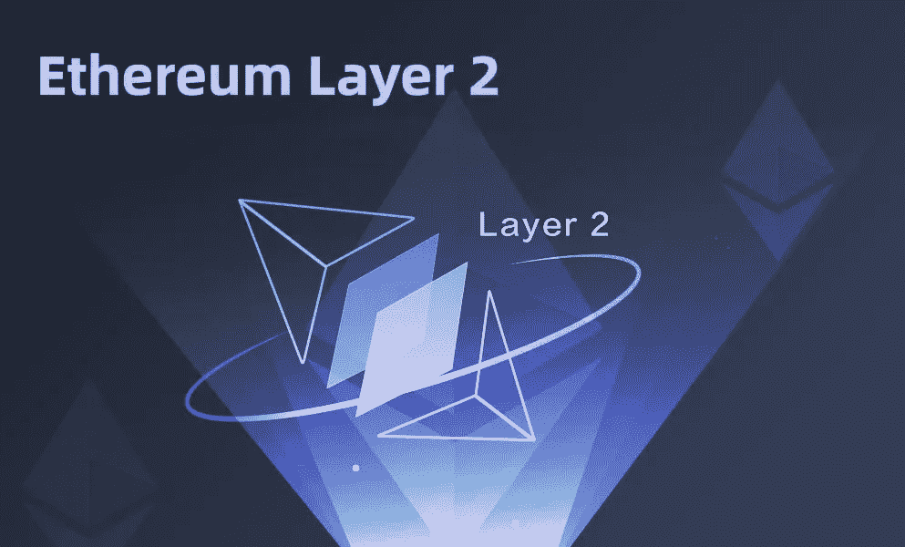
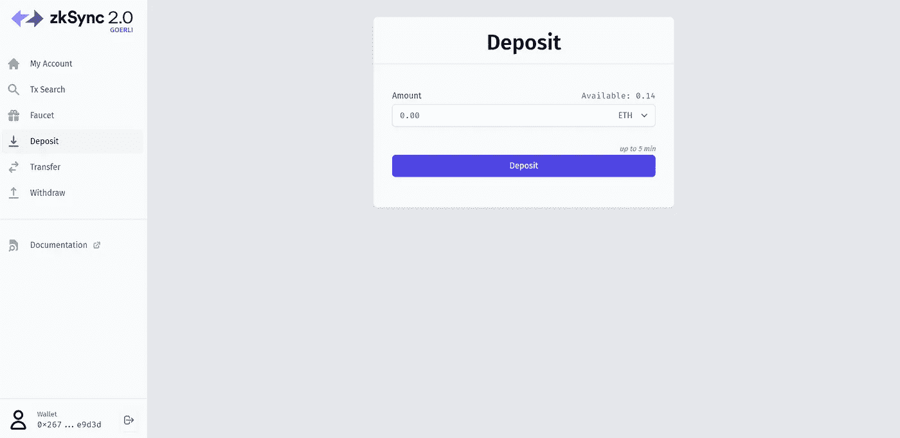
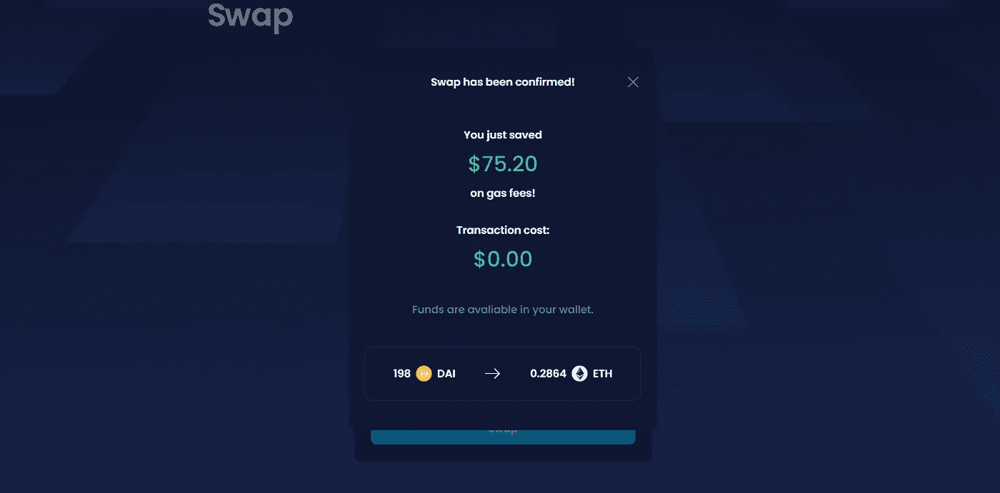

# 是时候关注以太坊的第二层了

> 原文：<https://medium.com/coinmonks/time-to-pay-attention-to-ethereums-layer-2-82f8a5b107dd?source=collection_archive---------22----------------------->

[Source](https://www.finextra.com/blogposting/21237/top-ethereum-layer-2-networks)

第 1 层出现故障，去年可能是智能合同区块链公司最繁忙的一年。合法而有趣的项目从每个角落冒出来，成千上万的用户参与其中。尽管智能合约平台激增；每一层都至少有一次超负荷工作。以太坊受到了最大的打击，然后十字架链发生了。他们一个接一个地成为家喻户晓的名字。

每一个新的链条都会诞生数百个建立在其第一层上的新项目。与以太坊的第一层相比，大多数其他智能合约区块链有两个区别——效率和便宜。尽管努力达到可接受的去中心化水平，这些其他的连锁拥有对大多数区块链爱好者更重要的特征。在排名、用户数量和总市值方面，这些替代品中的许多都被认为“颠覆”了以太坊。

嗯，以太坊的开发者至少在寻找可能的方法让以太坊区块链更好地工作方面没有松懈。开发以太坊区块链的第二层是目前这些方法中最重要的。

以太坊的第二层是一个灵活的平台，其功能经过优化，可以提高工作效率。第二层由一系列基础设施组成，旨在将以太坊区块链的大部分活动从主网上转移出去。

远离主网络并利用可伸缩性基础设施，给构建在第 2 层上的项目带来了某些明显的优势。第 2 层包括许多解决方案，这些解决方案通过脱离主层，在不牺牲安全性和分散性的情况下扩展以太坊区块链。这些项目仍然受益于以太坊主网的优势，构成了一个“完美的匹配”。企业解决方案已经建立在第二层之上，因为优秀的项目正在快速利用它提供的好处。

你可能没有要求那些解释；但是，尽管一切都好。第 2 层解决方案已经开始大放异彩。你可能甚至不在乎，但你现在可能想(更密切地)关注一下…随着 Zksync 2.0 在 goerli testnet 上公开测试，更多的第 2 层项目正准备使用更高效的设施启动。

就像你一样，这些项目已经迫不及待地开始了！DeFi Suite 项目— [Mute](https://mute.io/) 几乎立即在 ZKsync 的 testnet 上推出。

MUTE 正在推出它的去中心化交换机——MUTE SWITCH。Mute Switch 由 ZK-Rollup 公司提供技术支持，它利用该协议在以太坊的第二层上构建一个高效、廉价的分散式交换机。静音开关具有个性化的分散交换平台，增强了用户隐私和安全性。建立在第二层之上，从以太坊拥挤的主网(第一层)上卸下了 Mute Switch 的大部分事务，提高了可扩展性并确保了高效率。

准备好体验 ZKSync 和 MuteSwitch 的强大功能了吗？

下面是在 ZKSync 2.0 上测试静音开关的指南；

1.  从任一水龙头接收 goerli testnet eth:
    [水龙头 1](https://faucets.chain.link/goerli)
    [备选水龙头](https://goerli-faucet.mudit.blog/)
2.  从 goerli testnet 到 ZKSync 第二层的 eth 桥
3.  从 zksync [龙头](https://portal.zksync.io/faucet) (usdc/link/dai/wbtc)接收代币:
4.  一旦你在你的 zksync 钱包里有一些代币& ETH，你现在可以在[开关](https://testnet.switch.mute.io/)上访问和交易。

测试吧！分享你的经验，并保持你的眼睛粘在这个空间！

[将我们的下一期出版物发送到您的邮箱](https://cryptoscripts.medium.com/subscribe)

加密货币脚本正在转变成一个由热情的加密货币和区块链信徒组成的社区！[加入冒险吧！](https://t.me/cryptocurrencyscripts)

# 你会喜欢看类似的文章吗？

[将我们的下一期出版物发送到您的邮箱](https://cryptoscripts.medium.com/subscribe)

**关注我们** [**推特**](https://twitter.com/scriptscrypto) **关注我们** [**发布 0x**](https://www.publish0x.com/@Dzoelx) **关注我们** [**脸书**](https://www.facebook.com/scriptscrypto)

> 加入 Coinmonks [电报频道](https://t.me/coincodecap)和 [Youtube 频道](https://www.youtube.com/c/coinmonks/videos)了解加密交易和投资

# 另外，阅读

*   [新加坡十大最佳加密交易所](https://coincodecap.com/crypto-exchange-in-singapore) | [收购 AXS](https://coincodecap.com/buy-axs-token)
*   [投资印度的最佳加密软件](https://coincodecap.com/best-crypto-to-invest-in-india-in-2021) | [WazirX P2P](https://coincodecap.com/wazirx-p2p)
*   [7 个最佳零费用加密交换平台](https://coincodecap.com/zero-fee-crypto-exchanges)
*   [最佳网上赌场](https://coincodecap.com/best-online-casinos) | [期货交易机器人](/coinmonks/futures-trading-bots-5a282ccee3f5)
*   [分散交易所](https://coincodecap.com/what-are-decentralized-exchanges) | [比特 FIP](https://coincodecap.com/bitbns-fip) | [宾邦评论](https://coincodecap.com/bingbon-review)
*   用信用卡购买密码的 10 个最佳地点
*   [加拿大最佳加密交易机器人](https://coincodecap.com/5-best-crypto-trading-bots-in-canada) | [Bybit vs 币安](https://coincodecap.com/bybit-binance-moonxbt)
*   [阿联酋 5 大最佳加密交易所](https://coincodecap.com/best-crypto-exchanges-in-uae) | [SimpleSwap 评论](https://coincodecap.com/simpleswap-review)