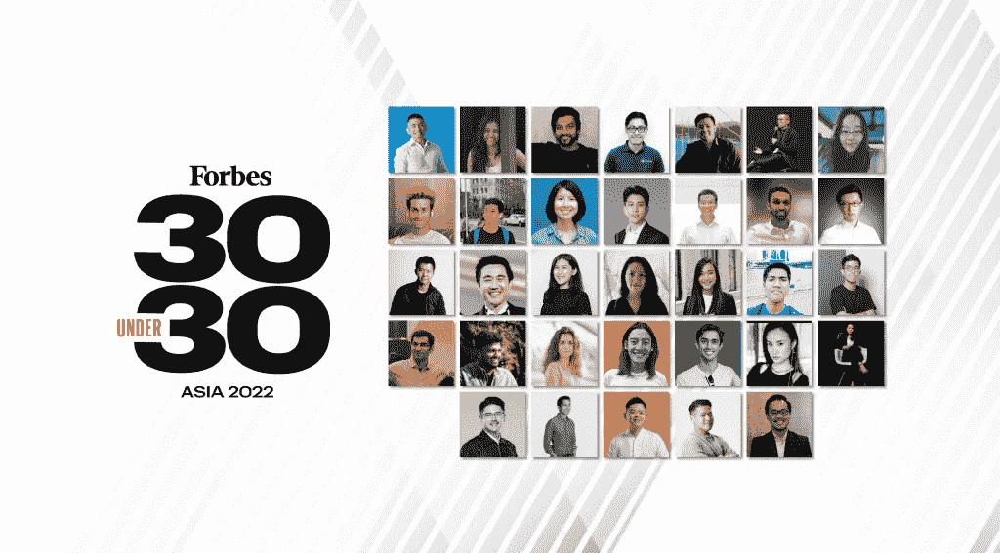

# 是时候停下来闻闻花香了。

> 原文：<https://medium.com/coinmonks/time-to-stop-and-smell-the-flowers-e02afa630408?source=collection_archive---------59----------------------->

当世界进入熊市时，Luna 在不到 16 天的时间里获得了 Luna 2.0 的复兴，股票继续下跌，新鲜鸡肉告罄，我说现在是我们暂停的时候了。

是时候总结一下我们作为 StartupX 在过去几年所做的事情了。

我们开展高质量的创新项目，如加速器、预加速器和黑客马拉松。

我们与早期创业者密切合作。

我们在创始人身上下了早期赌注。

他们刚开始旅行时，我们就在那里。

不，这一点都不容易。

他们中的一些人非常成功。

这是否意味着我们是千里眼？

不，这只是意味着我们对流程和人员的信任得到了回报。

它很可能在混乱中结束，悄悄地消失了。

但是我很自豪地说，我们为我们的生态系统所做的一点点工作，开始看到一些丰厚的收益。

《福布斯》做了它最擅长的事情，并于上周发布了 30 位 30 岁以下富豪榜。

向我们这些年来参加过各种项目的 StartupX 校友大声疾呼:

联合创始人:郑维奎，德里克·李，肖恩·齐塔姆，埃德蒙·周

StaffAny 的联合创始人:詹森·希、杰瑞米·汉、伊凯·李、尤金·吴

Augmentus 的联合创始人:Daryl Lim 和 Chong Voon Foo

开公司真的不容易。

创办一家羽翼未丰的初创公司，并在史无前例的全球疫情中生存下来，面临无数挑战和黯淡前景，无疑是人生中最艰难的事情之一。

非常尊重这些勇敢的创始人，他们埋头苦干，过了这么多年后又东山再起。

与他们一同上榜的还有新星、内容创作人安妮特·李，国内穿梭者罗建友，以及 Boom Digital Media 的创始人 Ng·魏明(他在抖音有 2000 万粉丝！).

Young talents rising in Asia.

亚洲和新加坡共有 4000 名候选人，入围数量位居第二。

我为新加坡和我们这个小国所取得的成就感到骄傲。

但是，我们应该始终注意，如果不播种或多年浇水，我们就不能期待美丽、成熟和多汁的芒果。

当我们赞美和钦佩那些使它成功的人时，我们不要忽视那些仍在播种的树苗和微小的种子。

无论是体育运动员、电子游戏玩家、网络 3 建设者还是科技企业家，我们都不能指望他们靠自己“成功”。

如果你想在未来 10 年或 20 年收获一个健康的初创企业、科技企业和创业生态系统的回报，就要关注种子、它们种植的土壤、它们被喂养的水和矿物质，以及在下一代照顾它们的人。

在他们成长、发展和成熟的过程中，需要一个完整的生态系统来支持、培育、激励和支持他们。

没有丹泽尔·华盛顿就没有黑豹(查德维克·博斯曼)。

没有 80 年代香港电影的黄金时代，就没有成龙。

没有硅谷令人惊叹的创业生态系统，就不会有苹果、亚马逊、脸书或 Airbnb。

当然，并不是每个种子或创始人都会像大多数创业公司一样成功。

但这是值得的，我们必须继续努力，尽我们所能培养他们。

Startup Weekend Singapore Mega in 2018!

生态系统的建设并不适合每个人，这在很大程度上是一项吃力不讨好的工作。

没有人要求我们这样做，也没有人会因为我们做得好而给我们颁奖。

这一切都是为了社区，让我们的努力分层，这样其他人就可以一砖一瓦地站起来。

我们的感谢来自于微笑和看到创始人成功的新闻报道。

我们的成功是他们的成功，我们知道下一代企业家将会从我们现在所做的事情中成长和发光，无论这项工作多么艰苦和困难。

让我们瞄准下一个大联盟，并与硅谷和欧洲的后起之秀竞争！

> 加入 Coinmonks [Telegram group](https://t.me/joinchat/Trz8jaxd6xEsBI4p) 并了解加密交易和投资

-

你认为新加坡的创业社区正在壮大吗？

-

# startups # business # startupx # growth # success # social media # culture # entrepreneurs # strategy # eth # bit coin # accredify # accelerator # staff any # augment us # founders # branding # web 3 #生态系统#forbes #30under30