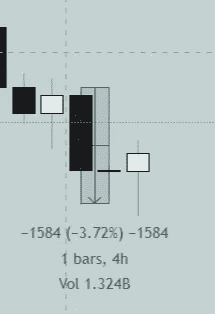
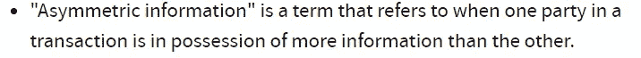
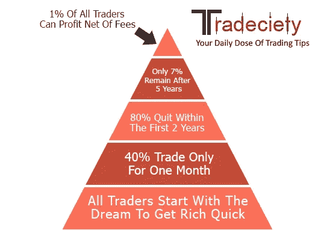
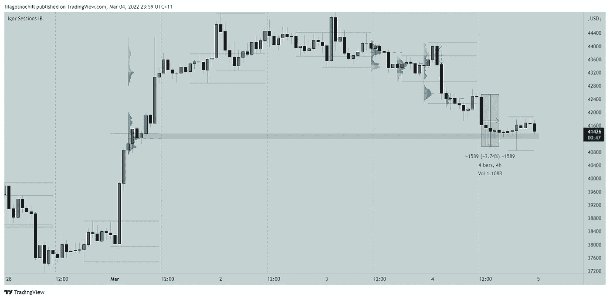
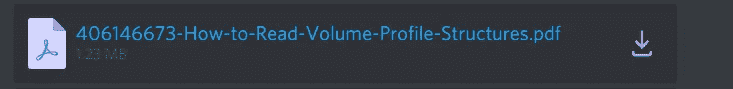

# 时间、交易量和价格:日内交易需要理解的关键概念

> 原文：<https://medium.com/coinmonks/time-volume-and-price-the-key-concepts-you-need-to-understand-for-day-trading-439fc9aa1596?source=collection_archive---------9----------------------->

4 hours opening Asia session Candle BTCPERP FTX

我们来看看这支 4H 蜡烛？问我们自己几个问题:

1.  为什么今天这个时候市场决定下跌？
2.  为什么会有 13 亿的成交量？
3.  为什么价格下跌了 3.72%，然后反弹？

在交易的世界里，90%的散户会告诉你价格就是一切，我不敢苟同。我认为价格变动是因为机构交易者(银行、对冲基金、交易所等)提供的时间和交易量。前 10%的人采取了所有的行动，因为他们能接触到不对称的信息。他们知道你什么时候买，什么时候卖。他们知道止损，他们知道你的目标。他们的机器人会玩弄你的思想，直到你击败他们。就像赌场一样。

[24 Facts about trading https://tinyurl.com/2p94z4rr](https://tinyurl.com/2p94z4rr)

统计显示 95%的交易者失败了，但实际上不止如此。如果只有 1%的人比所有人赚的钱都多，你就不能从 99%长期亏损的人的角度考虑问题。你需要有意识地做出决定:要么追随那 1%,要么像其他人一样失败。

如果我跟踪这 1%的波动，知道他们什么时候会波动，他们会给市场带来多少交易量，我就可以预测方向偏差，进行交易。

先来回答一下我一开始问的问题？

市场波动是因为这是亚洲时段的开始，机构、对冲基金和多个交易所正在运行机器人，将数十亿份订单推向散户的止损单价格，只是为了取出它们并反弹。只是拿走你的流动资金。

> *零售贸易支持和阻力，而 intituitions 发挥流动性。价格从一个流动性点移动到另一个流动性点。这就是成交量曲线和盘中高点和低点发挥作用的地方。那是另一天的拍摄。*

**拍卖市场理论及成交量简介:**

当出价最高的买家和卖家在当前形势的前提下(时间、价值、风险和波动性)达成协议或平衡时，市场就会移动。

我不会解释拍卖市场理论，因为有大量的文章和 youtube 视频。我在 discord 上传了资源(#免费资源)

find this one

*   [拍卖市场理论。你应该知道的最重要的事情(atas.net)](https://atas.net/volume-analysis/basics-of-volume-analysis/the-auction-market-theory/)
*   [https://discord.gg/utR9wysjEV](https://discord.gg/utR9wysjEV)

在下一篇文章中，我将解释我的设置，以及我如何在订单簿中使用交易量数据，这给了我交易的优势。

要获得 90 天免费使用 sigmabasis 指标的机会，请在[金融市场 stellar edge 体积指标(sigmabasis.com)](https://sigmabasis.com/)注册，或加入 [discord](https://discord.gg/utR9wysjEV) 。

感谢阅读。快乐适马贸易。