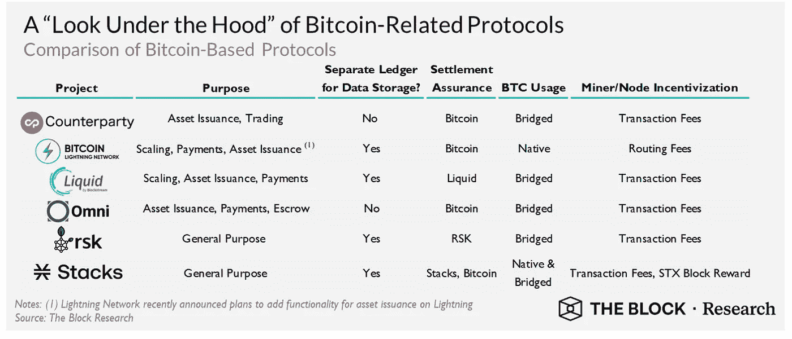
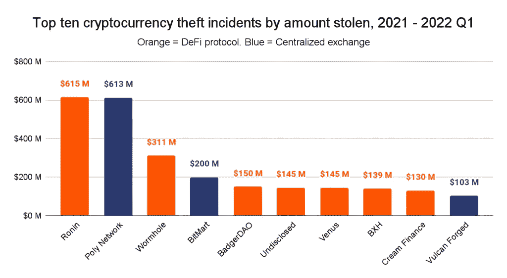
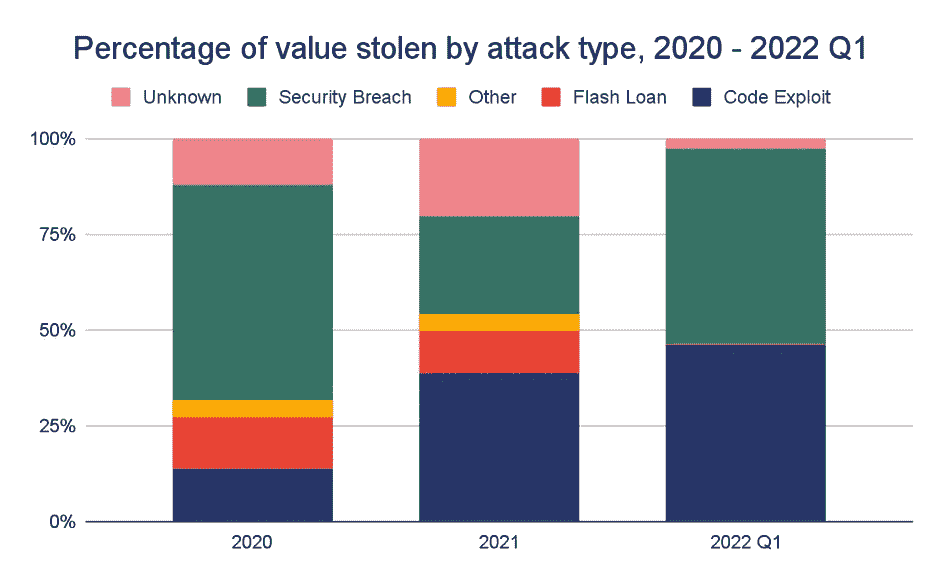
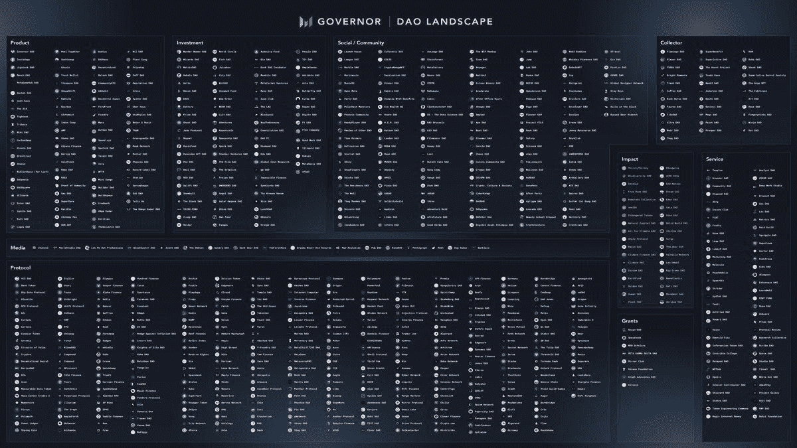
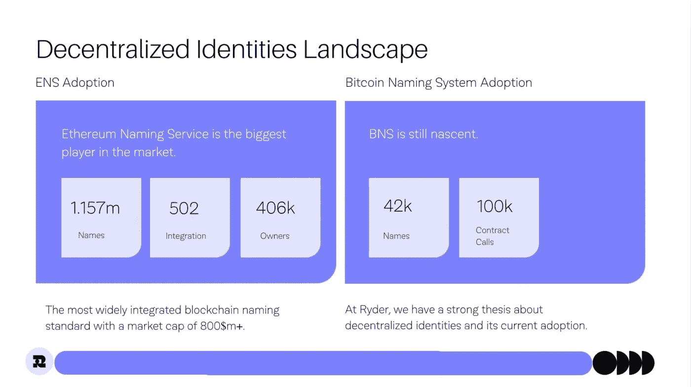

# “时代在变”:当前趋势和 2022 年 H2 对 Web 3.0 的预测

> 原文：<https://medium.com/coinmonks/times-are-a-changin-current-trends-2022-h2-predictions-for-web-3-0-780956d0bea7?source=collection_archive---------18----------------------->

Photo by [Hulki Okan Tabak](https://unsplash.com/@hulkiokantabak?utm_source=unsplash&utm_medium=referral&utm_content=creditCopyText) on [Unsplash](https://unsplash.com/s/photos/fortune-teller?utm_source=unsplash&utm_medium=referral&utm_content=creditCopyText)

【2022 年 6 月

去年[2021 年]结束时，Web 3.0 行业正在为下一个大规模扩张做准备，从新技术进步到成熟的类别和基础设施升级，再到创纪录的风险资本美元和活跃用户指标。在资本方面，投资者通过这个空间向公司注入了超过 314 亿美元，占 2021 年投资的所有风险资本的 5.0%**(每本书 6210 亿美元)。不可替代代币(NFT)在各个市场的交易量超过了创纪录的[400 亿美元](https://finance.yahoo.com/news/nft-market-sales-dropping-170000363.html)，而分散金融(DeFi)的锁定总价值超过了 2500 亿美元。有了所有这些活动和更多活动，我将这个时间定义为**转折的开始——技术采用成为默认，去中心化成为一个目标里程碑的时刻。****

*我们已经超过了去年的许多记录和我最初的 [2022 区块链& dApps 预测](https://kyleellicott.medium.com/the-state-of-decentralized-applications-dapps-h2-2021-review-d645131ae783)仅仅六个月。这让我不仅花时间对重要的前六个月进行了年中反思，而且很明显，Web 3.0 的前景已经发生了巨大的变化。因此，是时候准备和分享我对 2022 年 H2(下半年)的预测了，关于我们目前所处的位置，以及在这个看起来将重塑 Web 3.0 格局的时代，我们将会期待什么。我将在 2022 年第三季度再次对此进行更深入的回顾，继续围绕 dApps 和更重要的 Web 3.0 行业的未来加强我的论点:*

# *重返转折点& 2022 年 H2 预测；*

***风险投资总额(TVD):*****投资于 Web 3.0 的 291.75 亿美元—****数据来自 Dove Metrics，截至 2022 年 6 月 15 日***

****我的 EOY 对 TVD 2022 年的预测:391.86 亿美元 *(*同比增长 25%)*****

****1。构建**模式已完全激活。虽然围绕熊市和新一轮加密冬天有很多讨论，但该行业已经在 2021 年达到创纪录的 34，391 名开发者加入 web3 的[(人均电力资本)。随着越来越多的公司和新企业家专注于改善基础设施和扩展应用功能，对开发人员的需求只会增加，到 2021 年，EOY 将实现显著增长。预测:45，750 辆，同比增长 32.3%。](https://github.com/electric-capital/developer-reports/blob/master/dev_report_2021.pdf)**

****2。监管在 Web 3.0 的餐桌上占据了一席之地。**在过去的六个月里，围绕所有数字替代资产、采矿作业、工业环境影响、能源(可再生能源)使用、稳定资本的未来等等的对话愈演愈烈。结果及其影响仍有待确定。全球范围内的政府机构正在迅速行动，不仅以前所未有的方式参与进来，还尽可能在行业内制定规则、法规和标准——他们再也不能袖手旁观了。证券交易委员会(SEC)已经插手了，但是在 UST/露娜破产之后，他们将会更多地参与进来，并准备长期存在下去。围绕这一点，一个值得关注的重要行动将是 SEC 即将于 7 月 6 日发布的关于 Grayscale 将 GBTC 转换为 ETF 的公告。我们还发布了一份 70 页的[加密监管法案](https://www.politico.com/news/2022/06/06/lummis-and-gillibrands-crypto-hype-machine-00036712)，被称为“**负责任的金融创新法案”**，由[美国参议员辛西娅·卢米斯的](https://www.gillibrand.senate.gov/news/press/release/-lummis-gillibrand-introduce-landmark-legislation-to-create-regulatory-framework-for-digital-assets)领导，现已发布([完整法案](https://www.gillibrand.senate.gov/imo/media/doc/Lummis-Gillibrand%20Responsible%20Financial%20Innovation%20Act%20%5bFinal%5d.pdf)，试图在 11 月(2022 年)中期选举前通过。**

****3。整合**将在整个行业和整个技术体系中加速，增加一家公司的产品并加速许多公司的部署计划。今年 6 月，随着 FTX (Bitvo)、易贝(KnownOrigin)、Uniswap (Genie)、Animoca Brands (TinyTap)、Circle (Cybavo)、Flexa (Drop Party)在一周内完成合并，我们已经初步了解了未来六个月并购活动的力度。我预测，随着更多传统企业品牌的参与，我们将看到并购飙升至创纪录水平。此外，我们将看到风投&对冲基金、NFT 集合基金(即宇迦实验室收购幼虫实验室)、DAOs 之间惊人的交易数量，以及至少两起引人注目的协议合并。**

****4。继 UST 事件之后，业界开始重新思考未来基于算法的 Stablecoins。我预计我们不仅会看到基于生态系统的 stablecoins 的进一步推出(即 USN/Near、USDD/Tron、USDA/Stacks 等。)但这将成为常规做法，可能会导致令牌的包装(即 xUSD)，而不是网络原生的，仍然是 TBD。我还预测，我们将看到[银行](https://www.yahoo.com/now/versabank-announces-successful-completion-soc2-113000392.html)的出现，传统金融机构支持的代币进入市场，超越已经在进行中的中央银行数字世纪(CBDCs)试点和将于 2023 年推出的。****

****5。比特币**将作为一个网络进一步崛起，更多的应用程序(dApps)将利用它作为其安全和稳定的基础设施，以及增加流动性的桥梁。所有这些都将继续增长，部分原因是网络&协议，如:[栈](https://stacks.co/)、RSK、灵动、闪电网络、交易对手和 Omni。**

****

**Source: The Block**

****6。到今年年底，游戏**将帮助 500 多万新用户，每个人都有新的活动数字钱包。根据 [Dappsradar](https://dappradar.com/blog/dappradar-x-bga-games-report-q1-2022) 的数据，2022 年 3 月，区块链游戏吸引了 122 万 UAW(唯一活跃钱包)，占该行业活动的 52%，区块链游戏的使用量比 Q1 2021 年增加了 2000%。我们可以认为这是 2022 年的高可能性。此外，像“玩到赚”这样的商业模式正在更快地推动更多的采用，因为它们发展成为移动&学习模式。对改善用户体验的需求仍然很大(UX)。**

****7。可伸缩性**和**跨链互操作性**之争进一步显现。随着应用生态系统的发展以及用户对性能的关注超过了对功能的关注，网络的极限测试不断增加。下半年是重要的一年，许多网络都有许多重大升级——[为 Stacks](https://www.hiro.so/blog/an-update-on-hyperchains-a-scaling-solution-for-stacks) 发布了 Hyperchains，以太坊的[合并目标是 Q3/Q4](https://ethereum.org/en/upgrades/merge/) ，Avalanche 的[子网扩展](/@anotherfawks/avalanche-subnets-bridge-the-chasm-da063ce8d37d)，VeChains 的[权威证明 2.0 升级](https://coincodecap.com/vechain-proof-of-authority-is-live-on-testnet)，Kusama 的进一步推出和 [Polkdot 的 Parachains](https://polkadot.network/launch-parachains/) 的部署，等等。我还预计我们将看到主要协议之间桥接的爆炸式增长，这使得跨链移动非本地资产的早期试验变得棘手。**

****8。安全**是必须的。根据 bug bounty service ImmuneFi 的一份 r [报告，2021 年，该公司发现黑客、诈骗&和其他恶意活动造成的损失超过 102 亿美元！](https://cointelegraph.com/news/immunefi-report-10b-in-defi-hacks-and-losses-across-2021)**

********

**Source: Chainalysis**

**根据[chain analysis](https://blog.chainalysis.com/reports/2022-defi-hacks/)的数据，2022 年前三个月有 13 亿美元从交易所、平台和私人实体被盗，其中约 97.0%的加密货币是从 DeFi 协议中被盗的，高于 2021 年的 72%和 2020 年的 30%。这种不幸的趋势只会增加，强调所有 dApps 和协议中安全性(+审计)和隐私的重要性。**

****8。分散自治组织(DAOs)** *已经开始初步支出框架，指导早期业务模型、治理之外的用例的建立，并展示“链上声誉”管理的雏形，这可能是我们未来工作的重要组成部分。在撰写本文时，我们目前拥有 79000 万 DAO(*[*【快照】*](https://snapshot.org/#/) *)和 76 亿美元的 DAO 国债(*[*deep DAO*](https://deepdao.io/organizations)*)。*大胆预测，我们将看到 EOY 和 DAOs 推出的两个早期试点，作为新民族国家的测试替代。****

****

**Source: [Messari’s](https://messari.io/governor/daos) DAO [Landcape](https://twitter.com/MessariCrypto/status/1538525861699264515/photo/1) — June 2022**

****9。不可替代代币(NFT)**将超越该类别的初级阶段——朝着所需工具和改进的基础设施的方向发展，迎来可扩展的现实生活试验([票务](https://www.benzinga.com/markets/cryptocurrency/22/04/26820566/nfl-launches-nft-ticket-collection-on-flow-blockchain-are-nft-collectible-cards-a-new-tren)、音乐、粉丝参与、生物样本、[身份识别](https://www.citycoins.co/post/builders-showcase-citycoins-namespaces)等的增加。).即使到目前为止开发的技术堆栈和截至 5 月 1 日的 370 亿美元的交易量，使该类别在 2022 年 7 月前有望超过 2021 年的记录，非功能性交易本身还没有准备好被主流采用，这没关系。为 2023 年的收购做准备。此外，我很想看到的一个有趣的领域是 Vitalik Buterin 的不可转让(最初是公开的)" T24 " soul boundtokens[(SBTs)概念](https://nftnow.com/guides/soulbound-tokens-sbts-meet-the-tokens-that-may-change-your-life)，它可以对应于一系列围绕未来的" 去中心化社会(DeSoc)&密码城市(例如。 [CityCoins](https://citycoins.co/) )。**

****

**Source: [Ryder & CityCoins](https://www.citycoins.co/post/builders-showcase-citycoins-namespaces)**

**10。我对今年下半年的最后一个预测是，我们将不再使用**“Web 3.0”这个术语**对于这个行业来说，这似乎是不可避免的，更多的是一个时间问题。互联网和我们在互联网上的数字生活正在演变。最新的迭代刚刚开始成形，并将持续一段时间——尽管杰克·多西呼吁 [Web 5.0](https://www.coindesk.com/business/2022/06/10/jack-dorseys-tbd-announces-web-3-competitor-web5/) 和其他人喋喋不休地谈论“Web 4.0”很快各阶段(Web 2.0、Web 2.5 等。)将变成类似于工业革命之间相位变化的单纯参考点(即 1.0 > 4.0)。**

**[如果您正在围绕上述主题构建 dApp、Web 3.0 基础设施，或者想要讨论更多关于我们去中心化的未来，请联系我们。](https://twitter.com/kyleellicott)**

> ***加入 Coinmonks* [*电报频道*](https://t.me/coincodecap) *和* [*Youtube 频道*](https://www.youtube.com/c/coinmonks/videos) *了解加密交易和投资***

# **另外，阅读**

*   **[3 商业评论](/coinmonks/3commas-review-an-excellent-crypto-trading-bot-2020-1313a58bec92) | [Pionex 评论](https://coincodecap.com/pionex-review-exchange-with-crypto-trading-bot) | [Coinrule 评论](/coinmonks/coinrule-review-2021-a-beginner-friendly-crypto-trading-bot-daf0504848ba)**
*   **[莱杰 vs n rave](/coinmonks/ledger-vs-ngrave-zero-7e40f0c1d694)|[莱杰 nano s vs x](/coinmonks/ledger-nano-s-vs-x-battery-hardware-price-storage-59a6663fe3b0) | [币安评论](/coinmonks/binance-review-ee10d3bf3b6e)**
*   **[加密交易机器人](/coinmonks/crypto-trading-bot-c2ffce8acb2a) | [Bingbon 评论](https://coincodecap.com/bingbon-review)**
*   **[Bybit Exchange 评论](/coinmonks/bybit-exchange-review-dbd570019b71) | [Bityard 评论](https://coincodecap.com/bityard-reivew) | [Jet-Bot 评论](https://coincodecap.com/jet-bot-review)**
*   **[3 commas vs Cryptohopper](/coinmonks/3commas-vs-pionex-vs-cryptohopper-best-crypto-bot-6a98d2baa203)|[赚取加密利息](/coinmonks/earn-crypto-interest-b10b810fdda3)**
*   **最好的比特币[硬件钱包](/coinmonks/hardware-wallets-dfa1211730c6) | [BitBox02 回顾](/coinmonks/bitbox02-review-your-swiss-bitcoin-hardware-wallet-c36c88fff29)**