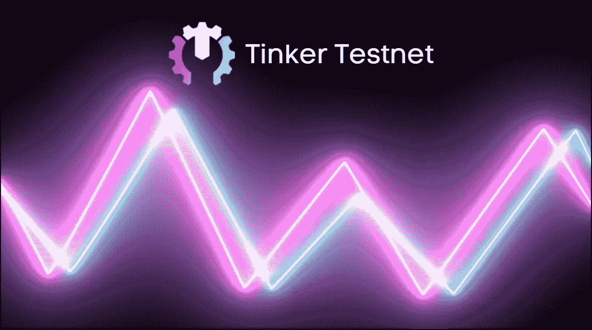
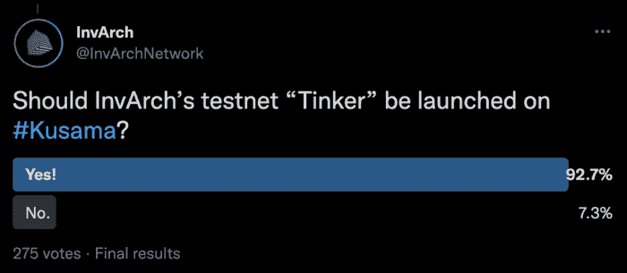

# 修补测试网

> 原文：<https://medium.com/coinmonks/tinker-testnet-13a588f6e9f3?source=collection_archive---------20----------------------->

## 为什么不在草间弥生？何时以及如何推出？

因瓦赫举办了其第 1 个 Twitter 空间 *(* [*全音频记录*](https://twitter.com/i/spaces/1BRKjnVYgjBKw?s=20) *)* 作为社区 AMA。本文涵盖了关于即将推出的 Tinker Testnet 的问题和答案。

**为什么小叮当不会是草间弥生？介绍之后是一个大话题，为什么团队决定不在草间弥生上推出 Tinker Testnet，即使 Twitter pool 显然支持它。**

然而，Dakota Barnett (InvArch 创始人)指出，它不会是一个测试网。相反，这将是一个完整的金丝雀网络，它会变成一种自己的野兽。

投票是压倒性的，该团队没有预料到强烈的社区支持。然而，草间弥生有很多乐趣和刺激，达科他真的喜欢那里的这么多项目，据了解，许多创始人在草间弥生生态系统中建立了成功的结对团队。

重新评估这个问题的原因是波尔卡多特的安全性超过了草间弥生的速度。安全是必不可少的，实际上是在 IP 和 IP 认证领域。但它的美妙之处在于，InvArch 可以部署在 Polkadot 上，并且在未来，通过桥上 XCA 无缝地接入和扩展功能到 Kusama，将跨链认证通过桥扩展到生态系统。因此，它将为开发者和团队提供波尔卡多特级别的安全性，并将其扩展到草间弥生生态系统的速度。因此，不会有任何功能或利用率损失。

此外，保持第二副链将成为一项重要任务。这对开发团队来说压力会更大，因为许多项目已经经历过了。草间弥生额外的副链需要大量的奉献、资源、注意力和专注。团队希望为 mainnet 保留这些品质；像这样坚持下去是我们最明智的选择。所以他们利用他们的资源专注于在波尔卡多特上建立职业安全并向外扩展。

如果团队部署在草间弥生，就会有一个测试令牌，即$TNKR 令牌。在波尔卡多特老虎机拍卖之前，它将被分离以不影响代币价格。

我们认为草间弥生会带来更多的支持者。尽管如此，Web3 和互操作性的美妙之处在于，无论我们从哪里开始，InvArch 都能够完成所有这些工作。我们的目标是拥有一个主要协议，并将这种保护和知识产权创造功能扩展到整个生态系统，所有的 Web3，最终有一天所有的 Web3。那会很酷。

最后，在草间弥生上推出 Tinker 会在某些方面加快发展。例如，在 XCA 大桥的一切准备就绪之前，我们完全部署 InvArch 是不明智的，这将是一个相当大的阻力。

Tinker 将于何时推出？
小炉匠预计发射日期:**2022 年 3 月 25 日至 3 月 31 日。** 无论波尔卡多特的测试网是部署在洛可可还是威斯特。

哪些功能将可用？
联合创始人、资深 Rust 工程师 Gabriel Facco de Arruda 在 AMA 期间提供了以下答案:

> 你们应该很快就能测试了。我们将会记录一切，每一种可以在 Tinker testnet 上测试的用例，因为我们希望看到人们实际上在它上面尝试真实的用例。这就是为什么我们花了一些时间来完成它。因为我们不希望只有基本的功能，我们希望有它，这样你就可以正确地测试你将如何使用它的主网的全部功能。因此，我们将拥有一切，从铸造 IP 到运行智能 IP，这就是为什么我们想得到这个波兰的第一个测试网。

换句话说，在我们的 Tinker Testnet 的首次发布中，个人将能够预期以下内容:

*   *IP 文件和 IP 集合薄荷:*能够薄荷你的文件，创建 IP 集合，将 IP 集合放入其他 IP 集合(IP 子集)等。
*   *IP 集复制:*能够复制 IP 文件、IP 集，并将这些复制链接起来，这将使跟踪您的文件变得更加容易(想想分叉存储库)
*   *基本智能 IP 功能:*智能 IP 文件拥有自身的能力；在未来，我们将拥有 IPVM(知识产权虚拟机)，在这里，IP 上的函数调用能够调用其他 IP 上的函数，从而为 IP 文件、IP 集等创建一个分散的环境。

这是你可以期待的关于 Tinker 的事情 InvArch 团队邀请每个人尽他们最大的能力“打破它”,并获得有趣的体验。

访问因瓦赫官方渠道:
[**网站**](https://invarch.network/)】[**推特**](https://twitter.com/InvArchNetwork)**不和**】[**亚社会**](https://app.subsocial.network/5857)】[**中社会**](https://invarch.medium.com/)[**电报**](https://t.me/InvArch)[**Github**](https://github.com/Invarch)】

> 加入 Coinmonks [电报频道](https://t.me/coincodecap)和 [Youtube 频道](https://www.youtube.com/c/coinmonks/videos)了解加密交易和投资

# 另外，阅读

*   [印度加密交易所](/coinmonks/bitcoin-exchange-in-india-7f1fe79715c9) | [比特币储蓄账户](/coinmonks/bitcoin-savings-account-e65b13f92451)
*   [OKEx vs KuCoin](https://coincodecap.com/okex-kucoin) | [摄氏替代品](https://coincodecap.com/celsius-alternatives) | [如何购买 VeChain](https://coincodecap.com/buy-vechain)
*   [币安期货交易](https://coincodecap.com/binance-futures-trading)|[3 commas vs Mudrex vs eToro](https://coincodecap.com/mudrex-3commas-etoro)
*   [如何购买 Monero](https://coincodecap.com/buy-monero) | [IDEX 评论](https://coincodecap.com/idex-review) | [BitKan 交易机器人](https://coincodecap.com/bitkan-trading-bot)
*   [CoinDCX 评论](/coinmonks/coindcx-review-8444db3621a2) | [加密保证金交易交易所](https://coincodecap.com/crypto-margin-trading-exchanges)
*   [红狗赌场评论](https://coincodecap.com/red-dog-casino-review) | [Swyftx 评论](https://coincodecap.com/swyftx-review) | [CoinGate 评论](https://coincodecap.com/coingate-review)