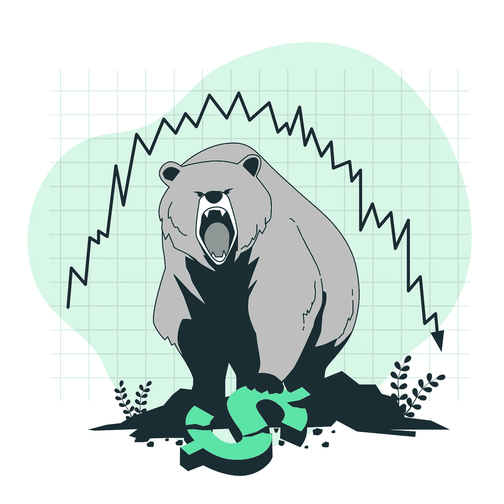

# 熊市投资小贴士

> 原文：<https://medium.com/coinmonks/tips-for-investing-in-a-bear-market-2f78843139e0?source=collection_archive---------7----------------------->

Tips for Investing in a Bear Market

[熊市](https://cryptoworldfinace.blogspot.com/2021/12/bullish-and-bearish.html)对于任何加密货币持有者或投资者来说，都可能是一个令人畏惧的时期，因为它们通常会导致大多数数字资产持续、经常是大规模的亏损。

事实上，没有哪个市场可以永远保持上涨，忍受市场当前的可能性，这可能是纠正你犯下的任何错误的大好时机，做好准备，迎接市场的复苏。

在这里，我们讨论在熊市投资的技巧，当市场最终选择回升时，让自己处于稳健的状态。

# 坚持计划

你可能已经读过了:“[初学者和进阶者的完美策略加密货币交易](https://cryptoworldfinace.blogspot.com/2021/11/perfect-strategy-cryptocurrency-trading.html)”、“[突破和伪造加密货币](https://cryptoworldfinace.blogspot.com/2021/12/breakout-and-fakeout-in-cryptocurrency.html)”、“[加密泵和转储方案](https://cryptoworldfinace.blogspot.com/2021/11/crypto-pump-and-dump-schemes.html)。如果你和大多数人一样，当事情变得不可收拾时，所有的计划和技巧都会被抛到九霄云外。但是，如果在投资和买卖时有一个最重要的组成部分，那就是坚持图表(假设草图是精心设计的)。如果你曾经对自己说，“只要 X 的价格低于 Y 的价格，我就会买入”……早于后来不能坚持计划，那么你就切除了大多数。然而，虽然在市场强劲时制定这样的计划很方便，但当整个事情开始暴跌时，坚持这样的计划肯定说起来比做起来简单。

然而，记录已经证明，那些有勇气在市场一片紫红色时出手买进的人，往往会做好长期投资。以比特币为例，它从 2017 年 12 月的 2 万多美元跌至 2018 年 12 月的 4000 美元以下。

在“下一次跌破 X”时承诺购买的人中，有百分之多少只是伴随着 via，然后持有？"少得可怜的少数人。"

我们大多数人都对此负有责任。当市场下跌时，大多数人会开始认为这是市场崩溃到零或者根本无法恢复的时候，而一些人会继续希望以更低的价格购买，但无论如何都不会扣动扳机。然而，正如比特币和许多不同的加密货币已经证明的那样，从长期来看，它们几乎总是跳得更低。

避免不流血的最简单的方法之一是在你的目标价位设置限价单。例如，如果你希望在比特币跌破 10，000 美元时买入，你可以设置一个限制令，在比特币触及该费用点时触发市场买入。

或者，考虑使用美元平均价格(DCA)在下跌市场的某个阶段构建您的头寸，这将有助于展示您的进场价格，许多交易所和经纪人允许您通过进行日常购买来自动化该系统。

# 对基本面的信任

加密货币市场充满了机会，尽管即使是低质量的任务也肯定可以获得(通常是短暂的)成功，但那些所有基本面都在附近的人通常会承受在持久市场中幸存下来的巨大风险，并在不同方面得到增强。

不要被炒作和短暂的运动所困扰；尽管这些在牛市的某个阶段可能是有益的迹象，但在持久的市场中，它们的代价要小得多。相反，重要的能源预警信号可以用来发现那些现在可能表现不佳，但在市场复苏时有可能暴涨的任务。

一些事情似乎包括一个强大的集团和合作伙伴，增值的支持者，强劲的流动性，顶级交易上市，可能和显著的市场契合度。如果一家企业在现实中符合这些标准，那么它很可能会在牛市中正常运作。也就是说，一个项目的基本面在它的生命周期中会发生很大的变化，主要是基于领导层、方向、反对意见和市场情绪的变化。正因为如此，有必要查看一下任务，看看它们是否达到了路线图的里程碑，是否朝着正确的方向发展和推进。如果没有，考虑重新考虑你的投资——几乎总是有更高的选择。

# 重温你的知识

尽管经历市场加大了在买卖或长期投资的同时翻转收入的难度，但它们确实为牛市狂热提供了一个经常急需的喘息机会。这段时间可以用来更高的把握行情，看看哪些管用，哪些不管用，更高的把自己拼起来，为后续的牛市做准备。至少，它可以为你提供时间来复制你之前的投资决策，更好地认识到你做错了什么，做对了什么，或者如果有机会你会做出什么调整。

对于绝对的初学者来说，持久市场是一个非常好的机会，可以诚实地磨练你对加密货币和区块链公司的欣赏，专注于主要加密货币的方式和原因，并掌握可能影响市场的因素。

如果你特别看好某个特定的垂直行业，比如第二层解决方案、互操作平台、[区块链游戏](https://cryptoworldfinace.blogspot.com/2021/12/fractal-nft-gaming-marketplace.html)、隐私币等。—然后，你可能还想更深入地了解这些，因为这将帮助你更深入地了解这些属性是如何成为可能的

在给定的时间范围内进化。它还能帮助你更容易地抓住被低估的物品。

你可能还想温习的一些额外的有益事项可能包括:

*   [技术分析](https://cryptoworldfinace.blogspot.com/search/label/trading%20Analysis):发现市场模式，指出适当的进/出点；
*   基本面分析:发现具有长期增长潜力的被低估的计划；
*   情绪分析:理解市场中的既定基调、恐惧和炒作；
*   风险管理:分析如何控制你的风险，价格范围，并分散你的投资；
*   [交易策略](https://cryptoworldfinace.blogspot.com/2021/11/perfect-strategy-cryptocurrency-trading.html):查找和检查几种买卖技巧，以便能够应对额外的机会。

通过确保你有足够的知识和充分的准备来发现和把握可能有回报的买卖机会，你将在每个牛市和熊市中承受成功的最高风险。

# 要明白，不是一切都会崩溃

对于加密货币爱好者来说，熊市可能是一个令人沮丧的时期，他们不得不看到自己的投资组合在可能希望非常快的时间框架内经历痛苦的损失。

但是，尽管绝大多数加密货币在随后的市场中都将经历巨大的损失，但现在并不是所有的加密货币都将如此。很少有人有能力去理解哪些股票会经得起通常的熊市，哪些会暴跌。

毕竟，包括 LOOM Network、元宇宙 ETP 和币安硬币(BNB)在内的众多加密货币已经能够逆时尚而动，并在 2018 年的某个时候继续其大部分价格——这是大多数加密货币报告中最糟糕的持续时间之一。

也就是说，在随后的持久市场中，仅仅一小部分举措就能实现这一点。这适用于每一个新的发布和已经连接的项目。一些人会操纵价格继续高于其他人，而一小部分人只会继续升值。花时间去预测和挑选出哪些可以实现这一点，应该可以阻止你提前退出。

# 抢购打折的宝石

虽然经历市场可以是许多交易者和交易者的尝试实例，但它们另外表征了以岩石背面价格购买有前途的现金和代币的第一可行概率。

在 2018 年至 2020 年之间，绝大多数加密货币都经历了惊人的损失——其中许多加密货币在这三年中错放了超过 90%的费用。放大比特币，它从 2 万多美元的高点跌至最低点的近 3000 美元。尽管比特币在持久市场中以超过 80%的价格崩溃，但在最近的牛市中，比特币将继续获得超过 2000%的价格，从而破坏连续的历史最佳价值。

然而，毫无疑问，很少有商家在这个低点提供比特币，甚至关闭比特币，因为在如此广泛的下跌后购买资产存在心理挑战——而那些可能不会保持足够长的时间来实现回报最大化。

也就是说，有了适当的智力毅力和计划，持久市场可以说是积累本质上稳健的加密货币头寸的理想时机。但要弄清楚哪些股票无疑是因为当前的持久市场而苦苦挣扎，哪些股票正在经历一场持久的抛售，说起来比做起来要简单。

和往常一样，以前的整体表现通常不是未来成功的指标，但是，如果加密货币已经证实了周期性利率波动，并且多次恢复得比以前更好，这对该资产来说是一个好兆头。像往常一样，注意遵守纪律，确保你在几个领域都有一个以上的任务，而不是把所有的鸡蛋放在一个篮子里。这有助于平衡任何损失，同时确保你在捕捉独角兽时有更高的风险。

> 阅读:[加密货币的重要提示](https://cryptoworldfinace.blogspot.com/2021/11/important-tips-for-cryptocurrency.html)

# 利用闲置资产

加密货币持有者犯的最大错误之一是持有。尽管许多加密货币已经建立了长期看涨的风格，为这些虚拟持有的货币带来了惊人的回报，但它不再是最环保的资本使用方式。

相反，借助于利用 CeFi 或 [DeFi](https://cryptoworldfinace.blogspot.com/2021/12/liquidity-pools-in-defi-explained.html) 结构来产生这些资产的收益，你可以在等待市场再次上涨的同时发展你的稳定性。如今，依靠你持有的财产，获得 5%以上的 APY 收益率是一个相当容易的过程，依靠你对机会的容忍度，大幅增加收入是可行的。

像 Orion Money 这样的分散结构允许你在你的稳定存款上赚取高达 25%的 APY，而像 [Nexo](https://nexo.io/) 、 [Celsius](https://celsius.network/) 和 [BlockFi](https://blockfi.com/) 这样的金融储蓄结构在像 BTC、ETH 和 BNB 这样的高风险资产上提供大约 6-10%的 APY。此外，许多资产管理工具，如 Curve、 [PancakeSwap](https://pancakeswap.finance/) 和 [Uniswap](https://uniswap.org/) 允许你在提供流动性或使用 LP 代币的帮助下，在每种风险和稳定的资产上产生明显安全的收益。

通过将你的闲置资产投入持久的市场，你可以发展你的资产，如果/当市场最终复苏时，你就能担任更高的角色。例如，如果你持有价值 10，000 美元的稳定币和 0.1 的 BTC 币，并且你真的持有它们两年，你仍然会得到 10，000 美元的稳定币和 0.1 的 BTC 币。

相反，如果你将 10，000 美元存入像 Orion Money 或 Anchor Protocol 这样的 DeFi 金融储蓄账户，并获得约 20%的 APY，两年后你会得到 14，400 美元。然而，如果你在这个时期的某个阶段通过类似 Celsius 的结构在 0.1 的 BTC 上获得了 8%的 APY，你就会放弃 0.1164 的 BTC——这可能会在随后的牛市中继续认可。

如果没有别的，这些结构应该用来抵消你在持续市场期间可能额外遭受的一些损失。

也就是说，你可能也赞成考虑使用无数 DeFi 保险计划选项中的一个，如 Nexus Mutual、insurance 或 Bridge Mutual，以帮助减轻巧妙合同失败、黑客攻击、盗窃和 stable coin 的风险，这取决于何时使用这些平台。被保护通常比抱歉更重要。

# 别忘了短路

在牛市中，毫无疑问，购买和保护最可靠的加密货币和数字财产通常会导致收益函数，即通常情况下，低买高卖是最明智的想法。

对于正在经历的市场来说，可以说恰恰相反，早期促销的地方通常是最好的，买卖方法转移到高价促销，低价购买和重复可能的地方。但是，尽管在一个持久的市场中，做多的可能性很少，但各种快速的可能性却在飙升。然而，很少有商家懂得如何快速、顺利地进行交易，更少的商家能够在这样做的同时获得收益。

在下跌的市场中，有几种方法可以获得收益，包括快速卖出、做空期权/期货合约、保留反向 ETF、使用预测市场等等。每一种策略都有自己的优点和缺点，在冒巨额风险之前，尽早了解这些策略一直是一个理想的想法。请记住，即使你本质上看好加密货币或整个加密货币企业，几乎所有的加密货币都可能在持久的市场中陷入低迷。正因为如此，利用有利时机在快速方面进行买卖可以取得广泛的积极效果。

> 阅读:[技术分析，阅读加密交易的蜡烛图](https://cryptoworldfinace.blogspot.com/2021/11/technical-analysis-and-read-candlestick.html)

# 网络时间

和大多数行业一样，你所在社区的能量会极大地影响你成功的几率。在加密货币这样一个快节奏、以创新为基础的企业中，情况确实如此，这将是一个与建设者和创新者建立联系和友谊的明智之举，这些建设者和创新者将开创未来区块链的任务。

熊市象征着一个合适的时机来融入社会，展示你的身份，这可以通过参加会议、研讨会或邻里研讨会，或者加强你的 LinkedIn 游戏来实现。你认识的人越多，你在随后的牛市中成功的几率就越大。

无论是通过对即将到来的项目的早期宣传，获得相对抢手的工作职位，还是真正的专业认知和信息，或者当然是为自己的发展寻找合适的团队，一个强大的社区的重要性都不会被夸大。尽管如此，还是有太多的人决定单干，只是在市场复苏时发现自己后悔了。[阅读更多](https://cryptoworldfinace.blogspot.com/2022/01/tips-for-investing-in-bear-market.html)。

> 加入 Coinmonks [电报频道](https://t.me/coincodecap)和 [Youtube 频道](https://www.youtube.com/c/coinmonks/videos)了解加密交易和投资

## 另外，阅读

*   [比特币主根](https://blog.coincodecap.com/bitcoin-taproot) | [排名前 6 的比特币信用卡](/coinmonks/bitcoin-credit-card-bc8ab6f377c6)
*   [最佳免费加密信号](https://blog.coincodecap.com/free-crypto-signals) | [YoBit 评论](/coinmonks/yobit-review-175464162c62) | [Bitbns 评论](/coinmonks/bitbns-review-38256a07e161)
*   [huo bi 的加密交易信号](https://blog.coincodecap.com/huobi-crypto-trading-signals) | [BitMEX 评论](https://blog.coincodecap.com/bitmex-review)
*   [7 个最佳零费用加密交易平台](https://blog.coincodecap.com/zero-fee-crypto-exchanges)
*   [分散交易所](https://blog.coincodecap.com/what-are-decentralized-exchanges) | [比特恩斯 FIP](https://blog.coincodecap.com/bitbns-fip) | [皮奥克斯评论](https://blog.coincodecap.com/pionex-review-exchange-with-crypto-trading-bot)
*   [用信用卡购买密码的 10 个最佳地点](https://blog.coincodecap.com/buy-crypto-with-credit-card)
*   [OKEx 评论](/coinmonks/okex-review-6b369304110f) | [Kucoin 交易机器人](/coinmonks/kucoin-trading-bot-automate-your-trades-8cf0ca2138e0) | [期货交易机器人](/coinmonks/futures-trading-bots-5a282ccee3f5)
*   [AscendEx Staking](https://blog.coincodecap.com/ascendex-staking)|[Bot Ocean Review](https://blog.coincodecap.com/bot-ocean-review)|[最佳比特币钱包](https://blog.coincodecap.com/bitcoin-wallets-india)
*   [霍比评论](https://blog.coincodecap.com/huobi-review) | [OKEx 保证金交易](https://blog.coincodecap.com/okex-margin-trading) | [期货交易](https://blog.coincodecap.com/futures-trading)
*   [Godex.io 审核](/coinmonks/godex-io-review-7366086519fb) | [邀请审核](/coinmonks/invity-review-70f3030c0502) | [BitForex 审核](https://blog.coincodecap.com/bitforex-review)