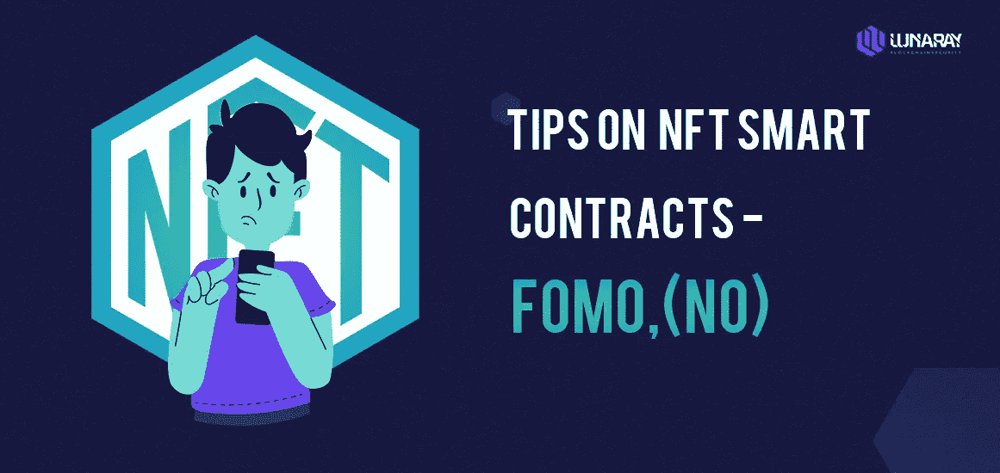
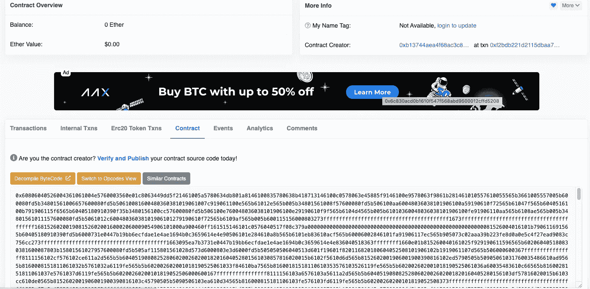

# 阅读 NFT 智能合同的提示-FOMO，(否)

> 原文：<https://medium.com/coinmonks/tips-on-reading-nft-smart-contracts-fomo-no-b4857100ec2b?source=collection_archive---------32----------------------->

## 0x 01 预览

由于目前的 NFT meta 是没有路线图的免费薄荷糖，这里有一些关于安全使用薄荷糖的快速入门和一些阅读 NFT 智能合同的技巧。

## 0x02 提示 1:永远使用一次性钱包。

仅供参考:一次性钱包是主钱包(保险库)的第二个(临时)钱包，通常用于制造 NFT 或与未经审计的 dApp 通信。一次性钱包的创建方式与任何其他钱包相同，但用于特定目的，如铸造 NFT 或连接未经审核的项目。

这已经说过很多次了，但是使用一个最少 ETH 并且里面没有贵重资产的钱包。一个错误的签名，你的 50k 猿消失了。与此相关的一点是，不要把你的贵重物品放在热钱包里，请转移到硬件钱包里。

## 技巧 2:尽可能从合同中获利。

有许多骗局，其中一个项目在其网站上宣传免费造币厂，但将造币厂按钮更改为签名请求，以便您批准转移到您有价值的 NFTs。这就是你如何让你的 NFTs 很快被盗。

当你从一个契约中创建时，你可以调用你想调用的精确的(创建)函数。这减少了你签署你不打算签署的东西的机会。然而，这意味着你需要知道如何阅读基本的合同。

## 0x04 技巧 3:基本了解智能合约代码。

我们要看的第一个例子是下面的合同，这是几周前免费的:

[https://ethers can . io/address/0x BCE 3781 AE 7 ca 1 a5e 050 BD 9 C4 c 77369867 ebc 307 e # code](https://etherscan.io/address/0xbce3781ae7ca1a5e050bd9c4c77369867ebc307e#code)

对于上下文，几乎所有 NFT 智能合同都有相关性。这些依赖项中的大部分只是契约所依赖的流行库。常见的例子有 **ERC721A** 、Ownable、any**open zeppelin**。

因此，您经常会发现许多与实际项目无关的代码。你会想直接搜索薄荷功能。项目可以将这些依赖关系以单个或多个文件的形式上传到 etherscan，前者更难浏览。

地精的合同都是作为一个文件上传的，这意味着你需要按 ctrl+f 键。

> 加入 Coinmonks [电报频道](https://t.me/coincodecap)和 [Youtube 频道](https://www.youtube.com/c/coinmonks/videos)了解加密交易和投资

这里有一个更容易搜索的多文件上传:

[https://ethers can . io/address/0x 659 a4 bdaaacc 62 D2 BD 9 CB 18225d 9 c 89 b5 b 697 a5a #代码](https://etherscan.io/address/0x659a4bdaaacc62d2bd9cb18225d9c89b5b697a5a#code)

对于地精契约来说，铸币功能叫做 makingobblin。您可以通过搜索 _mint(或 _safeMint(。您还在寻找一个没有“onlyOwner”修饰符的函数，因为那是为契约所有者保留的。

一旦您找到了 mint 函数，您将希望尽最大努力确定没有恶意代码。我的一般看法是，免费 mint 的 mint 函数应该只包括必需的语句、一个 _mint/_safeMint 调用，有时还包括对映射的写操作。

地精契约符合这些要求，1634 行只是记录以确保用户不会铸造超过允许的数量。

[https://ethers can . io/address/0x 659 a4 bdaaacc 62 D2 BD 9 CB 18225d 9 c 89 b5 b 697 a5a #代码](https://etherscan.io/address/0x659a4bdaaacc62d2bd9cb18225d9c89b5b697a5a#code)

这个契约更容易阅读，我们可以看到 mint 函数的字面意思是“mint”(wag die . sol 中的第 43 行)。同样，这个契约所做的唯一一件事是运行一些 requires，写入 Mint 的日志数量的映射(第 48 行)，并调用 _safeMint。

这只是对阅读 NFT 智能合同的介绍，并不是避免恶意代码的证明方法。如果你有某种形式的保护时，决定德根一个免费薄荷。

我们仍然强烈建议尽可能等待专家来确认合同的安全性，尤其是当您看到超出上述标准的代码时。显然，随着所有免费薄荷糖的出现，这是不可能的，所以使用上面的工具来指导你自己。

## 0x05 提示 4:如果在以太网扫描上没有验证合同

如果合同在 etherscan 上未被验证远远没有这个，这里有一个未验证合同的例子:你会发现在 etherscan 页面上没有可读的代码。

对于一个自由的 NFT 造币厂来说，这几乎保证了一些恶意的事情正在发生。除非你知道如何通读反编译的字节码，否则我们强烈建议不要铸造。你也不能直接从合同中赚钱。

## 0x06 摘要

永远用一次性钱包来装德根薄荷糖。最坏的情况是你会失去少量的 ETH。当去薄荷，尝试直接从合同薄荷，并尽最大努力提前理解代码。祝你好运，不要留在 FOMO。

参赛:https://twitter.com/cygaar_dev/status/1533522565846560769