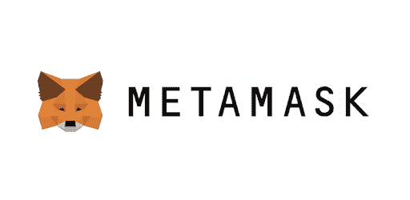
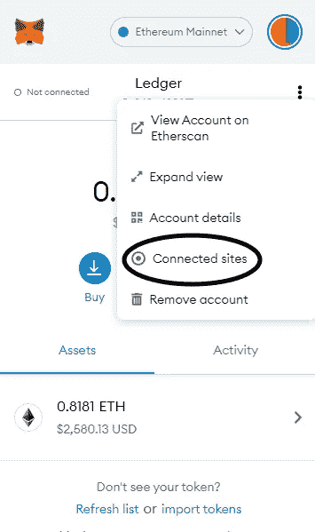
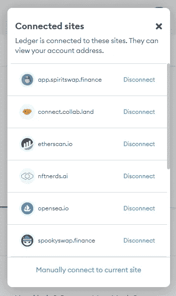

# 保护元蒙版安全的小贴士

> 原文：<https://medium.com/coinmonks/tips-to-keep-your-metamask-safe-cc7dbd4c937f?source=collection_archive---------65----------------------->

MetaMask 是你的加密和 NFTs 的分散的家，是生态系统的一个重要部分，更重要的是，它是你进入 Web3 生态系统的关键。但许多人开始不关心它的安全方面，我也不，但在我的 MetaMask 钱包被黑后，我得到了教训。不像在 Web2 空间，我们在 Web3 中没有一个中央权威机构，如果一个坏演员窃取了你的资金，你只能靠自己。你的资产完全成为你的责任，因为你必须自己照看它们。这个领域的安全应该是你的第一优先考虑的事情，这里有一些技巧来保证你的 MetaMask 钱包的安全

*   **买一个硬件钱包——**我怎么强调都不为过，但是一个冰冷的钱包在 Web3 中的重要性是无与伦比的。与普通的冷钱包(如 MetaMask)相比，冷钱包本质上是离线存储您的私钥，后者将它们存储在您的设备上。我将在以后的博客中更深入地介绍冷钱包，但如果你想用[莱杰](https://www.ledger.com/)或[特雷佐](https://trezor.io/)买一个。
*   **离线存储您的种子短语-** 当您设置任何分散式钱包时，都会为您提供一个 12 或 24 个字的秘密恢复短语，顾名思义，这是在您忘记密码的情况下返回钱包的方法。大多数人的储存方式是不正确的。一些例子包括截图、邮寄/发短信给自己、复制粘贴到 word 文档中。你应该远离任何电子邮件或云服务。所有这些存储方法本质上都是在邀请黑客侵入你的钱包。理想情况下，你的秘密恢复短语不应该出现在数字世界。它应该被写在一张应该被安全保存的纸上。我认为不言而喻的是，无论如何你都不应该把你的种子短语给任何人。
*   **定期撤销已连接网站的访问权限-** 尽管你应该只连接到可信的网站，但对于像我这样狂热的 Web3 探索者来说，你经常需要将钱包连接到不同的网站，比如尝试新的 Defi 协议或 NFT 造币网站。当连接到粗略的网站时，你应该创建一个二级一次性钱包，这样即使你的钱包被黑客攻击，也不会有你所有的资金在里面。使用完服务后，请务必记住撤销对它们的访问权限。下面附上图片供参考。

*   **开启自动锁定功能-** 当您的 MetaMask 钱包解锁时，您浏览器上打开的任何一个标签都可以看到它的详细信息，尽管它们无法像连接的网站那样与之交互，但这可能会危及您钱包的安全。这项功能会在设定的时间后自动锁定您的钱包。此外，如果你的钱包不小心被打开了，它也会有所帮助。
    开机步骤是-
    设置>高级>自锁定时器>设置为 3/5 分钟

我希望这个帖子对你们有所帮助！这个空间是非常邪恶的，充满了巴演员，你的安全取决于你自己。

> 加入 Coinmonks [电报频道](https://t.me/coincodecap)和 [Youtube 频道](https://www.youtube.com/c/coinmonks/videos)了解加密交易和投资

# 另外，阅读

*   [有哪些交易信号？](https://coincodecap.com/trading-signal) | [Bitstamp vs 比特币基地](https://coincodecap.com/bitstamp-coinbase) | [买索拉纳](https://coincodecap.com/buy-solana)
*   [ProfitFarmers 点评](https://coincodecap.com/profitfarmers-review) | [如何使用 Cornix Trading Bot](https://coincodecap.com/cornix-trading-bot)
*   [十大最佳加密货币博客](https://coincodecap.com/best-cryptocurrency-blogs) | [YouHodler 评论](https://coincodecap.com/youhodler-review)
*   [my constant Review](https://coincodecap.com/myconstant-review)|[8 款最佳摇摆交易机器人](https://coincodecap.com/best-swing-trading-bots)
*   [MXC 交易所评论](/coinmonks/mxc-exchange-review-3af0ec1cba8c) | [Pionex vs 币安](https://coincodecap.com/pionex-vs-binance) | [Pionex 套利机器人](https://coincodecap.com/pionex-arbitrage-bot)