# 在 Honeygain 上获得最大收益的 10 个技巧:一个轻松的被动收入应用程序！

> 原文：<https://medium.com/coinmonks/tips-to-maximize-earnings-on-honeygain-an-effortless-passive-income-app-15f9793bb423?source=collection_archive---------0----------------------->

Seeking passive income is my one of my life goals, among many others. Honeygain makes for an excellent long-term passive income solution.

oneygain 是我最喜欢的被动收入来源之一——它是一种简单的、设置好就一劳永逸的方式，可以在后台为我赚取被动收入。这是一个免费的应用程序，几乎可以在任何移动或桌面设备上工作，通过安全地共享您的互联网连接，使您几乎不用动一根手指就能获得被动现金流，然后这些连接被用于收集公开可用的网络数据，这些数据对寻求提高广告排名、比较价格和防止广告欺诈的企业至关重要；所有这些都不会损害您的[数据安全](https://www.honeygain.com/security/)。从本质上来说， [Honeygain](https://r.honeygain.me/CYBER577DD) 允许你通过把你的设备变成一个网络网关(住宅代理)来利用你未使用的互联网流量。虽然这并不能保证丰厚的回报，但获得的小回报确实能为生活中的小事增添一点点光彩，比如每月支付网飞订阅费，或者一次昂贵的难得款待。

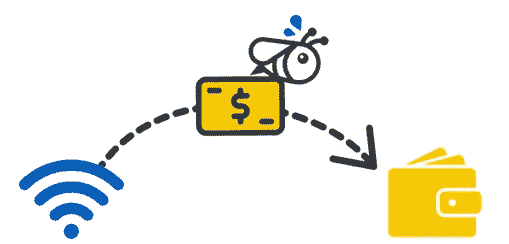

# 基本原理

Honeygain 为数据科学家、财富 500 强、广告公司和其他企业等第三方提供住宅代理服务。在任何给定的时间，你在智能手机或台式机上使用的只是你全部互联网数据的一小部分。在你的设备上安装 Honeygain 允许这些公司使用你未使用的互联网连接来运行[众包信息处理](http://news.mit.edu/2017/crowdsourcing-big-data-analysis-1030)、[品牌保护活动](https://blog.redpoints.com/en/the-ultimate-guide-to-brand-protection)、 [SEO 监控](https://www.honeygain.com/post/how-honeygain-network-supports-seo-practice)、[广告欺诈防范](https://www.honeygain.com/post/how-honeygain-helps-the-advertising-industry)，启用流媒体等等，以及许多其他事情。作为将你多余的互联网数据“出租”给这些公司的回报，你会得到一笔可观的报酬——所有这些都在后台毫不费力地完成。你每分享 10MB 的数据就可以获得 1 分。每个信用值 0.0001 美元，因此，如果您共享 10GB，您将获得 1 美元的信用。

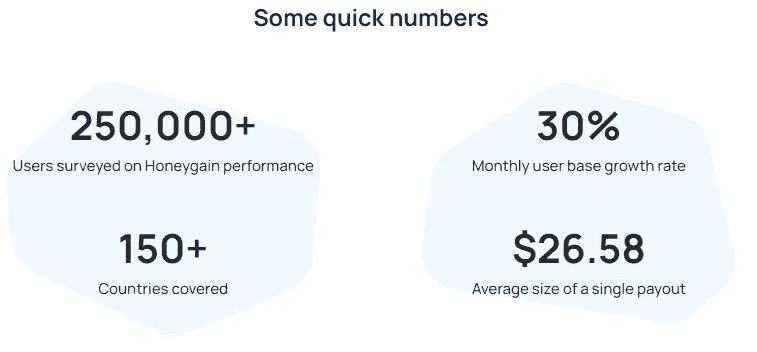

# 我的数据安全吗？

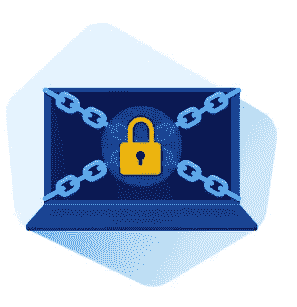

是的。Honeygain 确保您的互联网流量仅由可信任的合作伙伴使用，不会访问您设备的存储空间，也不会收集您的任何个人数据，除了您的电子邮件地址、IP 地址和支付方式，或者识别您的帐户和结算付款所需的任何其他信息。

对我的 Android 设备权限的快速检查证实了 Honeygain 的声明，即该应用程序不需要任何特殊权限即可运行。

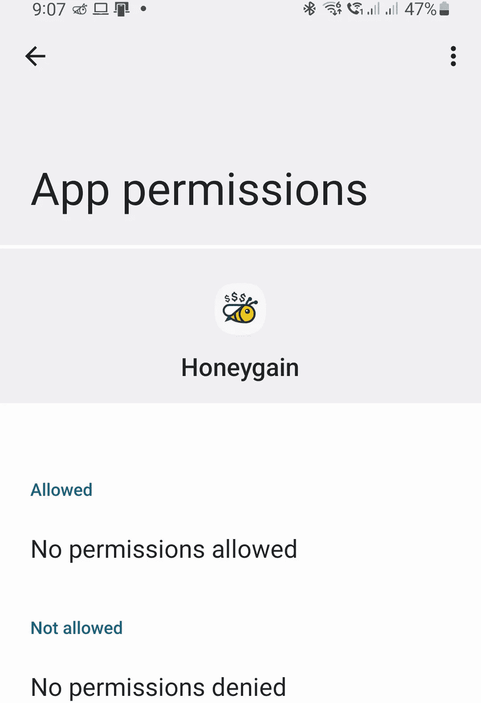

No permissions were required by Honeygain on my Android device. Version 0.9.6-LP-HI

# 电源问题

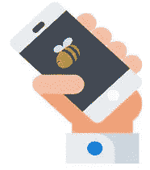

该应用程序在后台安静地运行，典型的电池消耗每天在 5%-8%之间变化；因此，这几乎不是电池杀手，尤其是如果手机连接到 WiFi 网络。

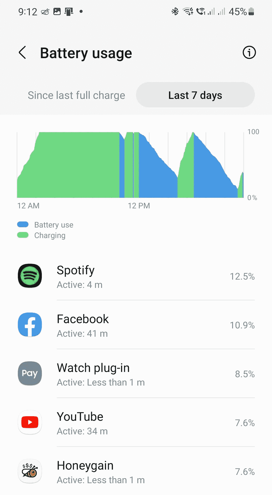

Honeygain uses an average of around 5–8% daily of my 2 year-old Samsung S20’s battery charge, while running on mobile data.

# 重要的事情先来

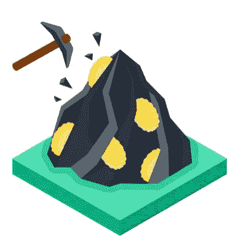

如果您还没有这样做，请在此注册 Honeygain [。注册后，你将被带到 Honeygain](https://r.honeygain.me/CYBER577DD) [仪表盘](https://dashboard.honeygain.com/)，全面显示你的收入，并根据你与网络共享的带宽自动实时更新。收入被很好地细分为子类别，如聚会、推荐、奖金和红利，以便于你阅读。

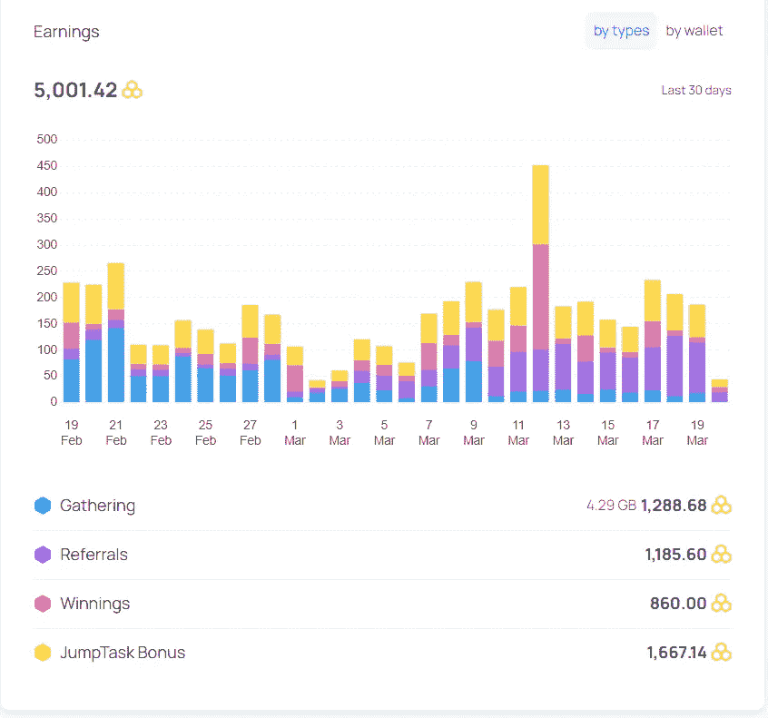

一旦你创建了你的账户，[下载](https://www.honeygain.com/download/)honey gain 应用程序，适用于 Android、iOS、Mac、Windows ( [教程](https://www.blog.honeygain.com/post/step-by-step-how-to-install-honeygain-on-windows))和 Linux。安装完成后，使用相同的凭据登录您的帐户，以便您的应用程序可以与您的仪表板同步。

以下是我在 Honeygain 的整个旅程中发现的一些技巧，它们可能有助于使你的收益最大化。

# 🐝#1 使用多种设备

每个中奖者在任何给定时间都可以拥有多达 10 个活动设备。您使用的设备和 IP 地址越多，您可以分享的流量就越多——这也意味着更多的收入！但是，请注意，每个网络最多只能设置 3 台设备。利用你家里闲置的旧智能手机，或者把它安装在你的笔记本电脑上，当你在家工作时在后台运行。

2012 年 4 月 24 日更新:Honeygain 最近宣布，他们将只允许每个 IP 地址有一个活动设备，目的是在不影响用户收入的情况下简化和优化互联网流量。但是，您仍然可以在不同的 IP 地址上运行多达 10 个活动设备，以最大限度地提高您的收入！

# 🐝# 2 jump task 中的收入！

2022 年 1 月，Honeygain 与远程工作平台 JumpTask 合作，提供在 JumpTask 网络的原生令牌中赚取收入的选项。JumpTask 是一个基于零工经济的市场，允许公司充分利用全球分散的劳动力所拥有的集体技能。该平台由 JumpToken (JMPT) token 提供动力，鉴于该项目的良好理念和实用性，该平台具有相当好的投资潜力。

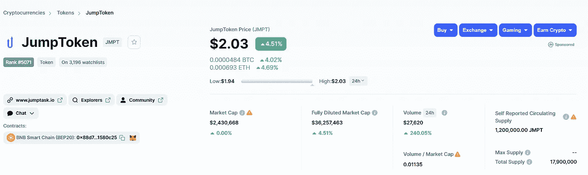

JMPT token, as seen on coinmarketcap.

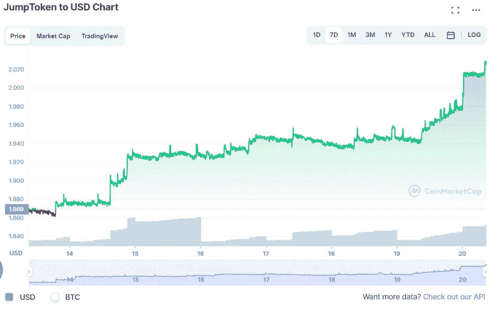

JMPT is currently trading at $2.04\. Image taken from coinmarketcap.

Honeygainers 可以利用这一新代币的潜力，通过选择在 JMPT 而不是 Honeygain 积分赢取更多限时 50%的奖金，如下所示。

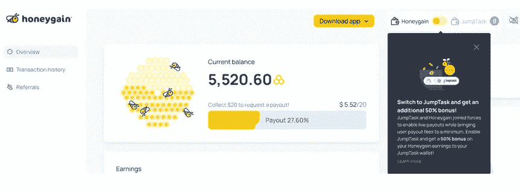

如果你决定切换到 JumpTask 模式下赚取收入，你必须连接一个加密货币钱包来收集 JumpTokens 中的收入。支持任何与币安智能链(BSC)网络兼容的钱包——我个人为此使用 Trust wallet，尽管 Metamask 也是一个受欢迎的选项。(教程跟随；敬请期待！)

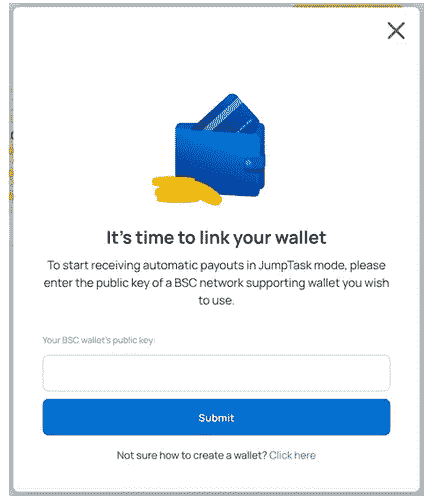

选择在 JMPT 赚钱的其他好处包括灵活的提现选择，交易费用低。

更新 14/6/22:JMPT 50%红利支付的促销期已经结束。在 JMPT 的收益现在累积 10%的红利。

How to earn with Honeygain in JMPT tokens: From the Honeygain YouTube channel.

# 🐝#3 Avail JumpTask 奖金！

JumpTask 有一个活跃的开发团队和不断发展的社区。除了通过 Honeygain 赚钱，JumpTask 还不时提供新的赚钱机会，例如即将推出的 Offerwall！Offerwalls 将于 3 月 21 日首次亮相，为 JumpToken (JMPT)的 JumpTask 用户提供一种全新类型的微任务。

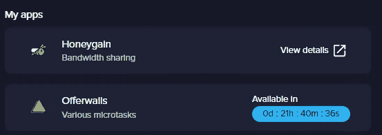

Offerwalls coming up soon!

在你的日常爱好中加入一点经济刺激，从游戏到观看视频或尝试一项新的服务或应用——可能性是无限的！最重要的是，在舒适的家中做所有这些事情，Honeygain 在后台运行，为您的 JMPT 收入增添一点趣味！

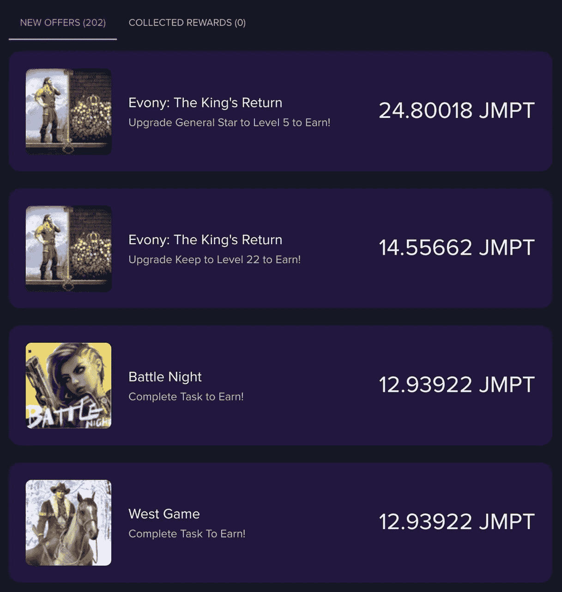

A glimpse into Offerwalls: Taken from the JumpTask medium page.

# 🐝#4 支持内容交付！

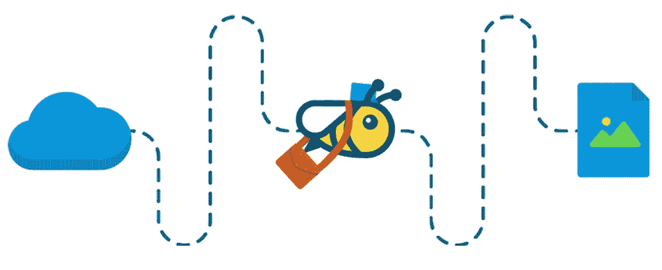

实质上，内容传送系统通过引入某些中介(例如网络和存储服务器)来工作，这些中介通过传送其缓存的副本或重定向它们以便用户可以经由更快或更合适的路线到达它，来方便用户访问因特网上的某些内容。内容交付还可用于将内容流式传输到无法直接访问的位置。

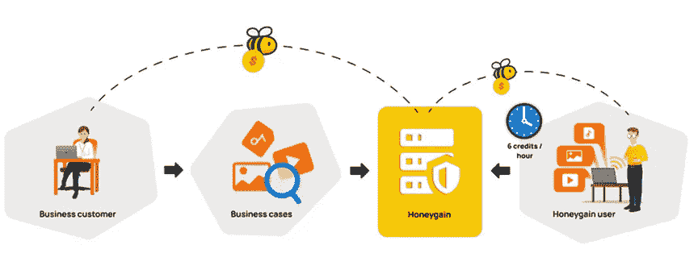

在 Honeygain 的背景下，内容交付是 Windows 和 macOS 设备上的一项功能，可为其客户端实现传输加速和带宽优化，以更高的数据传输速率和更流畅的浏览体验在全球范围内实现更快、更安全的内容交付；对于 Honeygainer 来说，这将转化为额外的收入，这将不取决于你的流量有多少与 Honeygain 的网络共享，而是取决于你打开该功能并处于“活跃”状态(而不是“排队”)的时间(分钟、小时或天)！).因此，通过启用内容交付，任何连接到内容交付服务器的桌面设备除了常规收入之外，还将获得 6 个积分/小时。重要的是，这些以共享流量形式通过黑客设备进行内容传输的数据是完全加密的，因此无法被任何第三方破译。由于内容交付包括多种类型的带宽密集型内容，如图像、视频、音频、流媒体、大型网站、IPTV、VOD、社交媒体或 VoIP 服务，因此它仅在桌面设备上可用，桌面设备通常具有更稳定的互联网连接。

如何激活内容交付？当内容交付的弹出通知显示在您的台式机/笔记本电脑设备上时，只需点击**启用**。

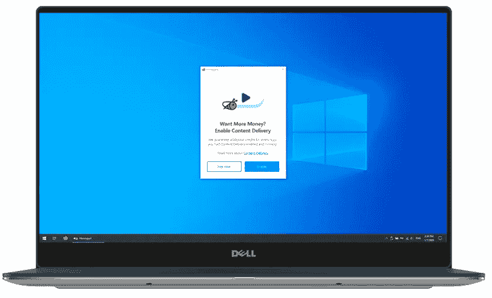

该功能目前仅向有限国家的用户提供，即阿根廷、澳大利亚、奥地利、比利时、巴西、加拿大、中国、哥伦比亚、捷克共和国、丹麦、芬兰、法国、德国、希腊、匈牙利、印度、爱尔兰、意大利、日本、马来西亚、墨西哥、荷兰、新西兰、挪威、波兰、菲律宾、葡萄牙、罗马尼亚、俄罗斯、新加坡、南非、西班牙、瑞典、瑞士、中国台湾、土耳其、英国和美国。[更新于 2021 年 6 月 8 日]

然而，老实说，我的内容交付状态，虽然已经启用，但由于有限的现货供应，大部分时间仍处于“排队”状态；Honeygain 团队承诺将努力工作，使这一功能在全球范围内可用，并提供更多可用的插槽！一旦空闲连接可用，您将再次被自动添加到内容交付池中。一旦进入，您的仪表板上将会显示一个特殊的通知。

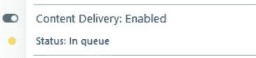

# 🐝#5 每天试试你的运气！

我早上的例行公事之一就是查看我的 Honeygain 仪表盘；除了我每天的收入，还有一个幸运罐彩票，有时可能相当慷慨！Honeygain 的幸运罐彩票为您提供了每天赢取高达 10，000 额外积分(10 美元)的机会，只需在您的桌面或移动设备上检查 Honeygain 应用程序。在我的实践经验中，我的奖励通常在 10-50 个学分的范围内，但有一次获得了 200 个学分。

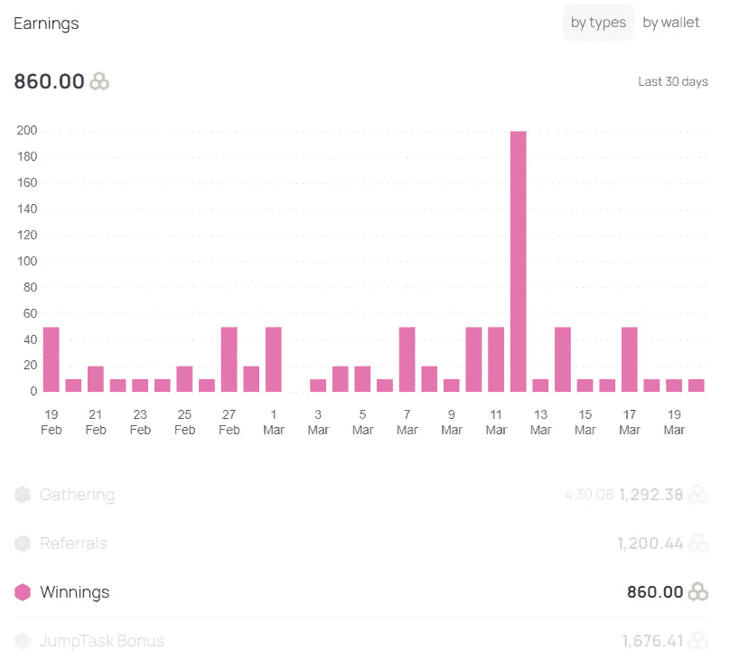

# 🐝#6 分享爱！

邀请您的家人和朋友试用这个伟大的平台！与大多数为推荐人提供固定一次性奖金的应用程序和服务不同，Honeygain 提供的推荐奖励是永久循环的——你可以从你的推荐中获得 10%的奖励(这笔奖金不会从你的推荐收入中扣除，而是 Honeygain 作为对传播信息的感谢而记入的奖金)。)最棒的是，你的推荐人一注册你的推荐链接，还能获得 5,000 Honeygain 积分(5 美元)的奖金！您可以在您的仪表盘的[右下角找到您的推荐链接。](https://dashboard.honeygain.com/)

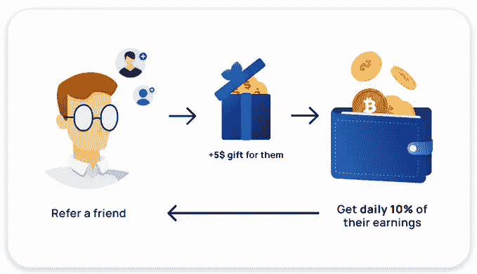

要查看您的推荐收入，请访问您的 Honeygain 仪表盘中的交易历史部分。

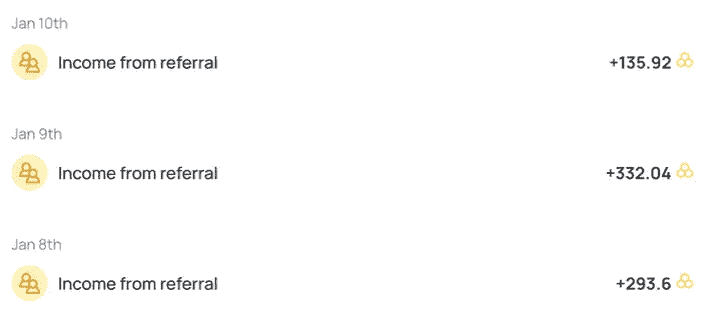

# 🐝#7 在社交媒体上关注 Honeygain

在[脸书](https://www.facebook.com/honeygainapp/)、 [Instagram](https://www.instagram.com/honeygain_app/) 和[推特](https://twitter.com/Honeygain_App)上关注 Honeygain 的社交媒体网站，获取更新和有吸引力的比赛，您可以赢得数千 Honeygain 积分，如下所示。

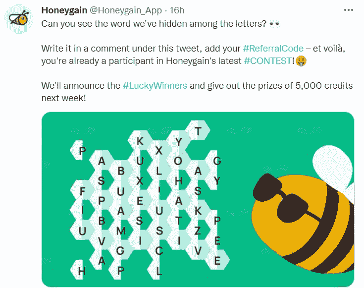

# 🐝#8 确保正确的技术配置

在移动设备上，可能会出现的一个问题是间歇性收益——例如，由 Android 电源管理提供支持的 Android 设备可能会在应用程序正式启动后的几个小时内将正在后台工作的 Honeygain 置于睡眠状态。这是为节省电池而设计的——的确如此；但在 Honeygain 的情况下，可能会减少收入或使收入不一致，因为应用程序在一段时间后被软件操作系统视为在前台不活动而进入睡眠状态。老实说，让 Honeygain 在后台勤奋地(并且安全地)收集数据会对你的电池性能产生很小的影响——在我的经验中，在移动数据上运行会产生额外的 5-8%的电池疲劳(一旦连接到 WiFi 网络，这种情况就会显著减少)；但不用担心，当情况需要时，可以选择在移动数据和不充电时关闭 Honeygain 以节省电池。

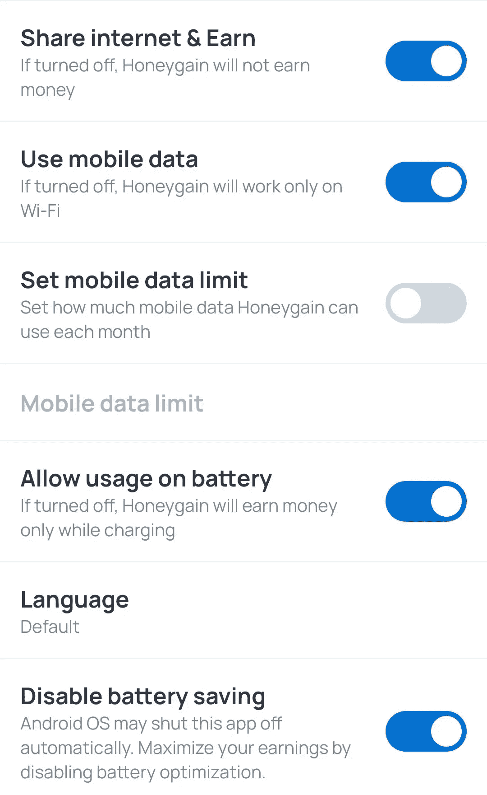

Some important settings on the Honeygain app.

为确保 Honeygain 的平稳运行，请禁用该应用程序的电池优化。详细说明可在 Honeygain 服务台[这里](https://honeygain.zendesk.com/hc/en-us/articles/360013291539)找到。

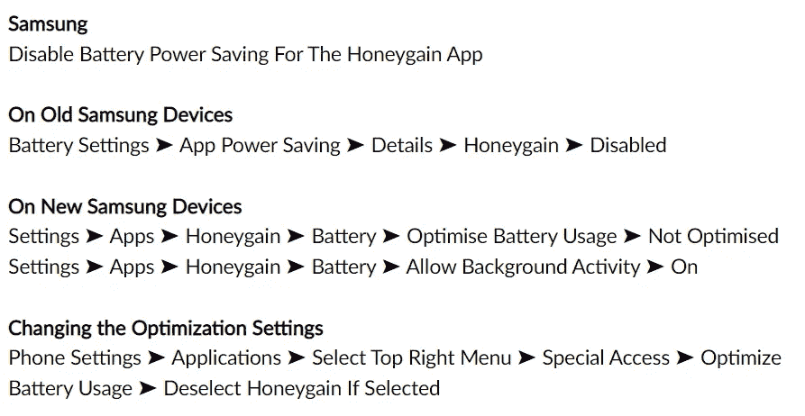

How to disable battery optimization for Honeygain. Image taken from the Honeygain blog.

# 🐝#9 确保稳定的互联网连接

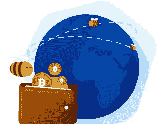

不言而喻，Honeygain 的性能高度依赖于您的互联网连接质量。Honeygain 的网络被各种企业和数据科学家用来[进行市场研究](https://www.honeygain.com/concept/)并收集重要但公开可用的信息，如文本或媒体文件。由于需要收集大量数据，缓慢的互联网连接会减慢整个过程。你仍然可以在网速较慢的情况下赚一些钱——但是收入较低。

互联网连接的质量可以通过测量其延迟或 ping 来确定，它定义了以毫秒(ms)为单位将信息从一点发送到另一点的时间范围；以及以 Mbps 为单位的数据吞吐量或速度，它显示了特定时间段内的数据传输速率。也许 50 的一般规则适用——小于 50 毫秒的 ping 和大于 50 Mbps 的速度应该为 Honeygain 的工作提供良好和稳定的互联网连接。

改善网络连接的技巧:

*   减少连接到 Honeygain 的设备数量，因为太多设备连接到同一个网络可能会适得其反。最大限度地增加不同网络和不同 IP 地址上运行 Honeygain 的设备数量。
*   将您的设备放在离 WiFi 路由器更近的地方！如果您在家中的角落遇到信号强度差的情况，请使用网状 WiFis 或网络扩展器，因为这些会降低您的网络延迟和速度。如果可行，局域网连接可以为桌面设备提供最稳定的互联网连接。
*   确保您没有任何活动的软件限制，如防火墙，它们会干扰 Honeygain。

# 🐝#10 避免欺骗系统

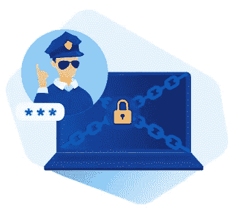

Honeygain 采用智能反作弊(HAC)系统，通过自动和定期检查用户账户及其统计数据，识别所有操纵或滥用系统的企图。每个被发现违反使用条款或从事非法行为的用户都被禁止进入 Honeygain。违反使用条款的活动示例包括:

❌将 Honeygain 与 VPN、仿真器、虚拟机和虚拟专用服务器结合使用，从而触发反欺诈算法，将用户识别为欺诈/虚假用户，因此可能导致帐户被禁。

❌创建多个帐户(特别是如果打算在同一个网络上运行/利用自己的推荐奖金)。

# 🐝今天就成为甜蜜赢家！

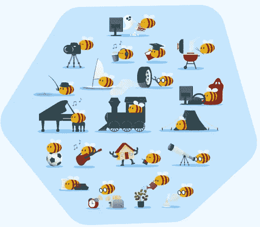

事实上， [Honeygain](https://r.honeygain.me/CYBER577DD) 是一个很好的被动收入来源，使用起来轻松简单。以上是我在使用 Honeygain 的体验中发现的一些收益最大化的小技巧和窍门。

今天就创造一份聪明的被动收入，这样你就可以专注于生活中其他重要的事情，比如家庭。通过毫不费力地分享你未使用的互联网连接，将你的互联网流量货币化，同时在获得推荐的同时传播爱。如果你想有多种收入来源，而且你以前从未尝试过用 Honeygain 轻松赚钱，现在就没有时间开始了！点击[此处](https://r.honeygain.me/CYBER577DD)注册 [Honeygain](https://r.honeygain.me/CYBER577DD) ，并获得 5 美元的注册奖金，立即开始您的收入！想了解更多关于 Honeygain 的信息，请点击这里查看我之前的文章。

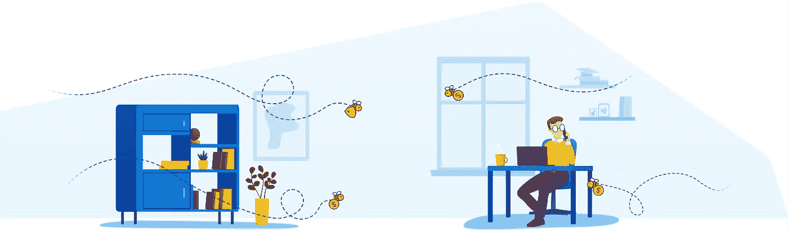

*本文使用的部分材料摘自足智多谋* [*Honeygain 博客*](https://www.blog.honeygain.com/) *和* [*Honeygain 网站*](https://r.honeygain.me/CYBER577DD) *。*

一如既往，这不是财务建议！而只是我投资过的，觉得值得分享的投资平台。在投资前做好自己的研究，不要存你输不起的钱。下面有什么问题可以随时问我。

*如果你喜欢这篇文章，* [*关注&订阅*](/@cybery) *！*

查看以下值得信赖的平台！

*🎁*[*honey gain*](https://r.honeygain.me/CYBER577DD)*一款被动收入 app，从你未使用的互联网带宽中赚钱。* [*免费获得 5 美元*](https://r.honeygain.me/CYBER577DD) *，无需投资。*

*🎁* [*蛋糕 Defi*](https://cakedefi.com/?ref=677920) *一站式投资平台，以高达 200%的年利率烘焙被动现金流！* [*在 DFI 用 50 美元存款获得 30 美元*](https://cakedefi.com/?ref=677920) *。*

*🎁* [*Nexo*](https://nexo.io/ref/hce5cfdt5o?src=web-link) *世界上最先进、受监管的数字资产机构，在 200 多个司法管辖区提供 40 多种法定货币的即时加密贷款、每日资产收益、兑换和服务。* [*用 100 美元存款获得 25 美元*](https://nexo.io/ref/hce5cfdt5o?src=web-link) *。*

*🎁* [*摄氏度*](https://celsiusnetwork.app.link/174094633e) *一个金融科技平台，提供带息储蓄账户、借贷，以及用数字和法定资产进行支付。* [*在 BTC 获得 50 美元*](https://celsiusnetwork.app.link/174094633e) *与 400 美元存款。*

*🎁*[*Hodlnaut*](https://www.hodlnaut.com/join/RTbHxuJMX)*一个稳健的新加坡加密借贷平台，成立于 2019 年，从你闲置的加密货币中产生被动现金流。* [*获得 30 美元*](https://www.hodlnaut.com/join/RTbHxuJMX) *在 USDC 拥有 1000 美元存款。*

*🎁*[*BlockFi*](https://blockfi.com/?ref=a16e37fd)*一种加密货币兑换和钱包。* [*用 100 美元存款获得 10 美元*](https://blockfi.com/?ref=a16e37fd) *。*

*🎁* [*库币*](https://www.kucoin.com/land/register/r/rJH29LZ) *最大的加密货币交易所之一。*

*🎁* [*火币*](https://www.huobi.com/en-us/topic/double-invite/register/?invite_code=5t5jb) *最大的加密货币交易所之一。*

*🎁*[*MEXC*](https://m.mexc.com/auth/signup?inviteCode=1NAJC)*最大的加密货币交易所之一。*

*🎁*[*Crypto.com*](https://read.cash/@TraderFX/10-tips-to-maximize-earnings-on-honeygain-an-effortless-free-passive-income-app-68535728#bad-link)*一款基于新加坡的加密货币兑换 app。* [*获得 25 美元*](https://crypto.com/app/fcbsjmf5pb) *在 CRO 赌一张红宝石牌。*

*针对马来西亚投资者*

*🎁***获得 6 个月免费投资！**

**🎁Wahed code 'KENLIE1' RM10 注册奖金**

**🎁Capbay P2P 代码' 8879c6' RM100 注册奖金**

**接我* [*中*](https://cybery.medium.com/)*|*[*read . cash*](https://read.cash/r/TraderFX)*|*[*Youtube*](https://www.youtube.com/c/SmartInvestingChannel)*|*[*电报*](https://t.me/kkkk289)|[推特](https://twitter.com/cybertraderfx)*|*T60*

> *加入 Coinmonks [电报频道](https://t.me/coincodecap)和 [Youtube 频道](https://www.youtube.com/c/coinmonks/videos)获取每日[加密新闻](http://coincodecap.com/)*

## *另外，阅读*

*   *[复制交易](/coinmonks/top-10-crypto-copy-trading-platforms-for-beginners-d0c37c7d698c) | [加密税务软件](/coinmonks/crypto-tax-software-ed4b4810e338)*
*   *[网格交易](https://coincodecap.com/grid-trading) | [加密硬件钱包](/coinmonks/the-best-cryptocurrency-hardware-wallets-of-2020-e28b1c124069)*
*   *[密码电报信号](http://Top 4 Telegram Channels for Crypto Traders) | [密码交易机器人](/coinmonks/crypto-trading-bot-c2ffce8acb2a)*
*   *[最佳加密交易所](/coinmonks/crypto-exchange-dd2f9d6f3769) | [印度最佳加密交易所](/coinmonks/bitcoin-exchange-in-india-7f1fe79715c9)*
*   *[开发者最佳加密 API](/coinmonks/best-crypto-apis-for-developers-5efe3a597a9f)*
*   *最佳[密码借贷平台](/coinmonks/top-5-crypto-lending-platforms-in-2020-that-you-need-to-know-a1b675cec3fa)*
*   *[免费加密信号](/coinmonks/free-crypto-signals-48b25e61a8da) | [加密交易机器人](/coinmonks/crypto-trading-bot-c2ffce8acb2a)*
*   *杠杆代币的终极指南*
*   *[Bookmap 评论](https://coincodecap.com/bookmap-review-2021-best-trading-software) | [美国 5 大最佳加密交易所](https://coincodecap.com/crypto-exchange-usa)*
*   *最佳加密[硬件钱包](/coinmonks/hardware-wallets-dfa1211730c6) | [Bitbns 评论](/coinmonks/bitbns-review-38256a07e161)*
*   *[新加坡十大最佳加密交易所](https://coincodecap.com/crypto-exchange-in-singapore) | [购买 AXS](https://coincodecap.com/buy-axs-token)*
*   *[红狗赌场评论](https://coincodecap.com/red-dog-casino-review) | [Swyftx 评论](https://coincodecap.com/swyftx-review) | [CoinGate 评论](https://coincodecap.com/coingate-review)*
*   *[投资印度的最佳密码](https://coincodecap.com/best-crypto-to-invest-in-india-in-2021)|[WazirX P2P](https://coincodecap.com/wazirx-p2p)|[Hi Dollar Review](https://coincodecap.com/hi-dollar-review)*