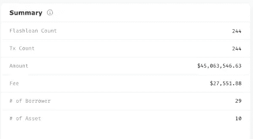
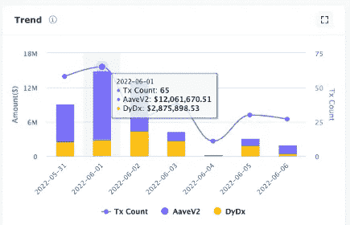
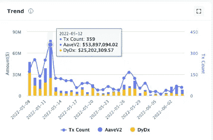
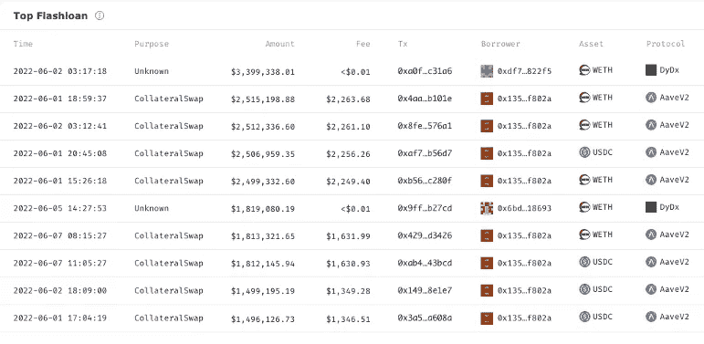
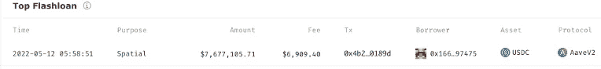
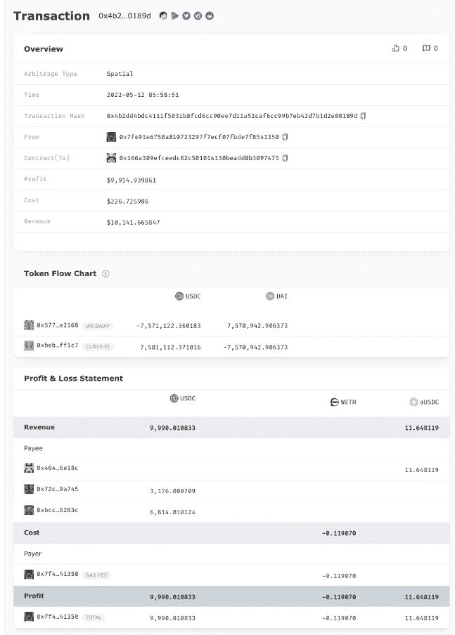
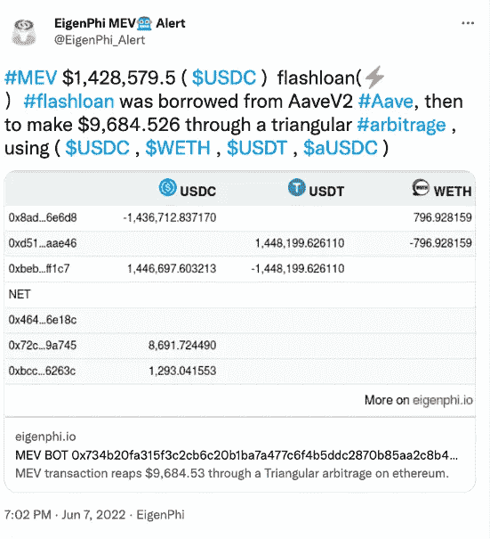
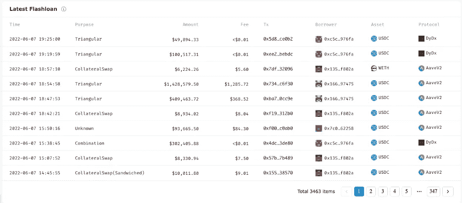
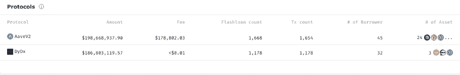

# 为了避免遭受超过 3.08 亿美元的损失，从跨越数据鸿沟开始

> 原文：<https://medium.com/coinmonks/to-avoid-suffering-over-308m-loss-start-from-crossing-the-data-gap-f1e1ba950508?source=collection_archive---------20----------------------->

Photo by [Zuza Gałczyńska](https://unsplash.com/@zgalczynska) on [Unsplash](https://unsplash.com/)

关键要点:

●闪贷是德菲世界最锋利的双刃剑。

●为了抑制其丑陋的一面，公众必须清楚地了解其交易以及与其他 DeFi 业务的联系，由于协议之间的数据差距，这一点更难实现。

● EigenPhi 的闪贷模块弥合了数据鸿沟，揭示了闪贷利益相关者的行为。

2022 年 4 月 30 日，[马鞍金融](https://rekt.news/saddle-finance-rekt2/)，1100 万美元。

2022 年 4 月 30 日，[费拉里](https://rekt.news/fei-rari-rekt/)，8000 万美元。

2022 年 4 月 28 日，[德乌斯财经](https://twitter.com/DeusDao/status/1519574219419496449)，1340 万美元

2022 年 4 月 17 日，[豆茎](https://rekt.news/beanstalk-rekt/)，1.82 亿美元，迄今为止同类作品中最大的。

2022 年 4 月 13 日[，大象金钱](https://rekt.news/elephant-money-rekt/)，2220 万美元。

仅在 4 月份就造成了 3.086 亿美元的总损失，所有这些对 DeFi 协议的攻击都有相同的作案手法。

据《华尔街日报》报道，对豆茎的攻击有一个独特的优势。

> 一笔 10 亿美元的贷款被借出，没有抵押，没有收入证明，也没有身份验证。贷款必须在不到一秒钟的时间内偿还，但这是窃取数千万美元所需的全部。

是的，是闪贷——一种基于加密货币的廉价、即时和匿名融资形式——导致了如此巨大的损失。

闪贷最大的资金来源， [AAVE 暗示](/aave/sneak-peek-at-flash-loans-f2b28a394d62)其目的是建立“一个更具弹性的生态系统，以应对清算”:

> 通过消除持有任何资本的需要，我们的目标是使清算市场民主化，并使清算更快更容易。整个生态系统的安全性会更好，“坏账”的风险会低得多。

一看到闪贷的丑陋，被告知背后的善良之心，如何才能发现它是一个怎样的坏蛋，以防止后来的恶意？我们需要跨越不同协议之间的数据鸿沟来实现这一目标。这些差距阻碍了 DeFi 用户认识到风险，并阻碍了市场产生和传播有效信号。

欢迎来到[eigen phi 发布的闪贷模块](https://eigenphi.io/ethereum/flashloan)，这是**建立在一个连贯统一的数据模型上，通过整合多维度的信息来帮助你弥合数据鸿沟。**

让我们开始吧。

## 揭开大画面

首先，你可以阅读所选时间范围内的趋势，1 天，7 天，或 30 天。我们将使用 7 天作为以下内容的背景。

摘要部分告诉你，在过去的 7 天里发生了 244 笔快速贷款。我们还显示了有多少交易嵌入了这些快速贷款。有时候，一笔交易可以有不止一笔闪贷。

244 笔快速贷款的总额以及实施这些贷款所需的费用也可以在这里找到，其中涉及 29 个借款人和 10 项资产。

下图说明了过去 7 天的趋势，显示了按 Aave v2 和 dYdX 划分的每日贷款额。6 月 1 日的条形图告诉我们，当天发生了 65 笔闪电贷款，Aave V2 公司超过 1200 万美元，dYdX 公司近 287.6 万美元。而最低的数据点发生在 6 月 4 日。

您可以将时间窗口切换到 30 天，以了解更全面的情况。

5 月 12 日，也就是 UST 脱钩和卢娜崩盘的日子，是闪电贷款金额和频率最高的一天。

## 通过交互式探索性分析发现隐藏的行为

我们再切换回 7 天，查查排名靠前的闪贷。

这里显示了有关交易的一些基本信息，包括时间、目的、金额、费用、交易地址、借款人地址、借出资产和贷款协议。

这里最重要的领域当然是目的。根据 AAVE 创始人的说法，您可以在以下用例中利用闪贷:

● [套利](https://eigenphi-1.gitbook.io/classroom/what-is-arbitrage)

●抵押品互换

●利率和货币互换

●自我[清算](https://eigenphi-1.gitbook.io/classroom/glossary/liquidation)

●利用聚合器

通常我们列出的目的都可以归结到这些案例上，我们把这里的数据和[套利扫描](https://eigenphi.io/)联系起来，画出更深入的图像。

以这个闪贷为例。

其目的是[空间](https://eigenphi-1.gitbook.io/classroom/arbitrage-types/spatial-arbitrage)套利。点击该行，您将被定向到[套利交易详情页面](https://eigenphi.io/ethereum/tx/0x4b2dd4bdc4111f5031b0fcd6cc90ee7d11a52caf6cc99b7eb42d7b1d2e00189d)，其中显示，同样的合约以 7475 结束，使用借出的$USDC 从 UNISWAP 购买$戴，并在 CURVE-FI 上与$USDC 进行交换，最终赚取了近$10K 作为利润。

本质上，我们的[闪贷模块](https://eigenphi.io/ethereum/flashloan)整合了碎片化的数据，揭露了掩盖的行为。

我们也向公众广播这样的行为，比如这个[推文提醒](https://twitter.com/EigenPhi_Alert/status/1534309753270190080)。

顶部闪贷部分之后是最新的闪贷部分。这就是现在以太坊上发生的实时闪贷。您还可以浏览感兴趣的页面，了解更多信息。

几个 DeFi 协议支持市场上的闪贷。EigenPhi 涵盖了目前主要使用的两种。我们向您显示金额，费用，快速贷款计数，交易计数，协议的借款人，以及它提供的资产。

这些功能关于闪贷只是一个开始。在接下来的几天中，您将能够检查协议的详细信息，如前 10 名资产、前几名目的地等。，具有同等水平的数据和信息交互和连接能力，所有这些都有利于您做出明智的投资决策。

敬请期待！

> 加入 Coinmonks [电报频道](https://t.me/coincodecap)和 [Youtube 频道](https://www.youtube.com/c/coinmonks/videos)了解加密交易和投资

跟随我们通过这些来挖掘更多隐藏的 DeFi 的智慧:

*   [EigenPhi 官方推特](https://twitter.com/eigenphi)
*   [EigenPhi MEV 提醒推特](https://twitter.com/eigenphi_alert)
*   [子堆栈](https://eigenphi.substack.com/)
*   [中等](/@eigenphi)
*   [Mirror.xyz](https://mirror.xyz/0xc19565163aFdEe3783FC970E4Bd0275B11848d34)
*   [电报](https://t.me/WisdomOfDeFi)
*   [不和](https://discord.com/invite/JXD8cyzR2a)
*   [Review](https://www.getrevue.co/profile/EigenPhi)