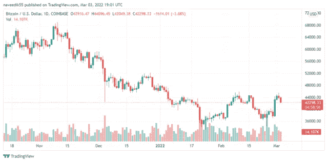

# 为了增加 NFT 的采用，FTX 交易所将组建一个专注于游戏的团队

> 原文：<https://medium.com/coinmonks/to-increase-nft-adoption-ftx-exchange-will-form-a-gaming-focused-team-d8666950d8d3?source=collection_archive---------70----------------------->

**Visit our website:-** [**https://bitcoinsupports.com/**](https://bitcoinsupports.com/)

为了增加比特币和 NFT 的广泛使用，FTX 加密货币交易所希望建立一个专门的团队来服务游戏发行商。一个新单元的加入将作为一个“加密即服务”平台，允许游戏开发者支持和开发游戏内 NFTs。

FTX 加密货币交易所的一名代表继续说道，“FTX 加密货币交易所的一名代表补充道，表达了他们采取这一行动的动机；

***“我们推出 FTX 游戏是因为我们认为游戏是一个激动人心的加密用例。全世界有超过 20 亿的游戏玩家玩过并收集了数字物品，现在他们也可以拥有这些物品了。"***

建立一个专注于游戏的团队将加速游戏行业基于区块链的新产品的开发。例如，GameStop 最近推出了 NFT 市场。

虽然在游戏功能中加入非功能性技术无疑有助于游戏开发商增加收入，但游戏玩家也表示希望区块链技术能够提供更好的体验。几个月前，粉丝对 NFT 电影节的愤怒促使其他公司提出了在 NFT 的项目。很自然，在说服许多其他 NFT 停止艺术家和社区之间的直接销售时，中介是主要对手，在这种情况下，玩家获得了附加值。在他们的声明中，反对者将球迷的反对作为停止 NFT 相关业务的一个原因。与此同时，很少有反对者强调这样一个事实，即有许多 NFTs 平台已经给它们分配了一个值，这是不确定的。

**Visit our website:-** [**https://bitcoinsupports.com/**](https://bitcoinsupports.com/)

另一方面，总部位于美国的 FTX 加密货币交易所总裁 Brett Harrison 认为，区块链技术可以集成到现有的游戏功能中，而不会损害用户体验。在一封电子邮件中，他补充道；

***“我认为这种反弹主要是因为对加密货币的关注将分散游戏工作室为游戏玩家创造最佳游戏的注意力。我们认为，区块链技术采用了现有游戏的功能，如头像、皮肤和游戏内奖励，并允许玩家在游戏外拥有、投资和交易这些物品。但让所有玩家享受游戏的乐趣，包括那些不希望参与这种经济的人，应该永远是主要目标，无论区块链科技是否参与其中。”作为提高收养率的努力的一部分，该平台还旨在与游戏开发商建立合作伙伴关系，以便让他们参与进来，从而加快文化领域的收养。FTX 最近建立了科切拉节 NFT 市场，在那里大量的海报，图片和终身通行证作为 NFT 提供。超级碗观众可能已经看到了它的广告，因为这个平台多年来一直在努力吸引足球迷的注意力。此外，在一轮融资中筹集了 4 亿美元后，加密交易所在 2022 年 1 月成为世界上最有价值的私人加密交易所。同样，它声称自己是交易量第三大的交易所。

由于加勒比海地区有利的加密法规，FTX 将其国际业务从香港迁至巴哈马。因此，请注意，游戏团队目前可通过 FTX 在美国的子公司获得。***

**访问我们的网站:-**[**https://bitcoinsupports.com/**](https://bitcoinsupports.com/)

**免责声明:以上为作者观点，不应视为投资建议。读者应该自己做研究。**

> *加入 Coinmonks* [*电报频道*](https://t.me/coincodecap) *和* [*Youtube 频道*](https://www.youtube.com/c/coinmonks/videos) *了解加密交易和投资*

# 另外，阅读

*   [3 商业评论](/coinmonks/3commas-review-an-excellent-crypto-trading-bot-2020-1313a58bec92) | [Pionex 评论](https://coincodecap.com/pionex-review-exchange-with-crypto-trading-bot) | [Coinrule 评论](/coinmonks/coinrule-review-2021-a-beginner-friendly-crypto-trading-bot-daf0504848ba)
*   [莱杰 vs n rave](/coinmonks/ledger-vs-ngrave-zero-7e40f0c1d694)|[莱杰 nano s vs x](/coinmonks/ledger-nano-s-vs-x-battery-hardware-price-storage-59a6663fe3b0) | [币安评论](/coinmonks/binance-review-ee10d3bf3b6e)
*   [Bybit Exchange 审查](/coinmonks/bybit-exchange-review-dbd570019b71) | [Bityard 审查](https://coincodecap.com/bityard-reivew) | [Jet-Bot 审查](https://coincodecap.com/jet-bot-review)
*   [3 commas vs crypto hopper](/coinmonks/3commas-vs-pionex-vs-cryptohopper-best-crypto-bot-6a98d2baa203)|[赚取加密利息](/coinmonks/earn-crypto-interest-b10b810fdda3)
*   最好的比特币[硬件钱包](/coinmonks/hardware-wallets-dfa1211730c6) | [BitBox02 回顾](/coinmonks/bitbox02-review-your-swiss-bitcoin-hardware-wallet-c36c88fff29)
*   [BlockFi vs 摄氏度](/coinmonks/blockfi-vs-celsius-vs-hodlnaut-8a1cc8c26630) | [Hodlnaut 审核](/coinmonks/hodlnaut-review-best-way-to-hodl-is-to-earn-interest-on-your-bitcoin-6658a8c19edf) | [KuCoin 审核](https://coincodecap.com/kucoin-review)