# 要真正理解 NFTs，你需要理解数字世界

> 原文：<https://medium.com/coinmonks/to-really-understand-nfts-you-need-to-understand-the-digital-world-eaef27c60c8a?source=collection_archive---------42----------------------->

尽管今天我们几乎把数字世界和现实世界分开对待，但这种区别将变得越来越不明显。

看看下面这个标题:

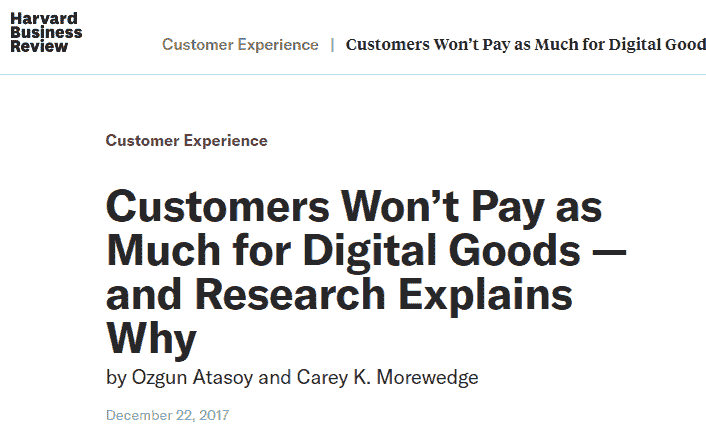

它基于 2017 年发表的一项研究。作者表示:*“尽管数字产品有许多优势，但研究表明，在许多情况下，人们愿意为实物产品支付更多的钱。在这篇文章中，作者描述了最近的一项研究，该研究发现，客户往往感觉不到他们实际上拥有数字产品，这导致他们认为数字产品不如实物产品有价值。*

再读一遍那句话。(……)*顾客往往就是感觉不到他们实际上拥有了***”的数字商品。**

*嗯……如果我们有一种技术，能让我们有一种真正拥有数字商品的感觉，会怎么样？这正是 NFT 现在正在做的事情。*

*年轻人已经开始重视数码产品，比如皮肤或者 Roblox 或堡垒之夜等游戏中的物品。问问你的儿子或女儿就知道了。他们是在一个虚拟世界中长大的，他们在虚拟世界中的衣服和他们在现实世界中的衣服一样有意义。*

*不仅仅是年轻人，很多人都会因为失去 Twitter、抖音、Instagram 或 LinkedIn 账户而丧命。它们就像是我们自身的延伸。他们就是虚拟世界中的我们自己。而 NFT 更看重这一点。非功能性数码产品增强了我们的主人翁意识，以及我们可以用这些数码产品做什么的可能性。*

*虚拟世界和现实世界将成为一体。*

*迪士尼前首席执行官 Bob Iger 表示:*

*“我们忘记了，在我们这一代，事物不一定是物质的。它们可以是数字的，对人们有意义。只要这种意义能够在区块链中得到本质上的证实，我认为你将会看到在非功能性交易中创造、交易和收集的事物的爆炸式增长。”*

*在未来几年，我们应该会看到用户和品牌对 NFT 的看法发生变化。今天，它们被视为独立的类别或产品。同样，电子商务和数字营销曾经是商业和营销的两个独立类别。NFT 将越来越多地被整合到现有的结构、产品和网络中，而不仅仅被视为独立的类别。这将是大规模采用的另一个驱动因素。*

***气泡和堆积物***

*我们现在是不是生活在一个非金融资产泡沫中？那很有可能。今天的 NFT 就像 1998 年的互联网。*

*另外重要的一点是:*

*99%的收藏和项目都有可能死掉。这很正常。我们经历了一次互联网大崩溃，但互联网作为一项革命性的技术继续存在，并彻底改变了我们的生活。同样，99%的首批手机游戏都没能存活下来。但它们是创造市场所必需的。*

*这就是为什么不要把所有的钱都投入到一个项目或进行交易是很重要的。在投资任何新系列之前，一定要做大量的研究。不要被情绪或影响者的话冲昏头脑。*

*但无论如何，事实是:这个行业正在吸引一些世界上最具创造力和技术含量的建筑商。这是一个必然的市场。我们是来帮助建造它的。*

***你还不算太迟***

*在我们谈论证书之前，我们想留下一个信息。这是 2016 年出版的《不可避免》一书的节选，作者是我们最喜欢的作家之一凯文·凯利——你可能已经注意到我们公司的名字是为了向这本书致敬。*

*凯利谈论互联网的起源。我们经常想回到一切都在建造的时候。*

*好消息:你还不算太晚。*

**“你能想象在 1985 年互联网刚刚出现的时候，作为一名雄心勃勃的企业家有多棒吗？那时，你想要的几乎任何网络公司的名字都有。你所要做的只是简单地要一个你想要的。一个单词的域名，普通的名字——它们都是可用的。它甚至不需要任何费用来索赔。这一重大机遇多年来一直存在。1994 年，一位连线作家注意到 mcdonalds.com 的***仍然无人认领，于是在我的鼓励下他注册了它。然后，他试图把它给麦当劳，但没有成功，但该公司对互联网的无知是如此滑稽(“点什么？”)这个故事成了我们在《连线》杂志上发表的著名故事。***

***当时，互联网是一个开放的前沿领域。在你选择的任何类别中成为第一名都很容易。消费者的期望值很低，壁垒也非常低。启动搜索引擎！做第一个开网店的！提供业余视频！当然，那是当时。现在回想起来，似乎一波又一波的定居者已经推平并开发了每一个可能的场地，只给今天的新来者留下了最困难和粗糙的斑点。三十年后，互联网上充斥着应用、平台、设备和足够多的内容，需要我们在接下来的一百万年里关注。即使你能设法挤进另一个微小的创新，谁会在我们奇迹般的丰富中注意到它呢？***

***但是，但是。。。事情是这样的。互联网方面，还什么都没发生！互联网还处于起步阶段。它只是变得。如果我们可以爬进时间机器，穿越 30 年后的未来，从那个有利位置回顾今天，我们会意识到，2050 年影响公民生活的大多数最伟大的产品直到 2016 年后才被发明出来。未来的人们会看着他们的全息甲板、可佩戴的虚拟现实隐形眼镜、可下载的虚拟形象和人工智能界面，然后说，“哦，你真的没有互联网”——或者不管他们怎么称呼它——“那时候。”***

***他们是对的。因为从我们现在的角度来看，本世纪上半叶最伟大的在线事物都在我们面前。所有这些奇迹般的发明都在等待那个疯狂的、没人告诉过我这是不可能的幻想家开始攫取低垂的果实——相当于 1984 年的网络公司名称。***

***因为 2050 年的老人们会告诉你另一件事:你能想象在 2016 年成为一名创新者有多棒吗？这是一个完全开放的前沿！你可以选择几乎任何类别，添加一些人工智能，把它放在云上。很少有设备内置一两个以上的传感器，不像现在的数百个。期望值和障碍都很低。成为第一个很容易。然后他们会叹息。“哦，要是我们意识到那时一切是多么可能就好了！”***

***所以，事实是:现在，也就是 2016 年的今天，是创业的最佳时机。在整个世界历史上，从来没有一个更好的日子来发明东西。从未有过比现在更好的时机，有更多的机会、更多的机会、更低的壁垒、更高的收益/风险比、更好的回报、更大的上升空间。此时此刻。这是一个未来的人们回首往事时会说，“哦，那时候还活着，还好好的！”过去的 30 年创造了一个不可思议的起点，一个建立真正伟大事业的坚实平台。但即将到来的将是不同的，超越的，和其他的。我们要制造的东西会不断地、无情地变成别的东西。最酷的东西还没有被发明出来。***

**今天确实是一个开放的前沿。我们都在变得。这是人类历史上开始的最好时机。你没有迟到。”**

****创建元掩码钱包****

**你还记得第 3 课我们谈到的 NFTs 生态系统吗？在那里，我们讨论了 Metamask，一个基于以太坊区块链与应用程序交互的钱包。要创建您的证书，您需要创建一个钱包。别担心，只需要几分钟，而且完全免费。**

****步骤 1 —下载元掩码扩展****

**第一步是将元掩码扩展添加到您的浏览器中。**

**如果你使用的是移动设备，你需要在 App Store 或谷歌 Play 商店上下载 MetaMask 应用。**

****当你安装 Metamask 手机应用程序时，在侧边菜单上寻找“浏览器”选项，并使用它来访问**[**NFC . accessible . studio**](https://inevitable.lt.acemlna.com/Prod/link-tracker?redirectUrl=aHR0cHMlM0ElMkYlMkZuZmMuaW5ldml0YWJsZS5zdHVkaW8lM0Z1dG1fc291cmNlJTNEQWN0aXZlQ2FtcGFpZ24lMjZ1dG1fbWVkaXVtJTNEZW1haWwlMjZ1dG1fY29udGVudCUzRDV0aCUyQkxlc3NvbiUyNTNBJTJCVGhlJTJCRnV0dXJlJTJCb2YlMkJORlRzJTJCJTI1MkIlMkJZb3VyJTJCQ2VydGlmaWNhdGUlMjZ1dG1fY2FtcGFpZ24lM0REYXklMkIx&sig=9ENdZpomDtdiCMpZuTMmEy67pD8HzWBCUj7f7XB6LFMb&iat=1648022850&a=%7C%7C611818266%7C%7C&account=inevitable%2Eactivehosted%2Ecom&email=uQLwTufj7Ml62fkqpgOfnUzkASpiHornD%2Fz2wZTd1jg%3D&s=eb97f19c1bb48dc2b6f82bf6a2ea5239&i=18A20A2A354)**

**在本指南中，我们将在浏览器扩展上创建一个元掩码钱包。**

**访问[https://metamask.io/](https://inevitable.lt.acemlna.com/Prod/link-tracker?redirectUrl=aHR0cHMlM0ElMkYlMkZtZXRhbWFzay5pbyUyRiUzRnV0bV9zb3VyY2UlM0RBY3RpdmVDYW1wYWlnbiUyNnV0bV9tZWRpdW0lM0RlbWFpbCUyNnV0bV9jb250ZW50JTNENXRoJTJCTGVzc29uJTI1M0ElMkJUaGUlMkJGdXR1cmUlMkJvZiUyQk5GVHMlMkIlMjUyQiUyQllvdXIlMkJDZXJ0aWZpY2F0ZSUyNnV0bV9jYW1wYWlnbiUzRERheSUyQjE=&sig=GzotBiUGTgJ9RJuKHmZQPMVHiQxRtXj3Kv4EcCHUi31P&iat=1648022850&a=%7C%7C611818266%7C%7C&account=inevitable%2Eactivehosted%2Ecom&email=uQLwTufj7Ml62fkqpgOfnUzkASpiHornD%2Fz2wZTd1jg%3D&s=eb97f19c1bb48dc2b6f82bf6a2ea5239&i=18A20A2A353)并点击**下载**在你的浏览器上安装 Metamask 扩展。**

**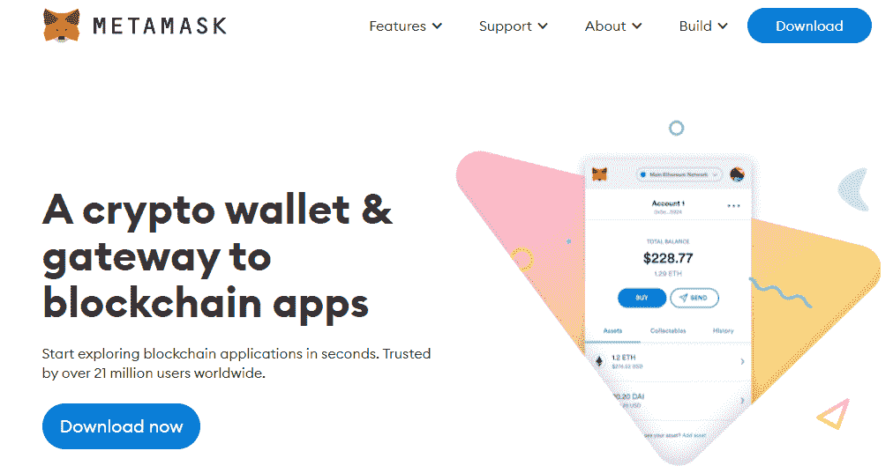****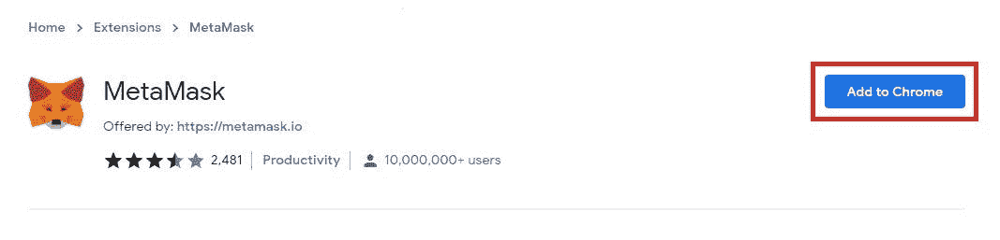**

****步骤 2 —打开元掩码扩展****

**单击浏览器中的元掩码扩展。**

**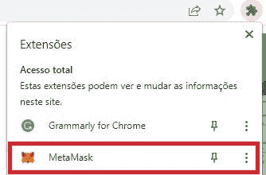**

**在 Chrome 中，点击**拼图图标**。这将打开您的扩展。您可以在那里找到元掩码扩展。
要打开扩展，点击元掩码，然后点击扩展本身。这将打开一个新标签。
您也可以将元掩码添加到工具栏中:单击大头针图标。**

****步骤 3——创建元蒙版****

**单击元掩码图标后，您将被带到“欢迎使用元掩码”页面。**

**点击**开始**按钮。**

**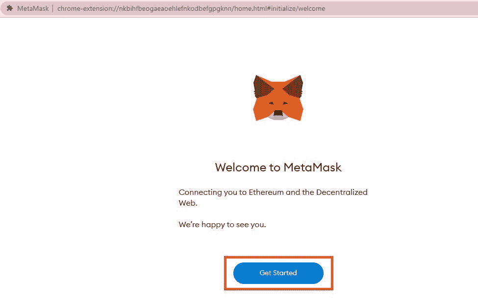**

****第 4 步——创建您的钱包****

**在下一个屏幕上，点击“**创建钱包”**。然后，点击**“同意”。****

**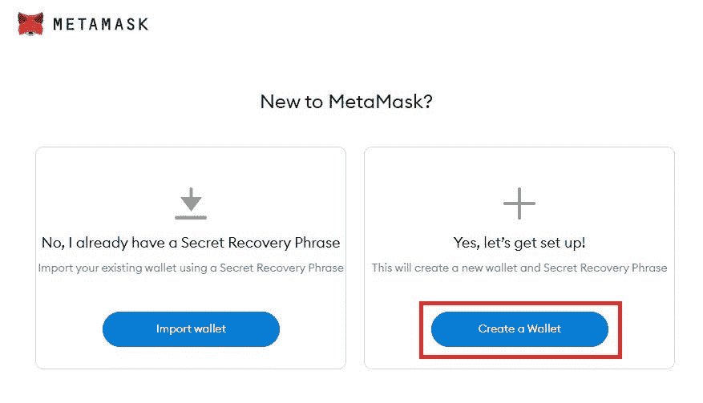**

****步骤 5 —创建密码****

**在下一个屏幕上，创建密码，阅读并同意使用条款，然后点击**“创建”。****

**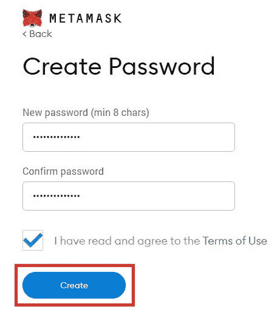**

****第 6 步—存储您的秘密恢复短语****

**现在，这里有很多关注。**

**您的机密备份短语允许您导入元掩码钱包。**

**不要向任何人展示你的秘密恢复短语。使用您的短语的用户可以登录您的帐户并取走您的资金。**

**点击锁图标显示您的短语，并将其保存在一个安全的地方。遵循 Metamask 自己的安全提示，例如在纸上或在 1Password 等应用程序中做笔记，可能是一个不错的开始。**

**透露您的短语并妥善保管后，点击**下一步**。**

**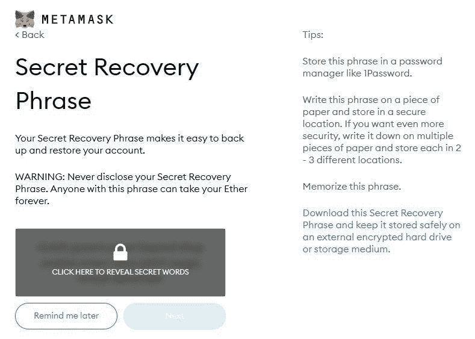**

****第七步——确认你的秘密短语****

**当您进入下一个屏幕时，您将看到您的恢复短语中的单词以混乱的顺序排列。**

**为了确保你的备份短语是正确的，你需要以正确的顺序选择每个单词。**

**例如，如果备份短语的前三个单词是“离合器”、“管理”和“铺设”，请分别单击“离合器”、“管理”和“铺设”。**

**一旦你以正确的顺序选择了每个单词，点击“**确认**以确保你的恢复短语是正确的。**

**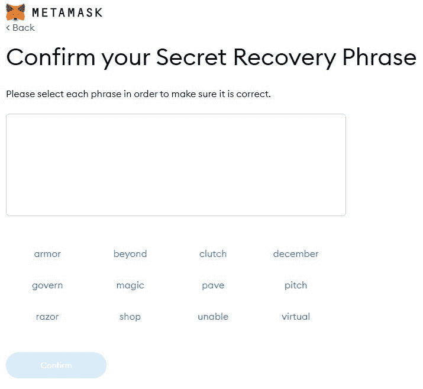**

**搞定了。在下一个屏幕中，只需点击**“全部完成”**，现在您就拥有了一个 Metamask 钱包！**

**一些重要的提示:
- >永远不要和任何人分享你的恢复短语。
- >将你的备份短语存放在多个地方。
- >如果您丢失了备份短语，MetaMask 将无法为您恢复。**

**在下一个屏幕上，您将能够看到您的**地址**和您钱包的**余额**。**

**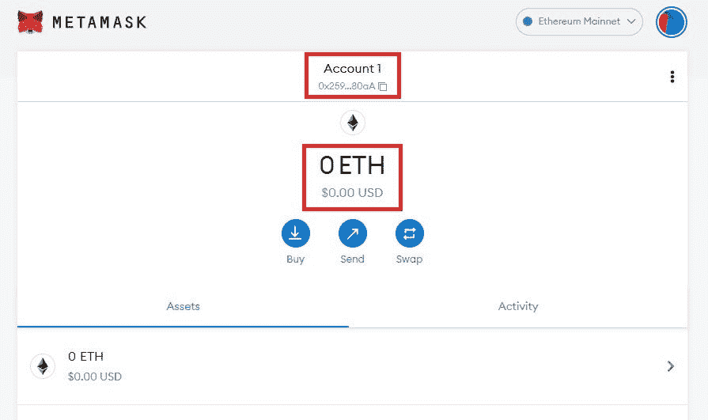**

****制作您的证书****

**现在你有了一个 Metamask 钱包，是时候铸造你的证书了！点击下面的按钮进入我们的网站[https://NFC . accessible . studio](https://inevitable.lt.acemlna.com/Prod/link-tracker?redirectUrl=aHR0cHMlM0ElMkYlMkZuZmMuaW5ldml0YWJsZS5zdHVkaW8lM0Z1dG1fc291cmNlJTNEQWN0aXZlQ2FtcGFpZ24lMjZ1dG1fbWVkaXVtJTNEZW1haWwlMjZ1dG1fY29udGVudCUzRDV0aCUyQkxlc3NvbiUyNTNBJTJCVGhlJTJCRnV0dXJlJTJCb2YlMkJORlRzJTJCJTI1MkIlMkJZb3VyJTJCQ2VydGlmaWNhdGUlMjZ1dG1fY2FtcGFpZ24lM0REYXklMkIx&sig=9ENdZpomDtdiCMpZuTMmEy67pD8HzWBCUj7f7XB6LFMb&iat=1648022850&a=%7C%7C611818266%7C%7C&account=inevitable%2Eactivehosted%2Ecom&email=uQLwTufj7Ml62fkqpgOfnUzkASpiHornD%2Fz2wZTd1jg%3D&s=eb97f19c1bb48dc2b6f82bf6a2ea5239&i=18A20A2A354)。**

**[**点击此处铸造您的证书**](https://inevitable.lt.acemlna.com/Prod/link-tracker?redirectUrl=aHR0cHMlM0ElMkYlMkZuZmMuaW5ldml0YWJsZS5zdHVkaW8lM0Z1dG1fc291cmNlJTNEQWN0aXZlQ2FtcGFpZ24lMjZ1dG1fbWVkaXVtJTNEZW1haWwlMjZ1dG1fY29udGVudCUzRDV0aCUyQkxlc3NvbiUyNTNBJTJCVGhlJTJCRnV0dXJlJTJCb2YlMkJORlRzJTJCJTI1MkIlMkJZb3VyJTJCQ2VydGlmaWNhdGUlMjZ1dG1fY2FtcGFpZ24lM0REYXklMkIx&sig=9ENdZpomDtdiCMpZuTMmEy67pD8HzWBCUj7f7XB6LFMb&iat=1648022850&a=%7C%7C611818266%7C%7C&account=inevitable%2Eactivehosted%2Ecom&email=uQLwTufj7Ml62fkqpgOfnUzkASpiHornD%2Fz2wZTd1jg%3D&s=eb97f19c1bb48dc2b6f82bf6a2ea5239&i=18A20A2A354)**

****第一步——连接钱包****

**第一步是将您的钱包连接到我们的网站，这样我们的技术就知道应该将证书发送到哪个地址。点击**“连接”。****

**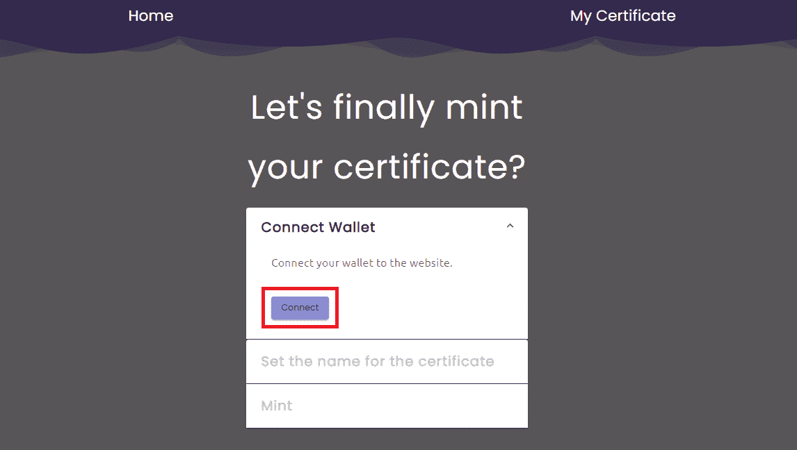**

****步骤 2 —确认连接****

**然后，在你的元蒙版中，点击**“连接”**，如下图。**

**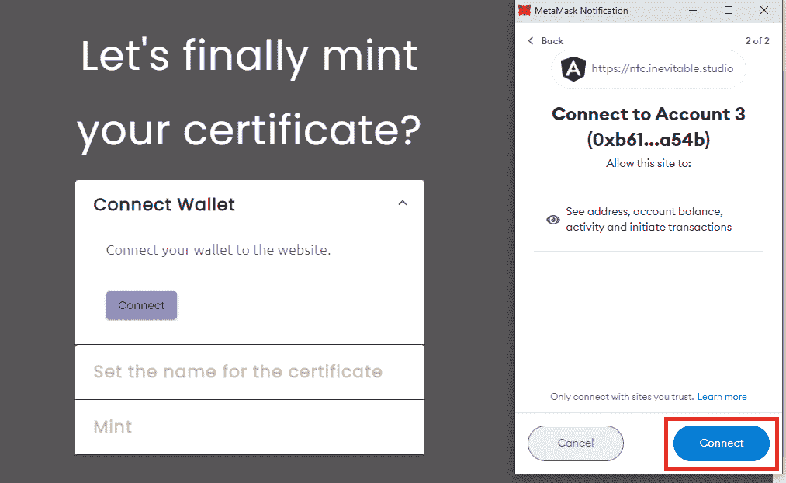**

****第 3 步—为您的证书设置名称****

**写下您希望出现在证书上的姓名，然后点击**“设置姓名”**。**

**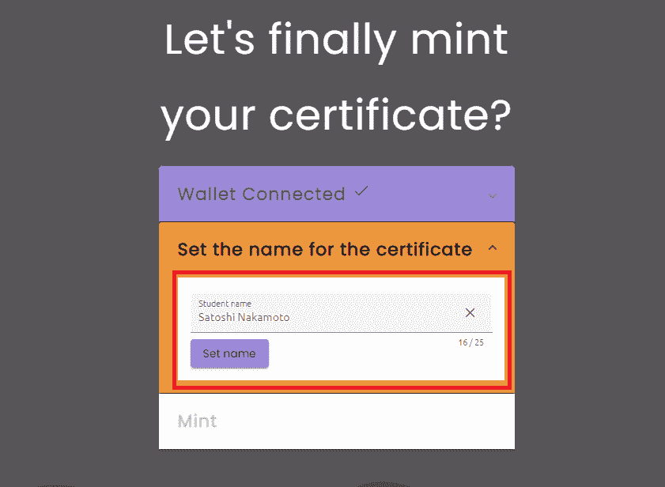**

****步骤 4 —薄荷****

**检查名称是否正确。证书生成后就不能再更改了。如果一切正确，点击**“Mint”**。**

**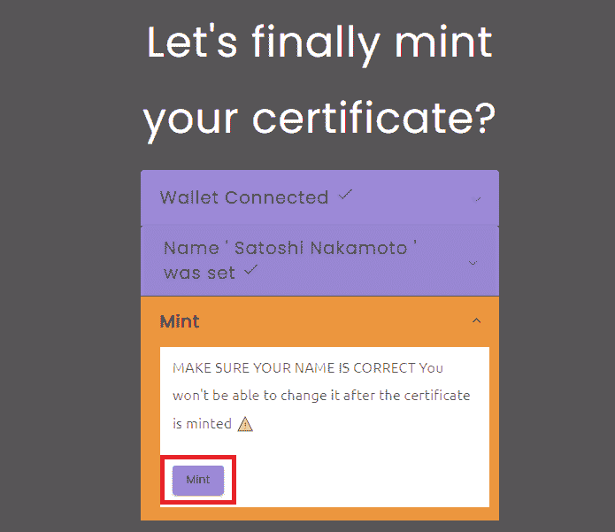**

****第五步——签署交易****

**您的元掩码将再次打开，并要求您在交易上签名。点击**“标志”**。**

**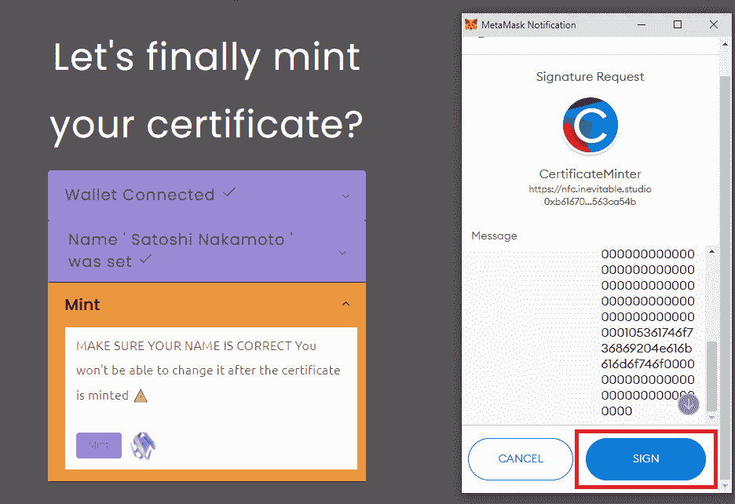**

**…**

> **加入 Coinmonks [电报频道](https://t.me/coincodecap)和 [Youtube 频道](https://www.youtube.com/c/coinmonks/videos)了解加密交易和投资**

# **另外，阅读**

*   **[南非的加密交易所](https://coincodecap.com/crypto-exchanges-in-south-africa) | [BitMEX 加密信号](https://coincodecap.com/bitmex-crypto-signals)**
*   **如何在 WazirX 上购买柴犬(SHIB)硬币？**
*   **[MoonXBT 副本交易](https://coincodecap.com/moonxbt-copy-trading) | [阿联酋的加密钱包](https://coincodecap.com/crypto-wallets-in-uae)**
*   **[MoonXBT vs Bybit vs 币安](https://coincodecap.com/bybit-binance-moonxbt) | [硬件钱包](/coinmonks/hardware-wallets-dfa1211730c6)**
*   **[雷米塔诺评论](https://coincodecap.com/remitano-review)|[1 英寸协议指南](https://coincodecap.com/1inch)**
*   **[十大最佳加密货币博客](https://coincodecap.com/best-cryptocurrency-blogs) | [YouHodler 评论](https://coincodecap.com/youhodler-review)**
*   **[KuCoin vs 币安](https://coincodecap.com/kucoin-vs-binance) | [Bitrue 点评](https://coincodecap.com/bitrue-review) | [Jet-Bot 点评](https://coincodecap.com/jet-bot-review)**