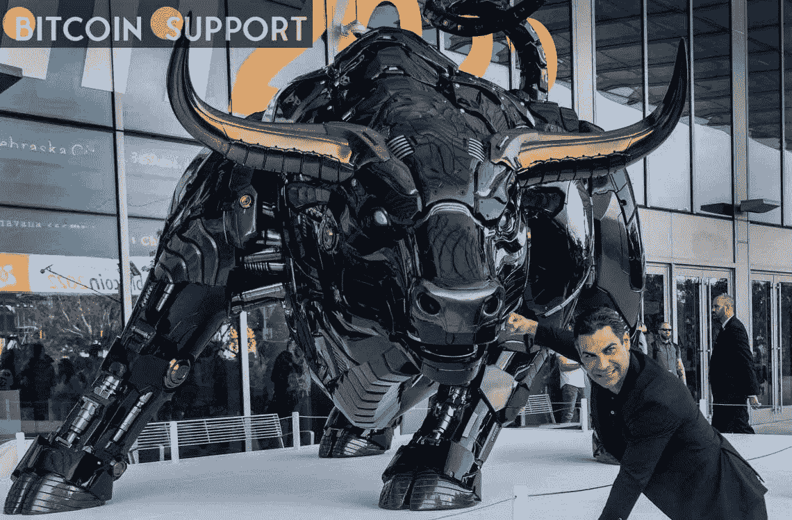

# 为了启动比特币 2022，市长揭幕了一座激光眼“迈阿密公牛”雕像

> 原文：<https://medium.com/coinmonks/to-start-off-bitcoin-2022-the-mayor-unveils-a-miami-bull-statue-with-laser-eyes-315aa3bddfc5?source=collection_archive---------37----------------------->

**Visit our website:-** [**https://bitcoinsupports.com/**](https://bitcoinsupports.com/)

比特币 2022 大会以市长弗朗西斯·苏亚雷斯(Francis Suarez)的话作为一个乐观的开端，他身着比特币礼服，并推出了迈阿密的华尔街充电公牛。

迈阿密市长弗朗西斯·苏亚雷斯(Francis Suarez)竖立了一座激光眼公牛雕像，以纪念比特币 2022 大会的开始，象征着迈阿密自称的“世界加密之都”的地位。根据官方网站，这座雕像是一只 3000 磅重的机器人模样的公牛，具有华尔街冲锋公牛的风格。佛罗里达州的金融公司 Tradestation 委托制作了这座雕像。https://twitter.com/brucefenton/status/1511688954327834627

[它于 4 月 6 日在会议举行地迈阿密海滩会议中心展出，并立即被 Intelligencer 的怀疑者称为“对上帝的犯罪”。另一方面，加密社区已经看到了金融未来的新标志。4 月 7 日，Morgan Creek Digital 的联合创始人安东尼·庞普利亚诺(Anthony“Pomp”Pomp liano)在推特上写道:“多头在控制局面。”币安的创始人兼首席执行官 CZ 在推特上说这头公牛“非常酷”](https://twitter.com/brucefenton/status/1511688954327834627) [https://twitter.com/cz_binance/status/1511875614713733122](https://twitter.com/cz_binance/status/1511875614713733122)

这头公牛将迎接计划参加今年会议的 3 万名观众，随后在活动结束后被送往迈阿密戴德学院的牧场。从 4 月 6 日到 9 日，会议将持续四天。

大会分为五个阶段，最大阶段可容纳 15000 人。活动以 Pomp 和 Galaxy Digital 首席执行官 Mike Novogratz 的炉边谈话开始，然后是比特币社区偶像 Nick Szabo、Jameson Lopp、Dan Held 和其他人的聊天。PayPal 创始人彼得·泰尔、NFL 球星小奥德尔·贝汉姆和 MicroStrategy 首席执行官迈克尔·塞勒也是演讲嘉宾。萨尔瓦多总统 Nayib Bukele 在最后一刻退出了峰会。布克勒总统正在应对他的国家爆发的帮派暴力事件，这导致了紧急状态的实施，暂停了关键的公民自由，引起了人权组织的担忧。根据比特币 2022 Twitter 账户 4 月 7 日的一条推文，布克勒在给会议代表的一封信中提到了“不可预见的情况”。

[https://Twitter . com/TheBitcoinConf/status/1511751005377073154](https://twitter.com/TheBitcoinConf/status/1511751005377073154)

布科勒在去年的比特币 2021 大会(Bitcoin 2021 conference)上透露了他要让比特币(BTC)在自己的国家成为法定现金的雄心，该大会也在迈阿密举行。尽管今年开局强劲，但市场已经转向看跌，根据统计数据，比特币本周下跌 6.26%，过去 24 小时下跌 4.37%，至每周低点 43，401 美元。

**访问我们的网站:-**[**https://bitcoinsupports.com/**](https://bitcoinsupports.com/)

**免责声明:以上为作者观点，不应视为投资建议。读者应该自己做研究。**

> 加入 Coinmonks [电报频道](https://t.me/coincodecap)和 [Youtube 频道](https://www.youtube.com/c/coinmonks/videos)了解加密交易和投资

# 另外，阅读

*   [如何开始用加密贷款赚取被动收入](https://coincodecap.com/passive-income-crypto-lending)
*   [加密货币储蓄账户](/coinmonks/cryptocurrency-savings-accounts-be3bc0feffbf) | [加密交易机器人](https://coincodecap.com/best-crypto-trading-bots)
*   [BigONE 交易所评论](/coinmonks/bigone-exchange-review-64705d85a1d4) | [CEX。IO 审查](https://coincodecap.com/cex-io-review) | [交换区审查](/coinmonks/swapzone-review-crypto-exchange-data-aggregator-e0ad78e55ed7)
*   [最佳比特币保证金交易](/coinmonks/bitcoin-margin-trading-exchange-bcbfcbf7b8e3) | [比特币保证金交易](https://coincodecap.com/bityard-margin-trading)