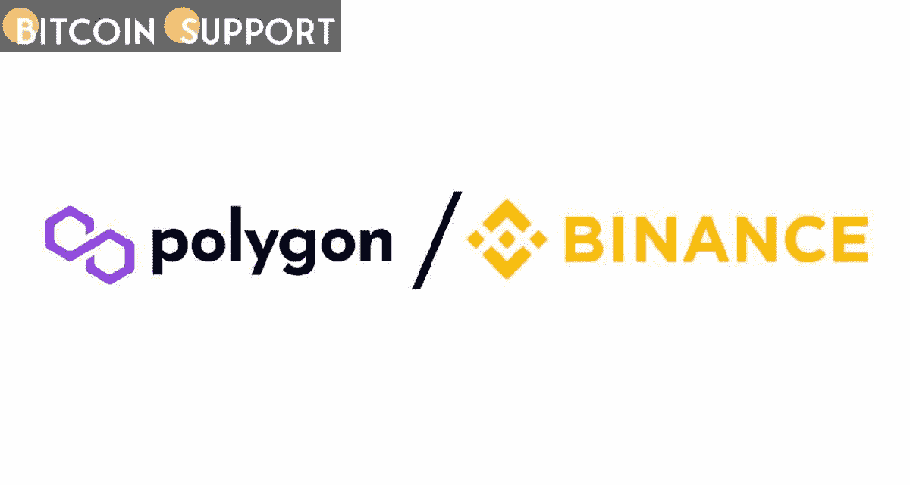

# 为了同步节点，币安暂时停止了多边形的存取

> 原文：<https://medium.com/coinmonks/to-sync-nodes-binance-has-momentarily-halted-polygon-deposit-and-withdrawal-e45b9903e468?source=collection_archive---------60----------------------->

**Visit our website:-** [**https://bitcoinsupports.com/**](https://bitcoinsupports.com/)

根据 Polygon 的说法，币安的暂时停止是为了在错误问题得到纠正和网络保持稳定后升级和同步节点。全球交易量最大的加密交易所币安周二早些时候表示，Polygon (MATIC)网络上的存款和取款将暂时停止。

这一声明是在 Polygon 网络由于网络升级而于 3 月 11 日关闭后发布的。密码交易所表示，一旦网络稳定下来，它将恢复存款和取款服务。

Polygon Network 是一个二层以太坊扩展解决方案，拥有不断增长的生态系统和数百万用户。3 月 11 日，网络在三层中的一层进行了一次关键升级，但由于一个可疑缺陷，三层在升级后无法达成共识，导致停机。

根据 Polygon 开发者在 Twitter 上的账号，bug 已经修复，网络稳定。币安目前正在升级其节点和同步数据，这就是为什么会有短暂的停顿。

[https://Twitter . com/0x polygondevs/status/1503626645361815556](https://twitter.com/0xPolygonDevs/status/1503626645361815556)

多边形网络分为三个层次，各有其功能。以太坊层管理智能合约，而 Bor 层帮助生成块。断层位于海姆达尔层的第三层。

由于可能出现的问题，各种 Heimdall 验证器位于链的不同版本上，阻止了达成 2/3 的共识。虽然几个小时的停机时间是预料之中的，Polygon 团队也得到通知，但 11 小时的停机时间成为许多项目和交易商焦虑的根源。

在一家安全合作伙伴发现了一个可能使 240 亿美元现金面临风险的漏洞后，Polygon Network 于 2021 年 12 月纠正了另一个升级缺陷。根据最近的 Polygonscan 统计，网络已经开始产生及时的块，并且该团队已经保证网络错误已经被解决。

**访问我们的网站:-**[**https://bitcoinsupports.com/**](https://bitcoinsupports.com/)

**免责声明:以上为作者观点，不应视为投资建议。读者应该自己做研究。**

> 加入 Coinmonks [电报频道](https://t.me/coincodecap)和 [Youtube 频道](https://www.youtube.com/c/coinmonks/videos)了解加密交易和投资

# 另外，阅读

*   如何在 Uniswap 上交换加密？ | [A-Ads 审查](https://coincodecap.com/a-ads-review)
*   [加密货币储蓄账户](/coinmonks/cryptocurrency-savings-accounts-be3bc0feffbf) | [YoBit 审核](/coinmonks/yobit-review-175464162c62)
*   [Botsfolio vs nap bots vs Mudrex](/coinmonks/botsfolio-vs-napbots-vs-mudrex-c81344970c02)|[gate . io 交流回顾](/coinmonks/gate-io-exchange-review-61bf87b7078f)
*   [CoinFLEX 评论](https://coincodecap.com/coinflex-review) | [AEX 交易所评论](https://coincodecap.com/aex-exchange-review) | [UPbit 评论](https://coincodecap.com/upbit-review)
*   [AscendEx 保证金交易](https://coincodecap.com/ascendex-margin-trading) | [Bitfinex 赌注](https://coincodecap.com/bitfinex-staking) | [bitFlyer 点评](https://coincodecap.com/bitflyer-review)
*   [Bitget 回顾](https://coincodecap.com/bitget-review)|[Gemini vs block fi](https://coincodecap.com/gemini-vs-blockfi)cmd |[OKEx 期货交易](https://coincodecap.com/okex-futures-trading)
*   [AscendEx Staking](https://coincodecap.com/ascendex-staking)|[Bot Ocean Review](https://coincodecap.com/bot-ocean-review)|[最佳比特币钱包](https://coincodecap.com/bitcoin-wallets-india)