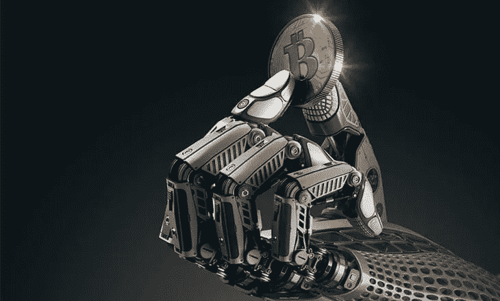
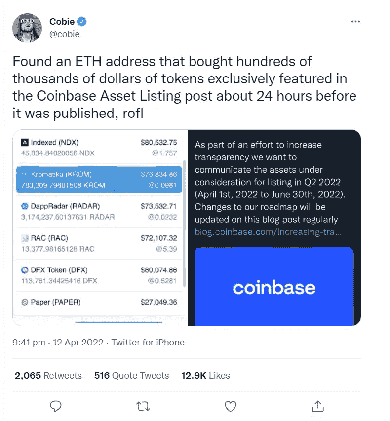

# 今天我们将学习赛跑。

> 原文：<https://medium.com/coinmonks/today-we-shall-learn-about-frontrunning-4d07e6978658?source=collection_archive---------33----------------------->

Frontrunning in crypto is very, very profitable.

想赚数百万的交易密码？

很好。

你不需要学习如何说唱或报名参加课程。

你需要学习跑在前面。

不，这不是一个新的跑酷技巧。

“在区块链平台上的前置操作是指在知道未来交易的情况下，将交易放入队列中的行为，根据未决交易下单以赚取利润。”

从严格意义上来说，这是不合法的，但在合法性和管辖权模糊的神秘国度，这种情况确实经常发生。

在这种情况下，乔丹·费什，又名科比，推特上的一个秘密名人，对比特币基地所谓的内幕交易投下了一颗炸弹。

比特币基地的平台拥有约 9000 万注册用户，是全球最大的加密交易所之一。

基本上，Cobie 发现一个 ETH 地址在比特币基地上线之前购买了数十万美元的令牌。

比特币基地正要发布关于即将在其平台上上市的新令牌列表的消息。

罪犯(可能有内部消息)在别人之前买了一卡车的代币。

“这是一个基于内部信息的赌注:在这种情况下，一种加密货币在比特币基地这样的主要交易所上市。由于比特币基地庞大的客户群提供了流动性，代币上市通常会推高其价格。”

当然，就像钟表一样，当代币在比特币基地上市时，它们的价格都上涨了。

罪犯在不到 24 小时内几乎奇迹般地获得了直接账面利润。

我敢打赌，人们正怀着极大的兴趣看着那个地址，看他/她是否兑现或转移到任何地方。

请不要把这个地址和比特币基地的任何人联系起来，否则会引起轩然大波。

How anyone discovers such thing is beyond me.

那么你怎么看待领跑呢？

听起来不公平？

这合法吗？

谁来监管这个？

对此，比特币基地将如何回答？

人们能想到这样的事情，真令人吃惊？

如果我告诉你这甚至发生在股票交易和内幕交易的传统金融中，会怎么样？

好吧，感谢现在所有这些都在区块链，有义务警员在那里搜寻，就像夜晚警惕的保护者。

他们是嗅出坏蛋的无名英雄。

利用直觉、深刻的道德感、强大的链上分析工具和一些脑细胞，他们跟踪区块链上的交易和运动，以连接这些点。

我深入了解了他们到底是如何做到的，坦率地说，这并不容易，也非常令人厌倦。

但是，赢得大奖并看到区块链上的点连接起来是非常有益和有趣的。

向现代义警脱帽致敬，他们做了他们该做的事，所以我们其他人可以感到更安全一点，更明智一点，学到更多一点。

哦，我写了这个几个月前，整个内特查斯顿惨败。在另一篇文章中会有更多的介绍。

-

你认为比特币基地正在发生内幕交易吗？

-

# startups # business # startupx # growth # success # social media # culture # entrepreneur # strategy # eth #比特币#加密货币# NFT # getrich # branding # cobie # Jordan fish # front running # coin base #义警#区块链

> 加入 Coinmonks [Telegram group](https://t.me/joinchat/Trz8jaxd6xEsBI4p) 并了解加密交易和投资