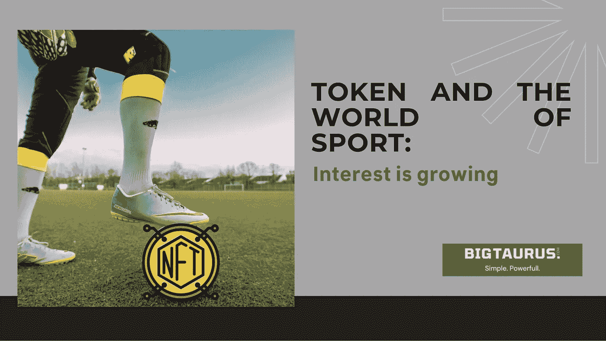

# 托肯和体育世界

> 原文：<https://medium.com/coinmonks/token-and-the-world-of-sport-22c967bc0b75?source=collection_archive---------45----------------------->

# 在体育界，人们对球迷代币和 NFT 的兴趣越来越大。

尼尔森集团进行的一项研究表明，10%的体育迷有兴趣购买加密代币来支持他们喜欢的球队、联赛或球员，8%的 T2 有兴趣参与球队或冠军的日常活动。心脏的。

对加密世界的兴趣当然也是过去两年中由加密货币或区块链公司签署的**体育赞助协议越来越多的结果。**

仅在 2021 年的前三个季度，十大加密公司就在体育赞助上投入了超过 2 亿欧元(来源:尼尔森体育赞助全球)。

目前业内最流行的两种数字资产类型是**粉丝代币**和 **NFTs /数字收藏品。**

**粉丝代币**是在区块链运营的数字资产，旨在让粉丝获得运动队提供的特定商品和服务。

因此，它是**公用代币**的一个“子类别”,保证购买代币的人获得一系列**优惠**。

事实上，通过购买球迷代币，球迷可以获得折扣、预订优惠、促销，并在购买比赛门票时获得优先权，会见当前或过去的运动员和球员，或获得商品折扣。

同时，它可以通过参与在相关平台上推广的调查，在团队管理和决策中发挥更积极的作用，表达对俱乐部或联盟决策的判断。

**NFTs /数字收藏品**是独特或稀有的照片、视频、音频和其他类型的文件，可转让但不可替换或复制，可能由单个个人拥有。对于球迷来说，拥有这些物品意味着有新的可能性来支持他们最喜欢的运动队，具有潜在的增长价值。

球迷最欣赏的 nft 是固有的，例如，奖杯、t 恤、鞋子，或者与事件、比赛或球员有关的壮观和激动人心的行动。

几天前，2022 年 6 月 20 日，意大利棒垒球联合会**发布了第一个官方代币，这是意大利乃至世界上第一个激活自己的荣誉俱乐部、向个人和公司开放的体育联合会，发布了新一代 NFT。**

FIBS 荣誉俱乐部记录了支持其价值观和活动的人和组织。

除了 fib，几个**足球队**已经通过推出他们自己的球迷代币进入了加密世界。

在与公司相关的粉丝代币方面，绝对领先的是 **PSG** ，即**巴黎圣日耳曼**粉丝代币，市值超过 4700 万美元。**城市**其次是**曼城** (40.4)和**马竞** (30.1)。

在意大利俱乐部中，排名第一(第五)的是**尤文图斯**，市值 2320 万美元。

**BigTaurus 还创造了** [**热那亚球迷令牌**](https://genoafantoken.com/) ，为在体育界传播对秘密世界的兴趣做出了贡献

尽管我们处于早期阶段，但加密货币在体育界的存在正在疯狂增长。

— -

# 您想创建自己的个性化令牌吗？

# 创建你自己的令牌是可能的和简单的，但它需要一些技术技能，对于一些难以学习的。

# 如果你不想浪费时间学习所有的程序，冒着犯错误和迷失在网络迷宫中的风险，BigTaurus 专家团队可以为你提供建议，解释你如何可以创建你的自定义令牌，并可以为你制作。

# 请立即联系我们寻求建议。

> 加入 Coinmonks [电报频道](https://t.me/coincodecap)和 [Youtube 频道](https://www.youtube.com/c/coinmonks/videos)了解加密交易和投资

# 另外，阅读

*   [SmithBot 评论](https://coincodecap.com/smithbot-review) | [4 款最佳免费开源交易机器人](https://coincodecap.com/free-open-source-trading-bots)
*   [比特币基地僵尸程序](/coinmonks/coinbase-bots-ac6359e897f3) | [AscendEX 审查](/coinmonks/ascendex-review-53e829cf75fa) | [OKEx 交易僵尸程序](/coinmonks/okex-trading-bots-234920f61e60)
*   [如何在印度购买比特币？](/coinmonks/buy-bitcoin-in-india-feb50ddfef94) | [瓦济克斯审查](/coinmonks/wazirx-review-5c811b074f5b)
*   [加密交易机器人](/coinmonks/crypto-trading-bot-c2ffce8acb2a) | [菜鸟评论](https://coincodecap.com/probit-review)
*   [隐翅虫替代品](/coinmonks/cryptohopper-alternatives-d67287b16d27) | [HitBTC 审查](/coinmonks/hitbtc-review-c5143c5d53c2)
*   [CBET 回顾](https://coincodecap.com/cbet-casino-review) | [库科恩 vs 比特币基地](https://coincodecap.com/kucoin-vs-coinbase)