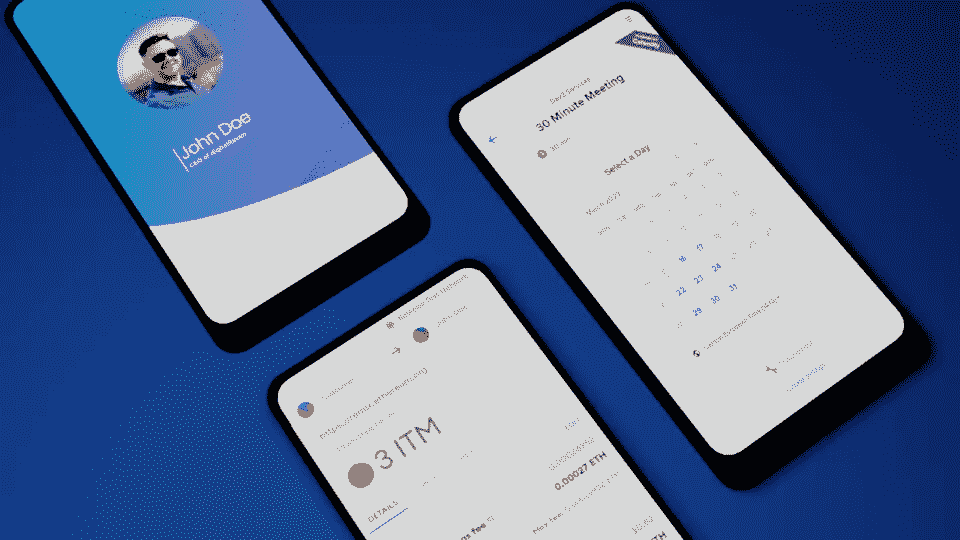
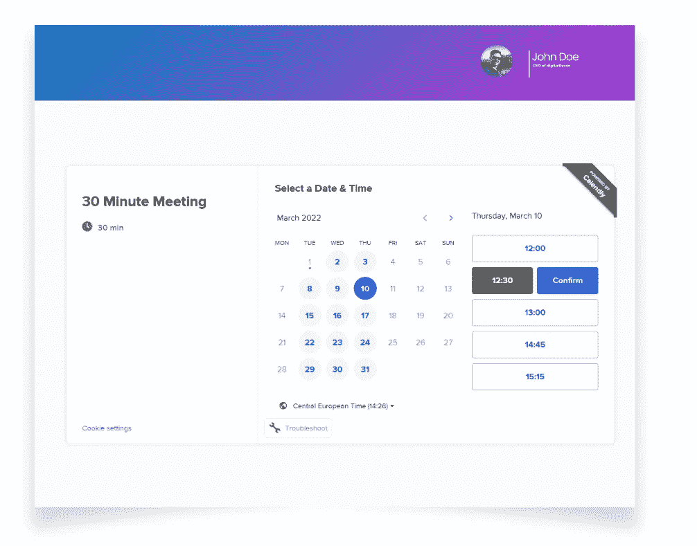
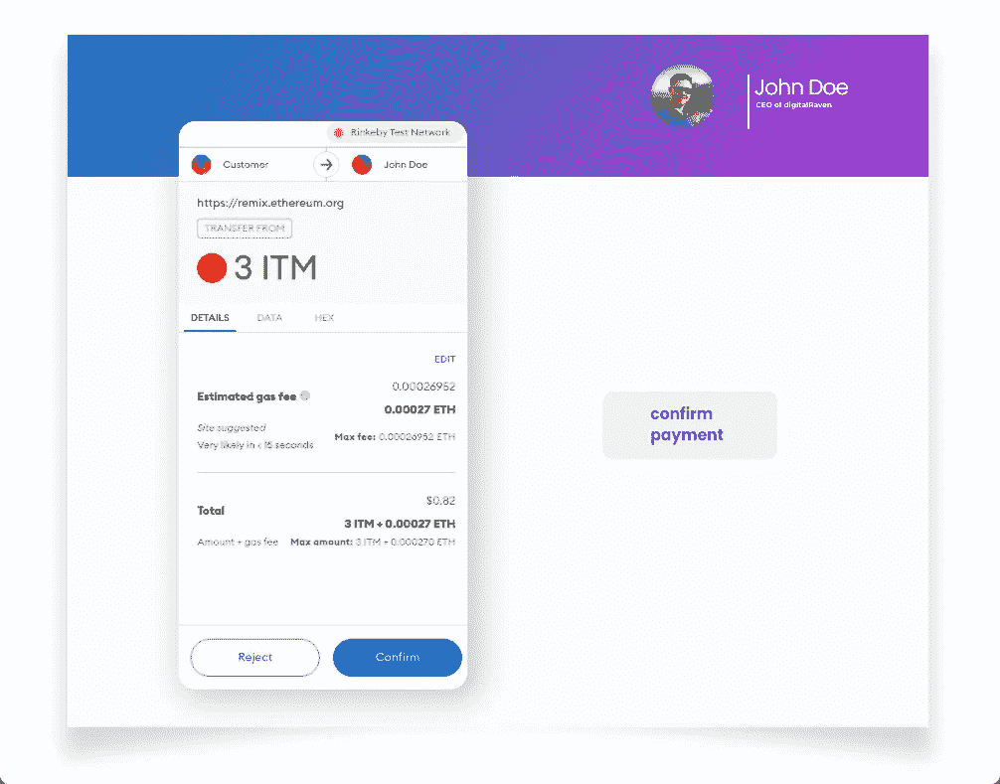

# 使用 NFT 和日历的令牌门控时间调度。

> 原文：<https://medium.com/coinmonks/token-gated-time-scheduling-using-nft-calendly-45cb9f805f9?source=collection_archive---------39----------------------->

受令牌保护的日程安排系统允许用户使用加密货币将他们的时间货币化，或者只为钱包中有特定令牌*的人提供预订时间的机会。

**令牌可以是以 ERC20、ERC721、ERC1155 开头的任何东西，也可以是符合客户特定需求的完全定制的东西。然而，由于与 OpenSea 等市场的现成集成，使用标准接口可以使发行者更容易上市。*

**独立解决方案**
对于那些已经拥有品牌和专业知识，并希望以一定价格分享知识的人，尤其是那些被 web3 world 吸引的人来说，独立系统本身可能就是一个有价值的产品。在区块链领域的所有专业领域中，这可能是所期望的。如果不允许人们以某种形式的加密货币进行支付，那么通过在线会议就“如何投资一个全新的 NFT 项目并变得富有”提出建议将是一种遗憾。

**后 ICO 扩展**
此外，它还可以是一个吸引人的扩展，用于过去由名人为独占组发布的任何令牌(我们在这里写更多关于名人令牌使用的内容)。让我们想象一个例子，一个名人已经发行了一个代币，持有者对此非常高兴。为了进一步增加轰动和兴奋，他们可以允许人们预订与他们的独家会议，所以它变得更加豪华。随着令牌的这种额外使用，市场上的令牌价格甚至更高，并且有许多与上下文相关的其他好处。

**工作流** 工作流可以根据业务逻辑而不同。在某些情况下，只有在付款后才能预订时间，而在其他情况下，如果没有代币，甚至不可能看到日历。

在 3dev.io，我们最近实现了一个 web3 集成的想法，并经过了实战检验，因此时间管理的整个逻辑在某种程度上是由外部处理的。这是通过在某人证明他/她拥有令牌之前不显示日历来实现的。然后，我们允许用户查看日历并预订会议。之后，我们还测试了用户被要求立即支付预约费用的情况。这当然取决于用例。如果没有出售个人时间的意愿，如果预订功能仅限于同一社区或 DAO 的成员，我们就不需要它。

# 让我们看看例子:

1.用户选择一名顾问，并启动证明他/她确实拥有必要令牌的流程。这是通过连接元掩码(或其他钱包)来完成的。这允许系统查询相关智能合约的链数据(在系统初始设置时提供)。从现在起，我们确信用户有一个令牌，将能够支付访问。

2.我们允许用户选择具体的时间

3.我们通知用户会议已经准备好了，并且知道是时候用令牌支付费用了。如果用户有不止一个这样的令牌，则系统挑选其中的第一个。用户当然可以在这一点上跳过付款步骤，但他的约会将被每 15 分钟运行一次的作业取消，并检查是否有尚未付款的约会。这可以通过与 Calendly 系统的深度集成以及处理 Calendly 事件和垂死用户钱包地址之间的链接来实现。

文章中描述的用例展示了 web3 世界和现实生活之间的桥梁。它可以是对现有 web3 解决方案或独立系统本身的有价值的补充，在所有已知的以及那些复杂的新业务分支中创造新的机会。

> 加入 Coinmonks [电报频道](https://t.me/coincodecap)和 [Youtube 频道](https://www.youtube.com/c/coinmonks/videos)了解加密交易和投资

# 另外，阅读

*   [用于 Huobi 的加密交易信号](https://coincodecap.com/huobi-crypto-trading-signals) | [HitBTC 审核](/coinmonks/hitbtc-review-c5143c5d53c2)
*   [如何在 FTX 交易所交易期货](https://coincodecap.com/ftx-futures-trading) | [OKEx vs 币安](https://coincodecap.com/okex-vs-binance)
*   [OKEx vs KuCoin](https://coincodecap.com/okex-kucoin) | [摄氏替代品](https://coincodecap.com/celsius-alternatives) | [如何购买 VeChain](https://coincodecap.com/buy-vechain)
*   [ProfitFarmers 点评](https://coincodecap.com/profitfarmers-review) | [如何使用 Cornix 交易机器人](https://coincodecap.com/cornix-trading-bot)
*   [如何匿名购买比特币](https://coincodecap.com/buy-bitcoin-anonymously) | [比特币现金钱包](https://coincodecap.com/bitcoin-cash-wallets)
*   [瓦济里克斯 NFT 评论](https://coincodecap.com/wazirx-nft-review) | [比茨盖普 vs 皮奥克斯](https://coincodecap.com/bitsgap-vs-pionex) | [坦吉姆评论](https://coincodecap.com/tangem-wallet-review)