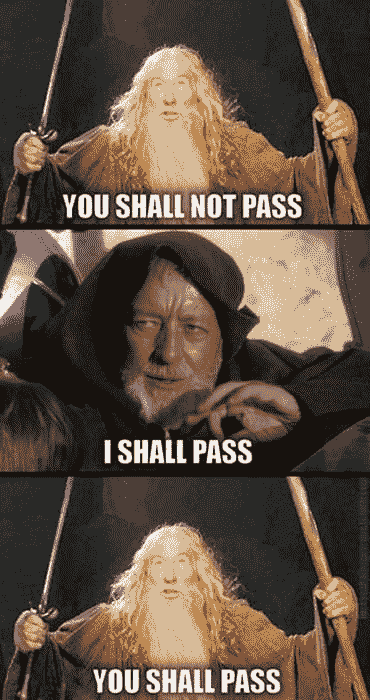
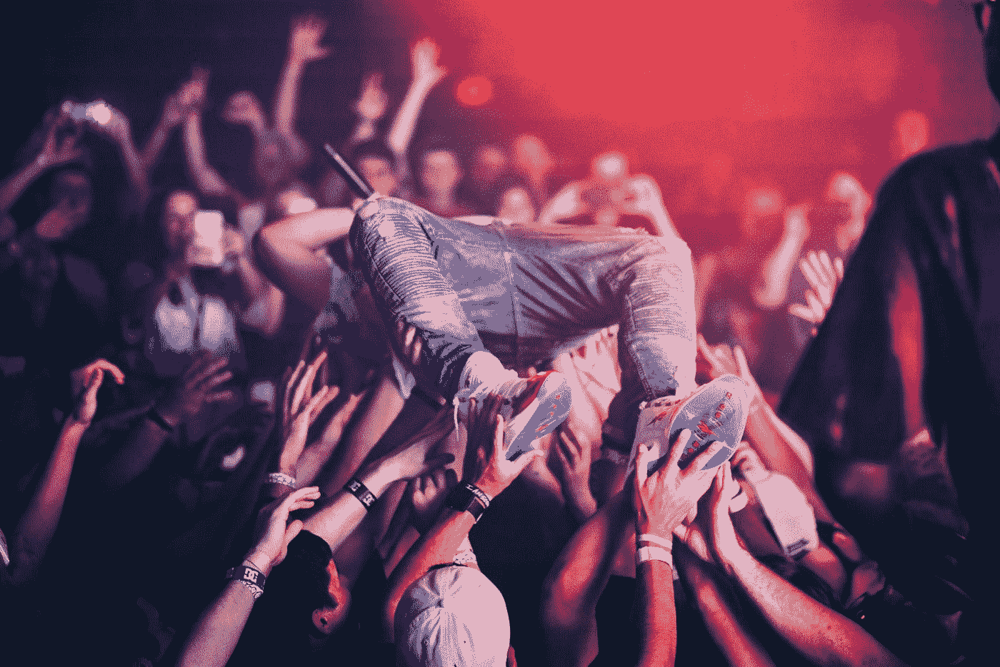
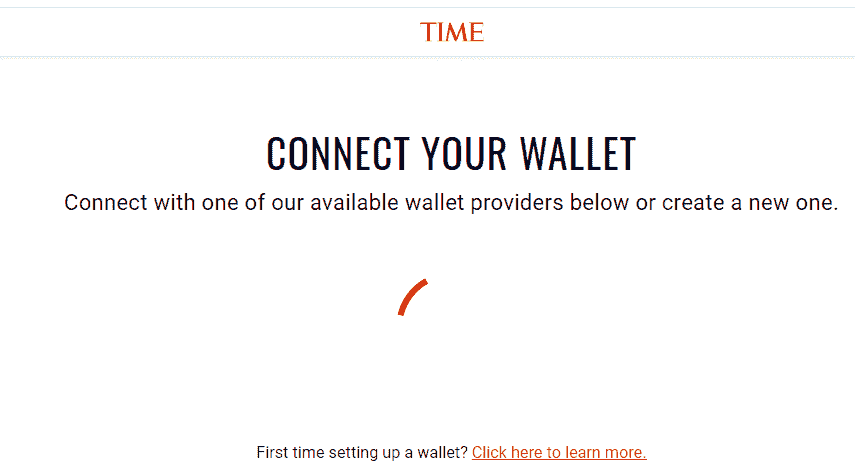
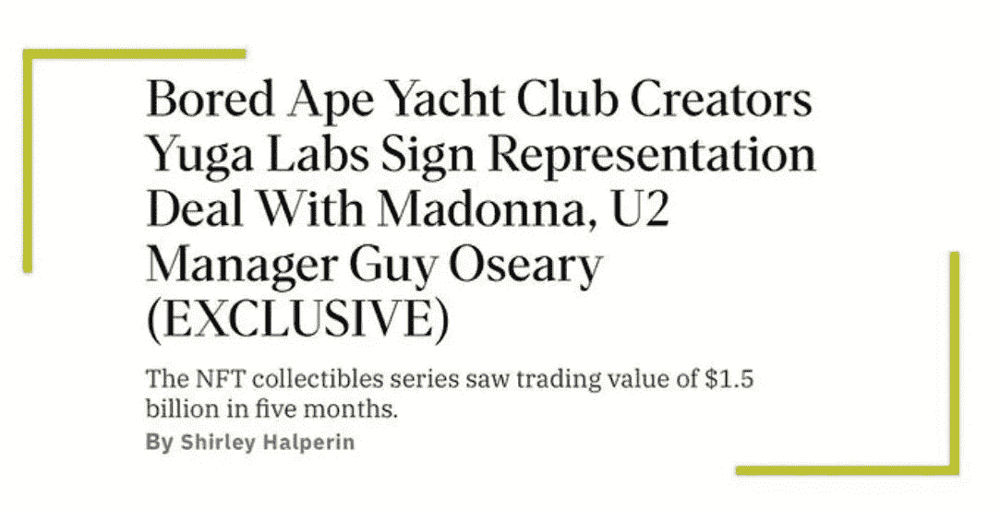
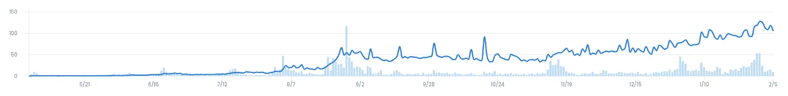
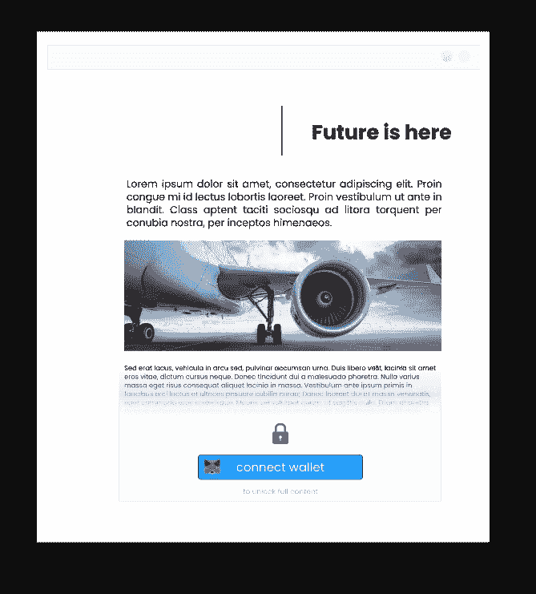
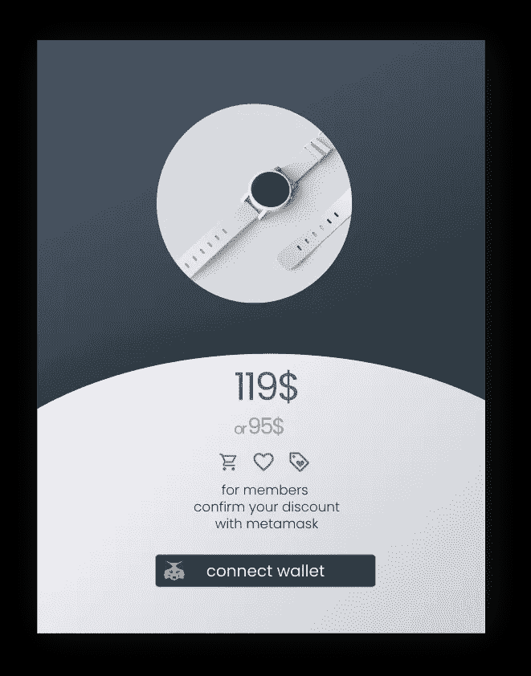

# 令牌保护页面:使用 NFT 作为访问通行证。

> 原文：<https://medium.com/coinmonks/token-protected-pages-use-nft-as-access-pass-1c719353ad88?source=collection_archive---------3----------------------->

在 [3dev.io](http://3dev.io/) 中，我们观察到 NFT 通行证对各种类型的内容创作者越来越有兴趣。我们已经成功地集成了几个令牌保护的页面，在下面的文章中，我们将分享我们在这个问题上的想法。

NFT 不仅仅是花费数百万的图像。他们最终带来的真正价值是所有权证书。它可以以各种方式使用，其中一种方式是授权/拒绝访问高级资源，类似于所有基于订阅的页面，即中等，但没有每月付款。取而代之的是，通过在钱包中拥有特定的令牌，可以很容易地验证访问权限。

# 为什么会有人用？

*Photo by* [*Karsten Winegeart*](https://unsplash.com/@karsten116?utm_source=medium&utm_medium=referral) *on* [*Unsplash*](https://unsplash.com/?utm_source=medium&utm_medium=referral)

让我们想象一个围绕名人建立的粉丝社区。名人发行 NFT 代币，粉丝可以获得。作为回报，钱包里有代币的粉丝可以访问一些其他人无法访问的优质资料——至少在公开之前的一段时间内。所有真正的粉丝都能获得巨大的荣誉。所有这些都可以用名人很少或没有成本来实现。名人决定发放代币的限制数量，从而可以保持其**对有限人群的独家**。

发行这样的实用令牌会带来更多好处。其他情况是，提供对商品或服务的访问，其中 NFT 访问通行证可以提高**客户忠诚度**和**保留率。更不用说通过在社交媒体上制造更多关于偷窥的噪音来提升品牌知名度了。如今，各品牌都在努力在不同的社交媒体平台上展示自己的存在，甚至经常专门为此投入大量预算的整个团队。而更实惠的解决方案已经存在几年了。**

> 根据 [CMP 调查](https://cmosurvey.org/wp-content/uploads/sites/15/2019/02/The_CMO_Survey-Highlights-and_Insights_Report-Feb-2019-1.pdf)显示，公司倾向于在社交媒体上花费其总营销支出的 20%左右。

如果粉丝已经想要进入这个 VIP 社区，品牌可以很容易地融入游戏化等概念，只是为了提高客户参与度。此外，公司总是可以留下一些备用通行证，使其更加精彩。

让我们总结一下到目前为止我们所获得的好处:

*   发行人的推广成本低
*   令牌持有者的专属内容
*   顾客版税
*   客户保留
*   品牌知名度
*   不同渠道的品牌形象
*   客户参与度

# 其他人已经在使用它了

## 时代公司采用 NFT 通行令牌

大量采用代币门控概念的最重要的里程碑是 Time.inc 允许代币持有者自由阅读杂志。永远。免费的。

[https://www.linkedin.com/feed/update/urn:li:activity:6892831436534358016](https://www.linkedin.com/feed/update/urn:li:activity:6892831436534358016)

对于许多传统品牌来说，这是一个信号，尽管围绕着 crypto 和 NFTs 的整个怀疑，这个概念确实很有趣。即使对于像《时代》这样拥有可靠客户基础的老牌媒体机构来说，这也不仅仅是一种时尚，而是更多的东西。

> 大概**时代公司**就是**T3 吧。或许时机也是正确的。**

# NFT 作为门票

显而易见，与在线服务类似，NFTs 可以利用对会议、音乐会或其他活动门票等物理场所的访问。有多种使用 NFT 的记录，例如 NYC.NFT 期间的 pussy-riot 演出。音乐会门票是免费的，但是，每个愿意参加的人都应该在钱包中至少有 5 个组织者的 NFT 代币。

# 道成员资格

一个不太传统但仍然有效的例子是访问在 web3 空间中创建的所有 Dao。

**道**是一个分享相同价值观或使命的社区，在这里创造和分享大量有价值的内容。现有 Dao 的例子是投资者社区在排他性和封闭的团体中分享他们的想法。另一个从线是区块链开发商社区建设在一起的互联网的未来或最豪华的社区称为无聊猿游艇俱乐部。后者可能不是一个严格意义上的刀，但肯定是一个社区…拥有超级昂贵的猿图片，有更多的人想加入。他们有充分的理由这么做。

# 可能性是无限的

NFT 通行证正在改变规则。艺术家、博客作者、YouTubers 用户、音乐家、名人、教练，最后，品牌可以通过 NFT 门控访问来分发他们的内容。他们可以自由地将他们的社区货币化，并按照他们自己的规则建立社区。通过发行 NFT 代币，他们可以获得他们现在和将来想要分享的东西。

另一方面，代币持有者将加入独家俱乐部的乐趣、获得优质材料的机会以及在会员资格变得更有声望时出售代币的可能性结合在一起(代币的价格也因此更高)。这种情况已经发生过很多次，其收益是任何其他投资都无法比拟的

The average price of BAYC rising from 0.08 to 124Ethers

# 市场反应

在 3dev.io 中，我们观察到 NFT 访问通行证获得了很多关注。允许客户保护对各种内容的访问的解决方案的 RFQ 数量每个月都在上升。在 2021 年第 4 季度，我们完成了 NFT 通行证在各种平台上的集成，包括以下平台。

## 博客引擎(WordPress 和自定义的)。

只有持有代币的会员才可以使用特定的材料。

## 电子商务解决方案(Shopify 和 WooCommerce)。

*用代币给顾客打折的赠品。*

## 预订(定制预订系统)

高级公寓套房只对钱包里有代币的用户开放

我们预计这一趋势将在未来几个月稳步上升，改变人们对 NFT 的看法，因为它们不仅是昂贵的照片，而且可能是互联网的未来，也是内容创作者经济中的重要杠杆。

> 加入 Coinmonks [电报频道](https://t.me/coincodecap)和 [Youtube 频道](https://www.youtube.com/c/coinmonks/videos)了解加密交易和投资

# 另外，阅读

*   [区块链 vs 比特币基地](https://coincodecap.com/blockfi-vs-coinbase) | [BitKan 评论](https://coincodecap.com/bitkan-review) | [期货交易机器人](/coinmonks/futures-trading-bots-5a282ccee3f5)
*   [南非的加密交易所](https://coincodecap.com/crypto-exchanges-in-south-africa) | [BitMEX 加密信号](https://coincodecap.com/bitmex-crypto-signals)
*   [如何在 WazirX 上购买柴犬(SHIB)币？](https://coincodecap.com/buy-shiba-wazirx)
*   [MoonXBT 副本交易](https://coincodecap.com/moonxbt-copy-trading) | [阿联酋](https://coincodecap.com/crypto-wallets-in-uae)的加密钱包
*   [MoonXBT vs Bybit vs 币安](https://coincodecap.com/bybit-binance-moonxbt) | [硬件钱包](/coinmonks/hardware-wallets-dfa1211730c6)
*   [雷米塔诺审查](https://coincodecap.com/remitano-review)|[1 英寸协议指南](https://coincodecap.com/1inch)
*   [十大最佳加密货币博客](https://coincodecap.com/best-cryptocurrency-blogs) | [YouHodler 评论](https://coincodecap.com/youhodler-review)
*   [KuCoin vs 币安](https://coincodecap.com/kucoin-vs-binance) | [Bitrue 点评](https://coincodecap.com/bitrue-review) | [Jet-Bot 点评](https://coincodecap.com/jet-bot-review)
*   [购买 PancakeSwap(蛋糕)](https://coincodecap.com/buy-pancakeswap) | [矩阵导出审核](https://coincodecap.com/matrixport-review)