# 令牌归属:令牌组学中创建归属的完全指南

> 原文：<https://medium.com/coinmonks/token-vesting-the-complete-guide-to-creating-vesting-in-tokenomics-bf211b999f2f?source=collection_archive---------0----------------------->

## 如何创建代币授权计划

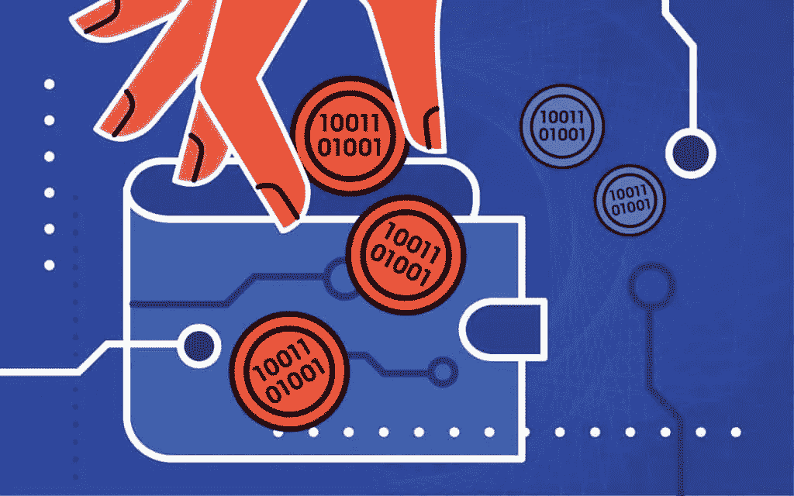

Token Vesting

术语“**归属**”源自拉丁语“vestire”。如今它正被公司和企业家广泛使用。它通常是在公司一次发行股票、硬币或代币时引入的。在这篇文章中，你将学习**如何在令牌组学中创建一个令牌授予计划**。以及 **VTVL 归属工具**如何工作。让我们来看看！

# 归属的重要性

在传统金融中，一些公司也向员工提供股权。但如果它们一起发布，通常会对交易所产生抛售压力，拖累股价。因此，公司通常引入一个归属期来延迟承诺资产的所有权。

在区块链领域，有远见的团队和创始人铸造代币，并通过首次公开募股(IDO)出售给风投、私人资本和公众，以支持他们正在构建的颠覆性想法。由于这些销售以分散的方式进行，任何看到潜力的人都可以参与代币销售。

代币销售结束后，参与者将收到基于预定汇率的代币。如果他们被给予他们购买的所有代币，一旦代币在集中甚至[分散的交易所上市](https://blog.cryptostars.is/what-are-decentralized-exchanges-how-do-dexs-work-4e54fd477e0e)，很可能会经历巨大的抛售。这是广受欢迎的地毯拉。这就是归属来拯救。

# 归属介绍

**授权是在给定的时间范围内锁定和分配购买的代币的过程**。决定归属的特定时间框架称为“**归属期**”。

> **它基本上延迟了对所提供资产的访问。**

它不仅适用于项目创始人、顾问和团队成员，也适用于在向公众出售代币之前购买代币的私人投资者。然而，目前的项目确实有在公开轮次中出售的代币的授权计划，以保持抛售压力。

# 归属类型:

“悬崖”是关于归属讨论最多的术语。在行权时间表之前对代币进行的持续锁定称为悬崖。它主要用于种子和私人销售投资者。这个术语现在很清楚了，这就是归属的类型:

## **线性归属**

在一定时间内将代币按等份分配被称为线性归属。时间段可以是几天、几周、几个月甚至几年。

## **扭曲的归属**

在各种时间周期内随机分配代币被称为扭曲归属。时间周期从几天、几周、几个月甚至几年不等。

例如，顾问需要获得 600，000 个测试令牌。在线性归属下，每月可发行 50，000 个测试代币，在一年内完成整个归属。如果添加 6 个月的悬崖，顾问将从第 6 个月开始连续 12 个月每月收到 50，000 个测试代币。

但是在扭曲的归属中，你看不到线性的分布模式。在前 3 个月，600，000 个测试令牌中的 25%可以每月发布，然后 75%的测试令牌可以在 6 个月的悬崖后发布。扭曲模式通常出现在第 1 层项目或第 1 层区块链中，以维持令牌定价。

因此，根据发行的性质，授予计划由许多单独的锁定组成。在锁定期间，任何人都不能在发布计划之前访问令牌。对于投资者的授权，项目通常会保管代币，并在发布日将代币空投到投资者的地址。保管的代币不算流通。

# 风险投资和资本的归属

这些实体、组织或个人通过签署未来代币简单协议，在早期购买大量代币(SAFT)。由于他们在早期阶段支持项目，因此与公开销售相比，他们将以折扣价获得代币。

由于早期阶段的销售量相对较高，一旦 IDO 结束，令牌在 CEX/DEX 上市，项目可能会面临巨大的销售压力。它增加了流通中的大量代币，导致代币价格大幅下跌。

由于区块链相对来说是一项新技术，它需要足够的时间来构建和交付某些东西。通过 IDOs 筹集资金的项目通常努力吸引观众来完成用例，最终给出内在的象征性价值。因此，这需要耐心，而授权做得很好。

它永久地消除了人们对失去对少数风投或上市资本的象征性控制的担忧。如果发生这种情况，一群持有更多股份的人可以按照他们想要的方式波动代币价格，并将项目生态系统引向毁灭。因此，授权已经成为代币经济学的核心部分，任何投资者的投资决策都依赖于此。

# 归属证券

如我们所知，授权涉及锁定大量价值数十万甚至数百万的代币；锁定令牌的安全性确实很重要。区块链的生态系统还很年轻，缺乏投资者安全感。有两种方法可以为各种分配锁定和授予令牌。

场景 1 :创始人自己保管这些代币，并保留一本记录代币发行时间表的书。在行权日，他们基本上是通过大宗代币发送者向投资者和顾问空投相应的代币。即多发送器、分散器等。

这种方法耗时且缺乏信任，因为不涉及第三方监管。因此，该团队控制了大量令牌，他们可以在任何时间点出售或取消令牌发布。许多项目都遭遇了同样的问题。

**场景二:**创始人在第三方平台的帮助下建立代币行权时间表。他们的智能合同是由著名的审计公司审计的，是专门为处理可定制的项目授权而建立的。项目还可以透明地展示他们的全部授权，并建立信任。

在某些情况下，团队还部署智能合同来处理他们的内部令牌授予。如果他们正在由已知的公司审计这样的合同，它不会收集问题，但是花费在为与 NFT 有关的项目建立和部署这样的智能合同上的资源不是一个可行的想法，因为它在那之后将是无用的。

*那么，还有什么不涉及复杂性的方法呢？给你…*

# 如何毫不费力地创建一个令牌归属时间表？

有许多第三方平台可以帮助为部署在多个区块链上的令牌创建授权计划。其中一些在内部部署了令牌发布时间表，而少数提供了用户界面。

在本指南中，我们将利用 BlockPad Vault 的直观界面来建立授权计划。它支持四个领先的区块链，包括以太坊、BSC、Polygon 和 KCC，而 BlockPad 背后的年轻头脑正致力于在不久的将来集成更多的区块链。

假设您在受支持的区块链上部署了令牌智能合同，创建授权计划所需的步骤如下:(我正在演示为我在 IDO 中购买的 Polkalokr (LKR)令牌创建授权计划。)

**1:** 转到我们的[官方 BlockPad 网站](https://theblockpad.com/)并导航到“授权”部分。(或[点击此处](https://theblockpad.com/vault?type=vesting))

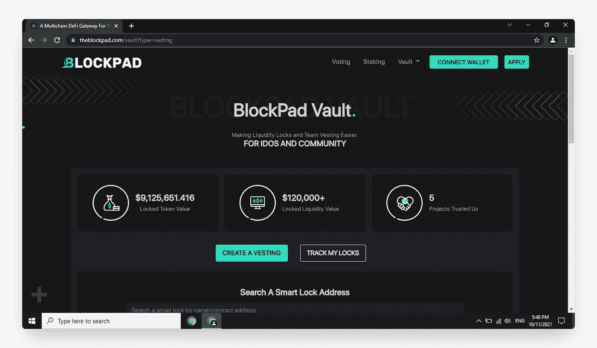

[official BlockPad website](https://theblockpad.com/)

**2:** 选择部署令牌的区块链(mainnet)。支持的链有以太坊，BSC，多边形和 KCC。

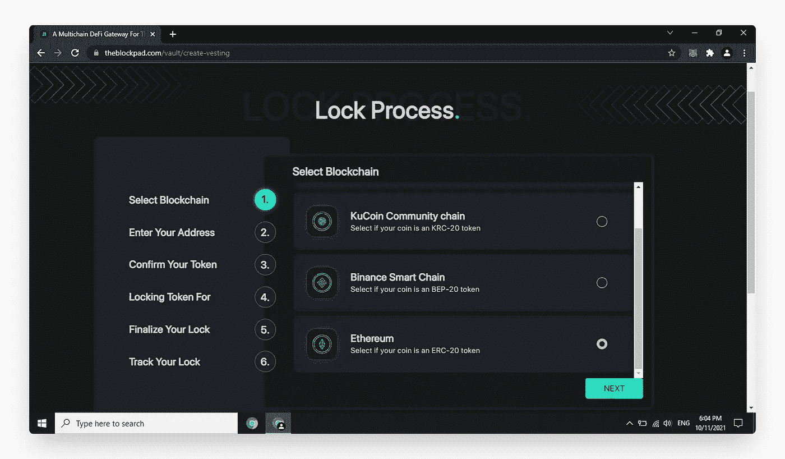

Select the blockchain (mainnet)

**3:** 在此处显示的字段中输入您的令牌智能合约地址。它将从区块链获取令牌细节。

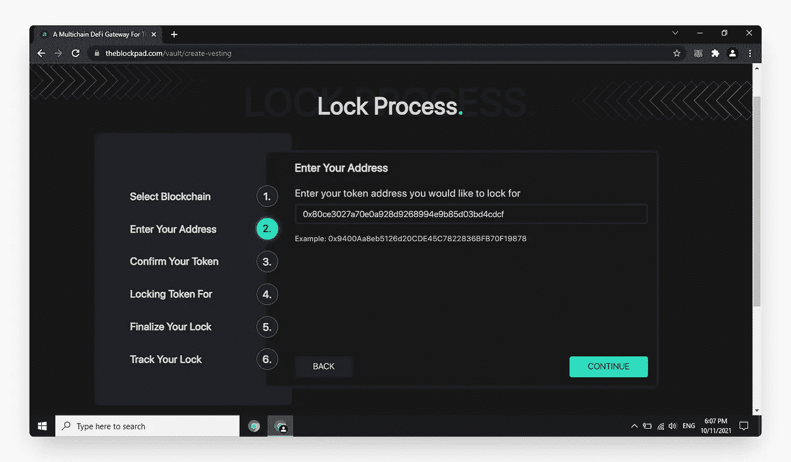

token smart contract address

**4:** 确认提取的令牌详情。您的代币总量和您地址中持有的代币数量将在此处显示。

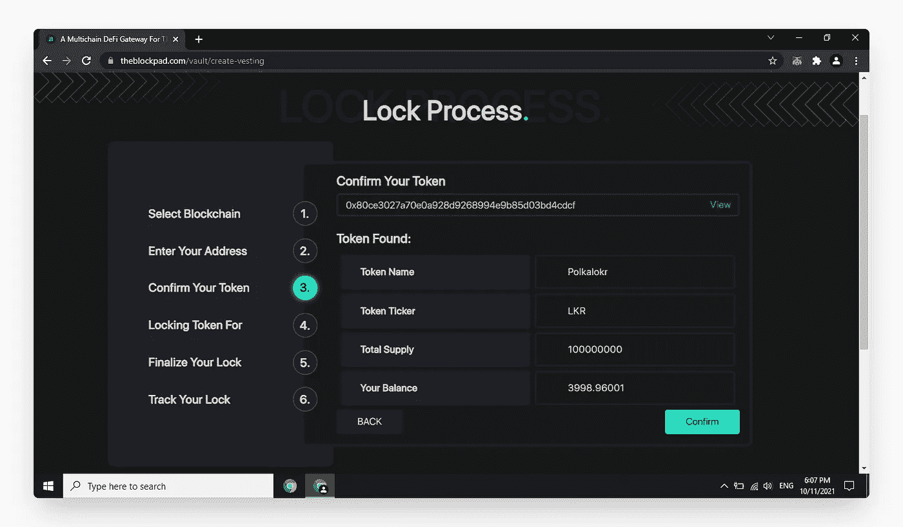

Confirm the fetched token details

**5:** 利用“我自己”选项，您可以创建一个授权计划，其发放的代币将被撤回到您的地址。“其他人”选项将允许您为自己以外的地址创建一个授权计划。

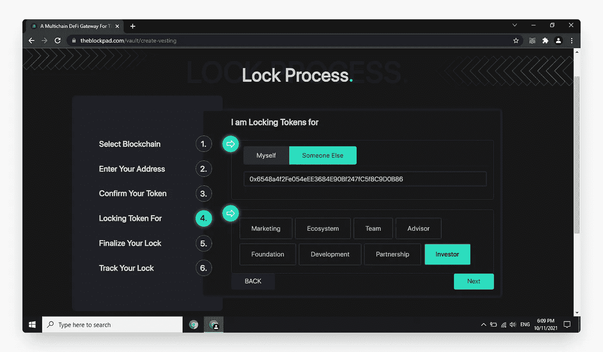

Utilizing the “Myself” option

**6:** “单锁”可以创建一个固定持续时间的简单令牌锁。另一方面，“线性归属”将允许你创建一个悬崖插入线性发布时间表。例如，下面的快照将连续 5 个月释放 500 个 LKR 令牌，然后是 2 个月的悬崖。

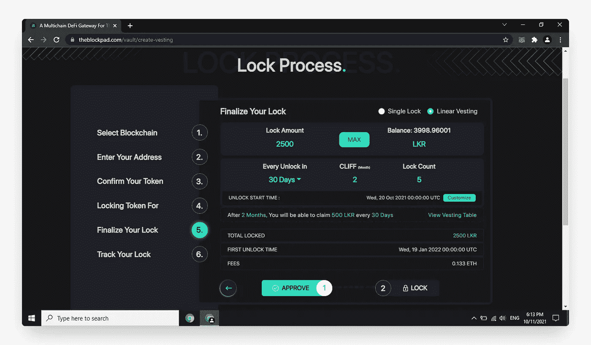

Single Lock

您可以通过点击“归属表”选项来交叉检查所有锁和准确的解锁时间。请看下面我的例子。

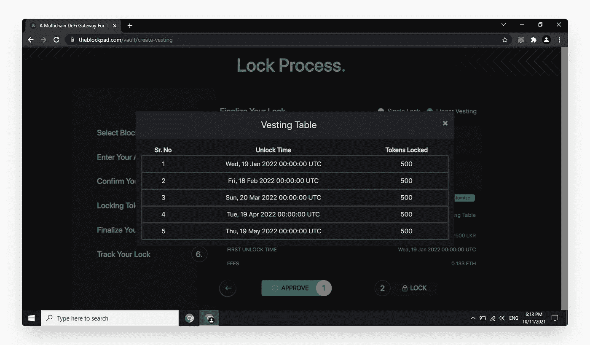

The “Vesting Table” option

**7:** 一旦您批准了锁定代币的代币消费和最终元掩码交易，您的授权计划将显示在授权页面上。这是一个界面，在这里你可以检查下一个版本，并搜索为各种目的而创建的授权。即投资者、团队、顾问、营销等。

通过 BlockPad】创建授权时间表的过程不需要技术知识，在 IDO 之后就能派上用场。它不仅仅是为团队设立的，任何个人都可以启动授权。因此，对代币的授权防止了重大的市场倾销和代币价格操纵。另一方面，这也代表了团队在他们的令牌发布中是透明的，最终建立了信任。

*现在我们来看看什么是****VTVL****以及* ***VTVL 归属工具*** *是如何工作的！*

# VTVL 授权工具

在 Eniac Ventures、Biconomy、Spice Capital、Chainalysis、Baboon VC、AAVE 等知名投资者的支持下，VTVL 构建了一个令牌管理平台，使协议、分散自治组织(DAO)、Defi、加密基金、家族办公室和风险投资家等 web3 公司更容易分发和接收令牌。

# **VTVL 授权工具如何工作**

## **在几分钟内创建自动授权计划**

告别编辑电子表格，向无代码可定制的实时跟踪行权时间表问好。项目所有者可以在几分钟内无缝地创建新的授权时间表，以确保令牌每次都按时分发到正确的接收者手中！

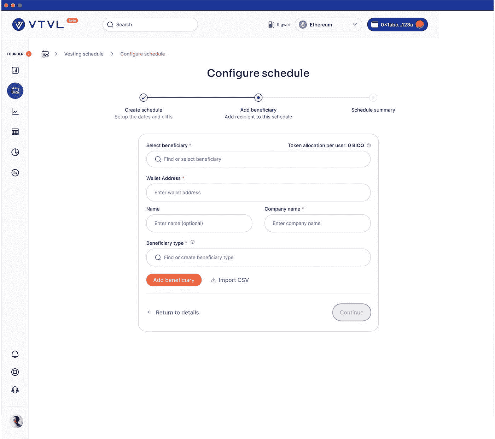

Creating a new vesting schedule

在几分钟内无缝创建新的授权时间表，以确保令牌每次都按时分发到正确的收件人手中！

## **链上跟踪和即时令牌分发**

VTVL 授权时间表在我们的索赔门户网站上进行实时跟踪，对项目创建者和接受者完全透明。当令牌准备认领时，收件人只需点击一下鼠标，即可无缝批准将令牌移动到他们的钱包中。

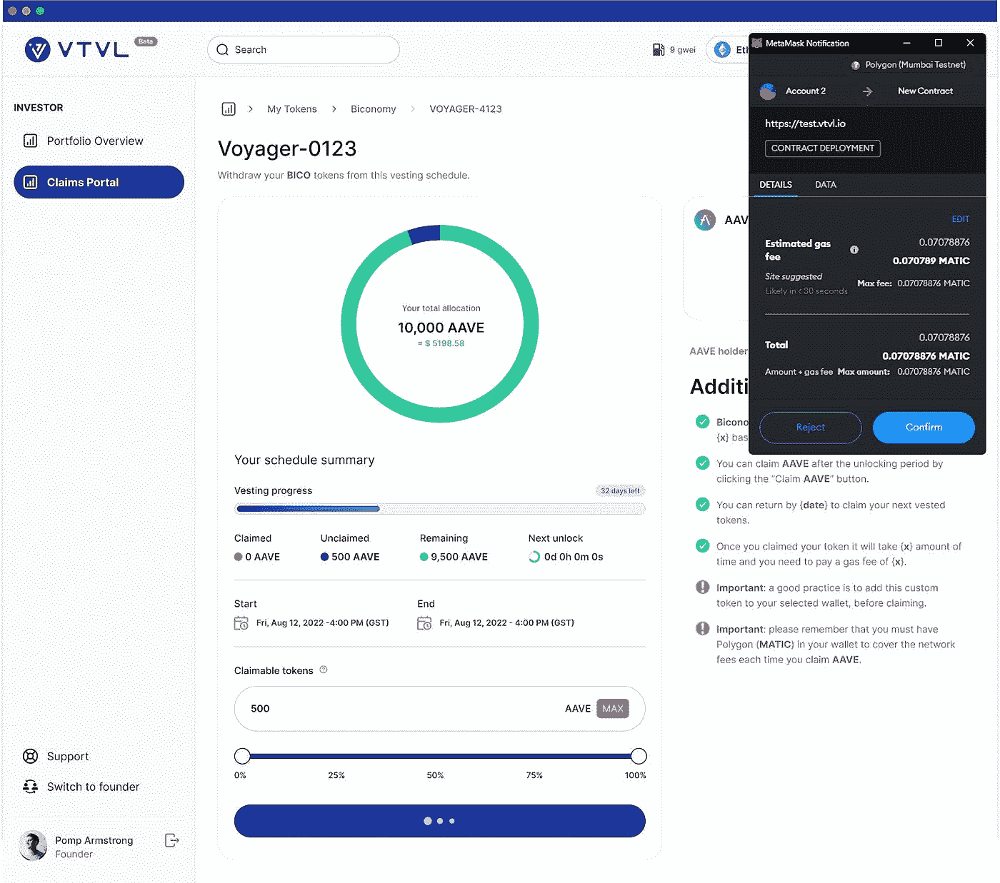

On-Chain Tracking and Instant Token Distribution through VTVL

对于投资于多个项目并积累了多个令牌的投资者或接收者，您可以在一个强大而安全的仪表板中跟踪所有项目。

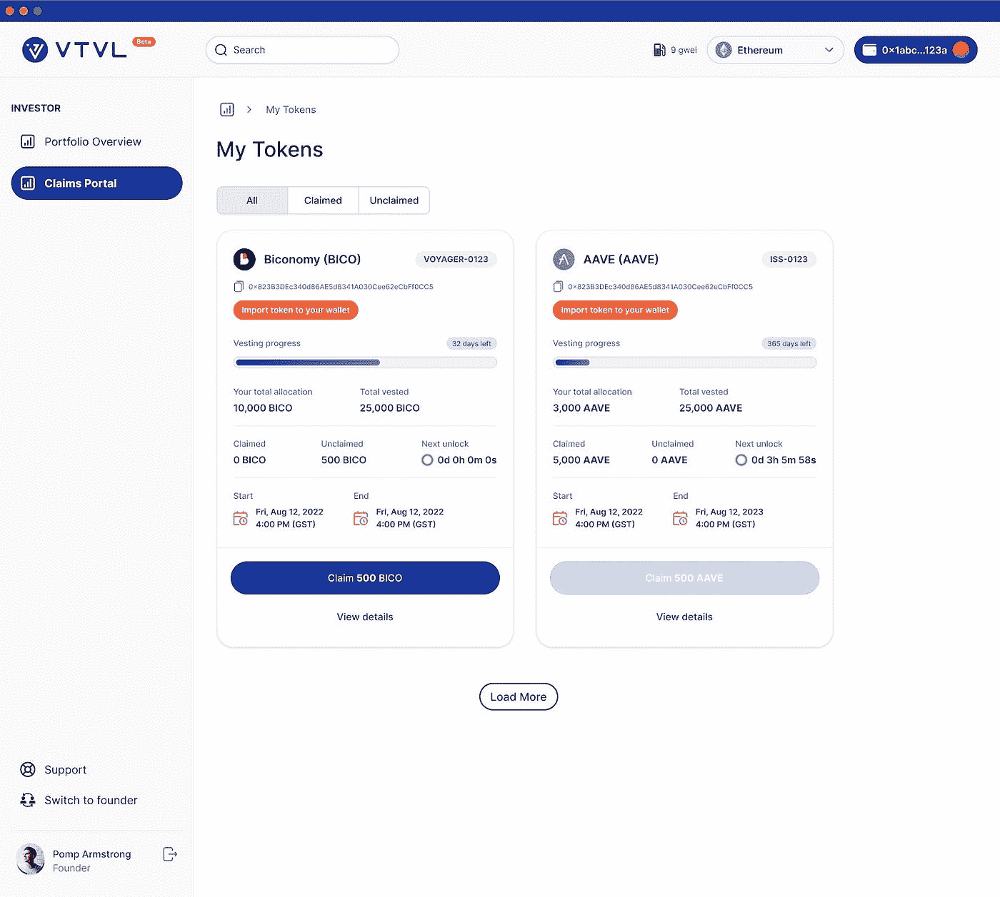

VTVL Dashboard

## **安全第一**

VTVL 已投资超过 100，000 美元，用近一年时间完成了由 Certik、Quantstamp 和 Code4rena 这三家值得信赖的公司进行的三次独立审计，以确保我们的智能合同保持最高水平的安全性。借助经过审核的智能合同和无缝的用户界面，将代币安全地分发给您的投资者/员工。

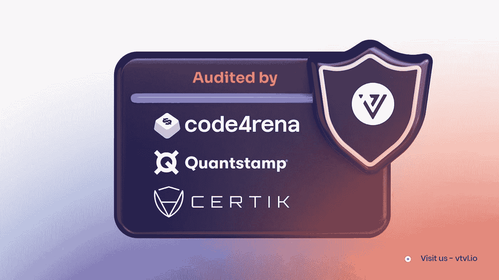

VTVL completes audits by these firms

## **链不可知论者**

VTVL 目前支持在 EVM 区块链发行的代币，如以太坊、Klatyn、Fantom、Avalanche、BSC、Polygon、Cronos、Aurora 和计划于 2023 年添加的额外区块链。

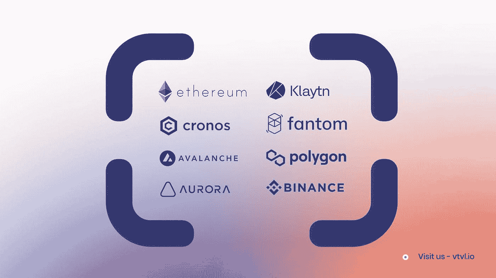

VTVL supports tokens issued on EVM-based blockchains

如需了解更多关于 VTVL 的信息，请访问他们的网站 https://vtvl.io 或在 https://medium.com/vtvl-official[关注他们](https://medium.com/vtvl-official)。

另外，阅读

 [## 理解代币组学:代币的真正价值

### 什么是令牌组学

medium.com](/coinmonks/understanding-tokenomics-the-real-value-of-a-token-6e798c9a442e)  [## 令牌组学:决定密码成功的 4 个因素

### 令牌组学成功因素

medium.com](/coinmonks/tokenomics-4-factors-that-determine-a-cryptos-success-858ee7a0cf94) 

## 在 Linkedin 上关注我，保持联系

[https://www.linkedin.com/in/ishanshahzad/](https://www.linkedin.com/in/ishanshahzad/)