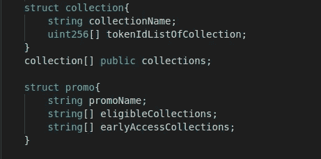
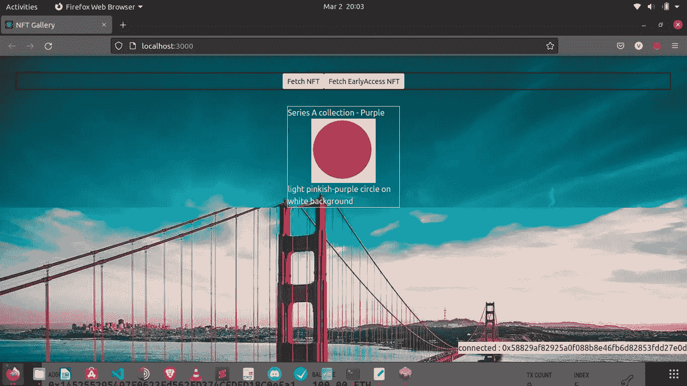
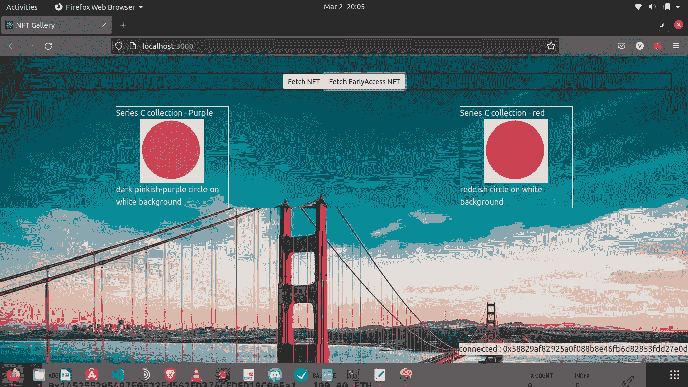
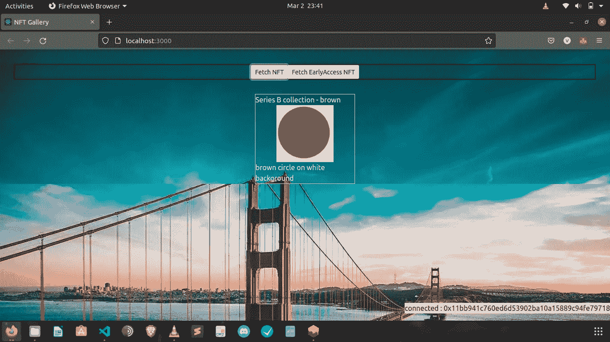
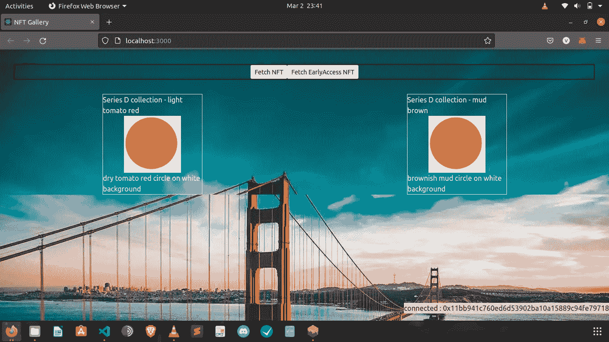

# 令牌门-授予特定 NFT 集合的所有者独占访问权限

> 原文：<https://medium.com/coinmonks/tokengating-grant-exclusive-access-to-owners-of-select-nft-collections-b52ad683c1bb?source=collection_archive---------20----------------------->

我们都知道封闭的社区，那里的设施只对成员开放。令牌选通与此类似。

令牌/NFT 可用于提供/确定对事件或在线内容的访问级别。这有许多用例。最近有一个活动，门票是 NFTs 的形式。使用你的钱包，证明你拥有一个特定的 NFT，并获得进入…

在本文中，让我们探索如何为特定的 NFT 集合/集合的所有者提供对 NFT 集合的早期访问。让我们看看如何创建一个促销活动，如果你有一个特定系列的 NFT，可以提前购买新系列的非功能性食物。

因此，通常栈是 Solidity，Truffle，Ganache，VSCode，IPFS 的 Pinata 这里的代码 repo 是。

## [代码](https://github.com/Vbhaskar125/NFT--TokenGating)的整体结构

我们将使用 Openzepplin 的 ERC721 作为基础代码，并在此基础上进行构建。我们将定义两个名为“collection”和“promo”的结构。

结构集合将有一个名称和一个 NFTs id 数组。Struct promo 将有一个 promo 名称和两个用于合格集合的集合的数组，以访问存储在第二个数组中的早期访问集合。

collection and promo structs

你可以在 Github [这里](https://github.com/Vbhaskar125/NFT--TokenGating)获取代码。

接下来，对于任何参观画廊的游客，我们将整理他拥有的 NFT 收藏，并挑选他有资格参加的宣传片。点击“显示早期访问 NFTs ”,我们将显示他在发布前可以购买的 NFTs。

出于演示目的，下面是上下文。

## 我们将有 4 个 NFT 系列

> 系列 A 具有令牌 id 0 和 1
> 
> 系列 B 具有令牌 id 2 和 3
> 
> 系列 C 具有令牌 id 4 和 5
> 
> 系列 D 具有令牌 id 6 和 7

我们将创建两个促销活动

1.  对于集合 A 的所有者，将允许访问购买集合 C
2.  对于集合 B 的所有者，将被给予购买集合 D 的访问权

下面的演示让用户拥有一个 series- A 集合，如下所示。

this user owns collection A

在获取早期访问集合时，他获得了对 C 系列集合的早期访问

Series C collections as Early access collections for the user

同样，拥有 Series-B 的用户也可以访问 Series-D。请注意这些图片右下角的帐户地址。

user owns Series-B NFT

user has access to series-D NFTs

要进一步了解代码，请访问 [Github](https://github.com/Vbhaskar125/NFT--TokenGating) 。

因此，这是一个使用案例，NFT 的所有权可用作独家优惠/访问的通行证或门票

请随时通过我的 linkedIn 联系我。

> 加入 Coinmonks [电报频道](https://t.me/coincodecap)和 [Youtube 频道](https://www.youtube.com/c/coinmonks/videos)了解加密交易和投资

# 另外，阅读

*   [交易信号是什么？](https://coincodecap.com/trading-signal) | [Bitstamp vs 比特币基地](https://coincodecap.com/bitstamp-coinbase) | [买索拉纳](https://coincodecap.com/buy-solana)
*   [ProfitFarmers 回顾](https://coincodecap.com/profitfarmers-review) | [如何使用 Cornix Trading Bot](https://coincodecap.com/cornix-trading-bot)
*   [十大最佳加密货币博客](https://coincodecap.com/best-cryptocurrency-blogs) | [YouHodler 评论](https://coincodecap.com/youhodler-review)
*   [my constant Review](https://coincodecap.com/myconstant-review)|[8 款最佳摇摆交易机器人](https://coincodecap.com/best-swing-trading-bots)
*   [MXC 交易所评论](/coinmonks/mxc-exchange-review-3af0ec1cba8c) | [Pionex vs 币安](https://coincodecap.com/pionex-vs-binance) | [Pionex 套利机器人](https://coincodecap.com/pionex-arbitrage-bot)
*   [我的密码交易经验](/coinmonks/my-experience-with-crypto-copy-trading-d6feb2ce3ac5) | [《比特币基地评论》](/coinmonks/coinbase-review-6ef4e0f56064)
*   [CoinFLEX 评论](https://coincodecap.com/coinflex-review) | [AEX 交易所评论](https://coincodecap.com/aex-exchange-review) | [UPbit 评论](https://coincodecap.com/upbit-review)
*   [AscendEx 保证金交易](https://coincodecap.com/ascendex-margin-trading) | [Bitfinex 赌注](https://coincodecap.com/bitfinex-staking) | [bitFlyer 点评](https://coincodecap.com/bitflyer-review)