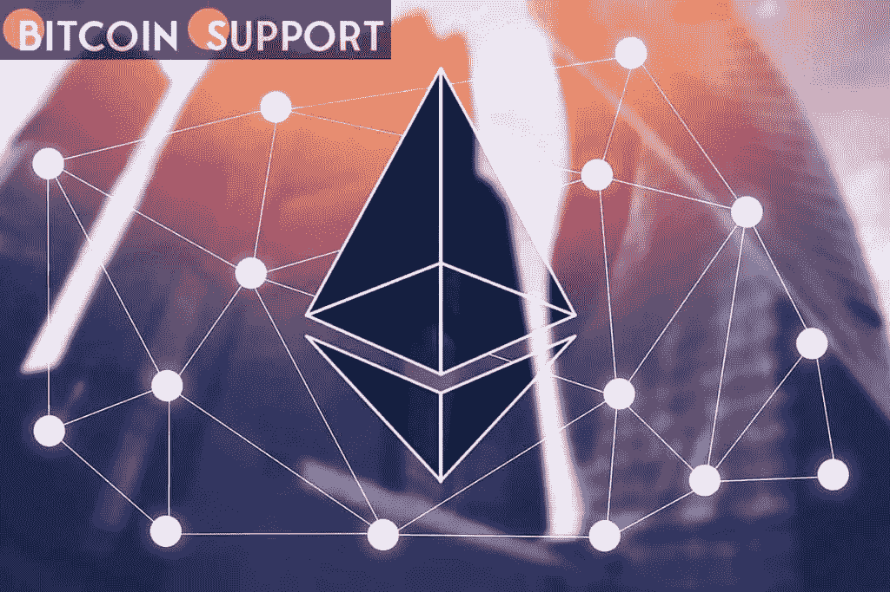
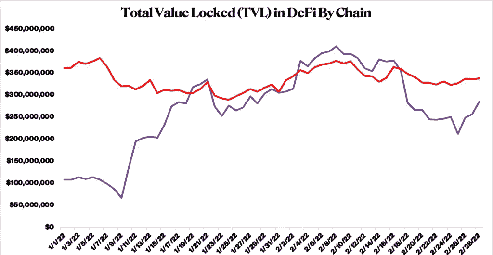
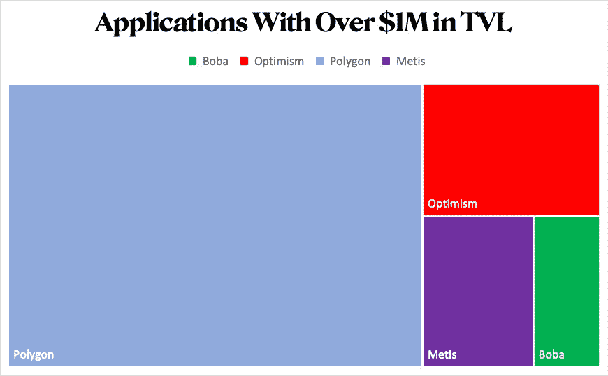
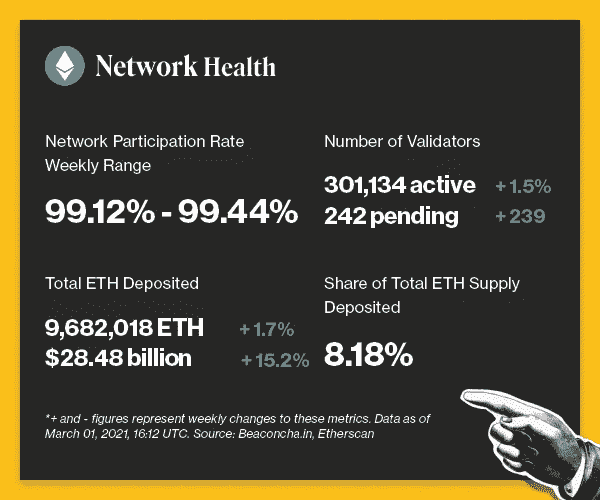
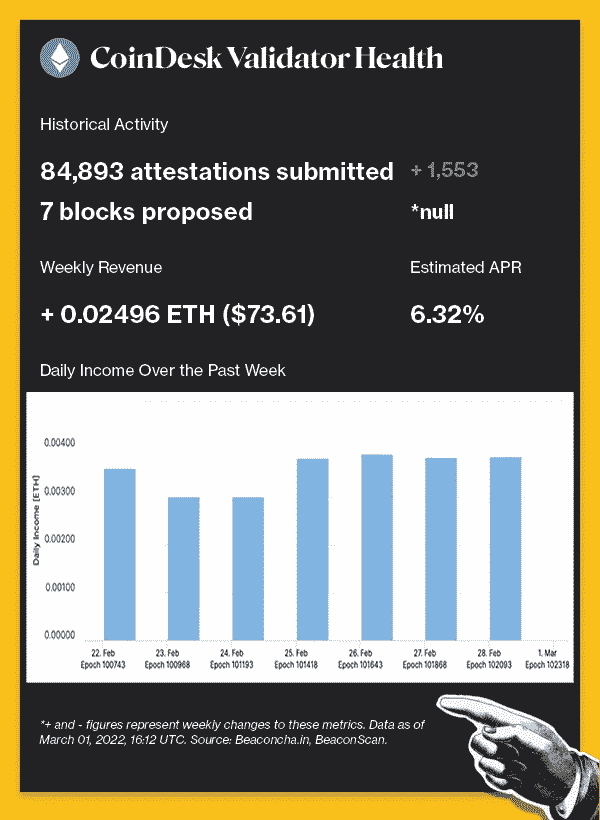
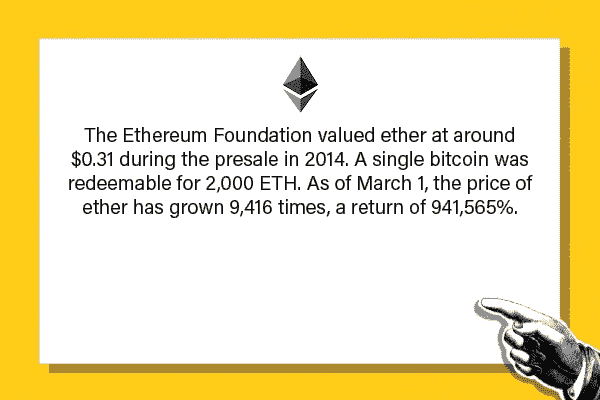

# 令牌化对以太坊扩展解决方案的潜在影响

> 原文：<https://medium.com/coinmonks/tokenizations-potential-impact-on-ethereum-scaling-solutions-24b8a1db1ad5?source=collection_archive---------42----------------------->

**Visit our website:-** [**https://bitcoinsupports.com/**](https://bitcoinsupports.com/)

给以太坊的第二层增加一个本地令牌能给生态系统带来优势吗？StarkWare 重新开发的以太坊零知识(ZK) rollup 产品 StarkNet 宣布打算在 2022 年第三或第四季度过渡到社区控制。

虽然 StarkNet 拒绝评论这是否是推出令牌的前兆，但分散自治组织(DAO)/治理模式经常依赖治理令牌来提供投票权，并将协议的治理与平台投资者联系起来。鉴于加密货币的许多项目都使用代币，StarkNet 可能的推出为什么会对行业产生重大影响？以太坊的第 2 层协议在是否需要令牌或以太是否应该作为所有汇总的主要令牌的问题上存在分歧。

Arbitrum 和 Optimism 都采用“包装”以太作为其基础令牌，为天然气付费，并作为大量分散金融(DeFi)资产的主要 DEX(分散交易所)配对。为了向 mainnet 发布批量汇总交易，协议必须支付链上交易费用，该费用由汇总的用户提供。从这个角度来看，以太坊的扩展工具将以太作为本地资产是合理的。另一方面，Rollups 一直在努力获得类似于 Solana、Avalanche 和币安智能链等第一层硬币的追随者。在短期内，无令牌的第二层面临着与第一层的艰苦斗争，第一层装备了数十亿美元的战争基金，使建设者和用户能够为网络做出贡献。
虽然锁定的总价值(TVL)可能不是永久的，但令牌或激励计划的引入增加了人们的兴趣，并在经济上激励建筑商和用户连接到网络。Metis 正试图通过在 Metis 令牌中收取交易费，并向网络上开发的协议偿还 30%的 gas 收入，来扩展其令牌组学。这一举措改善了 Metis 和基于该网络的项目之间的一致性，因为双方现在都从从竞争链中攫取市场份额和培育更强大的生态系统中受益。

Metis 还利用其原生加密货币在 DeFi 之外促进去中心化和安全性。Metis 的 Andromeda 是一个乐观汇总，像 Abitrum 和乐观一样，使用序列器验证事务。Metis 希望允许第三方运行测序仪，而不是依赖于由该协议的创建者运行的单个测序仪，方法是让 Metis 在金钱上证明它们的完整性。

**Visit our website:-** [**https://bitcoinsupports.com/**](https://bitcoinsupports.com/)

**Visit our website:-** [**https://bitcoinsupports.com/**](https://bitcoinsupports.com/)

令牌只是乐观主义和其他令牌化的第二层服务之间的区别之一，因此，用户体验、去中心化和交易成本等多个方面都有助于采用。尽管如此，如果第二层生态系统也能从加密业务中普遍存在的投机价值中受益，那么第二层生态系统将会以与第一层生态系统相同的方式增长，这似乎是合理的。这并不是说标记化解决了所有问题。事实上，令牌化第二层可能会在更广泛的以太坊生态系统中造成一些复杂性。由于加密货币是如此受叙事驱动，随着用户追求激励，流动性可能会变得分散。这种分散会将用户和流动性分散到数百个应用程序和几个链上，从而降低应用程序和链的效率。

此外，符号化可能会助长开发者和生态系统参与者的短期思维，从而抑制实际创新，并产生负面反馈循环。(类似的情况经常发生在高管和股票期权上。)

虽然令牌化不是一个放之四海而皆准的解决方案，但它无疑将为刺激特定层 2 的增长和创新提供一个工具。通过引入令牌，Arbitrum、optimission 或 StarkWare 等重要的汇总提供商可能很容易引发多米诺骨牌效应，迫使较小的网络效仿以保持相关性。毫无疑问，以太坊游戏的主要参与者最终将屈服于生态系统参与者和风险投资组织的压力。

**脉冲检查**

以下是以太坊信标链上周网络活动的快照。要了解本节讨论的更多指标，请访问我们关于 Eth 2.0 指标的 101 页教程。

**Visit our website:-** [**https://bitcoinsupports.com/**](https://bitcoinsupports.com/)

**Visit our website:-** [**https://bitcoinsupports.com/**](https://bitcoinsupports.com/)

**经验证的拍摄**

—二月份在 StarkWare 上部署 Aave 生态系统的计划得到了 Aave 社区的一致支持。背景:为了在以太坊上提供 Aave V3，引导将需要大约三个月的时间来完成。由于 Aave V3 侧重于为用户提供多链借贷体验，因此该项目的可交付成果包括“支持 aTokens 包装和桥接的智能合同(以太坊/Starknet)”

—zkEVM 的推出标志着以太坊测试网上第一个符合 EVM(以太坊虚拟机)标准的 ZK。背景:zkSYNC 2.0 旨在成为以太坊残局可扩展性的关键组件。新部署的扩展工具是 ZK 汇总的第一个实现，它使开发人员能够使用以太坊的原生编程语言 Solidity 在低成本、高度可扩展的第二层环境中构建和部署分散的应用程序。

——超过 500 万美元的以太币被送往以太坊地址，以帮助乌克兰击退俄罗斯入侵。背景:乌克兰政府和数字转型部长米哈伊洛·费多罗夫的官方推特账户@Ukraine 和@FedorovMykhailo 发布了这个钱包地址，以协调全球对乌克兰对抗俄罗斯的支持。加密货币再次证明了其作为众包和融资手段的有效性。

——加拿大毕马威会计师事务所(KPMG Canada)在完成首笔比特币交易几周后，购买了一个不可替代的女性世界代币。背景:全球会计公司毕马威加拿大公司(KPMG Canada)最近为 25 ETH 购买了世界女性收藏中心的一件 NFT，从而进入了数字收藏品领域。毕马威进入数字收藏品市场是为客户开发企业近期技术战略的第一步。

**本周仿真陈述**

**访问我们的网站:-**[**https://bitcoinsupports.com/**](https://bitcoinsupports.com/)

**免责声明:这些是作者的观点，不应被视为投资建议。读者应该自己做研究。**

> 加入 Coinmonks [电报频道](https://t.me/coincodecap)和 [Youtube 频道](https://www.youtube.com/c/coinmonks/videos)了解加密交易和投资

# 另外，阅读

*   [印度最佳 P2P 加密交易所](https://coincodecap.com/p2p-crypto-exchanges-in-india) | [柴犬钱包](https://coincodecap.com/baby-shiba-inu-wallets)
*   [八大加密附属计划](https://coincodecap.com/crypto-affiliate-programs) | [eToro vs 比特币基地](https://coincodecap.com/etoro-vs-coinbase)
*   [最佳以太坊钱包](https://coincodecap.com/best-ethereum-wallets) | [电报上的加密货币机器人](https://coincodecap.com/telegram-crypto-bots)
*   [交易杠杆代币的最佳交易所](https://coincodecap.com/leveraged-token-exchanges) | [购买 Floki](https://coincodecap.com/buy-floki-inu-token)
*   [3 commas vs . Pionex vs . crypto hopper](https://coincodecap.com/3commas-vs-pionex-vs-cryptohopper)|[Bingbon Review](https://coincodecap.com/bingbon-review)
*   [加密复制交易平台](/coinmonks/top-10-crypto-copy-trading-platforms-for-beginners-d0c37c7d698c) | [如何在 WazirX 上购买比特币](/coinmonks/buy-bitcoin-on-wazirx-2d12b7989af1)
*   [CoinLoan 评论【Crypto.com】|](https://coincodecap.com/coinloan-review)[评论](/coinmonks/crypto-com-review-f143dca1f74c)
*   [如何在加拿大购买加密货币？](https://coincodecap.com/how-to-buy-cryptocurrency-in-canada)
*   [无聊猿游艇俱乐部(BAYC)评论](https://coincodecap.com/bored-ape-yacht-club-bayc-review)
*   [5 款最佳加密交易终端](https://coincodecap.com/crypto-trading-terminals) | [最佳 DeFi 应用](https://coincodecap.com/best-defi-apps)