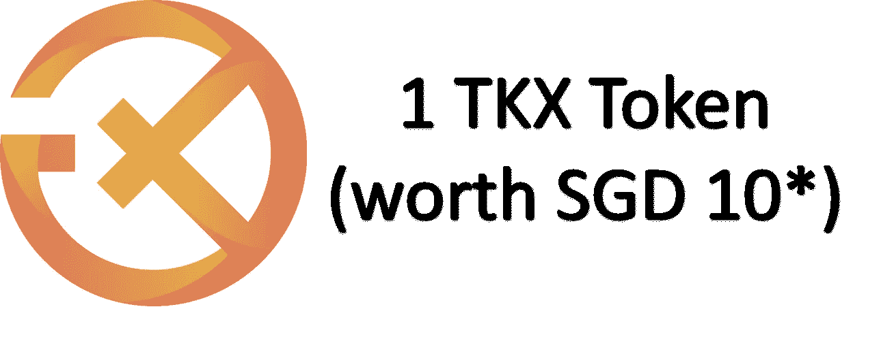

# Tokenize Exchange —接收特殊附属合作伙伴推荐链接— 3TKX

> 原文：<https://medium.com/coinmonks/tokenize-exchange-receive-special-affiliate-partnership-referral-link-5-tkx-1-tkx-free-fff26af3b98c?source=collection_archive---------3----------------------->

[https://tokenize.exchange/register?invite_code=J9EJp](https://tokenize.exchange/register?invite_code=J9EJp)

# 免费的钱真的存在吗？是的，它在这里

一些好东西要带给每个人。我刚刚收到了一个附属合作伙伴关系的地位，使 **3TKX 转介，而不是从其他链接的 2TKX** 。

另读: [**如何提现那些免费的 tkx**](https://financialfreedom.quest/how-to-withdraw-your-free-tkx-from-tokenize-exchange-bd2b715e5da5?source=your_stories_page-------------------------------------)

除此之外，如果这还不够好；

1.  不需要押金
2.  不需要交易
3.  只要您通过了 KYC**(了解您的客户流程)，您就可以将 3TKX 存入您的帐户。如果有 Singpass 就更无缝了。

****值得一提的是，对于新加坡居民来说，您可以通过新加坡通(Singpass)游览 KYC。其他国际客户可以通过正常途径。**

> “新加坡个人接入(或 Singpass)是新加坡公民和居民的可信数字身份，可方便、安全地在线或亲自访问数以千计的政府和私营部门服务。—摘自新加坡政府门户网站([https://www.singpass.gov.sg/](https://www.singpass.gov.sg/))
> 
> **记下:**
> 
> **排除列表中的国家:美国、马来西亚、加纳、墨西哥和俄罗斯**
> 
> **非新加坡居民需要护照、移动验证和地址证明。**

务必阅读 3 篇相关文章

## [**如何提现那些免费的 tkx？？？**](https://financialfreedom.quest/how-to-withdraw-your-free-tkx-from-tokenize-exchange-bd2b715e5da5?source=your_stories_page-------------------------------------)

[**什么是稳定积分**](https://financialfreedom.quest/high-yield-interest-stablecoins-from-singapore-context-c8c4f440e82f)

[推荐链接，点击此处](https://tokenize.exchange/register?invite_code=J9EJp)

# 不要错过这些，口袋里的钱

*   [高收益利息稳定增长](https://financialfreedom.quest/high-yield-interest-stablecoins-from-singapore-context-c8c4f440e82f?source=user_profile---------5----------------------------)
*   [90%稳定币& 10%替代币平衡优化](https://financialfreedom.quest/90-10-stablecoin-altcoin-balanced-yet-optimized-combo-55b3183fd3bf?source=your_stories_page-------------------------------------)
*   [如何收回你的免费 TKX](https://financialfreedom.quest/how-to-withdraw-your-free-tkx-from-tokenize-exchange-bd2b715e5da5?source=user_profile---------1----------------------------)
*   [通过简单的两步](https://financialfreedom.quest/free-approx-usd-50-giveaways-by-doing-only-2-simple-steps-7c7d33e2378f?source=user_profile---------0----------------------------)获得约 50 美元的奖励

> 如果你喜欢你读到的或从中受益，请关注并留下你善意的评论。你会得到我找到的最新的赠品信息。

 [## 通过我的推荐链接加入媒体

### 作为一个媒体会员，你的会员费的一部分会给你阅读的作家，你可以完全接触到每一个故事…

金融自由。探索](https://financialfreedom.quest/membership) 

> 加入 Coinmonks [电报频道](https://t.me/coincodecap)和 [Youtube 频道](https://www.youtube.com/c/coinmonks/videos)了解加密交易和投资

# 另外，阅读

*   [Fold App 审核](https://coincodecap.com/fold-app-review) | [Kucoin 交易机器人](/coinmonks/kucoin-trading-bot-automate-your-trades-8cf0ca2138e0) | [Probit 审核](https://coincodecap.com/probit-review)
*   [如何匿名购买比特币](https://coincodecap.com/buy-bitcoin-anonymously) | [比特币现金钱包](https://coincodecap.com/bitcoin-cash-wallets)
*   [币安 vs FTX](https://coincodecap.com/binance-vs-ftx) | [最佳(SOL)索拉纳钱包](https://coincodecap.com/solana-wallets)
*   [比诺莫评论](https://coincodecap.com/binomo-review) | [斯多葛派 vs 3Commas vs TradeSanta](https://coincodecap.com/stoic-vs-3commas-vs-tradesanta)
*   [Capital.com 审查](https://coincodecap.com/capital-com-review) | [港加密借贷平台](https://coincodecap.com/crypto-lending-hong-kong)
*   [如何在 Uniswap 上交换加密？](https://coincodecap.com/swap-crypto-on-uniswap) | [A-Ads 审核](https://coincodecap.com/a-ads-review)