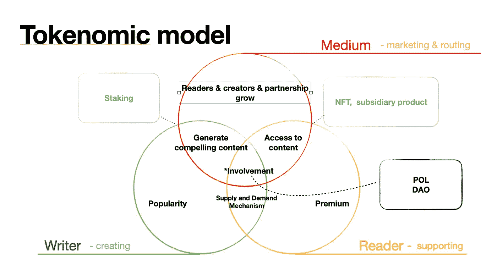
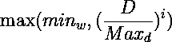

# SAAS 中的标记示例:中等

> 原文：<https://medium.com/coinmonks/tokenomic-examples-in-saas-medium-6878f2e93ddc?source=collection_archive---------17----------------------->

本文将是我上一篇文章“SASS 平台的 Tokennomics 模型”的进一步讨论，也是未来几周 Tokennomics 系列的第一篇文章，因为发送实际和实用的示例比仅仅描述图表和用冗长的注释解释一些技术名词更合理。

我们上周已经定义了一些必要的前提:

1.  供给/需求机制
2.  政客
3.  留住客户(*可持续的外部现金流)

model structure

## 1.供求

出色的智能合同设计和稳健的激励制度将是大多数项目未能成为的成功协议的主要思想和关键。为了实现上述愿景，****需求和供给**法则必须被纳入，被烘焙到你的表征模型中。**

**让我们举一些关于 web2.0 的明显例子，优步。**

**我们可以看到价格浮动取决于多种因素，如距离英里数，乘客数量，天气，遵循供求规律；因此，价格和服务的数量/质量都归结于供给/需求。优步可以在他们现有的模式中引入一些 web3.0 的想法，通过披露价格是如何计算的或者奖励长期忠诚的客户来使其变得完整。**

**回到媒介的话题，我们更清楚地定义了媒介的平台在销售什么，因为不难猜测，作者在平台上制作和发布的文章是这个 Tokenomic 模型的核心产品，此外，这也是我们说 C2C 是我们的理想模型的原因之一，因为客户和卖家都可以影响价格。**

## **2.协议自有流动性**

**老实说，获得自己的治理令牌的概念不应该仅限于这种模型，而是应该适用于所有在密码世界中寻找可持续商业模型的协议。**我厌倦了看到协议通过奖励和发布他们的治理令牌来承诺高 APY，而不关心通货膨胀问题，这对我来说与欺骗客户没有任何区别。****

**目前有一些关于 POL 在链上工作的成熟想法，特别是以太坊上的 Curve 和 Olympus，Solana 上的 PsyOptions 和 Lifinity 都是非常值得一试的参考。**

**当保留治理令牌时，价格稳定性保证了我们可以通过提出独家和创新的功能来为令牌增加一些价值。例如，Medium 可以通过允许读者锁定治理令牌以换取投票托管令牌来改善当前的鼓掌功能，我们不仅可以定义谁是可靠和忠诚的，还可以使用有限的投票权来选择高质量的文章或优秀的读者。除此之外，读者还可以为个人作者提供资金和精神支持，分享收入。**

## **3.留住客户**

**我从“保持可持续的现金流”重新定义了这个假设，因为前一个前提不够通用和全面，不足以额外解释那些不包括 Defi 的协议。在 Defi 中，专注于创造流动性和避免通胀等问题可能是最简单和最容易的，这些问题可以通过奖励稳定的承诺收益率回报、锁定代币和发行债券或期权来解决。**

**然而，对于那些协议来说，这变成了一项额外的任务，比如玩赚游戏(Stepn)或内容共享平台(Audius)。当问及我们如何获得可持续的现金流时，似乎我们渴望如何在我们的应用程序或平台上留住客户。Web3.0 并不是各种应用程序重生和成功的灵丹妙药或药方，事实上，应用程序的第一原则是有用和满足需求，不能丢弃。**

**因此，它将方便那些成功的 web 2.0 公司，如优步或 Medium，因为他们拥有坚实的客户基础、稳定的收入和健康的商业模式，以支持和探索与区块链和加密相关的功能。更合理的说法是，web3.0 公司也应该让 Dapp 变得有吸引力、可用，但与 web 2.0 技术不同，这不是阻止创业公司进入 web 3.0 世界，而是通过结合区块链技术，即 NFT、元宇宙发明等来实现。**

# **互动**

**可以看出，出色的智能契约设计协议在 web 3.0 中表现出色，脱颖而出，这不仅需要设计商业想法，还需要承诺参与者之间的共享机会和公平性。**换句话说，平台需要提出一个包含两个想法、一个供给/需求机制和扩展功能的程序。****

**有很多关于供给/需求机制的想法已经推出并得到测试，例如，**的 xyk 模型，curve DAO 模型**等，请自行参考白皮书，目前，我已经提出了一个从 xyk 模型转化而来的基本机制，该机制简单地放弃了在池中存放单个令牌来确定投票权重。**

**简单地说，假设我们有下面的等式来确定投票权重，为了使它更精简，简单地使 **i= 1** ，**

****

**例如，每个池代表一个写入者，该写入者是根据一些标准(如高读取率或追随者)选择的。当锁定了其治理令牌的读者根据其投票托管令牌的数量可以被视为平台的忠实客户和贡献者时，他们有权为他们心爱的作家投票，以分享他们的收入或投票作家获胜时的额外奖励。**

**深入到一个公式中，将投票权重的最小值和存款的最大值设置为 1 和 100，这意味着当单个池的投票令牌的存款达到最大值时，我们得到投票权重的最小值。这种设计的目的是防止著名作家的垄断，并让次要作家仍然有机会出现，尽可能分散。**

**当互动、供应和需求机制顺利运行，没有治理令牌膨胀或贿赂选民等问题时，我们可能会进一步为我们的商业模式增加更多价值，为投票获胜者建立一些独特的功能，如铸造独家 NFT 或免费品牌和营销，试图通过一些刻录和备份方法使投票更有吸引力和稀缺。**

**虽然该模型有一些基本但简陋的想法，但核心概念已经列出，以原型 SAAS 平台应该是什么样子。我将继续深入到相关的实现中，比如戴的 Maker DAO，试图把这个概念做得更完美。**

**感谢您的阅读。**

**: )**

> **加入 Coinmonks [电报频道](https://t.me/coincodecap)和 [Youtube 频道](https://www.youtube.com/c/coinmonks/videos)了解加密交易和投资**

# **另外，阅读**

*   **[如何在 Uniswap 上交换加密？](https://coincodecap.com/swap-crypto-on-uniswap) | [A-Ads 审核](https://coincodecap.com/a-ads-review)**
*   **[WazirX vs coin dcx vs bit bns](/coinmonks/wazirx-vs-coindcx-vs-bitbns-149f4f19a2f1)|[block fi vs coin loan vs Nexo](/coinmonks/blockfi-vs-coinloan-vs-nexo-cb624635230d)**
*   **[本地比特币审核](/coinmonks/localbitcoins-review-6cc001c6ed56) | [加密货币储蓄账户](https://coincodecap.com/cryptocurrency-savings-accounts)**
*   **[什么是保证金交易](https://coincodecap.com/margin-trading) | [美元成本平均法](https://coincodecap.com/dca)**
*   **[支持卡审核](https://coincodecap.com/uphold-card-review) | [信任钱包 vs MetaMask](https://coincodecap.com/trust-wallet-vs-metamask)**
*   **[Exness 回顾](https://coincodecap.com/exness-review)|[moon xbt Vs bit get Vs Bingbon](https://coincodecap.com/bingbon-vs-bitget-vs-moonxbt)**