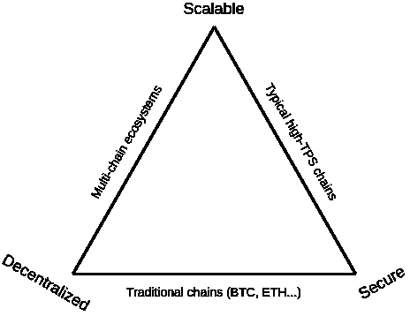
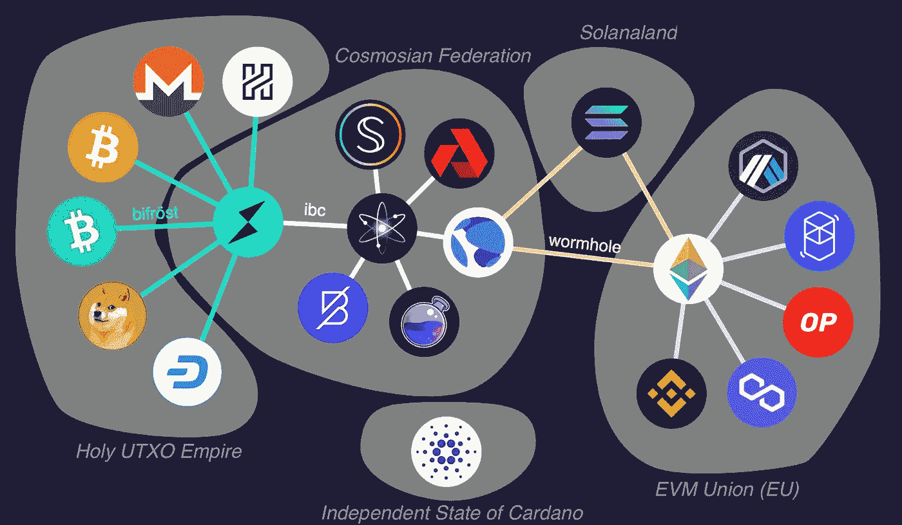

# 词汇组学 101:在链条之间

> 原文：<https://medium.com/coinmonks/tokenomics-101-in-between-chains-dc76050f2377?source=collection_archive---------3----------------------->

我最近加入了第二季的团队道，作为体验的一部分，我必须承诺 1 wxDAI 来获得团队道的股份。很简单，我想，只要把一些 ETH 交换给 DAI，把它桥接到 xDAI，然后把它包到 wxDAI。

Gas fees on Ethereum mainnet

我忘了交易费。用价值 3 美元的 ETH 去换戴，我会损失价值 32 美元的 ETH。如果你问我的话，我会觉得很离谱。这让我开始思考，我找到了一些我不久前买的 Matic/Polygon，把它换成了 DAI，并以不到几分钱的费用桥接到 xDAI。低交易费感觉很棒，它们让你想使用 Packy 为 Solana 描述的系统:

> 你做任何事情都不需要三思，因为它进展如此之快，花费如此之少。这才是重点。**感觉就像在使用互联网。**

低交易费很好，但每个链都有其实施方式的理由，以太坊/比特币有一个证明其高交易费的理由。

Vitalik 称之为[可扩展性三难困境](https://vitalik.ca/general/2021/04/07/sharding.html)(见下图)；一些链会牺牲安全性和/或分散性来获得可伸缩性。因此，如果我在 Polygon 上的交易进行得很快并且成本很低，这意味着将会有更少的验证器验证交易(更少的分散)和/或网络将会整体变小，从而更容易受到 51%的攻击。

每个区块链都必须决定它想在哪里玩，并且可能会有不同的链用于不同的用例。10 年后，Defi 将不会只在一条链上运行，而是由许多不同的链组成，每条链都有自己的优缺点。这些链当然会连接起来，就像 Polygon 连接到以太坊，以太坊连接到 xDAI。这种连接被称为桥梁，其中许多已经建成。

Incomplete map of bridges between ecosystems

Larry0x 的这篇精彩综述展示了一系列不同的 L1 链、L2 解决方案和侧链，以及它们之间的相互联系。这张图片错过了许多不同的链条和桥梁，但我认为它仍然是最重要的链条和桥梁以及生态系统如何进化的一个很好的概述。让我们简单看一下不同类型的链，它们是如何连接的，然后进入令牌是如何流动的。

大多数桥梁是这样工作的:链 A 上的代币被锁定，而链 B 上的代币被铸造成等量的代币。将代币移回链 A 会烧掉链 B 上的代币，并解锁链 A 上的代币。魔法发生在链之间的通信中，James Prestwich 对此解释得很好。

不同的链和不同的层不能简单地相互发布事务，因此需要在它们之间实现一些逻辑。让我们浏览一下上图中的一些连接，看看这两个连接之间是如何工作的。

# 侧链桥

上图中的 EVM 联盟显示了[多边形](https://polygon.technology/)和[乐观](https://optimism.io/)与以太坊相连。Polygon 有两种不同的链产品，但其中一种是侧链，乐观是第 2 层乐观[汇总](https://www.youtube.com/watch?v=7pWxCklcNsU)解决方案。

通常，侧链被描述为具有独立共有机制的链，其通过桥与主链相连，并与主链相容。对于 Polygon 的侧链，这意味着它有自己的验证器、标记机制和令牌。桥在主链和侧链之间移动令牌。此外，Polygon 可以运行以太坊虚拟机，这使得它与主链兼容。与主链相比，部署应用程序的人几乎不会注意到任何差异。

Sidechains interacting via a bridge

让我们以我将一些 DAI 移动到 xDAI 的场景为例。DAI 是以太坊主链上的 ERC20 令牌，xDAI 是 xDAI 侧链的令牌。两条链条通过[桥](https://www.xdaichain.com/about-xdai/faqs/bridges-xdai-bridge-and-omnibridge#xdai-bridge-faqs)连接。[桥是相互连接的两条链上的](https://stonecoldpat.medium.com/a-note-on-bridges-layer-2-protocols-b01f8fc22324)智能契约。要在链之间移动令牌，xDAI 需要在侧链上铸造，DAI 在主链上的合同中锁定。要还戴，需要在侧链上烧 xDAI 才能解锁主链上的戴。整个过程由侧链的验证者控制，他们可以访问两个合同并可以签署交易——假设有多数。

这是一个提高可伸缩性的简单解决方案。不利的一面是降低了安全性和分散性，因为你的资金是由侧链而不是主链的验证者来担保的。

# 第 2 层汇总桥

第 2 层解决方案使用第 1 层共识机制，从上面的地图来看，乐观的是以太坊的第 2 层，因此将由以太坊挖掘器/验证器保护。第 2 层通过允许计算在链外发生，但在链上汇总事务数据来扩展。有多种方式可以做到这一点，[汇总](https://research.paradigm.xyz/rollups)只是一种可能的选择——Vitalik 进入更多的[细节](https://vitalik.ca/general/2021/01/05/rollup.html)。

Bridging between layers

层 1 和层 2 之间的桥与侧链略有不同。资金将存入一个智能合同，由主链担保。智能合约会将你的资金映射到第二层(到一个 [merkle 树](https://media.consensys.net/ever-wonder-how-merkle-trees-work-c2f8b7100ed3)，但是你保持对你资金的控制。即使第 2 层停止运行，您仍然可以访问智能合约中存放的资金。

为了将 ETH 或其他 ERC20 令牌存入第 2 层，需要为第 2 层激活钱包。在第 2 层，您拥有与第 1 层完全相同的本地令牌。Mainnet 应用程序可以迁移到第 2 层，越来越多的人正在这样做，允许您使用相同的应用程序和相同的令牌，交易费用低得多，但 mainnet 的安全性。

Moving ETH from layer 1 to layer 2

将一些 ETH 移动到第 2 层涉及激活第 2 层并将资金存入智能合同。然后，这些资金将在 merkle 树(仍称为 ETH)中离线表示，merkle 树跟踪所有交易，并将这些交易的证明发送回主链，余额在提取回第 1 层后进行结算。

这是一种非常安全的扩展方式，因为您可以控制自己的资产。与 sidechain 相比，更先进的技术意味着许多东西仍在开发中。

# 第 1 层到第 1 层—虫洞

图中大多数其它网桥都是第 1 层到第 1 层网桥。这包括 Thorchain 的 Bifrö st，Inter block chain Communication(IBC)和[虫洞](https://solana.com/wormhole)。先说 [Terra 到以太坊](/terra-money/terra-goes-live-on-wormhole-v2-12df49d446d2)或者 Solana，都是通过虫洞连接的。

类似于第二层网桥，[虫洞](/certus-one/introducing-the-wormhole-bridge-24911b7335f7)本身并不是一个区块链网络。相反，它依赖于它所连接的链条的共识。它使用 Guardians、跨链 oracles 来认证它所桥接的链上的令牌处理。监护人是验证者，拥有经过验证的跟踪记录和一致的激励——通过在根链(Solana)中定位。

当把代币从以太坊转移到索拉纳时，守护者会查看以太坊日志，确认是否锁定了 ERC20 代币。如果大多数⅔守护者通过签署来确认这一事件，索拉纳上代币的铸造将会被虫洞契约触发。

当转移到 Terra 或从 Terra 转移时，这个过程与[类似](/terra-money/terra-goes-live-on-wormhole-v2-12df49d446d2)。

Wormhole bridging between different chains

从索拉纳转移到以太坊，锁定索拉纳智能合约中的资金，一旦监护人确认锁定，他们将在以太坊上签署铸造交易。用户将把铸造的代币放入提供的钱包中(在此[试用](https://www.wormholebridge.com/#/move?from=SOL&token=WETH))。

虫洞是一种简单易行的连接链的方式，但是使用来自一个链的多重签名和验证器的事实使得它不如其他选项安全(IBC)。

# 第 1 层到第 1 层—区块链间通信

Inter block chain Communication(IBC)是全球最常用的构建区块链的框架 [Cosmos SDK](https://v1.cosmos.network/sdk) 的一部分。建立在宇宙上的区块链有 Terra，Avalanche，Thorchain 和许多其他的。建立在 Cosmos 上可以方便地访问 IBC——但是 IBC 也可以在 Cosmos 生态系统之外实现。IBC 更像是一个基础设施组件，可用于构建链间通信的应用——令牌传输只是一个可能的用例。

这本指南很好地解释了 IBC 如何运作的细节。神奇的是 relayer 角色监视其他链的活动并存储其他链块头的中继。假设链 A 信任链 B 的一致机制，它现在可以保留存放和锁定资金的证据，从而可以在另一端解锁/铸造资金。

该图显示了连接宇宙生态系统中两条链的简化版本。连接到生态系统之外的链更加复杂，需要在中继客户端进行额外的开发。

Inter Blockchain communication

将资金从一个链移动到另一个链会将资金锁定在链 A 上的智能合约中。链 B 的中继器将通过链 A 的块标题跟踪此事件。然后，链 B 的智能合约将触发代币的铸造。

与侧链和虫洞相比，IBC 的中继实现提供了一个更安全的选择，因为链只依赖于它们自己的共识。

# 第 1 层到第 1 层— Thorchain

Thorchain 不仅仅是一座桥梁，它还是一个去中心化的交易所。因此，它允许交换令牌，但不是像 Uniswap 那样只在一个链上进行交换，而是允许跨链交换。Thorchain 通过使用类似于虫洞的方法来实现这一点。Thorchain 使用一个跨越验证者的[门限签名方案](https://eprint.iacr.org/2019/114.pdf) ( [TSS](/thorchain/thorchain-publish-tss-whitepapers-d3ea66913721) )来签署交易，而不是一个锁定/解锁资金的 multisig 智能合同。TSS 使用密码术而不是智能合约，因此允许它与比特币等链进行交互。

Thorchain 验证器(Thornode)为所有可以与之交互的链运行一个节点，因此如果一个 Thornode 支持比特币和以太坊交易，它将必须为这两个网络运行节点。Thornodes 可以访问他们可以与之交互的链上的金库，并可以通过 TSS majority 签署这些金库的交易。节点将观察链 A 的资金锁定，并在锁定完成时释放链 B 上的资金。下图显示了令牌交换方式的高度简化版本。

Thorchain — more than just a bridge

由于 Thorchain 不仅是一座桥梁，也是一个交易所，它与流动性池一起工作。流动性提供者可以在每个链上存放资金，以确保代币的交换并获得收益。为了启动从 ETH 到 BTC 的交换，需要连接每个链的钱包，一旦资金被发送，Thornodes 观察进入金库的交易处理。完成后，BTC 的出站交易将被签署，用户将收到其 ETH 的 BTC。

通过 Thorchain 的桥接依赖于不同链的验证者，TSS 的方法非常类似于控制资金的 multisig 智能合同。

# 比较

值得将链选项之间的所有这些差异纳入一个视图中:

有多少链就有多少桥，我在这里肯定漏掉了一些。随着生态系统的发展，在链之间移动令牌将变得更加容易，这反过来将允许更多的链存在。如果令牌可以转移，并且 Dapp 使用特定的链会有一些好处，那么就没有什么会阻碍开放的生态系统。这可能有一天会让连锁店退居幕后。一个应用程序的用户不在乎它是运行在以太坊、索拉纳还是 Terra 上，只要用户能以良好的利率借到钱。

拉乌尔·帕尔最近加入了无银行播客，我推荐你收听这一集。他描述了一个未来，你可以向钱包发送代币，而不必担心对方的钱包在哪个链条上。基础技术——桥梁——会处理这方面的问题。你可以接到某人的电话，却不知道他是哪家网络供应商，也不知道你连接的是哪个手机信号塔。Crypto 还有很多需要改进的地方，而 bridges 在这里发挥了很大的作用。

> 加入 Coinmonks [电报频道](https://t.me/coincodecap)和 [Youtube 频道](https://www.youtube.com/c/coinmonks/videos)了解加密交易和投资

## 也阅读

 [## 杠杆代币[多头代币]终极指南

### 杠杆化令牌是具有杠杆化风险敞口的 ERC20 令牌，不考虑保证金、要求、管理…

medium.com](/coinmonks/leveraged-token-3f5257808b22)  [## 最佳加密交易所| 2022 年十大加密货币交易所| CoinCodeCap

### 哪一个是最好的加密交换？在本文中，我们将根据多种加密货币列出 10 大加密货币交易所

coincodecap.com](https://coincodecap.com/crypto-exchange)  [## 2022 年 2 月值得关注的三大游戏代币| CoinCodeCap

### 排名前 3 位的游戏也占交易总量的 85%以上。Defi 王国、Axie Infinity 和 Pegaxy…

coincodecap.com](https://coincodecap.com/top-3-gaming-tokens-to-look-out-for-in-february-2022)  [## 2022 年最佳加密交换平台| CoinCodeCap

### 随着时间的推移，我们大多数人将转向 dex 以获得更好的安全性和隐私。因此。在这里，我们将讨论…

coincodecap.com](https://coincodecap.com/best-swap-platforms)  [## 10 大最佳在线赌场|赢得并赢取免费 BTC 2022 | CoinCodeCap

### 接收、支付和赚取加密货币| |有各种各样的最佳在线赌场可供选择，有可能…

coincodecap.com](https://coincodecap.com/best-online-casinos)  [## 2021 年最佳加密借贷平台| 6 大比特币借贷平台

### 获得比特币和其他加密货币的最佳贷款利率

medium.com](/coinmonks/top-5-crypto-lending-platforms-in-2020-that-you-need-to-know-a1b675cec3fa)  [## 2021 年 6 大最佳硬件钱包|顶级加密硬件钱包[更新]

### 最好的加密货币硬件钱包是绝对必要的。我们将在 NGRAVE、Ledger Nano X 和…

medium.com](/coinmonks/the-best-cryptocurrency-hardware-wallets-of-2020-e28b1c124069)  [## 加密交易机器人——19 款最佳免费加密交易机器人

### 2022 年币安、比特币基地、库币和其他密码交易所的最佳密码交易机器人。四进制，位间隙…

medium.com](/coinmonks/crypto-trading-bot-c2ffce8acb2a)