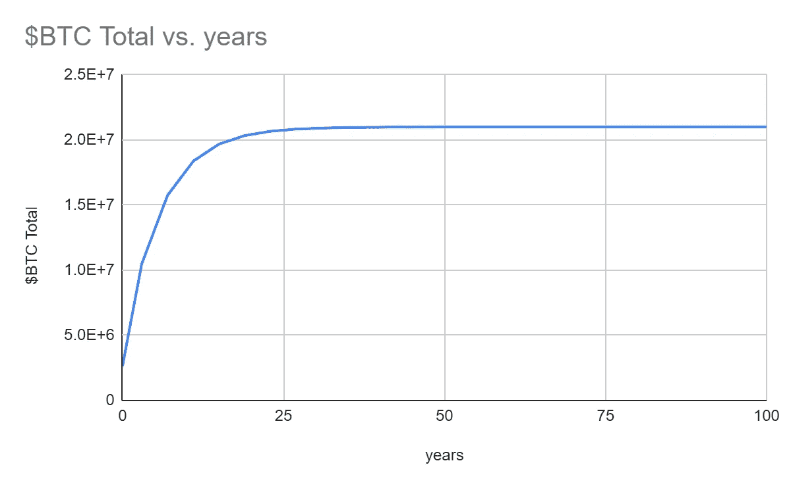
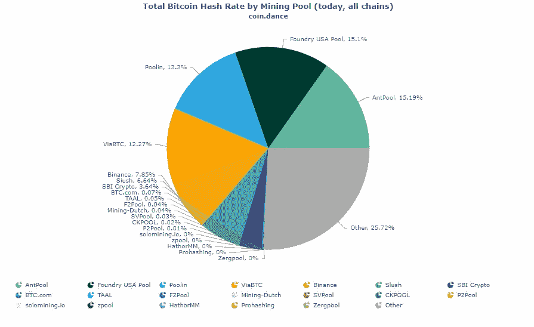

# 令牌组学

> 原文：<https://medium.com/coinmonks/tokenomics-2f4883a12414?source=collection_archive---------29----------------------->

你好。

我的名字叫 Ty，希望是“那个最终帮助我理解加密令牌组学的人”的简称。加密货币教育中一个反复出现的主题是，我发现自己解释了很多“书呆子行话”。“令牌经济学”更直观的名字应该是“经济学 2.0”。对我来说，教授令牌经济学的最佳方式是将它与现有的经济思想联系起来。

讨论加密货币的时候，最好从头说起——用比特币。比特币的起源是政治性的——这个习惯不会很快消失。这是“区块链技术”的第一个推广实例。本质上，我们使用一种称为“哈希函数”的奇特函数来快速验证和保护数据块。这是通过一堆电脑同时玩一个猜谜游戏来完成的——随机性确保了游戏的公平性，所有人都有机会参与。区块链中的第一个地块被称为“起源地块”。虽然比特币区块链上的区块只包括交易数据和采矿奖励，但 genesis 区块很特殊，因为它不包括交易——只包括数据。比特币的 genesis block 说:

# 财政大臣濒临第二次银行救助

它指的是 2008 年的金融危机，在很大程度上被认为是一种声明，即需要对我们政府不公正的金融部门采取一些措施。

事实是，美国金融体系并不新鲜，也不是我们发明的。我们从荷兰人那里学来的。美国独立战争开始前，荷兰人与寡头和贪婪的资本家之间的问题越来越严重，他们利用了他们的全球证券交易所/战争机器/供应链，即荷兰东印度贸易公司。荷兰难以想象的商业扩张的“黄金时代”即将结束，与英国相比，他们的战争机器并没有那么大。对人民征收的极高税率不能再提高了，随着基础设施开始崩溃，经济严重依赖消费主义。这无助于该地区的生活成本——这是非同寻常的。这很重要的原因是:为了理解经济学 1.0 是如何工作的，你必须知道它来自哪里。荷兰人在美国独立战争期间提供了很多资源来对抗英国人。事实上，就像巧合一样，英国人和荷兰人之间的战争将在美国独立战争结束仅一年后结束。

荷兰东印度公司创建了第一个资本市场(更广为人知的是股票市场)。他们绘制地图，并与附近地区分享，以开辟通往新贸易港口和前哨的道路——比如班达群岛，他们在那里剥削、杀戮和破坏当地文化，以实施垄断。几乎立刻，交易所的股东激进主义活跃起来，以解决关键的治理问题——主要围绕着集权和剥削。荷兰东印度贸易公司也将从奴隶贸易中受益(并在很大程度上促进了奴隶贸易)。尽管是私人融资，荷兰政府还是将该公司建立为一个“官方殖民机构”，这样它就可以合法地发动战争，甚至铸造自己的货币。

现在我们知道了股票市场的由来，让我们来看看它是如何运作的。

首先我们从金银开始。虽然白银以前一直是世界上的价值储存手段，但艾萨克·牛顿(Isaac Newton)在 1717 年犯下的一个“错误”基本上在很久以前就让白银退出了流通。通过一系列其他事件，黄金成为了世界标准——但是为什么呢？答案与它在金属市场的价值和稀有性有关。金币总是有价值的，因为它们是由有价值的东西制成的——不管政府赋予它们什么价值。黄金可以用于生物医学，制造珠宝或电路，等等。所以，金币本身就有价值。此外，黄金是一种元素，我们假设地球上只有这么多。每当我们使用、购买或储存黄金时，可供未来使用的黄金就越少。随着时间的推移，这赋予了它更多的价值，因为它变得更加罕见。这就是它被称为“价值储存”的原因。

比特币是价值的替代存储。这是因为它被设定为随着时间的推移生产越来越少。起初，一个发现新积木的人每块可以得到 50 美元 BTC。现在，他们每块只能得到 6.25 美元 BTC。这是因为大约每隔 4 年(即 21 万个区块)，BTC 奖给一名成功矿工的金额就会减半。比特币大约有 14 年的历史，所以它经历了 3 次减半事件。这意味着:

(0-4 岁)50 美元 BTC

(5 至 8 岁)25 美元 BTC

(9 至 12 岁)12.5 美元 BTC

(13-现在年)6.25 美元 BTC

如果我们长期观察，图表看起来像这样:

BTC Total Suppply from 2008–2108

比特币就是这样变得越来越稀有的。如图所示，大约只有 2100 万美元的 BTC 会被生产出来，并且每四年我们都会得到一个严酷的事实提醒。但是它的背后是什么呢？

这是一个有趣的问题。要理解加密货币背后是什么，你必须理解它“做什么”。比特币真正“做”的是创造一种分散的方式，在比特币网络上发送和存储金钱。如果它独自拥有这种能力，这将是一项显而易见的投资。但事实并非如此。事实上，对于这个目的来说，它甚至不是最环保或最快的。那么，为什么它是“第一天”加密货币呢？因为这是第一次。

在我看来，创世积木告诉了用户它的价值。这是一个想法，也许我们应该从我们的金融体系的许多失败中吸取教训，提出一个新的体系——一个公平的体系。一种观点认为政府不应该控制货币——任何人都不应该。很明显这种力量对我们来说太强大了。所以还是交给数学和计算机来提供信任吧。比特币的背后是去中心化的信任。

然而，可悲的是，比特币本身似乎成了奥地利经济学严酷的牺牲品。比特币的淘金热已经发生了。极大量的“分散货币”被冷藏在大型交易所，如 Crypto.com、比特币基地和双子星交易所。所以供给不是很分散。然后是散列率集中化的问题。唯一众所周知的像比特币这样的工作证明网络的“黑客”被称为 51%攻击。为了做到这一点，你需要拥有超过 50%的网络散列率。然而，hash rate 由数量少得惊人的组织拥有，那么我们真的有多安全呢？

比特币的价值似乎存在第二十二条军规。它的价值根植于信任。这是分散的大众拥有自己的货币的一种方式。他们可以不受控制或“促进”我们几乎所有交易的法规和压制性贸易公司的约束。然而，随着它受到欢迎和监管，美元价值上升。当它变得不那么真实的时候，怎么可能值更多的钱呢？正是因为这个原因，我拥有一些比特币，但很少。

然而，工作证明(使比特币安全的算法)为许多网络提供了动力！它支持莱特币、比特币现金，甚至像 Ravencoin 这样允许 NFT 交易的网络。我们当然需要未来工作网络的证据(尽管他们的环境问题)，因为我们绝不能忘记什么是“真实的”。工作共识的证明将**真正的**能量转化为**真正的**安全和信任。我们需要这些网络——尤其是当我们对其他网络或市场失去信心的时候——就像当人们对经济失去信心时，黄金投资会增加一样。

将比特币比作黄金 2.0 实际上非常有效(当你忘记它的价值是基于它不断失去的东西这一事实时)。比特币将不会像现在这样“冒险”。比特币将会像今天的黄金一样成为稳定可靠的收益者。这也意味着你应该三思而后行如何花你的比特币。你会用金条买麦当劳吗？不，你应该使用像美元一样的法定货币。所以不要用比特币。但是，我们来介绍一下 Fiat2.0。

美元已经很久没有成为金本位了。当它是，你可以字面上得到真正的黄金回来为您的美元。如果可以的话，它是一种“大宗商品支持的货币”，比如比特币或黄金，这两种货币分别是金融独立性或其在金属市场上的价值。既然它不在金本位制上，它就是一种“法定货币”。法定货币“受到我们对政府保持其价值的信念的支持”。但这并不是**真正支持的**是吗？

不，美元实际上是基于美国经济的实力。这就是为什么政府机构给体育联盟、银行和大公司如此多的资金。美元允许你做什么？它允许您与任何接受美元的人进行交易。在美国，那是每个人(根据法律)。美国企业和产业越大、越成功，其货币就越坚挺。

这就把我们带到了网络 3。智能合同网络(最初是 Ethereum，但现在是 Cardano，Polkdaot，Solana 等)以不同的方式使用区块链。本质上，他们正在创造一个新的互联网层次——一个更快、更安全、更分散的层次。这些网络的货币可以认为是 Fiat2.0。

这是因为这些网络运行在“利害关系证明”上。从技术上讲，Ethereum 还没有，因为它速度慢，而且存在基础问题，但以下内容将对 Eth2.0 有效。“股份证明”网络在技术上不像比特币那样有限量的硬币供应。那么，为什么随着时间的推移，这个值不会归零(比如狗会怎么做)？因为这些网络得到了运营这些网络的企业的支持。如果一个崭露头角的体育博彩平台出现在卡达诺，那么卡达诺代币($ADA)的价值将会增加，因为更多的人需要它来使用博彩服务。这些不同网络的令牌供应是以不同的方式管理的，所以您必须自己进行研究，找到您更喜欢的。但是，最受欢迎的有:

币安的“烧伤”模型——本质上，它们是一个集中的智能合同网络。所以他们从每笔交易中分得一杯羹(就像美国政府用美元买东西一样)。然后，每隔一段时间，他们会拿走所有多余的代币，然后寄给一个没人能找到的破钱包。这被称为“燃烧”,有助于保持低流通供应量和高价格。这是在对币安公司充满信心的情况下进行的。

Ethereum 的“气体”模型——ether eum 有一个聪明的想法，就是为每笔交易燃烧一些交易费用。在这种情况下，这是一个实验，看看供应是否会自我调节——就像你必须如何燃烧汽油才能使用汽油来获得更多汽油一样。如果资本主义知道一件事，那就是如何燃烧。

你可能会想——如果我不能用我的$BTC 买东西，那我用什么买东西呢？这些。就像你用像美元这样的法定货币支付食品杂货一样，你可以用$ETH、$ADA、$DOT、$BNB 和其他货币进行日常购物。基本上，这些网络都在竞争通过广告、改进的开发体验、改进的用户体验等等来带来最多的业务。他们在吸引业务方面越成功，他们网络上的交易越多，他们的代币就越值钱。

股权证明/智能合约网络的令牌经济学就像 ETF2.0 一样。当你购买 ETF1.0 时，你购买的是一只基金，它将你的全部资金分配给一组公司。这通常是一种“更安全”的策略，因为你不会“把所有鸡蛋放在一个篮子里”，而且这些公司是“由专家审查的”。当您购买$ETH 或$ADA 时，您购买的是一个代表该网络支持的所有业务和商务的令牌。如果你认为你最喜欢的在线应用程序之一将部署在区块链网络上，这可能是投资该网络货币的好时机(或者不是，法律要求我分享我不是财务顾问)。

所以我们现在有 Gold2.0，ETF2.0，Fiat2.0，那么只有公司股票呢？在 web3 上，我们将没有应用程序，我们将有 Dapps。主要的区别是应用程序是由秘密的公司服务器驱动的，我们作为消费者支付费用，这样他们就可以支付费用来保证它们的安全——dapp 使用区块链。Web3 公司利用智能合约，如亚马逊、Spotify、Google Drive 等的替代品，提供新的或颠覆性的在线服务。然后他们不需要自己托管所有的服务器，网络验证器会为他们处理这些。此外，与智能合同的所有交互都在区块链中详细说明，因此非常透明和安全。如果你想专门了解加密货币领域的公司，而不仅仅是所有的大型网络，你可能会想查找“web3 业务”、“最佳 dapps”和“数字资产业务”等关键词。但是，请做你的研究，不要投入任何你不能完全失去的东西。

最后还有 stablecoins。Stablecoins 是一个值得解释的话题，但本质上，它们是一种“锁定”价值的加密货币。有许多美元稳定货币，如$TUSD，$USDC，$GUSD 等等。有些人用数学来确保与美元近乎完美的 1:1 的交易比例，有些人干脆把真正的美元锁在金库里，以便为他们拥有的每一美元生成一个数字货币。这就是系绳公司(TUSD)的工作方式，他们接受美国政府的审计，以确保他们拥有他们所说的资金。Stablecoins 非常适合那些希望利用加密货币收益而又不完全投入该领域的人。货币的价值将始终保持在 1:1，你可以通过某些交易所被动地获得高达 12%的 APY。有趣的事实是，对加密货币的大部分监管将围绕稳定的硬币，因为它们是政府代币的数字表示，他们喜欢对它们拥有绝对的控制权。

总之，像比特币这样的工作证明网络将成为未来经济学的基础资产。真正的能量(来自太阳、风或其他)被转换成数字信任。然后用加密货币来奖励为网络贡献计算能力和信任的人。当然，也许一些政治问题应该引导我们专门寻找比特币的替代品。然后是主要的智能合同网络，如以太坊和卡尔达诺。投资这些项目可以被认为是投资一只 ETF(或同时投资许多企业),因为这些网络的价值与该网络促成的所有业务的总和成正比。此外，由于这些网络上的代币是如何创建和管理的，它们是法定货币的绝佳替代品。还有一些稳定的货币，作为新旧经济之间的桥梁，很可能成为政府监管的重点。最后，实际的 dapps 和 web3 业务将会有你需要的令牌来使用它们的服务。他们都以不同的方式做不同的事情，所以你需要在那里做你自己的研究。

> *加入 Coinmonks* [*电报频道*](https://t.me/coincodecap) *和* [*Youtube 频道*](https://www.youtube.com/c/coinmonks/videos) *了解加密交易和投资*

# 另外，阅读

*   [有哪些交易信号？](https://coincodecap.com/trading-signal) | [Bitstamp vs 比特币基地](https://coincodecap.com/bitstamp-coinbase) | [买索拉纳](https://coincodecap.com/buy-solana)
*   [ProfitFarmers 回顾](https://coincodecap.com/profitfarmers-review) | [如何使用 Cornix 交易机器人](https://coincodecap.com/cornix-trading-bot)
*   [十大最佳加密货币博客](https://coincodecap.com/best-cryptocurrency-blogs) | [YouHodler 评论](https://coincodecap.com/youhodler-review)
*   [my constant Review](https://coincodecap.com/myconstant-review)|[8 款最佳摇摆交易机器人](https://coincodecap.com/best-swing-trading-bots)
*   [MXC 交易所评论](/coinmonks/mxc-exchange-review-3af0ec1cba8c) | [Pionex vs 币安](https://coincodecap.com/pionex-vs-binance) | [Pionex 套利机器人](https://coincodecap.com/pionex-arbitrage-bot)
*   [我的密码交易经验](/coinmonks/my-experience-with-crypto-copy-trading-d6feb2ce3ac5) | [《比特币基地评论》](/coinmonks/coinbase-review-6ef4e0f56064)
*   [CoinFLEX 评论](https://coincodecap.com/coinflex-review) | [AEX 交易所评论](https://coincodecap.com/aex-exchange-review) | [UPbit 评论](https://coincodecap.com/upbit-review)
*   [AscendEx 保证金交易](https://coincodecap.com/ascendex-margin-trading) | [Bitfinex 赌注](https://coincodecap.com/bitfinex-staking) | [bitFlyer 审核](https://coincodecap.com/bitflyer-review)
*   [麻雀交换评论](https://coincodecap.com/sparrow-exchange-review) | [纳什交换评论](https://coincodecap.com/nash-exchange-review)
*   [维护卡审核](https://coincodecap.com/uphold-card-review) | [信任钱包 vs MetaMask](https://coincodecap.com/trust-wallet-vs-metamask)