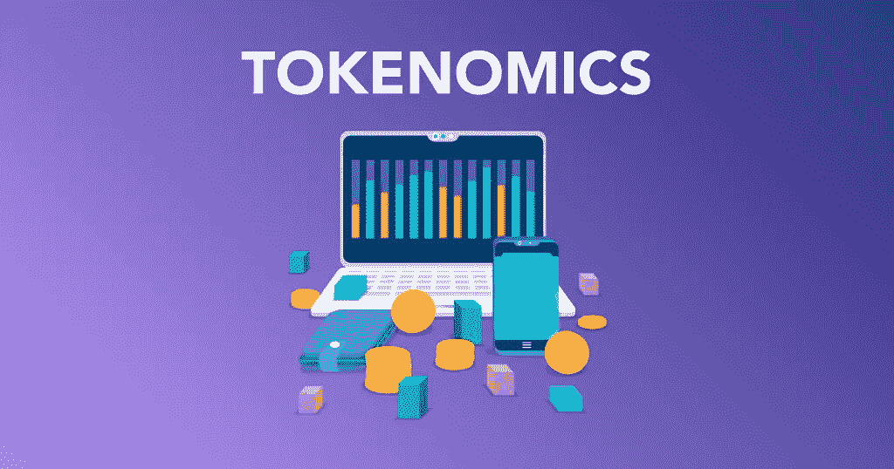

# 令牌组学:决定密码成功的 4 个因素

> 原文：<https://medium.com/coinmonks/tokenomics-4-factors-that-determine-a-cryptos-success-858ee7a0cf94?source=collection_archive---------1----------------------->

## 令牌组学成功因素

[令牌组学](/coinmonks/understanding-tokenomics-the-real-value-of-a-token-6e798c9a442e)是加密货币领域的一个重要概念，它分析了可能影响项目令牌未来的多个关键因素。

让我们看看决定 crypto 成功的因素是什么！

# 什么是加密令牌组学

从术语“令牌”和“经济学”的组合中产生的[令牌经济学](/coinmonks/understanding-tokenomics-the-real-value-of-a-token-6e798c9a442e)是一个至关重要的概念。然而，在加密货币领域，它缺乏一个普遍认可的定义。然而，“代币”和“经济学”这两个词是更好地理解我们这个话题的绝佳切入点。

经济学是一门社会科学，主要通过生产、分配和消费产品和服务来分析个人、组织、政府和国家如何分配资源。另一方面，令牌指的是基于现有区块链的非本地数字资产(例如，ETH 是以太坊的本地加密货币，而项目可以通过 ERC-20 标准推出自己的可替换令牌)。

结合这两个定义，我们可以得出结论，代币经济学是探索代币经济所有基本部分的科学，包括关键因素，如其效用、供应、价格稳定性、分配和治理。

# 为什么记号组学在密码学中很重要？

就像中央银行如何利用与各自法定货币相关的货币政策一样，令牌经济学的适当设计、管理和执行允许项目团队围绕其解决方案创造高效经济，促进生态系统和令牌价格的增长。

从投资者的角度来看， [tokenomics](/coinmonks/understanding-tokenomics-the-real-value-of-a-token-6e798c9a442e) 是一个需要考虑的关键因素，因为它对数字资产的未来价格以及项目是否能够实现其路线图中指定的目标有很大的影响。

简而言之，无论团队的专业知识和奉献精神，概念的潜力，以及从早期投资者和风险资本家那里收集的资金数量，糟糕的令牌经济学都可能导致加密项目的最终失败。

# 令牌组学:需要考虑的 4 个关键因素

现在你知道了基础知识，让我们看看什么时候我们可以说一个项目有好的令牌组学。下面，你会发现回答这个问题的四个关键因素。

# 1.效用

效用可能是加密项目令牌组学中最重要的因素。

即使一个代币是通货紧缩的，有最好的价格稳定机制，分配，以及分散和高效的链上治理过程，如果它不被用于任何事情，它也不会值太多。

这同样适用于法定货币，因为它只有在国民使用它进行日常支付、投资和其他交易时才有价值。而这也是过去一些央行打击数字资产的原因。

为了避免前面详述的场景，加密项目团队必须为他们的数字资产提供多种功能，使生态系统及其参与者受益。这方面的例子包括:

*   通过诸如打桩、采矿、高产农业和收入共享等活动获得机会
*   管理
*   平台或整个生态系统中的交换媒介
*   生态系统中其他资产的抵押品(例如，稳定资产)

例如，ETH 的主要用途是支付交易费用以及部署 [dApps](https://ishanshahzad.medium.com/how-to-build-a-full-stack-decentralized-application-dapp-abd5a27292bd) 和智能合约。另一方面，用户利用比特币作为价值储存手段和交易媒介。

一般来说，令牌的效用负责创造需求，如果供应保持不变或减少，需求就会推高数字资产的价值。

# 2.供应和价格稳定机制

加密令牌组学的另一个关键因素是供应和价格。加密项目还必须小心管理其令牌的供应，因为它还在以下方面对其价格产生直接影响:

1.  如果代币的供给增加，而需求保持不变，这将导致其价格下跌。
2.  另一方面，硬币的价格会随着供给的减少而增加(而需求保持不变)。

出于这个原因，如果一个加密项目寻求为投资者带来巨大回报，它可以将代币设计成一种通缩资产，随着时间的推移，这种资产会让很大一部分硬币退出流通。

一个替代方案是创造一种通胀资产，并逐渐降低其通胀率。比特币是一个很好的例子，它大约每四年将每个区块可以开采的新硬币减半，直到 2140 年达到 2100 万 BTC 的最大供应量。

然而，在某些情况下，由于加密项目解决方案的性质，膨胀或缺乏最大供应量对于令牌执行其核心功能是必要的。例如，虽然 ETH 的供应没有硬性上限，但该项目铸造新硬币来激励验证者维护生态系统。

基本上，加密项目可以通过两种主要方式控制其令牌的供应:

*   通过(不)限制可以发行的硬币数量(最大供应量)
*   通过实施价格稳定机制，使硬币退出流通(例如，硬币焚烧和回购，以及 BTC 的减半)

总的来说，在投资一枚硬币之前，有必要分析一下直接影响其供给的资产的动态和机制。

虽然一些硬币可以保持长期增长，但由于通缩过程，需求增加很少，但还有一些硬币即使在吸引了创纪录数量的新资本和买家后，也会经历通胀引发的价格崩盘。

# 3.分配

分布不仅是代币组学的关键因素，也是代币历史的关键因素。如果一个项目无法以这样或那样的方式向用户分发硬币，没有人能够使用它的网络，因为社区将无法访问为平台提供动力的资产。

项目可以通过多种方式将它们的代币引入市场。一些方法更多地奖励团队成员和早期投资者，而另一些方法，主要是公平发布模型，旨在使社区受益。

例如，在以下加密项目中，硬币分发以下列方式发生:

*   以太坊以众筹开始了它的历史，参与者贡献了 31000 BTC。出于这个原因，众筹捐助者获得了最初 7200 万 ETH 中的 6000 万 ETH(83%)，剩余的 1200 万 ETH (17%)在早期捐助者和以太坊基金会之间分配。在此之后，新的 ETH 供应已经发送给矿工，作为保护生态系统的奖励。
*   尽管在社区中存在一场辩论，即比特币的创始人中本聪是预先开采了最初的几枚硬币，还是作为一名普通矿工获得了它们(因为他是第一个开采 BTC 的人)，但我们可以得出结论，加密货币在其初始发行方面具有公平的推出模式。无论是否涉及预开采，Satoshi 的大约 110 万 BTC 存货都没有动过，没有任何硬币在市场上流通。也就是说，剩余的硬币已经在比特币矿工中分发了(就像 ETH 的情况一样)。
*   另一方面，基于以太坊的 AMM Uniswap 采用了一种非常不同的发行模式，介于公平发行和 2017 年风格的 ICO 模式之间(在后者中，项目团队、投资者和顾问受益最大)。在 2020 年 9 月发布后，10 亿美元的 UNI genesis 供应量以如下方式分配:15%用于社区空投，2%用于流动性挖掘，43%用于治理财政部，21.51%用于团队，17.8%用于投资者，0.69%用于顾问(除了为空投和流动性挖掘分配的代币外，所有东西都有 4 年的归属期)。

虽然令牌的分发模式对加密项目是否有必要的资金来实现其路线图上的目标以及其商业模式是否可持续有很大的影响，但它也对公众如何看待其解决方案有影响。

一方面，完全公平的发布模式有助于信任。然而，假设大部分硬币被分发给团队成员和私人投资者。在这种情况下，社区可能会产生怀疑。然而，这样的策略可以确保开发者和生态系统参与者获得必要的资源来实现他们的愿景。

也就是说，由于去中心化和透明性是 crypto 高度重视的两个品质，社区通常更喜欢公平的发布模型。

此外，在成千上万的用户中公平分配硬币通常比在十几个鲸鱼或大型早期投资者中公平分配更安全，因为这大大降低了风险，如价格操纵、恶意活动或治理流程的集中化。

# 4.管理

就象征经济学而言，最后要考虑的是治理。

虽然它对加密项目的未来成功及其本机令牌的价格有间接影响，但它与我们前面列出的其他因素一样重要，特别是对于主要功能中包含治理的硬币。

就像政府对国家经济的影响一样，项目的核心开发团队或由社区成员通过分散治理选出的治理委员会和机构对加密解决方案的未来(以及其本地令牌的价格)有着重大影响。

此外，允许团队或社区管理项目的过程本身在这里也很重要。就治理模型而言，这里有一些您应该考虑的要点:

*   集中化的程度(核心团队拥有最终的权威，而完全分散的社区治理过程)
*   治理是发生在链上还是链外(尽管，链外治理仍然可以是分散的)
*   对于普通用户来说，治理过程的可访问性如何(例如，创建一个提议并对其进行投票有多容易)
*   批准提案所需的最低票数
*   核心团队的背景、技能和经验，如果他们高度参与项目治理的话

总的来说，虽然分散化在 crypto 中受到高度重视，但这并不意味着所有以分散化治理为特征的项目都比完全或部分集中的项目好。透明性、完整性、通过高效流程的合作以及专业团队(无论他们是核心开发人员还是选举产生的社区成员)在该领域更为重要。

# 记号组学:密码学中的一个重要概念

虽然它缺乏一个通用的定义， [tokenomics](/coinmonks/understanding-tokenomics-the-real-value-of-a-token-6e798c9a442e) 探索了令牌经济中最重要的部分，这些部分对项目的未来及其原生数字资产的价格产生了重大影响。

出于这个原因，令牌组学是加密货币领域每个人都应该知道的一个重要概念。

虽然项目团队可以利用它来设计他们的令牌，使他们能够更快地达到目标和实现愿景，但投资者可以使用它来评估数字资产是否值得投资以及其风险和潜在回报。

另外，阅读

 [## 理解代币组学:代币的真正价值

### 在投资特定的加密货币之前，你需要了解该加密货币的令牌组学。的…

medium.com](/coinmonks/understanding-tokenomics-the-real-value-of-a-token-6e798c9a442e) 

## 在 Linkedin 上关注我，保持联系

[https://www.linkedin.com/in/ishanshahzad/](https://www.linkedin.com/in/ishanshahzad/)