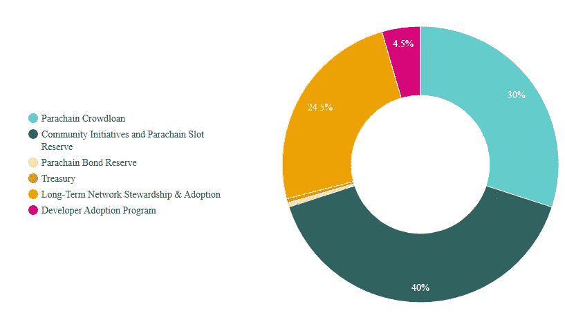
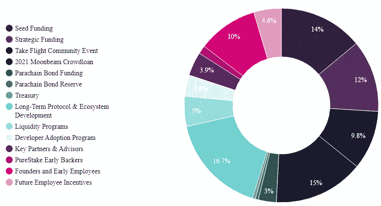
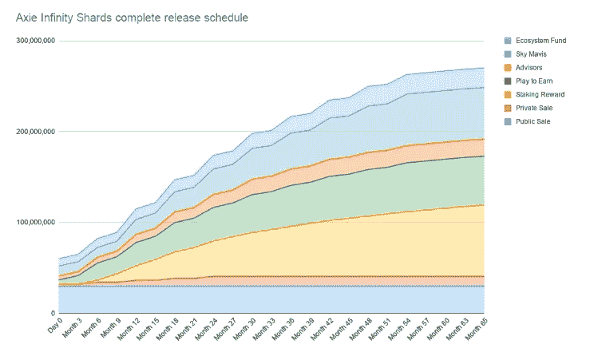

# 令牌组学:通往加密货币市场的成功之路(上)

> 原文：<https://medium.com/coinmonks/tokenomics-the-way-leads-to-success-in-cryptocurrency-market-part-1-9515ec0a9047?source=collection_archive---------30----------------------->

对于加密货币领域的几乎所有投资者来说，Tokenomic 非常关键。然而，并不是每个人都知道这个短语以及如何有效地使用它，尤其是新手。所以，在今天的分析和研究中，我将帮助你最透彻地理解 Tokenomics，并教你“如何有效地检查 Tokenomics。”

Illustration

# 令牌组学概念

代币经济学的概念，被称为加密货币的经济，是代币和经济两个词的结合。本质上，Tokenomics 适用于加密货币领域的所有项目。

# 令牌组学的重要性

实际上，令牌组学反映了项目的操作机器。想象一下，我们和 Cz([币安](https://www.binance.com/en)的 Ceo)、 [A16z](https://a16z.com/) 、Sam([FTX](https://ftx.com/)和[阿拉米达研究](https://www.alameda-research.com/)的 Ceo)等大男孩玩类似扑克的牌。他们是做这个市场趋势的做市商，比如[玩赚(P2E)](https://thelayer.xyz/what-is-play2earn-p2e-economy/)[元宇宙](https://thelayer.xyz/what-is-metaverse-everything-that-you-need-to-know/)[Web 3.0](https://thelayer.xyz/what-is-web-3-0-and-how-is-it-different-from-web-2-0/)或者 ICO、IDO、IEO，他们都是为了赚钱而创立的。

本质上，如果你想赢得这场游戏，你必须知道规则的运作，这个问题的答案是记号经济学。如果你有很好的知识，当看到 Tokenomics 时，你可以看到这个项目是如何进行的，你会明白它是如何工作的。

# 记号的结构和记号组学

## 硬币/代币供应

1.  **总供应量**

关于硬币/代币，总供应量至关重要。总供应量是流通和锁定的硬币/代币的总数减去烧掉的硬币/代币的数量。最初，Tokenomics 是由开发或核心团队创建的，以最好地操作机器。

总供应量各不相同，包括:

*   固定总供应量
*   非固定供应总量

2.**循环供给**

流通供给是市场上流通的代币总量。

3.**最大供应量**

最大供应量是有史以来存在的最大代币数量。

## 市值

Marketcap 是一个密码的流通供应的总市值。

配方奶粉市值

市值=当前价格 x 流通供应量。

## 完全稀释的市值

最大供应量流通时的市值。

配方奶粉完全稀释市值:

(FDMC) =价格 x 最大供应量。如果最大供应量为空，则 FDMC =价格 x 总供应量。如果最大供应量和总供应量为无穷大或不可用，则显示完全稀释的市值

## 象征性治理

根据 Coinmarketcap 的数据，目前市场上大约有 18000 个密码。然而，并不是每个代币都像比特币一样遵循去中心化机制；其中一些将由中央机制管理。

例如:

*   去中心化令牌:比特币、以太坊、Dot 等。
*   集中表征:USDT、USDC、XRP 等。
*   从分散到集中:BNB。最初，BNB 完全由币安统治。然而，在推出币安智能链和“验证聚光灯”计划后。币安已经逐渐将 BNB 代币网络分散给用户控制。

## 令牌分配

在投资任何项目之前，您应该检查项目的令牌分配。令牌分配显示了项目的分发令牌。通过代币分配，可以考虑投资。你就知道有没有意义了？

让我给你看几个例子。

**月亮河**

[月亮河](https://moonbeam.network/networks/moonriver/)是草间集上兼容以太坊的智能契约帕拉链。这是草间弥生卫星的伴星网络。

MoonRiver's Token Allocation

根据上图中 MoonRiver 的令牌分配，我们可以看到这些社区计划和 Parachain 插槽预留只有大约 40%，这完全合理。这意味着没有很多投资者可以出售 MOVR。所以，上市之后，MOVR 不会被激烈的倾销。事实上，上市两周后，MOVR 很快就有了新的 ATH。

**月光**

Moonbeam 是波尔卡多特上兼容以太坊的智能契约帕拉链。Moonbeam 使得使用流行的以太坊开发工具在基于底层的环境中构建或重新部署 Solidity 项目变得很容易。

Moonbeam 不仅仅是一个 EVM 实现:一个高度专业化的 para 链，镜像以太坊的 Web3 RPC、账户、密钥、订阅、日志等。Moonbeam 平台扩展了以太坊的基本功能集，增加了额外的链上治理、堆栈和跨链集成。

Moonbeam's Token Allocation

类似于 MOVR 的机制，但是 Moonbeam 的令牌分配不同。观察上图，GLMR 的分布是明显的。我们有 14%的种子资金，12%的战略资金，15%的 2021 年 Moonbeam 众筹贷款，10%的创始人和早期员工，3.9%的关键合作伙伴和顾问，9.8%的“搭乘航班社区”活动。很多投资者都有 Moonbeam，令牌放出就可以卖出。我认为，对于后来的投资者来说，这不是一个很好的代币配置。事实上，在币安上市后，GLMR 的价格已经下降了很多。我写这篇内容的时候，GLMR 的价格大致是 2 美元。

通过上面的两个例子，你可以看到代币分配在加密货币市场中的重要性。

## 令牌释放

代币发行是对市场的预定发行代币。像令牌分配一样，令牌发布也对市场有很大影响。目前，市场上有两种类型的代币发行:

1.  **显示默认日历**

几乎所有的项目都将遵循这种方法，然而，它在发布方式上仍然有所不同。他们可以选择在 1-2 年或 3-5 年内发布，有时是 5-10 年。

**3 岁以下:**

通常情况下，1 至 2 年 Token release 以下的项目往往会使开发商的贡献较小，投资者对这些项目没有太大的信任。

**3-5 年:**

几乎好的项目往往会选择这种方式。3-5 年是让开发者、支持者、合作伙伴有动力支持项目的绝佳时间。

**超过 7 年:**

据我所知，除了比特币，我们没有任何项目有超过 7 年的“令牌释放”。

为了进一步理解，让我们分析一个由币安支持的“热门”项目的象征性发布。

**轴无限远**

Axie Infinity 是一款总部位于区块链的交易和战斗游戏，由玩家部分拥有和运营。

Axie Infinity Token Release

例如，Axie Infinity 在 65 个月内发布了一个优秀的令牌。这意味着大约五年后释放。除了“公开销售和私人销售”，Sky Mavis 和 Advisors 在 65 个月内完成令牌发行。

在我看来，3-5 年内发布代币是一个完美的时机。实际上，加密项目变化非常快。证明就是从 2017 年到现在，我们看到了很多加密货币市场的趋势，比如 layer 1，比特币黑仔， [Defi](https://thelayer.xyz/what-is-decentralized-finance-defi-all-you-need-to-know/) ，GameFi 等等。因此，3-5 年是激励社区的最佳时机，让他们有动力和平和的心态来持有他们的令牌。此外，支持者、合作伙伴、开发者也有理由继续开发项目。

**2。按需发放令牌**

一些项目选择灵活的标准，而不是设定发布令牌的时间表，以避免可能的通货膨胀。这种方式将有助于项目根据当前情况进行适当的修改。例:马克道等。

# 未完待续…

> 要阅读本系列的第 2 部分，让我们按照我的方法，你也可以要求任何你需要解释的主题。我会帮你解决你的疑惑。
> 
> *链接第二部分*[此处 ](/@MorganLikesBigShort/tokenomics-the-way-leads-to-success-in-cryptocurrency-market-part-2-2e54b59e9e5b)

谢谢您，祝您愉快！

> 加入 Coinmonks [电报频道](https://t.me/coincodecap)和 [Youtube 频道](https://www.youtube.com/c/coinmonks/videos)了解加密交易和投资

# 另外，阅读

*   [币安期货交易](https://coincodecap.com/binance-futures-trading)|[3 comas vs Mudrex vs eToro](https://coincodecap.com/mudrex-3commas-etoro)
*   [如何购买 Monero](https://coincodecap.com/buy-monero) | [IDEX 评论](https://coincodecap.com/idex-review) | [BitKan 交易机器人](https://coincodecap.com/bitkan-trading-bot)
*   [CoinDCX 评论](/coinmonks/coindcx-review-8444db3621a2) | [加密保证金交易交易所](https://coincodecap.com/crypto-margin-trading-exchanges)
*   [红狗赌场评论](https://coincodecap.com/red-dog-casino-review) | [Swyftx 评论](https://coincodecap.com/swyftx-review) | [CoinGate 评论](https://coincodecap.com/coingate-review)
*   [Bookmap 评论](https://coincodecap.com/bookmap-review-2021-best-trading-software) | [美国 5 大最佳加密交易所](https://coincodecap.com/crypto-exchange-usa)
*   [如何在 FTX 交易所交易期货](https://coincodecap.com/ftx-futures-trading) | [OKEx vs 币安](https://coincodecap.com/okex-vs-binance)