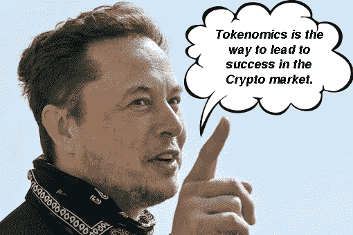

# 令牌组学:通往加密货币市场的成功之路(下)

> 原文：<https://medium.com/coinmonks/tokenomics-the-way-leads-to-success-in-cryptocurrency-market-part-2-2e54b59e9e5b?source=collection_archive---------37----------------------->

> 链接第 1 部分[这里](/coinmonks/tokenomics-the-way-leads-to-success-in-cryptocurrency-market-part-1-9515ec0a9047)

Illustration

## 象征性销售

与传统市场一样，公司在常规市场中使用股票来筹集资金，投资者将拥有股票作为股票。加密项目有一点不同，它们在加密市场使用代币销售来筹集资金，代币是投资者的股份。

与通常有五轮融资的传统公司不同，加密企业只有三轮融资。加密市场中的企业估值取决于许多因素。然而，C 轮融资的价值可能超过 1 亿美元。

*   **传统:**前期种子，种子，A 系列，B 系列，c 系列
*   **密码市场:**种子轮、私募轮、公开发售轮。

关于加密市场，该项目的估值可能小于传统市场，因为与股票、债券、黄金等传统市场相比，加密市场的市值仍然很小。

**种子轮**

种子轮是 Crypto Market 中任何项目的第一轮，这是第一轮融资。这个时候几乎项目还是没有产品。这一轮的投资人几乎都是把大量的钱投在项目上，他们接受的是高风险。但是，人们通常会关注这一轮，因为这一轮可以吸引到大的支持者，他们是风险投资基金。

这一轮参与的 VC(风险投资)几乎都是接受一个高风险的投资。作为回报，如果项目成功，他们可能会获得高额回报。

**私人回合**

与种子轮相比，私募比种子轮风险更低。所以这一轮比种子轮能吸引更多的大资本。它可以从传统市场或密码和传统市场的大公司吸引大量的大资金。

**公开销售**

与私募和种子轮有一点不同，公开销售是为社区轮。目前，加密市场是非常多样的，因此投资者可以通过 IDO、IEO、ICO、IFO 等购买项目的令牌。

**公平发布会**

与加密市场中的常见项目不同，一些项目使用公平发布向投资者分发令牌。另一方面，公平启动是区块链项目中硬币/代币的公平透明的初始分配。公平发布被认为是促进去中心化和参与加密社区的有效方式。

公平发布:

*   该项目的硬币/令牌将从一开始就由社区拥有和管理。
*   机会是给每个人分的，从开发团队散户到大型投资基金。
*   不再需要提前接触或向开发团队或大型投资基金分配代币。

**注**

对于种子轮之后的任何一轮，投资者应该检查从种子轮到公开销售的销售价格。如果范围太广，你就要小心了，因为他们可以全部卖出去。在公开销售回合后，他们也许会有重大兴趣。

## 令牌用例

令牌用例是令牌的用途。例如，令牌可以用于赌注、借贷、互换、治理等。因此，令牌用例也很重要；代币的目的将让我们知道该项目的代币如何激励投资者购买和出售它？

# 关于记号组学的案例研究

## 什么是 Token 中的成功？

据币安实验室称，Token 的成功具有与项目密切相关的实际应用，鼓励用户使用和参与项目管理。

## 币安实验室的案例研究

**币安币(**[**【BNB】**](https://thelayer.xyz/what-is-binance-coin-bnb-all-you-need-to-know/)**)**

**令牌供应**

*   初始总供应量:200，000，000 BNB
*   令牌释放:5 年(现在 100%解锁)
*   应用令牌燃烧机制，直到流通供应量变为 100，000，000 BNB。

通缩为象征性价格上涨和 BNB 持有者相信该项目创造了动力。

**令牌用例**

BNB 代币在币安交易所和币安智能连锁网络的使用方式是 BNB 显著增长的主要原因。

*   **币安交易所:**降低交易费用，加入 Launchpad，Staking，Lending &借款，衍生品等。
*   **BNB 链:**用于跑马圈地，养殖，用作 dapps 的交易费等。

币安也在开发币安支付，如果币安支付在未来取得成功，BNB 可能会成为最受欢迎的支付货币之一。

# 结论

对于所有投资者来说，知道如何检查令牌组学是赢得加密市场的基础。我分享了一些有效检查令牌组学的技巧，并给了你一个 BNB 的例子。通过这些提示和一个模型，如 BNB 硬币，你应该尝试分析密码市场中的一些令牌组学，以进一步精通。

以上都是**令牌经济学:通往加密货币市场成功之路。**如果你对我有任何问题，请在本帖下方评论；我会为你写的。别忘了跟随我的媒介。祝你投资之旅成功。

> 加入 Coinmonks [电报频道](https://t.me/coincodecap)和 [Youtube 频道](https://www.youtube.com/c/coinmonks/videos)了解加密交易和投资

# 另外，阅读

*   [有哪些交易信号？](https://coincodecap.com/trading-signal) | [Bitstamp vs 比特币基地](https://coincodecap.com/bitstamp-coinbase)
*   [ProfitFarmers 回顾](https://coincodecap.com/profitfarmers-review) | [如何使用 Cornix 交易机器人](https://coincodecap.com/cornix-trading-bot)
*   [如何在势不可挡的域名上购买域名？](https://coincodecap.com/buy-domain-on-unstoppable-domains)
*   [印度的加密税](https://coincodecap.com/crypto-tax-india) | [altFINS 审查](https://coincodecap.com/altfins-review) | [Prokey 审查](/coinmonks/prokey-review-26611173c13c)
*   [赢取注册奖金——10 大最佳加密平台](https://coincodecap.com/earn-sign-up-bonus)