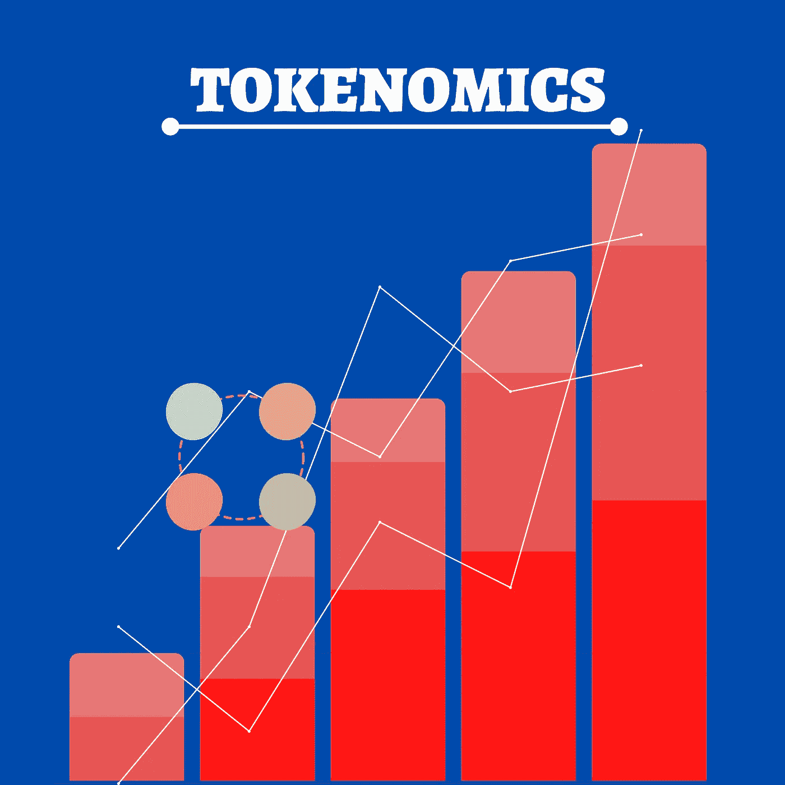
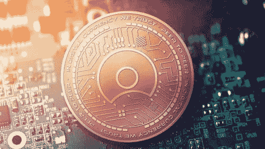
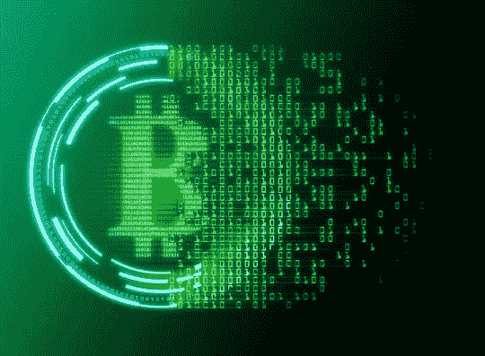
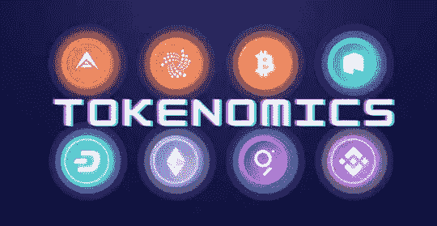

# 词汇学|它意味着什么。

> 原文：<https://medium.com/coinmonks/tokenomics-what-it-means-7521378cfe07?source=collection_archive---------20----------------------->

在将你的现金投资到这种硬币之前，理解加密代币的代币组学是非常重要的。

投资前理解象征经济学的重要性怎么强调都不为过。

正如一个国家了解其年度货币预算、财务管理和进出该国的现金流以抑制通货膨胀和货币价值损失等问题很重要一样，了解你想投入资金的任何硬币的象征经济学也很重要。

如果你注意到，单词 Tokenomics 听起来更像 Token-economics。只是这一次，字母 E 不发音，也没有出现。为了理解什么是记号组学，你需要获得关键因素的基本知识:

# 什么是代币？

代币是加密货币的数字单位，用作特定资产或代表区块链的特定用途。

令牌是用户定义的，因此是通过某种编程方法从特定地址创建的。

令牌有多种使用情形，但最常见的是安全、实用工具和治理令牌。

## 安全令牌:

安全令牌(也称为投资合同)是从外部来源获取其价值的数字资产(令牌)。大多数情况下，安全令牌受证券和法规的约束，这使得它们受到政府的监管。(这在一定程度上使它们成为更安全的选择)。

## 实用工具令牌:

效用令牌是可以用来交换效用的令牌(顾名思义)。一个例子是基本注意力令牌(BAT ),它可用于向创建好内容的内容创建者付费。

## 治理令牌:

治理令牌是赋予持有者对协议(通常是 DAO)的操作进行更改的投票权的令牌。治理令牌不是由开发人员或中央机构控制的项目，而是给予外行人建议可能的变更并可能变更 DAO 操作的投票权。

# 令牌的分类

通常，令牌基于可替换性进行分类。也就是说，我们有可替换的令牌和不可替换的令牌(NFT)。

## 可替换令牌:

可替换代币是具有相同价值的代币，可以很容易地替换或交换相同的金额。一个很好的例子是你的 100 美元纸币。你的 100 美元钞票和其他 100 美元钞票没有什么不同。本质上，它的价值是一样的，用你的 100 美元换另一个 100 美元不会让你更富或更穷。

## 不可替换的令牌:

另一方面，不可替换令牌与可替换令牌正好相反。

不可互换令牌是指不具有相同价值的令牌，因此不能相互交换。

理解代币可替代性概念的一个很好的例子是比特币和无聊猿游艇俱乐部 Nft。

你的一枚比特币的价值与任何其他人的比特币是一样的，因此即使交换或交换，它仍将保持其价值，因为它是可替代的。

与比特币不同，BAYC Nft 是独一无二的，每个 Nft 都有其罕见的特征，这使得 NFT 几乎不可能被交易为另一个。每一种都有其独特的价值和功能。

> 现在你已经对什么是令牌、令牌的使用情况和令牌的分类有了很好的基本了解。让我们深入了解一下令牌组学是怎么一回事。

令牌组学通常在项目白皮书中陈述，或者有时在他们的主网站上陈述。代币组学让投资者对代币的使用情况、分配过程、供应数量以及代币的未来价值有了一个清晰的认识。

> **代币经济学决定了加密经济的两件事——规定代币如何分配的激励措施，以及影响其需求的代币效用。这决定了任何代币的价值。**

# 令牌组学为什么重要？

记号经济学对投资者很重要，因为它有助于回答以下问题:

*   代币的总供应量是多少？
*   这些标记以前存在过吗？或者被隐藏起来了？
*   未来的供应量会增加吗？
*   未来会有对代币的需求吗？
*   令牌的用例是什么？
*   持有这种代币的动机是什么？
*   谁拥有代币，他们持有多少代币？
*   未来有没有一些代币要烧的时间表？
*   令牌有什么价值，值得你在未来投资？

在做投资决策时，记号经济学是一个需要考虑的重要概念。投资者会想把他们的钱押在一个有未来价值的项目上。不像我们现实世界中的法定货币那样可以触摸，并且很容易确定其价值；加密货币是无形的，因此，深入了解任何加密代币的代币组学将有助于投资者确定此类代币的价值。

# 记号组学的核心因素。

当考虑任何加密令牌的令牌组学时，应该高度考虑将导致这种令牌的价值降低的任何因素。

以下是在考虑投资任何加密令牌时要考虑的一些核心因素。

1.  **代币的分发**:投资者应该考虑代币将如何分发。一些项目通常有一个私人销售，他们向风险资本家和其他内部投资者(鲸鱼)出售一些代币。在投资任何加密令牌时，你必须确保发现鲸鱼的钱包里有多少这些令牌(你可以使用像 defilama 和其他区块链探险家这样的工具来完成)。如果钱包中的代币数量太多，则有可能会发生转储，这会影响代币的价值。但是，如果一个项目慷慨地向公众分发更多的令牌，那么它就有可能是一个好项目。(请注意，这只是加密令牌的令牌组学中的一个因素，考虑所有因素将决定您是否应该投资)。
2.  **令牌的供应**:令牌的供应是什么？这是任何表征的表征组学中非常关键的一个方面。有三种供给方式:总供给、循环供给和最大供给。尽管它们都是供应品，但它们是非常不同的，并且在理解加密令牌的令牌组学方面都起着关键作用。总供应量是目前存在的代币数量，不包括已经烧毁的代币。这显示了已经交易或正在下注的代币数量。流通供给必须处理当前流通的代币的数量。最大供应量是永远存在的令牌数。总供应量为 10 亿美元的代币，其最大供应量为 200 亿美元。很有可能将来会铸造更多的代币，并且基于它们何时被铸造、分发或分配将决定代币的价值是否会降低。
3.  **通货膨胀或通货紧缩**:根据代币的模型，投资者应该能够决定代币是否会通货膨胀。通货膨胀的代币会随着时间的推移而贬值，而通货紧缩的代币不仅会保值，还会升值。大多数时候，通货膨胀代币是没有最大供应量或具有高最大供应量的代币；这意味着流通中的货币太多，会使代币失去价值。此外，一些 PoS (Proof-of-Stake)令牌用额外的令牌奖励其委托人和验证人，这可能会导致通货膨胀。投资者应该考虑所有这些因素。
4.  令牌燃烧:一个令牌可能有一个最大供应量，这表明即将发生通货膨胀，但如果团队计划销毁一些令牌或减少供应量，那么令牌有机会从通货膨胀中恢复。一个投资者应该总是研究燃烧时间表，如果有的话。
5.  **市值**:代币市值是代币的总市场货币价值。其计算方法是将代币的当前价格乘以流通供应量。尽管市值可能无法提供对整个项目令牌组学的全面了解，但它确实给出了令牌在市场中的价值。具有低代币供应量的高市值意味着高价值代币。
6.  **会引起需求的代币的真实价值**:代币有很好的供应指标等等，但是如果它没有效用，或者更确切地说没有用例会让人们想要购买和持有它，那么它几乎被认为是无用的。
7.  **激励措施**:一些项目给持有者和投资者机会，用他们的代币换取更多代币。尽管这很好，但投资者还应该考虑能得到多少回报。如果给的太多，会导致通货膨胀，如果给的太少，会使人们不敢下注，这将导致脆弱的生态系统。

# 结论:

在做出投资决策时，理解象征经济学非常重要。事实上，在现实世界中，投资者可能需要很长时间才能理解加密令牌的真正令牌组学。以上列表不足以作为投资者决策时的模板。还有其他需要考虑的因素，比如背后的团队、风险投资家和赞助商，以及社区。

作为一个投资者，有一件事是明智的，那就是你要了解你想投资的任何项目的来龙去脉。此外，尽量不要被一个项目的宣传分散注意力，当有机会在社区时，总是问一些未来的问题。此外，你应该问一些“如果”的问题，比如“如果发生这种或那种情况，开发人员会怎么做？”。所有这些都有助于你进行研究，并决定一个项目是否值得你花费时间和金钱。

> 加入 Coinmonks [电报频道](https://t.me/coincodecap)和 [Youtube 频道](https://www.youtube.com/c/coinmonks/videos)了解加密交易和投资

# 另外，阅读

*   [OKEx vs KuCoin](https://coincodecap.com/okex-kucoin) | [摄氏替代品](https://coincodecap.com/celsius-alternatives) | [如何购买 VeChain](https://coincodecap.com/buy-vechain)
*   [ProfitFarmers 点评](https://coincodecap.com/profitfarmers-review) | [如何使用 Cornix Trading Bot](https://coincodecap.com/cornix-trading-bot)
*   [如何匿名购买比特币](https://coincodecap.com/buy-bitcoin-anonymously) | [比特币现金钱包](https://coincodecap.com/bitcoin-cash-wallets)
*   [瓦济里克斯 NFT 评论](https://coincodecap.com/wazirx-nft-review)|[Bitsgap vs Pionex](https://coincodecap.com/bitsgap-vs-pionex)|[Tangem 评论](https://coincodecap.com/tangem-wallet-review)
*   [如何使用 Solidity 在以太坊上创建 DApp？](https://coincodecap.com/create-a-dapp-on-ethereum-using-solidity)
*   [加密交易机器人](/coinmonks/crypto-trading-bot-c2ffce8acb2a) | [OKEx vs 币安](https://coincodecap.com/okex-vs-binance)