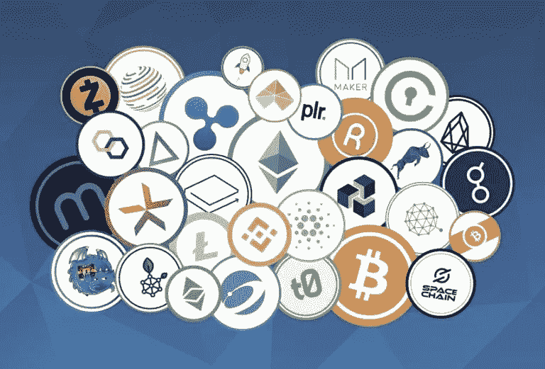

# 代币，是什么？。

> 原文：<https://medium.com/coinmonks/tokens-what-are-they-17df77dee467?source=collection_archive---------91----------------------->

区块链有哪些象征物？。

代币似乎是区块链最被误解的方面之一。有一段时间，我不知道他们是什么。如果你和我一样，你可能会认为代币是加密货币，如比特币(BTC)，系绳(USDT)等。然而，事实并非如此。代币只是区块链上的一个项目的表示。现在让我们来看看这意味着什么。像法币或硬币一样，代币代表价值。然而，令牌并不仅限于表示交换手段，如前面列出的各种加密货币。它不能代表我们想要代表的任何东西，比如钱、股票、土地(即使在现实世界中)等等。如果你已经理解了这一点，你可能会想，钱的属性和像房子这样的资产的属性，以及它们之间的区别。例如，货币的属性之一是它可以互换。像普通菲亚特一样，一辆 BTC 可以很容易地换成一辆 BTC。然而，我们能在知道房子本身价值的情况下，轻易地将纽约的一栋房子换成巴黎的另一栋房子吗？答案是否定的。我们已经开始看到，用于代表加密货币的相同类型的令牌将不同于用于代表房子的令牌。这让我们开始讨论各种令牌类型。
代币大致分为两种，可替代代币和不可替代代币(NFT)，你可能已经听说过。有关两者之间差异的基本解释；可替换的令牌可以彼此互换，而不可替换的令牌则不能。例如，像 BTC、USDT 这样的货币是可替代的代币，而区块链上展示的房屋、图像是不可替代的代币。

咻，这是我们第一次讨论代币。现在请喝一杯水。下一次我们见面时，我希望向你解释一下区块链是如何使用代币的。

> 加入 Coinmonks [电报频道](https://t.me/coincodecap)和 [Youtube 频道](https://www.youtube.com/c/coinmonks/videos)了解加密交易和投资

# 另外，阅读

*   [在印度利用加密套利赚取被动收入](https://coincodecap.com/crypto-arbitrage-in-india)
*   [Godex.io 审核](/coinmonks/godex-io-review-7366086519fb) | [邀请审核](/coinmonks/invity-review-70f3030c0502) | [BitForex 审核](https://coincodecap.com/bitforex-review)
*   [最佳比特币保证金交易](/coinmonks/bitcoin-margin-trading-exchange-bcbfcbf7b8e3) | [萝莉点评](/coinmonks/lolli-review-e6ddc7895ad8) | [比特币保证金交易](https://coincodecap.com/bityard-margin-trading)
*   创造并出售你的第一个 NFT | [密码交易机器人](https://coincodecap.com/best-crypto-trading-bots)
*   [如何在 CoinDCX 上购买柴犬(SHIB)币？](https://coincodecap.com/buy-shiba-coindcx)
*   [CBET 评论](https://coincodecap.com/cbet-casino-review) | [库科恩 vs 比特币基地](https://coincodecap.com/kucoin-vs-coinbase) | [拜比特 vs 比特币基地](https://coincodecap.com/bybit-vs-coinbase)