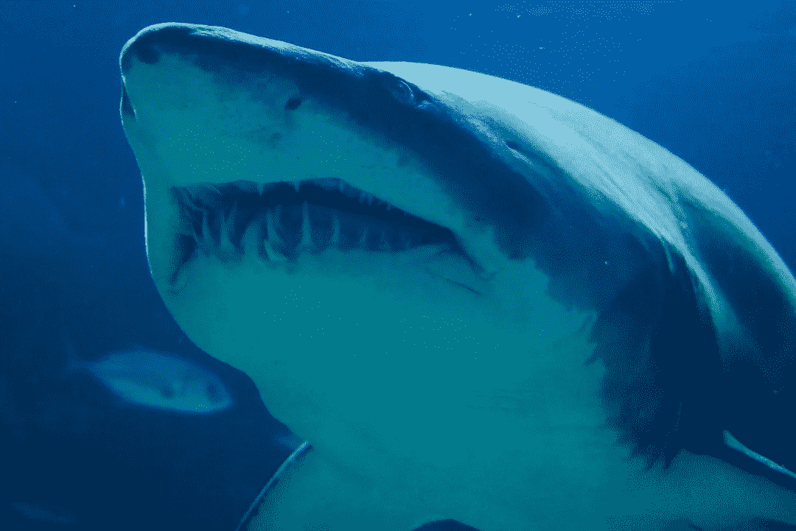
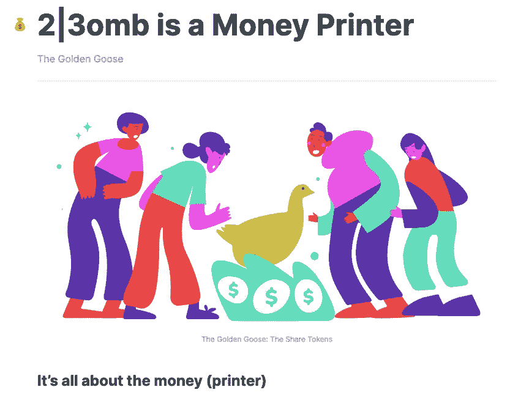

# 佐克斯墓:从德菲德根到德菲鲨鱼

> 原文：<https://medium.com/coinmonks/tomb-zorks-from-defi-degen-to-defi-shark-12ddf66075c6?source=collection_archive---------6----------------------->

几周前，我完全失去了理智。我得出结论墓叉需要工作。现在我已经看得更近了，我不认为它们能工作。

Image: PixTeller

> 华尔街的鲨鱼会去它们闻到血腥味的地方，这是你无法改变的——丹尼尔·卢贝茨基

# 介绍

我打算在我写这篇文章的当天发表它:2022 年 3 月 13 日。我的写作目标是教导人们，帮助他们避免经济损失。这次我决定等待。不过，我更新了一些数据。从 13 号开始他们都放弃了。

在[Crypto banner](https://www.youtube.com/c/CryptoBanterGroup)的善良的人们发表了我以前的一篇关于古墓丽影的文章。我指出这些协议存在一些非常严重的问题。来自 3omb 社区的反应并不热烈。

对于这篇文章，我想等等，因为我不想被指责为“捏造袋子”或成为它崩溃的原因之一。我想我至少要等几个星期。虽然我猜想 T2 3 fan bois 不会同意，但在我看来，这整个事情都完蛋了。

## 印钞机一直运转，直到崩溃

看到新手加密投资者被炒作套牢，我真的很痛苦。加密空间是一个零和游戏。任何收益总是以牺牲他人为代价的。我觉得这是可以忍受的，因为我知道加密的真正好处还没有实现。

“容易”的钱的诱惑是强大的。它还为总部设在区块链的公司提供研究资金，我相信这些公司将使世界变得更加美好。金融只是 crypto 的冰山一角。

公司喜欢图表，获取。AI，Chainlink，所有主要的区块链，以及数百个其他人正在开发工具，这些工具将彻底改变从医疗保健到物流和航运，到教育，当然还有金融的一切。我认为，人们可能会在途中赌博输钱，这个事实对于这种发展来说只是一个小小的代价。

希望这篇文章能帮助加密投资者避免严重损失。我也希望它能鼓励人们继续参与到大密码实验中来。理想情况下，安全地——至少以正确的态度。

抛开个人财富和回报不谈，我们所有投资加密的人都在帮助创造一个更美好的世界。我认为这是一个崇高的任务，也许*会让*在这个过程中为你赚些钱。好吧，只要你明智，不要让自己破产。

# 分散金融:一个狒狒的故事

几周前，我一头扎进了 DeFi。就背景而言，我在金融领域的大部分研究都是在监管领域。我发表过关于证券法和破产法的同行评议文章，也为*银行法律期刊发表过关于反洗钱法规的三集系列文章。*

从这个角度来看，人们很容易怀疑任何金融产品，尤其是新产品。这就是为什么我避免德根 DeFi 项目，就像他们有埃博拉病毒一样。不过，好奇心战胜了我，而且我觉得了解所有炒作的内容会很有趣。

你可以在这里[这里](/coinmonks/make-money-in-crypto-with-1000-and-no-leverage-4b369bd4a1d9)[这里](/coinmonks/defi-conservative-goes-full-degen-ape-how-i-doubled-my-bag-in-a-week-b8efd9129df0)[这里](/coinmonks/defi-101-how-to-make-money-by-not-being-a-baboon-7763ab69746f)阅读体验。我总是对这些说法保持警惕。apr 显然是不可持续的，稳定机制显然是有缺陷的。现在我已经‘看了引擎盖下的东西’，我很确定他们不会长期工作。为了生存，他们需要更多更深的储备。

## 2 | 3omb

在我发表加密的戏谑文章之前，3omb 的挂钩已经崩溃了。所有 [Basis.io](https://basis.io/) 衍生的协议(坟墓和分叉)都声称是与另一个密码挂钩的算法令牌。在 2 | 3omb 的情况下，peg 应该与 Fantom (FTM)为 1:1。

虽然我对协议崩溃的原因有自己的看法，但我会让开发人员[解释发生了什么](https://2omb3omb.medium.com/2-3omb-x-zomb-partnership-9c8d2c2799be):

> 最近 2 | 3omb 的 PEG 的丢失是由多种因素引起的，包括市场的不确定性、战争以及来自其他基于坟墓的协议的快速涌入的突然竞争

我摆弄的另一个德根墓叉是 Ripae 金融。就像 2 | 3omb 一样，他们的挂钩完全崩溃了。在脱钩之后，这些协议引发的资本外逃(资金外流)令人震惊。

当我解除 2omb 头寸时，锁定的总价值(TVL)已经从我睡觉时的 1 . 1 亿美元变成了我醒来时的 8000 万美元。今天(3 月 17 日)，TVL 的成交额约为 670 万美元，低于我第一次写这篇文章时的 950 万美元。一旦挂钩被打破，投资者就会逃之夭夭。

## Ripae 金融公司

我提到 Ripae 的原因是，在他们的挂钩崩溃后不久，他们尝试了不同的方法来收回挂钩。在鼎盛时期，该协议在 TVL 获得了大约 1000 万美元的资金。今天它大约值 150 万美元。

Ripae 尝试的一些想法是单边押注股票回报(没有非永久性损失风险)，以及也提供股票回报的激励性债券池(用于锁定潜在不可兑现债券的资金)。

开发人员大张旗鼓地推出了这些“修复程序”,看起来效果不错。汇率开始缓慢回升，从大约 0.35:1 上升到大约 0.8:1 *。*自那以后，它一直在 0.6 到 0.8:1 之间波动，但实际上看起来它可能会在无人注意的情况下偷偷上升。

有趣的是看看会发生什么。

然而，任何稍有常识或金融头脑的人都能看出这是徒劳之举。一旦钉住汇率制被切断，如果没有大量新资金的注入，回归 T2 真的很难。

如果没有足够的投资者来支付差价，协议本身必须提供资金。然而，一旦协议做到了这一点(如果他们甚至能够做到的话)，他们就会产生一种不正当的动机，继续挑战盯住汇率制度。这一挑战将持续下去，直到没有新的资金流入，或者国库空虚。

## Ripae 2omb:电动 Boogaloomb

T2 3 国对其货币脱钩危机的反应要慢得多。一个五音不全且执行不力的 AMA ( [删除了](https://www.twitch.tv/videos/1405911146)，但我认为这是一个抽搐的事情)并没有安抚投资者。资本外逃加速，留下的只有真正的信徒和 rekt 奇迹探索者。

在此期间，发达国家和发展中国家鼓励人们购买债券，以帮助恢复联系汇率制。许多信徒正是这样做的。然后，他们推出了高 APR 单边打桩。

这对有限合伙人和股东来说是好事，但对债券持有人来说却是当头一棒。在要求人们锁定债券的代币直到挂钩达成后才能赎回后，他们转而鼓励*而不是*购买高 APR 单边回报的债券。

不出所料，债券持有人很生气。我想 DMs 的反应可能不太友好。仅仅是在德根周围谈话就很烦人。我无法想象把它们对准你有多难受。

就像 Ripae 一样，单边赌注似乎正在发挥作用。2 | 3omb 的钉子慢慢开始爬升。然而，它不断碰到天花板，然后又会掉下来。开发人员将这些问题归咎于“机器人”和“恶意行为者”。

公平地说，看起来确实存在恶意交易活动(针对巨额亏损的买卖)。然而，这些“机器人”只是做着它们应该做的事情的限价单。

## 如何创造一个让交易者在你头上跳舞的地板

如果这不明显，那么“收回挂钩”的麻烦就在于，它告诉世界上的每一个投资者，不管发生什么情况，代币价格都会上涨。这种增长的唯一限制是该协议能够吸引的新资金数量和财政部的可动用余额。

对于交易者来说，这简直就是直升机撒钱。“我们要回佩格去，”喧闹声响起。交易者说，“太好了”，然后在信徒和最近的股市支撑的任何楼层买入 xyz 令牌。在 2 | 3omb 的情况下，大约是 0.30 美元。当时 FTM 的交易价格约为 1.50 美元。

因此，交易者可以在 0.30 美元时建仓，如果挂钩令牌升至 0.60 美元，他们可以卖出，以两倍于 T2 的价格卖出。太好了，谢谢！出售、冲洗和重复。不出所料，交易员们在信徒的头上跳舞。

我想，部分是因为这一失败和债券持有人的不满，下一步“回归联系汇率”的行动才得以展开。发展中国家现在将提供高年利率债券池。

鼓励投资者支持该协议，并锁定 2300 万英镑的债券。2omb 被确定为回收 peg 的第一个目标。许多真正的信徒遵循了这个建议。我决定袖手旁观。

请记住，债券不能赎回，直到后的*令牌高于挂钩。在该时间点之前，债券是不可赎回的(价值为零)。*

开发者们还戏弄了一个惊人的修复，将改变一切。在等待惊人修复的过程中，2omb 被反复作为回收 peg 的优先级出售。

## “你被一只 [Grue](https://en.wikipedia.org/wiki/Grue_(monster)) 吃掉了”

一个开发者哀叹 2 | 3omb 的合同被放弃，这限制了调整的选择。放弃对任何加密开发者来说都是一个艰难的决定。如果没有放弃，投资者(理所当然地)会小心谨慎。

在放弃的情况下，如果事情真的出了差错，开发者的手就会被捆住，没有一把硬叉子。由于 2 | 3omb 协议出了问题，开发人员陷入了困境。怎么办？

3mb，这个绝妙的计划基本上是一个后门分叉。他们与另一家古墓丽影合作，特别是 Zomb Finance。这个新坟墓[左克](https://en.wikipedia.org/wiki/Zork)反过来被钉住了……等等……被严重钉住的 3mb。

你不能编造这些东西。

现在的情况是，由于 3mb 的流动性要低得多，因此首先收回盯住美元的政策会更容易。不要介意他们刚刚告诉他们的投资者锁定 20mb 的债券，这 20mb 是优先的。

将投资者的资金锁定在 2300 万英镑的债券上，释放了流动性，有助于推出 Zork。这是 100%正确的 3omb 将更容易回收 peg。这也很方便，2omb 有更多的流动性。

我不会读心术，但在我看来，开发人员鼓励 2omb 债券与 Zork 一起“孤注一掷”。后门 Zork 现在能够提供高年利率来吸引新的资金。一个棘手的小问题是，它与一种不挂钩的“资产”挂钩。

仅这一点就让新货币提议看起来遥不可及。更糟糕的是，这种想法是用 Zork 来收回 3omb 的 peg。但是就像上面说的，那是一条非常艰难的路。

我们不要忘记:

> …市场的不确定性、战争以及其他基于坟墓协议的快速涌入带来的突然竞争。

我很确定那还没有消失。

## 贵族和神奇的独角兽

当我第一次开始摆弄 2 | 3omb 时，我持谨慎乐观的态度。开发人员看起来像是真正的人，他们正在尝试一些有趣和独特的东西。虽然我没有喝可乐，但我还是相信了他们。

他们可能有真正的，高尚的意图。我不知道。正如 Andre Cronje 多次说过的，在 DeFi 开发是一场噩梦。我只能猜测 T2|3 开发人员面对的是什么。我会假设他们的意图是好的——并且对基本的金融概念一无所知。

虽然我可能会给他们善意的好处，但他们肯定不会让事情变得容易。下图来自他们的文档。

Image: 2omb Finance

从虚无中赚钱的冷酷骗局一直存在。美国政府已经用美元做了 50 多年了。如果你把“金蛋”(印钞机)的部分从寓言中去掉，重要的部分是:

> 贪婪是如何失去一切，通过努力获得一切…像他一样穷的人
> 被过快致富的力量弄得一贫如洗！—伊索

不管怎样，最新的“修复”已经上线几天了。果不其然，真正的信徒帮助 3omb 走向挂钩。就像钟表一样，它撞到了天花板，然后直接掉了下来。

一遍又一遍。交易者低买。信徒泵。交易员抛售。

交易者不关心基本面。他们只关心价格变动。这不是火箭科学。

## 修复工作开始了

收回钉住汇率制的一个方法可能是在早期积极捍卫钉住汇率制*。一旦他们做不到这一点，一个更有可能的方法是立即超越挂钩(大规模买入)，把交易者赶出去，然后再做一次买入来收回卖家留下的空间。*

问题是，它可能不会长期工作。只要在谷歌上搜索“野猫银行”，你就会发现 19 世纪晚期美国有上百个不同的银行在经营同样的生意。

盯住黄金、白银、玉米、小麦、奶牛、房地产和其他货币，只要你能想到的。债券、股票、神奇的思维——同样的交易，同样的想法，同样的结果。他们只是还没有想到“算法”的戏弄。

他们都有银行挤兑。全都崩溃了。就像 2008 年倒闭的美国银行一样——它们都抵押不足。而且，就像今天的 T-forks 一样，许多银行从一开始就是拖后腿的。

如果你要将你毫无价值的代币/票据/承诺与有实际价值的东西挂钩，你最好手头有足够的有价值的东西，否则你迟早会遭遇银行挤兑。

2 | 3omb 发生了银行挤兑，他们没有足够的 FTM 来弥补。就这么简单。

任何对这个项目没有感情的人都可以很容易地看到这一点。我为那些不能的人感到难过。开发者声称另一个修复正在进行中。我想时间会证明一切。我(傅)怀疑开发者们能否找到能说服新资金进入的神奇独角兽。

我很确定它被一只 Grue 吃掉了。

虽然这可能是最好的结果。从这些协议中获利的合理(且简单)的方法是利用它们，而不是“支持”它们。

但是，嘿，这是加密的…更奇怪的事情发生了。见鬼，他们可能十分钟后就会恢复过来，到时候我就没脸见人了。我总是犯错，而且我绝对无法预测未来。

## 和鲨鱼一起游泳

通过这一切，这里有一个非常有价值的投资教训，可以用这句话来总结:

> 鲨鱼不会攻击人类，它们当然也不会记仇——彼得·本奇利

鲨鱼只是做它们该做的事情，不管是在海里，还是在华尔街，还是在区块链。如果你要安全地使用密码，你需要保持客观。藿定和芬太尼一样容易致死。

简单地说，要么你是鲨鱼，要么你就是食物。

我建议你当鲨鱼。冷漠、独立、注重结果、坚忍不拔。如果你能像那样，你可能不会陷入下一个德根 DeFi 混乱。如果你真的被绊倒了(这是常有的事)，至少你不会因为你的损失责怪任何人和任何事，除了你自己。

或者，更好的是，*也许*你可以在下一次 DeFi 混乱中赚些钱。

我做到了。

当然，这些只是我 ***的意见*。**我不是财务顾问，这不是财务建议，而且总是 [DYOR](/coinmonks/crypto-investing-how-to-dyor-1e6dabdb1de9) 。遵循这些想法中的任何一个都可能会让你失去所有的钱。我对此 100%认真。我喜欢摆弄这些东西，但我公开表现得像个彻头彻尾的狒狒。相应投资。

直到下一次，安全，聪明，并确保[绑骆驼](https://www.oxfordreference.com/view/10.1093/acref/9780199539536.001.0001/acref-9780199539536-e-2318)。

> 加入 Coinmonks [电报频道](https://t.me/coincodecap)和 [Youtube 频道](https://www.youtube.com/c/coinmonks/videos)了解加密交易和投资

# 另外，阅读

*   [CBET 回顾](https://coincodecap.com/cbet-casino-review) | [库币 vs 比特币基地](https://coincodecap.com/kucoin-vs-coinbase) | [拜比特 vs 比特币基地](https://coincodecap.com/bybit-vs-coinbase)
*   [折叠 App 回顾](https://coincodecap.com/fold-app-review) | [本地比特币回顾](/coinmonks/localbitcoins-review-6cc001c6ed56) | [Bybit vs 币安](https://coincodecap.com/bybit-binance-moonxbt)
*   [加密保证金交易交易所](/coinmonks/crypto-margin-trading-exchanges-428b1f7ad108) | [赚取比特币](/coinmonks/earn-bitcoin-6e8bd3c592d9) | [Mudrex 投资](https://coincodecap.com/mudrex-invest-review-the-best-way-to-invest-in-crypto)
*   [WazirX vs coin dcx vs bit bns](/coinmonks/wazirx-vs-coindcx-vs-bitbns-149f4f19a2f1)|[block fi vs coin loan vs Nexo](/coinmonks/blockfi-vs-coinloan-vs-nexo-cb624635230d)
*   [比斯勒评论](https://coincodecap.com/bitsler-review)|[WazirX vs coin switch vs coin dcx](https://coincodecap.com/wazirx-vs-coinswitch-vs-coindcx)
*   [7 大副本交易平台](https://coincodecap.com/copy-trading-platforms) | [BuyCoins 点评](https://coincodecap.com/buycoins-review)