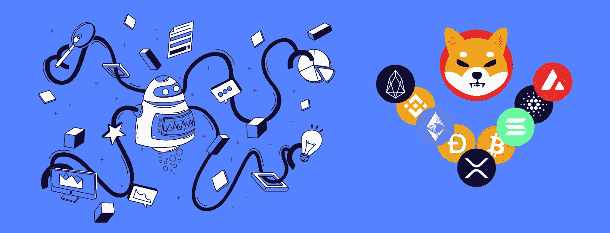
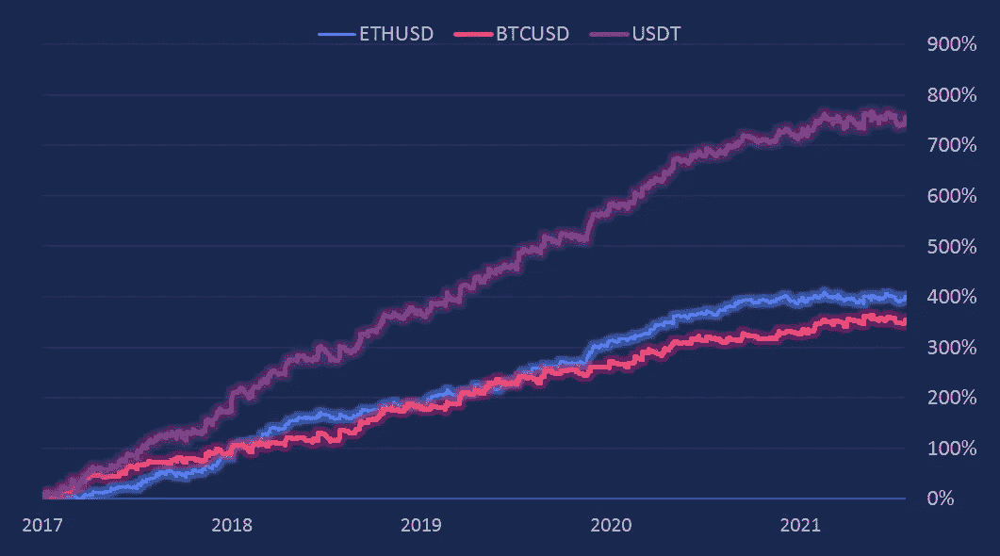
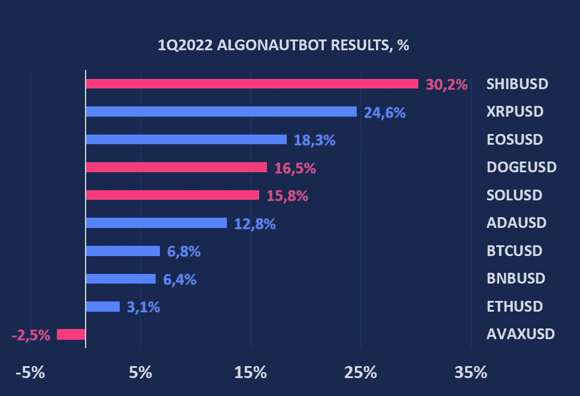
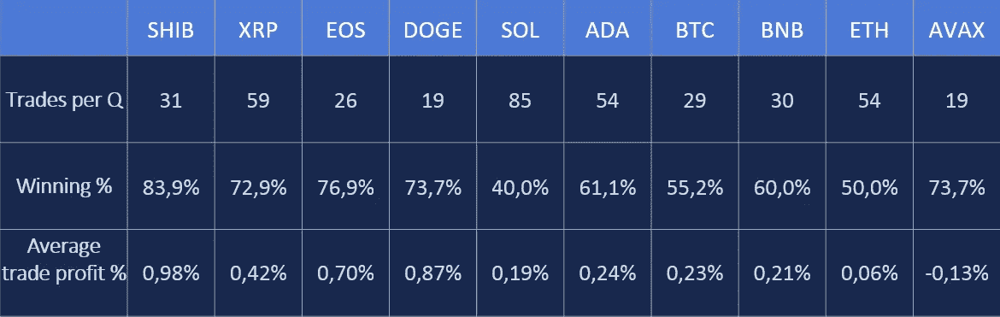
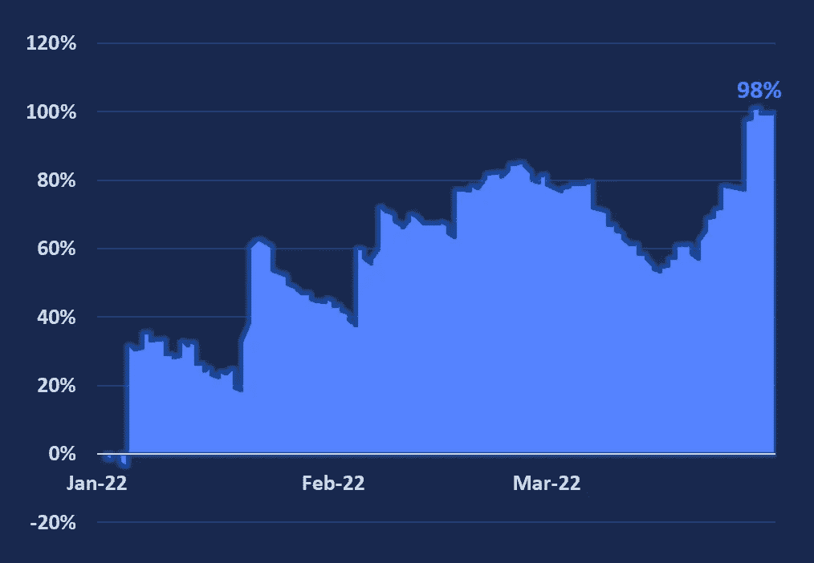
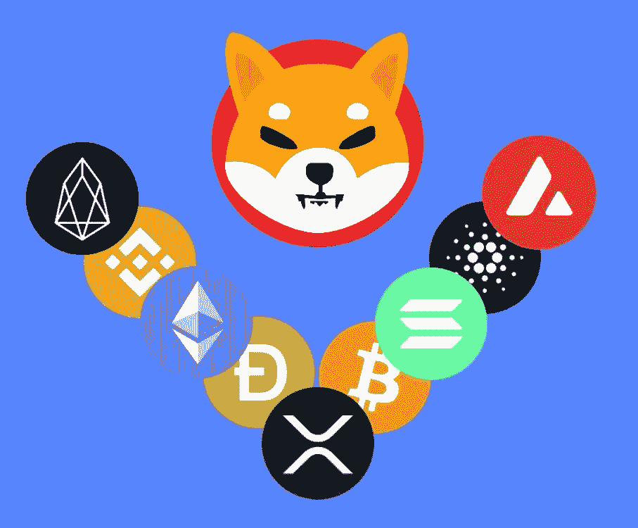

# 自动交易的十大硬币

> 原文：<https://medium.com/coinmonks/top-10-%D1%81oins-for-automated-trading-1ca50e35ebcc?source=collection_archive---------10----------------------->

## AlgonautBot 如何在 2022 年 3 个月内实现+98%

头三个月，加密投资者感到紧张，比特币跌破 35000 英镑，但后来价格回升。

## 1Q 2022:
BTCUSD**-1.5%**ETHUSD**-10.7%**

AlgonautBot 团队参与机器人的自动化期货交易。市场走向并不重要，因为当价格下跌时，你可以在期货上获利。

交易最多的是 BTCUSD 和 ETHUSD。自 2019 年以来，它们在真实账户上交易**，平均年收益率在 100%以上。**

> 过去一个季度，他们的交易结果是:
> BTCUSD**+6.8%**
> ETHUSD**+3.1%**

## 在自动交易中，回报分布不均。我能做什么来稳定结果？

1.**交易工具多样化**。交易的货币对越多，长期下跌的可能性就越小。重要的是要考虑加密货币之间的高度相关性。
2。**战略多元化**。如果有几个决策逻辑不同的策略，也会平滑收益率曲线
3。**参数多样化**。您可以交易 1 种工具，但属于不同的交易策略参数组。

# 按工具分类的多样化——十大交易硬币

2022 年，AlgonautBot 扩大了交易工具的清单。之前我们写了用 AlgonautBot 交易几个替代硬币的[历史结果。](/coinmonks/algonautbot-results-in-2021-2022-d19d49626a3f)

> **SHIBA、DOGE、AVAX 和 SOL** 被添加到可交易列表中。

现在你可以一次交易 10 个硬币。

Results in 1Q2022

1Q2022 stats

这些工具有不同的参数和交易数量。正如你所看到的，你不需要做很多交易来获利。也不一定要有超过 50%的盈利交易(像索拉纳)。

增加了一个亏损的 AVAX 币，看起来可能很奇怪。在较长的测试部分，AVAX 表现良好。这对多样化和稳定的结果很重要。

> 一次交易 10 个硬币可以带来惊人的效果。2022 年 3 个月比特币没有增长。这个机器人获得了 98%的利润。最大提取率为 36%。

**1Q2022: +98% profit | -36% maximum drawdown**

# 使用 AlgonautBot 开始自动交易的 6 个步骤

1.  **访问**[**algonautbot.com**](http://algonautbot.com/?utm_source=medium&utm_medium=organic&utm_campaign=medium_articles&utm_content=article1_hist_270)并报名
2.  [**用 API 密匙连接你的币安**](https://algonautbot.com/dashboard/exchanges) 账号和 AlgonautBot。无需在任何地方转移资金— **机器人只会在你的账户上交易**。
3.  **购买不限制机器人数量的专业计划**。
4.  **查看你的美元对人民币期货**币安账户。你必须有一些 USDT 来交易。
5.  [**为对方创建 10 个**](https://algonautbot.com/dashboard/bots)****低风险**的 bot 并启动。**
6.  ****с在设置中连接**您的电报以通知交易。**

**你有什么没有币安期货账户或者对与 [AlgonautBot](http://algonautbot.com/?utm_source=medium&utm_medium=organic&utm_campaign=medium_articles&utm_content=article1_hist_270) 交易有疑问？如需更多信息，请发邮件至 support@algonautbot.com[或](mailto:support@algonautbot.com)联系我们。**

**跟随我们，我们将讨论加密和算法交易。如何创建自己的 bot？如何检查是否有效？如何进行统计分析，预测结果？我们将来一定会报道它。**

****

> **加入 Coinmonks [电报频道](https://t.me/coincodecap)和 [Youtube 频道](https://www.youtube.com/c/coinmonks/videos)了解加密交易和投资**

# **另外，阅读**

*   **[如何在 FTX 交易所交易期货](https://coincodecap.com/ftx-futures-trading) | [OKEx vs 币安](https://coincodecap.com/okex-vs-binance)**
*   **[OKEx vs KuCoin](https://coincodecap.com/okex-kucoin) | [摄氏替代品](https://coincodecap.com/celsius-alternatives) | [如何购买 VeChain](https://coincodecap.com/buy-vechain)**
*   **[ProfitFarmers 点评](https://coincodecap.com/profitfarmers-review) | [如何使用 Cornix 交易机器人](https://coincodecap.com/cornix-trading-bot)**
*   **[如何匿名购买比特币](https://coincodecap.com/buy-bitcoin-anonymously) | [比特币现金钱包](https://coincodecap.com/bitcoin-cash-wallets)**
*   **[瓦济里克斯 NFT 评论](https://coincodecap.com/wazirx-nft-review)|[Bitsgap vs Pionex](https://coincodecap.com/bitsgap-vs-pionex)|[Tangem 评论](https://coincodecap.com/tangem-wallet-review)**