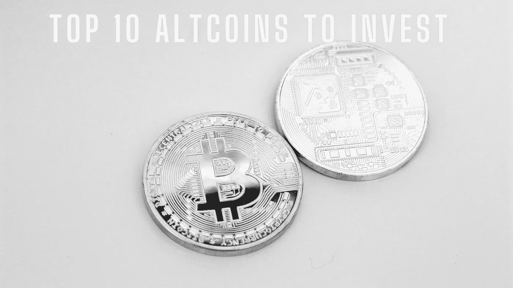

# 卖出你的 BTC 投资后要购买的 10 大备用硬币

> 原文：<https://medium.com/coinmonks/top-10-altcoins-to-purchase-after-selling-your-btc-investment-cae054b02226?source=collection_archive---------27----------------------->

毫无疑问，比特币是全球最受欢迎的数字货币。尽管如此，还是有很多表现非常好的替代币。在你卖出你的比特币投资后，检查一下要购买的 10 个主要的替代币。

## 以太坊

毫无疑问，以太坊被定位为仅次于比特币的第二大加密货币。吸引金融支持者眼球的是以太坊吹嘘的具体可能应用的真实情况，特别是当条件满足时会执行的悟性。事实上，这种替代硬币肯定会在你的购买清单上。

## 波尔卡多特

波尔卡多特是一种数字货币，在一段时间里，它的价值有了显著的发展。凭借其与所有异构区块链网络完美对接的能力，Polkadot 无疑吸引了眼球。由于各种事业都是基于波尔卡多特生物系统，这种计算机化的现金将会大受欢迎。

## 索拉纳

这种替代方案结合了股权确认和历史验证系统。凭借这一优势，它已经找到了如何为金融支持者获得巨大回报的方法。举例来说，Solana 已经让不同地区的其他 altcoins 黯然失色——去中心化财务(Defi)、去中心化应用(DApps)和精明合同。

## 卡尔达诺

卡尔达诺是另一个值得特别注意的另类硬币。自 2021 年被发送以来，这种数字货币一直在发展。由于它还降低了外汇投资的利用率，金融支持者正倾向于它。没什么好惊讶的，这是一次明智的冒险。

## 莱特币

莱特币已经在几秒钟内成为最不可思议的替代硬币之一。也许莱特币最好的组成部分是，与比特币相比，它的阻塞率更快。

## 极限

众所周知，领带是最稳定的数字货币形式之一。对于那些不愿意面对许多挑战的金融支持者来说，这已经变成了一个备用方案。铁的价值被认为比其他替代硬币更可靠，这就是它被许多金融支持者看好的原因。

## 币安硬币

币安，这个星球上最大的密码交易商之一，已经发出了币安硬币。长期来看，这种替代硬币价值的巨大膨胀说明了为什么把资源投入到每件事情上会有结果。

## 瑞波的 XRP

XRP 处理各种现金交易的能力，包括政府发行的货币和其他主要替代货币，吸引了世界各地的眼球。此外，其价值的上升足以证明这种加密货币拥有多大的潜力。

## Dogecoin

这种替代硬币于 2013 年发行，从那时起，Dogecoin 已经成为整个加密货币市场的主要数字货币之一。达拉斯小牛队、克罗诺斯和 SpaceX 等重要组织依赖这种替代硬币的方式是非常相似的强有力的证据。事实上，谁会拒绝 Dogecoin 不应该是你卖出比特币投机后购买的 10 种替代货币之一呢？

## 柴犬

这更多的是一个局部地区和盟友驱动的 altcoin，分享以太坊环境的安全和进步元素。最近，柴犬发布了关键的发展。这本身就意味着这是一个多么伟大的推测。

> 加入 Coinmonks [电报频道](https://t.me/coincodecap)和 [Youtube 频道](https://www.youtube.com/c/coinmonks/videos)了解加密交易和投资

# 另外，阅读

*   [如何在 FTX 交易所交易期货](https://coincodecap.com/ftx-futures-trading) | [OKEx vs 币安](https://coincodecap.com/okex-vs-binance)
*   [OKEx vs KuCoin](https://coincodecap.com/okex-kucoin) | [摄氏替代品](https://coincodecap.com/celsius-alternatives) | [如何购买 VeChain](https://coincodecap.com/buy-vechain)
*   [ProfitFarmers 点评](https://coincodecap.com/profitfarmers-review) | [如何使用 Cornix Trading Bot](https://coincodecap.com/cornix-trading-bot)
*   [如何匿名购买比特币](https://coincodecap.com/buy-bitcoin-anonymously) | [比特币现金钱包](https://coincodecap.com/bitcoin-cash-wallets)
*   [瓦济里克斯 NFT 评论](https://coincodecap.com/wazirx-nft-review)|[Bitsgap vs Pionex](https://coincodecap.com/bitsgap-vs-pionex)|[坦吉姆评论](https://coincodecap.com/tangem-wallet-review)