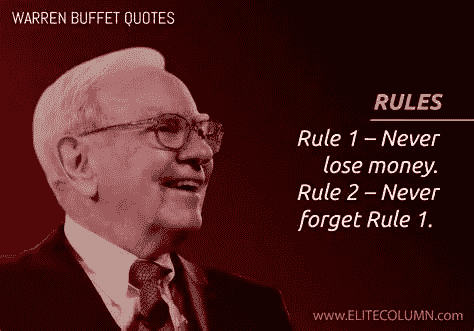

# 沃伦·巴菲特推荐用你的钱做的 10 件聪明事

> 原文：<https://medium.com/coinmonks/top-10-brilliant-things-warren-buffett-recommended-to-do-with-your-money-3abd3b0be64f?source=collection_archive---------0----------------------->

Source photo [warren buffett quotes — Bing images](https://www.bing.com/images/search?view=detailV2&ccid=N9Y97BWR&id=CCC482FD35D0C77894B5F6A170D73FE1B6CD2FAB&thid=OIP.N9Y97BWR8ijoHlb9hMiGXwHaFL&mediaurl=https%3a%2f%2fwww.elitecolumn.com%2fwp-content%2fuploads%2f2017%2f01%2fWarren-Buffett-On-Rules.jpg&cdnurl=https%3a%2f%2fth.bing.com%2fth%2fid%2fR.37d63dec1591f228e81e56fd84c8865f%3frik%3dqy%252fNtuE%252f13Ch9g%26pid%3dImgRaw%26r%3d0&exph=1434&expw=2048&q=warren+buffett+quotes&simid=608035750119560347&FORM=IRPRST&ck=BDD4F63084FCB8E12F7554B3180BE99B&selectedIndex=24&ajaxhist=0&ajaxserp=0)

沃伦·巴菲特无疑是世界上最知名、最受尊敬的投资者。巴菲特也因其脚踏实地的作风和著名的投资言论而闻名。

当试图登顶一座山峰时，小心翼翼地跟随在你之前成功登顶的人的脚步通常是明智的。如果你学习…